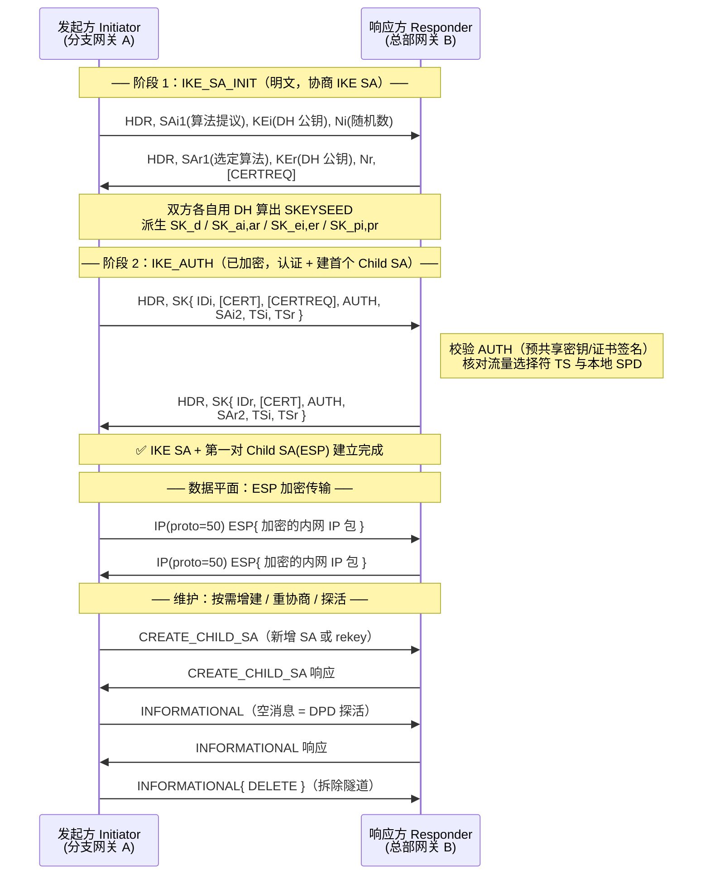
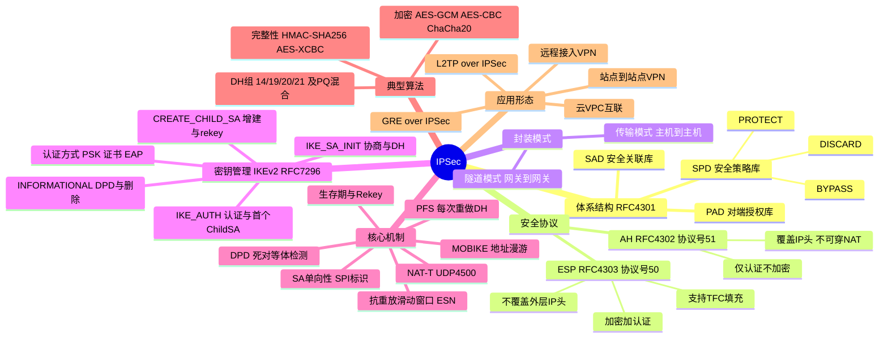

## 工作原理

IPSec 的数据平面处理可以概括为一句话：**每个进出的 IP 包都要先查 SPD 决定"怎么办"，命中保护策略后再查 SAD 取参数执行加解密。**

**出方向（Outbound）处理**

1. IP 包到达 IPSec 处理点，用选择符（Selector：源/目的 IP、协议号、源/目的端口）查询 **SPD**。
2. SPD 返回三种动作之一：`DISCARD`（丢弃）、`BYPASS`（明文放行）、`PROTECT`（IPSec 保护）。
3. 若为 `PROTECT`，查 **SAD** 找对应的出方向 SA；找不到则触发 **IKE** 协商建立新 SA（此过程中数据包通常被暂存或丢弃）。
4. 按 SA 中的模式（传输/隧道）、协议（AH/ESP）、算法与密钥封装数据包，序列号加 1。
5. 发送。

**入方向（Inbound）处理**

1. 收到 IP 包，识别协议号为 50/51（或 UDP 4500 的 NAT-T 封装）。
2. 用 `<SPI, 目的 IP, 协议>` 查 **SAD** 定位 SA；查不到则丢弃。
3. **抗重放检查**：序列号是否落在滑动窗口内且未被使用过。
4. 校验 ICV（完整性），失败则丢弃。
5. 解密，剥掉 IPSec 头。
6. **反查 SPD**：确认解出来的内层包确实符合该 SA 允许的选择符范围（防止对端用一个合法 SA 注入其他网段流量），通过后交上层。

## 报文 / 头部结构

### ESP 头部（Encapsulating Security Payload，RFC 4303）

ESP 是实际生产中的主力（提供加密），格式为"前有头、后有尾"：

| 字段 | 长度 | 含义 |
|------|------|------|
| **SPI**（Security Parameters Index） | 32 bit | 安全参数索引，接收方据此定位使用哪个 SA。1~255 保留，0 表示无 SA |
| **Sequence Number** | 32 bit | 单调递增序列号，从 1 开始，用于抗重放；配合 ESN 扩展可扩到 64 bit |
| **Payload Data** | 可变 | 加密后的载荷；若算法需要 IV，IV 置于此字段开头（明文传输） |
| **Padding** | 0–255 字节 | 填充至分组算法块长的整数倍，同时可用于 TFC 掩盖真实长度 |
| **Pad Length** | 8 bit | 填充字节数 |
| **Next Header** | 8 bit | 载荷类型：传输模式下为 6(TCP)/17(UDP)；隧道模式下为 4(IPv4)/41(IPv6) |
| **ICV**（Integrity Check Value） | 可变（通常 12/16 字节） | 完整性校验值，覆盖 ESP 头 + 载荷 + ESP 尾，**不覆盖外层 IP 头**（这正是 ESP 能穿 NAT 的原因） |

### AH 头部（Authentication Header，RFC 4302）

AH **只认证不加密**，实际部署已很少见：

| 字段 | 长度 | 含义 |
|------|------|------|
| **Next Header** | 8 bit | 被保护载荷的协议类型 |
| **Payload Len** | 8 bit | AH 头长度，以 32 bit 为单位再减 2 |
| **Reserved** | 16 bit | 保留，置 0 |
| **SPI** | 32 bit | 安全参数索引 |
| **Sequence Number** | 32 bit | 抗重放序列号 |
| **ICV** | 可变 | 完整性校验值，**覆盖整个 IP 包（含 IP 头中的不可变字段）** |

> AH 的 ICV 覆盖 IP 头中的源/目的地址等"不可变字段"，因此 **AH 无法穿越 NAT**。可变字段（TTL、TOS、Header Checksum、Fragment Offset）在计算时按 0 处理。

### 两种模式的封装对比

```
【原始 IPv4 包】
+---------+---------+--------+
| IP 头   | TCP 头  | 数据   |
+---------+---------+--------+

【ESP 传输模式】 —— 保留原 IP 头，只加密载荷
+---------+--------+---------+--------+---------+-----+
| 原IP头  | ESP头  | TCP头   | 数据   | ESP尾   | ICV |
+---------+--------+<------ 加密范围 ------>+
          +<-------- 完整性校验范围 --------------->+

【ESP 隧道模式】 —— 整个原包被加密，外套新 IP 头
+---------+--------+---------+--------+--------+---------+-----+
| 新IP头  | ESP头  | 原IP头  | TCP头  | 数据   | ESP尾   | ICV |
+---------+--------+<--------- 加密范围 ---------->+
          +<---------- 完整性校验范围 ------------------->+

【NAT-T 封装】 —— 再套一层 UDP 4500
+---------+-----------+--------+---------------+--------+-----+
| 新IP头  | UDP(4500) | ESP头  | 原IP头+TCP+数据| ESP尾  | ICV |
+---------+-----------+--------+---------------+--------+-----+
```

关键差别一句话：**传输模式给包"换内衣"，隧道模式给包"套外套"**。隧道模式因为多了 20 字节新 IP 头，MTU 开销更大（ESP 隧道模式总开销约 50–73 字节）。

### IKEv2 头部（RFC 7296）

| 字段 | 长度 | 含义 |
|------|------|------|
| IKE SA Initiator's SPI | 64 bit | 发起方 SPI |
| IKE SA Responder's SPI | 64 bit | 响应方 SPI（IKE_SA_INIT 请求中为 0） |
| Next Payload | 8 bit | 后续第一个载荷类型（SA=33, KE=34, Nonce=40, AUTH=39, TSi=44, TSr=45, SK=46…） |
| Version | 8 bit | 主版本 2 + 次版本 0 |
| Exchange Type | 8 bit | 34=IKE_SA_INIT，35=IKE_AUTH，36=CREATE_CHILD_SA，37=INFORMATIONAL |
| Flags | 8 bit | I（发起者）、V（版本）、R（响应） |
| Message ID | 32 bit | 消息序号，用于匹配请求/响应与防重放 |
| Length | 32 bit | 整个 IKE 消息总长 |

## 交互流程

### IKEv2 建立隧道（标准 2 次往返）



对比 IKEv1：IKEv1 需要主模式 6 条消息（或野蛮模式 3 条）+ 快速模式 3 条，共 9 条；**IKEv2 只需 4 条消息**即可完成认证并建立第一对数据 SA，且原生支持 NAT-T、DPD、EAP 与 MOBIKE（地址漫游）。

## 关键机制

### 1. 三个数据库的分工

| 数据库 | 全称 | 作用 | 类比 |
|--------|------|------|------|
| **SPD** | Security Policy Database | 按选择符规定对流量执行 DISCARD / BYPASS / PROTECT | "防火墙规则表" |
| **SAD** | Security Association Database | 存放每个 SA 的 SPI、密钥、算法、序列号、生存期、模式、隧道端点 | "已建立的加密会话表" |
| **PAD** | Peer Authorization Database | 定义对端身份（ID 类型/值）与允许的认证方式，桥接 IKE 与 SPD | "谁有资格跟我建隧道" |

### 2. SA 的单向性与 SPI

一条 SA 只保护一个方向的流量。网关 A ↔ B 的双向通信至少需要 **2 个 IPSec SA**（A→B 与 B→A），SPI 由**接收方**分配并告知对端。`ip xfrm state` 中看到成对出现的条目正是这个原因。

### 3. 抗重放滑动窗口

接收方维护一个默认 64 位（可配至 128/1024）的位图窗口：

- 序列号 **大于窗口右边界** → 接受，窗口右移。
- 序列号 **落在窗口内且对应位为 0** → 接受，置位为 1。
- 序列号 **落在窗口内但已置位**，或 **小于窗口左边界** → 判定为重放，丢弃。

序列号回绕（32 bit 用尽）时必须重建 SA，除非启用 **ESN（Extended Sequence Number）** 扩展到 64 bit。QoS 导致的乱序若超出窗口宽度会被误判为重放，是高带宽场景丢包的常见暗坑。

### 4. NAT 穿越（NAT-T，RFC 3947 / 3948）

1. IKE_SA_INIT 中双方交换 `NAT_DETECTION_SOURCE_IP` / `NAT_DETECTION_DESTINATION_IP` 载荷（内含 SPI+IP+Port 的哈希）。
2. 若收到的哈希与本地计算不符，说明路径上存在 NAT。
3. 双方把 IKE 通信从 UDP 500 切换到 **UDP 4500**，并将后续 ESP 包封装为 `UDP(4500) + ESP`（非 ESP 的 IKE 消息前加 4 字节全 0 的 Non-ESP Marker 以区分）。
4. 位于 NAT 后的一方定期发送 **NAT-Keepalive**（1 字节 0xFF 的 UDP 包，默认 20 秒）维持映射表项。

### 5. 完美前向保密（PFS）

Child SA 的 rekey 默认可以直接从 IKE SA 的 `SK_d` 派生新密钥（快但无 PFS）。启用 **PFS** 后，每次 `CREATE_CHILD_SA` 都重新做一次 DH 交换，代价是 CPU 开销，收益是单个密钥泄露不影响其他 SA。两端 PFS 组（DH Group）必须一致，否则 rekey 时隧道会断——这是"隧道跑一段时间就掉"的高频原因。

### 6. 生存期（Lifetime）与 Rekey

SA 有两个维度的生存期：**时间**（如 IKE SA 24h、Child SA 1h）与**流量**（如 4 GB）。任一先到即触发 rekey。两端配置不必完全相同（取较小值生效），但差距过大容易出现"一端已删、一端还在发"的黑洞期，建议设置 rekey 提前量（margintime + 随机抖动）。

## 知识框架


