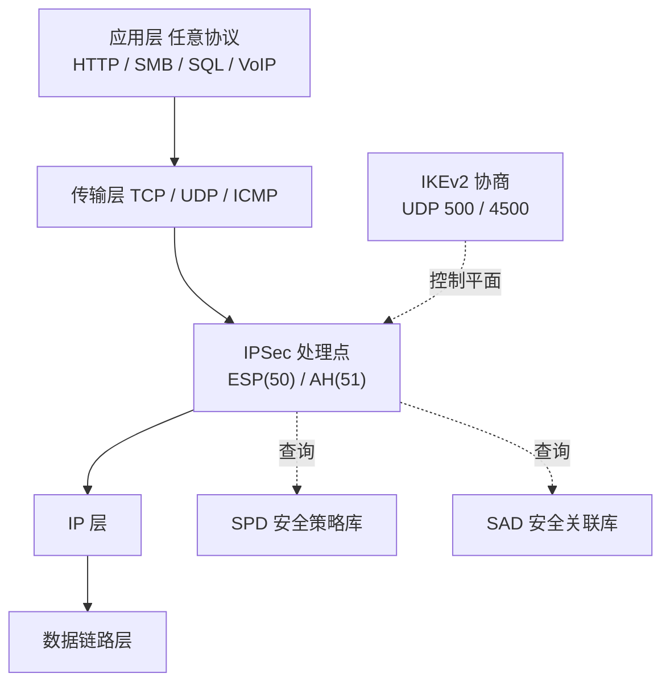

## 协议定位

| 项目 | 信息 |
|------|------|
| 所属层 | 网络层（Network Layer）安全扩展，直接作用于 IP 数据包 |
| 英文全称 | Internet Protocol Security（IP Security Architecture） |
| 主要 RFC | RFC 4301（安全体系结构）、RFC 4302（AH）、RFC 4303（ESP）、RFC 7296（IKEv2）、RFC 3948（ESP over UDP / NAT-T）、RFC 8221（ESP/AH 算法要求）、RFC 8247（IKEv2 算法要求） |
| 端口 | 无 TCP/UDP 端口（AH/ESP 是 IP 层协议）：**ESP = IP 协议号 50**，**AH = IP 协议号 51**；密钥协商 **IKE = UDP 500**，NAT 穿越 **NAT-T = UDP 4500** |
| 封装于 | 直接封装在 IP 之上（协议号方式）；NAT 环境下 ESP 再被封进 UDP 4500 |
| 典型应用 | 站点到站点 VPN（Site-to-Site）、远程接入 VPN（IKEv2/IPSec、L2TP/IPSec）、云上 VPC 互联、SD-WAN 底层加密、IPv6 端到端安全 |

## 一句话理解

**IPSec 是给 IP 包本身加壳的一套机制**：它不关心上面跑的是 HTTP 还是数据库协议，只要两端（主机或网关）事先通过 IKE 谈好了一个"安全关联（SA）"，此后凡是命中安全策略的 IP 包都会被自动加密/认证再发出——**对应用完全透明，不需要改一行业务代码**。

## 它解决什么问题

IPv4 设计之初没有任何安全考虑：源 IP 可伪造、载荷全明文、包可被中途改写。IPSec 在网络层一次性解决：

| 安全目标 | IPSec 机制 |
|---------|-----------|
| **机密性（Confidentiality）** | ESP 用对称算法（AES-GCM / AES-CBC / ChaCha20-Poly1305）加密载荷；隧道模式下连原始 IP 头一起加密 |
| **完整性 + 数据源认证** | AH 或 ESP 的 ICV（Integrity Check Value），基于 HMAC-SHA256 或 AEAD 认证标签 |
| **抗重放（Anti-Replay）** | 每个 SA 维护单调递增的序列号 + 接收端滑动窗口，重复序列号直接丢弃 |
| **访问控制** | SPD（安全策略数据库）按五元组决定"保护 / 放行 / 丢弃"，本质是一层带加密能力的包过滤 |
| **有限的流量分析防护** | 隧道模式隐藏真实内网源目 IP；ESP 支持 TFC（Traffic Flow Confidentiality）填充掩盖包长特征 |

相比 TLS 只保护"一条连接"，IPSec 保护的是"一条网络路径上的全部流量"——这正是它成为 VPN 事实标准的原因。

## 核心特征

1. **协议族而非单一协议**：由「两个安全协议（AH、ESP）+ 一个密钥管理协议（IKE）+ 三个数据库（SPD、SAD、PAD）」组成。
2. **两种封装模式**：
   - **传输模式（Transport Mode）**：保留原 IP 头，只保护载荷。用于**主机到主机**直连。
   - **隧道模式（Tunnel Mode）**：把整个原始 IP 包当作载荷，外面再套一个新 IP 头。用于**网关到网关**，是 VPN 的标准做法。
3. **安全关联（SA）是单向的**：一次双向通信需要**两个 SA**（进方向 + 出方向）。SA 由三元组 `<SPI, 目的 IP, 安全协议(AH/ESP)>` 唯一标识。
4. **策略驱动**：SPD 是"该不该保护"，SAD 是"用什么参数保护"。数据包先查 SPD 决定动作，再查 SAD 取出密钥与算法。
5. **两阶段密钥协商**：IKEv2 先建 IKE SA（保护协商信道本身），再在其保护下建 Child SA（实际保护数据的 ESP/AH SA）。
6. **IPv6 原生支持**：IPSec 在 IPv6 中作为扩展头存在，设计上比 IPv4 更自然（虽然 RFC 6434 已将其从"必须实现"降为"应当实现"）。

## 与其他协议的关系

- **与 IP**：IPSec 不是替代 IP，而是在 IP 头之后插入 AH/ESP 头，用 IP 头的 `Protocol` 字段（50/51）标识。
- **与 TLS**：层次不同、粒度不同。TLS 保护单条 TCP 连接、需要应用支持、天然穿 NAT；IPSec 保护全部 IP 流量、对应用透明、但穿 NAT 需要 NAT-T。企业内网互联选 IPSec，公网服务选 TLS。
- **与 NAT**：**AH 与 NAT 天然冲突**——AH 的 ICV 覆盖了 IP 头中的源/目的地址，NAT 改地址必然导致校验失败，因此 NAT 环境下**只能用 ESP**，且需启用 NAT-T（RFC 3948）把 ESP 封装进 UDP 4500。
- **与 L2TP**：L2TP 本身不加密，`L2TP/IPSec` 组合中由 IPSec（传输模式）提供加密，L2TP 提供二层隧道与用户认证。
- **与 GRE**：GRE 提供多协议封装但无加密，常见组合是 `GRE over IPSec`——用 GRE 承载组播/动态路由协议，再用 IPSec 加密整个 GRE 包。
- **与 WireGuard**：现代轻量替代方案，只有约 4000 行代码、固定算法套件、UDP 承载，但生态与设备兼容性不及 IPSec。

## 本目录学习路线

1. **[01-原理与报文](./01-原理与报文/)** — AH/ESP 头部逐字段解析、传输模式与隧道模式的封装对比图、IKEv2 四类交换的时序、SA/SPD/SAD 的协作流程、抗重放窗口机制。
2. **[02-实战与排错](./02-实战与排错/)** — Wireshark 过滤与 ESP 解密、`ip xfrm` / `swanctl` / `ipsec` 命令实战、隧道 up 但不通流量、MTU/分片、NAT 穿越失败等典型故障的定位方法。

> 学习建议：先牢记「**SA 是单向的**」和「**传输模式改包、隧道模式套包**」这两点，IPSec 的绝大部分困惑都源于这两处。
