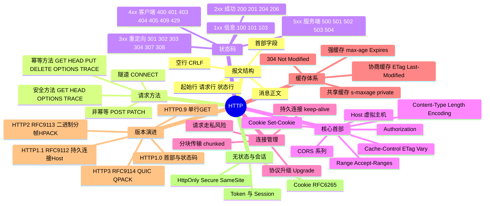

## 工作原理

一次完整的 HTTP/1.1 交互经历五步：

1. **解析 URL**：`https://api.example.com:443/v1/users?id=7` 拆成 scheme、host、port、path、query。
2. **DNS 解析 + 建立连接**：域名 → IP → TCP 三次握手（HTTPS 再加 TLS 握手）。
3. **发送请求报文**：客户端把方法、目标、首部、正文按 ASCII 文本格式串行写入 TCP 流。
4. **服务器处理并回送响应报文**：状态行 + 首部 + 正文。
5. **连接复用或关闭**：HTTP/1.1 默认 `Connection: keep-alive`，同一 TCP 连接可继续承载后续请求；收到 `Connection: close` 或超时则关闭。

核心约束是 **HTTP/1.1 在一条连接上必须"一问一答、严格有序"**。虽然规范允许流水线（Pipelining），但因为响应必须按请求顺序返回，一个慢响应会堵住后面所有响应——这就是 **HTTP 层的队头阻塞**。浏览器的应对是对同一域名开 6–8 条并行 TCP 连接，HTTP/2 的应对是二进制分帧多路复用。

## 报文 / 头部结构

### HTTP/1.1 报文通用格式

```
起始行（请求行 或 状态行）\r\n
首部字段名: 值\r\n
首部字段名: 值\r\n
\r\n                      ← 空行，标志首部结束
[消息正文 Body]
```

**请求示例**

```http
POST /v1/users?verbose=1 HTTP/1.1
Host: api.example.com
User-Agent: curl/8.4.0
Accept: application/json
Content-Type: application/json
Content-Length: 27
Cookie: session=abc123; theme=dark

{"name":"alice","age":30}
```

**响应示例**

```http
HTTP/1.1 201 Created
Date: Mon, 03 Aug 2026 02:15:00 GMT
Server: nginx/1.24.0
Content-Type: application/json; charset=utf-8
Content-Length: 45
Location: /v1/users/1024
Cache-Control: no-store
Set-Cookie: session=xyz789; HttpOnly; Secure; SameSite=Lax

{"id":1024,"name":"alice","created":true}
```

### 起始行字段

| 报文类型 | 格式 | 说明 |
|---------|------|------|
| 请求行 | `方法 请求目标 HTTP/版本` | 请求目标常见为 origin-form（`/path?query`）；CONNECT 用 authority-form（`host:port`）；代理请求用 absolute-form（完整 URL）；OPTIONS 可用 asterisk-form（`*`） |
| 状态行 | `HTTP/版本 状态码 原因短语` | 原因短语仅供人读，客户端不得依赖其内容 |

### 请求方法（RFC 9110 §9）

| 方法 | 语义 | 安全 | 幂等 | 可缓存 | 常带请求体 |
|------|------|:----:|:----:|:------:|:----------:|
| **GET** | 获取资源的当前表示 | ✅ | ✅ | ✅ | ❌ |
| **HEAD** | 同 GET 但只返回首部，不返回正文 | ✅ | ✅ | ✅ | ❌ |
| **POST** | 提交数据，由服务器决定如何处理（创建/执行） | ❌ | ❌ | 条件性 | ✅ |
| **PUT** | 用请求体**整体替换**目标资源 | ❌ | ✅ | ❌ | ✅ |
| **DELETE** | 删除目标资源 | ❌ | ✅ | ❌ | ❌ |
| **PATCH**（RFC 5789） | 对资源做**局部修改** | ❌ | ❌ | ❌ | ✅ |
| **OPTIONS** | 查询目标资源支持的通信选项（CORS 预检用） | ✅ | ✅ | ❌ | ❌ |
| **CONNECT** | 建立到目标的隧道（HTTPS 正向代理必用） | ❌ | ❌ | ❌ | ❌ |
| **TRACE** | 回显收到的请求，用于诊断（有 XST 风险，通常禁用） | ✅ | ✅ | ❌ | ❌ |

- **安全（Safe）**：不改变服务器状态，只读。
- **幂等（Idempotent）**：执行 1 次与执行 N 次，服务器状态的最终效果相同。这是客户端敢于自动重试的前提。

### 状态码分类（RFC 9110 §15）

| 类别 | 含义 | 高频状态码 |
|------|------|-----------|
| **1xx** 信息 | 请求已收到，处理中 | 100 Continue（配合 `Expect: 100-continue` 大文件预检）、101 Switching Protocols（WebSocket 升级）、103 Early Hints |
| **2xx** 成功 | 请求被成功接收理解 | 200 OK、201 Created（配 `Location`）、202 Accepted（异步已受理）、204 No Content（成功但无正文）、206 Partial Content（范围请求/断点续传） |
| **3xx** 重定向 | 需进一步动作才能完成 | 301 永久重定向（会改写书签，SEO 传权）、302 Found（临时，历史上会把 POST 改成 GET）、303 See Other（强制转 GET）、**304 Not Modified**（缓存命中，无正文）、307 临时重定向（**保持方法与正文**）、308 永久重定向（保持方法） |
| **4xx** 客户端错误 | 请求有语法错误或无法被满足 | 400 Bad Request、401 Unauthorized（**未认证**，须带 `WWW-Authenticate`）、403 Forbidden（**已认证但无权限**）、404 Not Found、405 Method Not Allowed（须带 `Allow`）、408 Request Timeout、409 Conflict、413 Content Too Large、415 Unsupported Media Type、**429 Too Many Requests**（限流，配 `Retry-After`） |
| **5xx** 服务端错误 | 服务器未能完成合法请求 | 500 Internal Server Error、**501 Not Implemented**、**502 Bad Gateway**（上游返回无效响应）、**503 Service Unavailable**（过载/维护，配 `Retry-After`）、**504 Gateway Timeout**（上游超时）、505 HTTP Version Not Supported |

> 记牢三组易混：**301 vs 308**（后者保留方法与请求体）、**401 vs 403**（前者"你是谁"，后者"你不能"）、**502 vs 504**（前者上游回了坏响应，后者上游压根没回）。

### 关键首部字段

| 分类 | 字段 | 作用 |
|------|------|------|
| **必需** | `Host` | HTTP/1.1 强制，虚拟主机分流依据；缺失服务器必须回 400 |
| **正文描述** | `Content-Type` / `Content-Length` / `Content-Encoding` / `Transfer-Encoding: chunked` | 正文的类型、长度、压缩方式、分块传输 |
| **内容协商** | `Accept` / `Accept-Language` / `Accept-Encoding` ↔ `Vary` | 客户端偏好 ↔ 服务端声明"响应随哪些请求头变化"（缓存键的关键） |
| **缓存** | `Cache-Control` / `Age` / `Expires` / `ETag` / `Last-Modified` | 强缓存与协商缓存 |
| **条件请求** | `If-None-Match` / `If-Modified-Since` / `If-Match` / `If-Unmodified-Since` | 分别用于缓存校验与并发写冲突检测（乐观锁） |
| **连接管理** | `Connection` / `Keep-Alive` / `Upgrade` | 连接复用与协议升级 |
| **认证** | `Authorization` / `WWW-Authenticate` / `Proxy-Authorization` | Basic / Bearer / Digest 认证 |
| **状态** | `Cookie` / `Set-Cookie` | 会话状态承载 |
| **范围** | `Range` / `Accept-Ranges` / `Content-Range` | 断点续传、视频拖拽 |
| **代理链路** | `Via` / `X-Forwarded-For` / `Forwarded`（RFC 7239） | 记录经过的中间节点与真实客户端 IP |
| **安全** | `Strict-Transport-Security` / `Content-Security-Policy` / `X-Content-Type-Options` | HSTS、CSP、禁止 MIME 嗅探 |
| **CORS** | `Origin` ↔ `Access-Control-Allow-Origin` / `-Methods` / `-Headers` / `-Credentials` | 跨域资源共享 |

### HTTP/2 帧头（RFC 9113，固定 9 字节）

| 字段 | 长度 | 含义 |
|------|------|------|
| Length | 24 bit | 帧负载长度（默认上限 16384，可由 SETTINGS 调整） |
| Type | 8 bit | 帧类型：`0x0`DATA、`0x1`HEADERS、`0x2`PRIORITY、`0x3`RST_STREAM、`0x4`SETTINGS、`0x5`PUSH_PROMISE、`0x6`PING、`0x7`GOAWAY、`0x8`WINDOW_UPDATE、`0x9`CONTINUATION |
| Flags | 8 bit | 标志位，如 `END_STREAM`、`END_HEADERS`、`ACK` |
| R | 1 bit | 保留位，必须为 0 |
| Stream Identifier | 31 bit | 流 ID。0 表示连接级控制流；客户端发起用奇数，服务端发起用偶数 |
| Frame Payload | 可变 | 帧负载 |

HTTP/2 连接以固定前导 `PRI * HTTP/2.0\r\n\r\nSM\r\n\r\n` 开始，随后必须发一个 SETTINGS 帧。

## 交互流程

```mermaid
sequenceDiagram
    participant B as 浏览器
    participant D as DNS
    participant S as Web 服务器

    B->>D: 查询 A 记录 example.com
    D-->>B: 93.184.216.34
    Note over B,S: TCP 三次握手（80 端口）
    B->>S: SYN
    S->>B: SYN+ACK
    B->>S: ACK

    Note over B,S: ── 第 1 个请求（连接复用开始）──
    B->>S: GET /index.html HTTP/1.1<br/>Host: example.com<br/>Connection: keep-alive
    S->>B: HTTP/1.1 200 OK<br/>Content-Type: text/html<br/>ETag: "v1"<br/>Cache-Control: max-age=600<br/><br/>[HTML 正文]

    Note over B,S: ── 同连接复用发第 2 个请求 ──
    B->>S: GET /app.css HTTP/1.1
    S->>B: HTTP/1.1 200 OK [CSS 正文]

    Note over B,S: ── 10 分钟后再访问：协商缓存 ──
    B->>S: GET /index.html HTTP/1.1<br/>If-None-Match: "v1"
    S->>B: HTTP/1.1 304 Not Modified<br/>（无正文，直接用本地缓存）

    Note over B,S: ── POST 提交与重定向 ──
    B->>S: POST /login HTTP/1.1<br/>Content-Type: application/x-www-form-urlencoded<br/><br/>user=alice&pass=***
    S->>B: HTTP/1.1 303 See Other<br/>Location: /dashboard<br/>Set-Cookie: sid=xyz; HttpOnly; Secure
    B->>S: GET /dashboard HTTP/1.1<br/>Cookie: sid=xyz
    S->>B: HTTP/1.1 200 OK [页面]

    Note over B,S: 空闲超时或 Connection: close
    B->>S: FIN
    S->>B: FIN+ACK
```

## 关键机制

### 1. 无状态与 Cookie

HTTP 本身不记忆客户端。Cookie（RFC 6265）通过 `Set-Cookie` 下发、`Cookie` 回带，把状态"寄存"在客户端。安全属性必须掌握：

| 属性 | 作用 |
|------|------|
| `HttpOnly` | 禁止 JavaScript 读取，缓解 XSS 窃取会话 |
| `Secure` | 仅通过 HTTPS 发送 |
| `SameSite=Strict/Lax/None` | 控制跨站请求是否携带，缓解 CSRF；`None` 必须同时带 `Secure` |
| `Domain` / `Path` | 作用域，决定哪些请求会带上 |
| `Max-Age` / `Expires` | 有效期；都不设即为会话 Cookie，关浏览器即失效 |

### 2. 缓存机制（RFC 9111）

- **强缓存**：`Cache-Control: max-age=3600` 或 `Expires`。命中则**完全不发请求**，浏览器直接读本地（DevTools 显示 `from disk cache`）。
- **协商缓存**：强缓存过期后，带 `If-None-Match: <ETag>` 或 `If-Modified-Since: <日期>` 询问服务器。未变更返回 **304 Not Modified**（无正文，省带宽），变更则返回 200 + 新内容。
- **`Cache-Control` 关键指令**：`no-cache`（可缓存但每次必须校验）、`no-store`（禁止任何存储，敏感数据用）、`private`（仅浏览器可存，CDN 不可）、`public`、`must-revalidate`、`immutable`、`s-maxage`（仅对共享缓存生效）。
- **`Vary`**：告诉缓存"响应内容随这些请求头变化"，如 `Vary: Accept-Encoding, Accept-Language`。漏配会导致给英文用户返回中文缓存。

> 易错点：`no-cache` **不是**"不缓存"，而是"缓存但每次都要问"；真正的不缓存是 `no-store`。

### 3. 持久连接与分块传输

- **持久连接（Persistent Connection）**：HTTP/1.1 默认开启，避免每个资源都重做 TCP 三次握手与慢启动。
- **分块传输编码（Chunked Transfer Encoding）**：当响应长度事先未知（如流式生成），用 `Transfer-Encoding: chunked` 替代 `Content-Length`，正文形如 `1a\r\n<26字节数据>\r\n0\r\n\r\n`，以长度为 0 的块结尾。
- **请求走私（Request Smuggling）**风险：当 `Content-Length` 与 `Transfer-Encoding` 同时存在且前后端解析优先级不同，攻击者可构造出被"劈开"的请求。RFC 9112 明确要求：两者共存时**必须以 `Transfer-Encoding` 为准并视为可疑**，代理应拒绝该请求。

### 4. HTTP/2 的多路复用

HTTP/2 把报文拆成二进制帧，同一 TCP 连接上并行承载多个**流（Stream）**，帧头的 Stream ID 标识归属，接收端按 ID 重组。这解决了 **HTTP 层**的队头阻塞。此外：

- **HPACK 首部压缩（RFC 7541）**：静态表 + 动态表 + 霍夫曼编码，把重复的 `User-Agent`、`Cookie` 压到几个字节。
- **流量控制**：连接级与流级各有一个窗口，通过 WINDOW_UPDATE 帧调整。
- **优先级**：原 PRIORITY 帧机制复杂且效果不佳，RFC 9218 提出了更简单的 `Priority` 首部方案。

**但 TCP 层的队头阻塞依然存在**：一个 TCP 段丢失，内核必须等它重传才能把后续数据交给上层，此时所有流一起卡住——这正是 HTTP/3 改用 QUIC 的根本原因。QUIC 在 UDP 之上为每个流独立维护可靠性，一个流丢包不影响其他流。

### 5. 内容协商与压缩

客户端 `Accept-Encoding: gzip, br, zstd` → 服务端选一种并回 `Content-Encoding: br` + `Vary: Accept-Encoding`。注意 **`Content-Length` 指的是压缩后的字节数**。

## 知识框架


