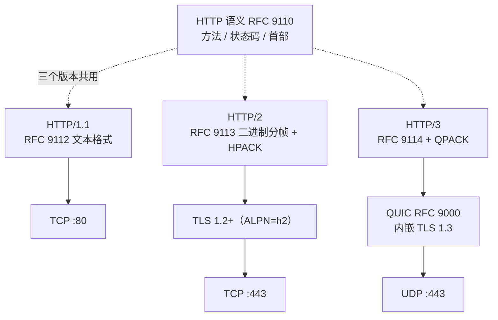

## 协议定位

| 项目 | 信息 |
|------|------|
| 所属层 | 应用层（Application Layer） |
| 英文全称 | Hypertext Transfer Protocol |
| 主要 RFC | **RFC 9110**（HTTP Semantics，STD 97，2022）、RFC 9111（Caching）、RFC 9112（HTTP/1.1）、RFC 9113（HTTP/2）、RFC 9114（HTTP/3）；RFC 9110 已废止 RFC 2616/7230-7235 系列 |
| 端口 | **TCP 80**（明文 HTTP）；HTTPS 用 TCP 443；HTTP/3 用 **UDP 443** |
| 封装于 | HTTP/1.1 与 HTTP/2 → TCP；HTTP/3 → QUIC → UDP |
| 典型应用 | 网页浏览、REST/GraphQL API、对象存储（S3）、WebSocket 握手、gRPC（基于 HTTP/2）、软件包分发 |

## 一句话理解

**HTTP 是一套"客户端提问、服务器回答"的文本化约定**：客户端发一行 `方法 + 目标 + 版本`，附带若干 `名: 值` 首部和可选正文；服务器回一行 `版本 + 状态码 + 原因短语`，同样附带首部和正文。所有 Web 生态——浏览器、CDN、API 网关、微服务——都建立在这套极简语义之上。

## 它解决什么问题

在 HTTP 出现前，网络上的资源获取需要为每类服务学一套协议（FTP 传文件、Gopher 浏览菜单、NNTP 读新闻）。HTTP 用**统一资源标识（URI）+ 统一操作语义（方法）+ 统一结果编码（状态码）** 三件套把这些抽象成了一个模型：

| 问题 | HTTP 的答案 |
|------|------------|
| 如何定位互联网上任意一个资源？ | URI / URL：`scheme://host:port/path?query#fragment` |
| 如何表达"我想对资源做什么"？ | 请求方法：GET（读）、POST（提交）、PUT（整体替换）、DELETE（删）… |
| 如何表达"结果怎么样"？ | 三位数字状态码分五类：1xx 信息、2xx 成功、3xx 重定向、4xx 客户端错、5xx 服务端错 |
| 如何传递元信息（编码、语言、缓存、认证）？ | 可扩展的首部字段（Header Fields），不改协议就能加能力 |
| 如何在同一资源上支持多种表示？ | 内容协商（`Accept` / `Accept-Language` / `Accept-Encoding` ↔ `Content-Type` / `Vary`） |
| 如何减少重复传输？ | 缓存机制（`Cache-Control` / `ETag` / `Last-Modified` + 条件请求 304） |
| 如何在无状态协议上做会话？ | Cookie（RFC 6265）、Authorization 首部、Token |

## 核心特征

1. **无状态（Stateless）**：服务器默认不保留两次请求之间的上下文。好处是任意一台服务器都能处理任意一个请求，天然支持水平扩展与负载均衡；代价是需要 Cookie / Token 等机制额外承载会话身份。
2. **请求-响应模型（Request-Response）**：由客户端发起，服务器被动响应。服务端主动推送需要额外机制（SSE、WebSocket、HTTP/2 Server Push——后者已被主流浏览器弃用）。
3. **可扩展的首部**：几乎所有新能力（CORS、HSTS、内容安全策略、压缩、范围请求）都是通过新增首部实现的，协议核心二十年未变。
4. **语义与语法分离**：RFC 9110 定义"语义"（方法、状态码、首部含义），RFC 9112/9113/9114 分别定义 HTTP/1.1、2、3 三种"线上格式"。**换版本不换语义**——这是 HTTP 能平滑演进的关键设计。
5. **中间件友好**：协议明确定义了代理（Proxy）、网关（Gateway）、缓存（Cache）等中间实体的行为，使 CDN、反向代理、API 网关成为可能。
6. **明文不安全**：HTTP/1.1 与 HTTP/2 over TCP 是明文的，任何路径节点都能读取和篡改。生产环境必须使用 HTTPS（见 [14-https](/learn/network-protocols/14-https/)）。

## 与其他协议的关系

- **与 TCP**：HTTP/1.1 与 HTTP/2 依赖 TCP 的可靠有序交付。TCP 的队头阻塞（Head-of-Line Blocking）是 HTTP/2 未能彻底解决的性能瓶颈，也是 HTTP/3 转向 QUIC 的直接动因。
- **与 TLS / HTTPS**：HTTPS 不是新协议，而是 `HTTP over TLS`。HTTP/2 在实践中被浏览器强制要求配合 TLS（通过 ALPN 协商 `h2`）。
- **与 DNS**：浏览器必须先经 DNS 把域名解析为 IP 才能建立 TCP 连接。HTTPS 记录（RFC 9460）还能直接通告服务器支持的 ALPN 与 ECH 配置。
- **与 QUIC**：HTTP/3 把可靠传输、拥塞控制、加密全都交给 QUIC，自身只负责帧格式与 QPACK 首部压缩。
- **与 WebSocket**：WebSocket（RFC 6455）借用 HTTP 的 `Upgrade` 握手完成协议切换，之后走独立的帧协议，实现全双工。
- **与 gRPC**：gRPC 基于 HTTP/2 的流（Stream）实现双向流式 RPC，把 Protobuf 消息装进 DATA 帧。

## 本目录学习路线

1. **[01-原理与报文](./01-原理与报文/)** — 请求/响应报文逐行解析、方法与状态码全表、关键首部字段、HTTP/1.1 完整交互时序、持久连接与分块传输、HTTP/2 二进制分帧与多路复用、缓存与条件请求机制。
2. **[02-实战与排错](./02-实战与排错/)** — Wireshark 过滤式、`curl` / `nc` / `ab` 实战命令、502/504/CORS/缓存不生效等典型故障的定位、HTTP/1.1 与 2 与 3 的对比表与面试速查。

> 学习建议：**先手敲一次原始 HTTP**（用 `nc` 或 `telnet` 打一条 GET 请求），亲眼看到"请求行 + 首部 + 空行 + 正文"的结构，比读十页文档都管用。
