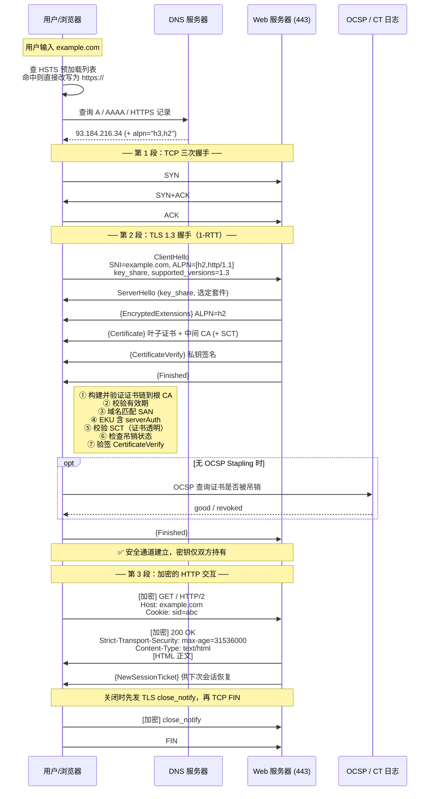
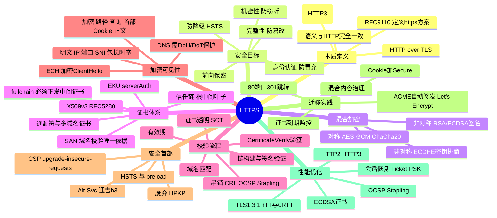

## 工作原理

HTTPS 的运行可以拆成"三段接力"：

1. **传输通道建立**：DNS 解析 → TCP 三次握手到 443 端口。
2. **安全通道建立（TLS 握手）**：协商版本与算法 → 服务器出示证书 → 客户端校验证书并验签 → 双方通过 ECDHE 派生对称密钥 → 双向 Finished 校验。此阶段结束后，双方持有一对**只有彼此知道的对称密钥**。
3. **业务数据传输**：把原本要写进 TCP 的 HTTP 报文字节，先交给 TLS 记录层做 AEAD 加密，再交给 TCP。服务器反向解密后交给 Web 服务处理。

关键认知：**HTTPS 没有定义任何新的报文格式**。抓包看到的 443 端口流量，剥掉 TLS 记录层后就是一模一样的 HTTP 报文。所谓"HTTPS 报文结构"，实际上就是 `TLS 记录头(5B) + 加密后的 HTTP 报文`。

## 报文 / 头部结构

### 分层封装示意

```
+----------------------------------------------------------+
| 以太网帧头                                                |
+----------------------------------------------------------+
| IP 头（源 IP、目的 IP —— 暴露）                           |
+----------------------------------------------------------+
| TCP 头（目的端口 443 —— 暴露）                            |
+----------------------------------------------------------+
| TLS 记录头 5 字节                                         |
|   ContentType(1) = 0x17 application_data                  |
|   LegacyVersion(2) = 0x0303                               |
|   Length(2)                                               |
+----------------------------------------------------------+
| AEAD 加密载荷 —— 以下内容全部不可见                        |
|   GET /account?id=1024 HTTP/1.1                           |
|   Host: bank.example.com                                  |
|   Cookie: sid=abc123                                      |
|   Authorization: Bearer eyJ...                            |
+----------------------------------------------------------+
```

### URL 各部分的加密可见性（高频考点）

以 `https://api.example.com:443/v1/users?token=secret#frag` 为例：

| 部分 | 是否加密 | 说明 |
|------|---------|------|
| 目的 **IP** 与 **端口 443** | ❌ 明文 | 在 IP/TCP 头中，路由必需 |
| **域名（DNS 查询）** | ❌ 明文（除非用 DoH/DoT） | 解析阶段先于 TLS 发生 |
| **域名（TLS SNI）** | ❌ 明文 | 服务器要靠它选证书，只能在加密前发送；ECH 用于解决 |
| **服务器证书** | TLS 1.2 明文 / **TLS 1.3 加密** | 1.3 把 Certificate 放在 EncryptedExtensions 之后 |
| **路径 `/v1/users`** | ✅ 加密 | 属 HTTP 请求行 |
| **查询串 `?token=secret`** | ✅ 加密 | 但会被浏览器历史、服务器 access 日志、`Referer` 记录，**仍不应放敏感信息** |
| **请求/响应首部（含 Cookie、Authorization）** | ✅ 加密 | |
| **请求/响应正文** | ✅ 加密 | |
| **片段 `#frag`** | 不发送 | 仅浏览器本地使用，从不上网 |
| **包长与时序** | ❌ 暴露 | 流量分析可据此推断访问内容，需靠填充（TFC/padding）缓解 |

### X.509 服务器证书关键字段（RFC 5280）

| 字段 | 含义与排错要点 |
|------|---------------|
| `Version` | 现代证书均为 v3（值为 2） |
| `Serial Number` | 序列号，吊销查询与 CT 日志的索引 |
| `Signature Algorithm` | 签名算法，如 `sha256WithRSAEncryption`、`ecdsa-with-SHA256`。SHA-1 签名已被全面拒绝 |
| `Issuer` | 签发者 DN，必须等于上级证书的 `Subject`，链式校验靠它串联 |
| `Validity (notBefore/notAfter)` | 有效期。Let's Encrypt 为 90 天；公共 CA 最长有效期已收紧至 398 天 |
| `Subject` | 主体 DN。其中的 `CN` 字段**早已不用于域名校验** |
| `Subject Public Key Info` | 公钥算法与公钥（RSA 2048+ 或 ECDSA P-256） |
| **`Subject Alternative Name (SAN)`** | **域名校验的唯一依据**，可含多个 `DNS:` 项与 `IP:` 项，支持 `*.example.com` 通配 |
| `Basic Constraints` | `CA:TRUE` 表示是 CA 证书，叶子证书必须为 `CA:FALSE` |
| `Key Usage` | 如 `digitalSignature, keyEncipherment` |
| `Extended Key Usage` | 服务器证书必须含 `serverAuth (1.3.6.1.5.5.7.3.1)` |
| `Authority Information Access (AIA)` | 含 OCSP responder 地址与中间证书下载地址（部分客户端据此自动补链） |
| `CRL Distribution Points` | 吊销列表地址 |
| `SCT List` | 证书透明日志的签名时间戳，Chrome 强制要求公网证书具备 |

### HTTPS 相关的安全首部

| 首部 | 示例 | 作用 |
|------|------|------|
| `Strict-Transport-Security` | `max-age=31536000; includeSubDomains; preload` | HSTS：告诉浏览器今后**只能**用 HTTPS 访问本域，且证书错误不可点击忽略 |
| `Content-Security-Policy` | `upgrade-insecure-requests` | 自动把页面内的 http 子资源升级为 https，治理混合内容 |
| `Expect-CT` | `max-age=86400, enforce` | 要求证书透明（已被 Chrome 内置强制取代，逐步淘汰） |
| `X-Content-Type-Options` | `nosniff` | 禁止 MIME 嗅探 |
| `Alt-Svc` | `h3=":443"; ma=86400` | 通告本服务支持 HTTP/3，引导客户端升级 |
| `Public-Key-Pins` | — | HPKP，因易造成站点自锁已被**废弃**，不要再用 |

## 交互流程



## 关键机制

### 1. 混合加密的分工

| 阶段 | 使用的密码学 | 目的 | 性能特点 |
|------|-------------|------|---------|
| 身份认证 | RSA / ECDSA / Ed25519 **签名** | 证明服务器持有证书对应私钥 | 慢，每次握手 1 次 |
| 密钥协商 | **ECDHE**（X25519 / P-256） | 在公开信道上算出共享秘密 | 中等，每次握手 1 次 |
| 数据加密 | AES-128/256-GCM、ChaCha20-Poly1305（**AEAD**） | 加密全部 HTTP 报文并保证完整性 | 快（有 AES-NI 硬件加速），处理 GB 级数据 |

一句话：**用慢算法安全地建立一把快算法的钥匙。**

### 2. 证书信任链与校验

```
根 CA 证书（自签名，预置在操作系统/浏览器信任库）
   └── 中间 CA 证书（由根签发，CA:TRUE，服务器必须下发）
          └── 叶子证书（由中间 CA 签发，CA:FALSE，含域名 SAN）
```

浏览器校验的七步（对应上图时序中的 ①–⑦）：**链完整 → 签名有效 → 在有效期内 → 域名命中 SAN → EKU 含 serverAuth → SCT 满足 CT 策略 → 未被吊销**，最后再用证书公钥验签 `CertificateVerify` 确认对端确实持有私钥。

> 工程铁律：服务器必须发送 **`fullchain`（叶子 + 中间 CA）**。根证书无需发送（客户端本地已有），只发叶子会导致部分客户端报 `unable to get local issuer certificate`。

### 3. HSTS 与 HTTPS 迁移

`Strict-Transport-Security` 生效后，浏览器在 `max-age` 期内：

- 自动把该域名的所有 `http://` 请求在**本地重写**为 `https://`（不发出明文请求，彻底封死 SSLStrip）；
- 证书错误时**不再提供"继续访问"按钮**。

`preload` 指令可申请加入浏览器内置的 HSTS 预加载列表，实现**首次访问就强制 HTTPS**。但需注意：**加入预加载列表后移除极其困难**（需等浏览器版本迭代），上线前必须确认全站及所有子域都能提供 HTTPS。

标准迁移步骤：
1. 申请证书（ACME / Let's Encrypt），配置 443 监听与 `fullchain`。
2. 全站可用性验证后，把 80 端口配置为 **301 重定向到 https**。
3. 排查并修复**混合内容（Mixed Content）**——HTTPS 页面里引用的 `http://` 脚本、样式会被浏览器直接阻断，图片会被标记为不安全。可先用 `Content-Security-Policy: upgrade-insecure-requests` 兜底。
4. 更新硬编码的绝对 URL、Cookie 加 `Secure` 属性、`SameSite` 复核。
5. 小 `max-age`（如 300）灰度 HSTS，观察无异常后逐步升到一年，最后考虑 `preload`。
6. 配置证书到期监控与自动续期，避免"证书过期导致全站不可用"这一最常见事故。

### 4. OCSP Stapling 与证书吊销

传统 OCSP 由**客户端**向 CA 查询证书吊销状态，带来三个问题：额外一次网络往返、CA 宕机时浏览器只能"软失败"放行、CA 得知了用户访问了哪个站点（隐私泄露）。

**OCSP Stapling**（TLS `status_request` 扩展）让**服务器**定期向 CA 查询并缓存一份带 CA 签名的 OCSP 响应，握手时直接"钉"在 Certificate 消息后面发给客户端。客户端无需外联即可确认状态。生产环境应始终开启。

### 5. 证书透明（Certificate Transparency）

CA 签发的每张公网证书都必须提交到多个公开、只可追加的 **CT 日志**，并把日志返回的 **SCT（Signed Certificate Timestamp）** 嵌入证书（或通过 TLS 扩展/OCSP 传递）。Chrome 等浏览器会拒绝不满足 CT 策略的证书。这使得任何"误签/恶意签发"都会在公开日志中留痕，域名所有者可通过 crt.sh 等工具监控自己域名下出现的所有证书。

### 6. 性能开销与优化

HTTPS 的额外成本主要是握手的 1–2 个 RTT 与非对称运算的 CPU 开销。缓解手段：

- **TLS 1.3**：1-RTT 握手，会话恢复 0-RTT。
- **会话恢复**：Session Ticket / PSK，避免重复完整握手。
- **OCSP Stapling**：省掉客户端的额外查询。
- **ECDSA 证书**：比同等强度 RSA 密钥更短、签名更快（可与 RSA 双证书并存以兼容老客户端）。
- **HTTP/2 / HTTP/3**：多路复用抵消并常常反超明文 HTTP/1.1 的整体性能。
- **会话复用与长连接**：避免每个请求都重新握手。

## 知识框架


