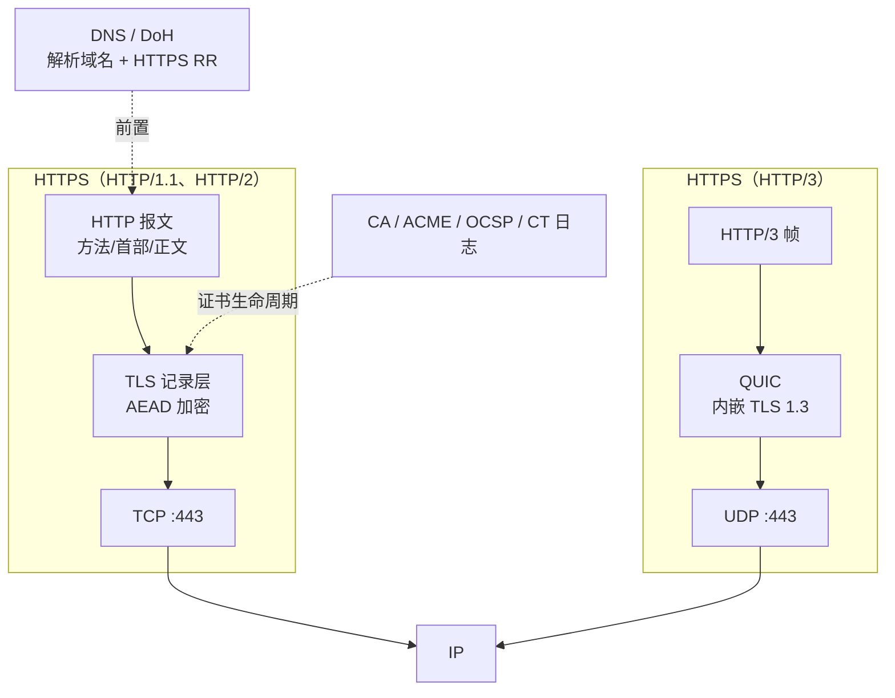

## 协议定位

| 项目 | 信息 |
|------|------|
| 所属层 | 应用层（HTTP 语义不变，仅在传输前插入 TLS 加密层） |
| 英文全称 | Hypertext Transfer Protocol Secure（本质是 **HTTP over TLS**） |
| 主要 RFC | **RFC 9110 §4.2.2**（定义 `https` URI 方案）、**§4.3.4**（https 证书校验）——已废止旧的 RFC 2818；配套 RFC 8446（TLS 1.3）、RFC 5280（X.509）、RFC 6797（HSTS）、RFC 6962/9162（证书透明 CT）、RFC 8555（ACME 自动签发） |
| 端口 | **TCP 443**（IANA 分配）；HTTP/3 为 **UDP 443** |
| 封装于 | `HTTP → TLS → TCP → IP`；HTTP/3 为 `HTTP/3 → QUIC(内嵌 TLS 1.3) → UDP → IP` |
| 典型应用 | 全部现代 Web 站点、REST/GraphQL API、移动端后端接口、支付与登录、PWA / Service Worker（浏览器强制要求安全上下文） |

## 一句话理解

**HTTPS = HTTP + TLS，一个字节的 HTTP 语义都没改。** 客户端仍然发 `GET /index.html HTTP/1.1`，只是这串字节在交给 TCP 之前先被 TLS 加了密。因此"学 HTTPS"的实质是"学 TLS 在 Web 场景下的落地细节"：证书怎么签、浏览器怎么校验、怎么从 HTTP 平滑迁移过来。

## 它解决什么问题

明文 HTTP 在今天已不可接受，具体风险与 HTTPS 的对策：

| 明文 HTTP 的风险 | 真实案例 | HTTPS 的对策 |
|-----------------|---------|-------------|
| **被窃听** | 公共 Wi-Fi 下抓包读取 Cookie，直接冒用登录态（Firesheep 攻击） | TLS 对整个 HTTP 报文（含首部与 Cookie）做 AEAD 加密 |
| **被篡改** | 运营商在网页底部插入弹窗广告；网关注入挖矿脚本 | AEAD 认证标签 + Finished 校验，任何比特改动都会导致解密失败 |
| **被冒充** | DNS 劫持 / ARP 欺骗把用户导向钓鱼站点 | 服务器必须出示由受信任 CA 为该域名签发的证书，并用私钥签名证明持有权 |
| **降级到明文** | SSLStrip：中间人把页面里的 https 链接全改成 http | HSTS（RFC 6797）强制浏览器只用 HTTPS 访问该域名 |
| **签错证书没人发现** | CA 被攻破为 google.com 误签证书 | 证书透明（CT）要求证书必须记入公开可审计日志，浏览器校验 SCT |

此外，HTTPS 已是**功能准入门槛**：HTTP/2、HTTP/3、Service Worker、Geolocation、getUserMedia、Web Push 等浏览器能力都只在"安全上下文（Secure Context）"下可用；搜索引擎也将 HTTPS 作为排序因子。

## 核心特征

1. **协议栈只多一层**：HTTPS 没有自己的报文格式，`443` 端口上跑的就是标准 TLS 记录，记录里装的是标准 HTTP 报文。
2. **混合加密（Hybrid Encryption）**：非对称算法（ECDHE 密钥交换 + RSA/ECDSA 签名）用于握手，对称 AEAD 算法（AES-GCM / ChaCha20-Poly1305）用于业务数据。
3. **服务器身份强制认证，客户端认证可选**：默认只校验服务器证书；金融、内网等场景可开启 **mTLS（双向 TLS）** 要求客户端也出示证书。
4. **加密范围**：URL 路径、查询串、首部、Cookie、请求体、响应体**全部加密**；但 **目标 IP、端口、SNI 中的域名、包长与时序**仍然暴露（ECH 正在解决 SNI 泄露）。
5. **信任锚在客户端**：浏览器/操作系统维护根证书信任库。企业中间盒之所以能解密流量，是因为把企业根 CA 装进了终端信任库——技术上就是"被允许的中间人"。
6. **证书自动化已成标配**：ACME 协议（RFC 8555）+ Let's Encrypt 让 90 天短周期证书的自动签发续期成为常态，人工年更证书的时代已过去。

## 与其他协议的关系

- **与 HTTP**：语义完全相同。迁移时业务代码几乎不用改，改的是部署（证书、监听端口、重定向、混合内容）。
- **与 TLS**：HTTPS 是 TLS 最大的使用者。TLS 的一切概念（握手、密码套件、证书链、前向保密、0-RTT）在 HTTPS 中原样适用，详见 [11-tls](/learn/network-protocols/11-tls/)。
- **与 DNS**：解析仍是明文短板——即使用了 HTTPS，DNS 查询也会暴露访问的域名。DoH（RFC 8484）/ DoT（RFC 7858）用于加密解析；DNS 的 `HTTPS` 记录（RFC 9460）可通告 ALPN、端口与 ECH 配置。
- **与 HTTP/2 / HTTP/3**：浏览器只在 TLS 上支持 HTTP/2（ALPN 协商 `h2`）；HTTP/3 强制加密。因此"上 HTTPS"往往顺带解锁了性能提升，抵消了握手开销。
- **与 SNI / CDN**：SNI 让一个 IP 承载成千上万个域名的 HTTPS 站点，是 CDN 与云托管的技术前提。

## 本目录学习路线

1. **[01-原理与报文](./01-原理与报文/)** — 完整访问时序（DNS → TCP → TLS → HTTP）、URL 各部分的加密可见性、证书链与浏览器校验的七步、HSTS/CT/OCSP 机制、HTTPS 独有的首部字段。
2. **[02-实战与排错](./02-实战与排错/)** — Wireshark 观察加密流量、`openssl` / `curl` 检查证书、Nginx 部署与 Let's Encrypt 自动化、混合内容 / 证书链不全 / 重定向循环等故障、与 HTTP 的对比表和面试题。

> 学习建议：HTTPS 的知识 = **TLS 原理（占 80%）+ Web 特有工程实践（占 20%）**。若还没看过 [11-tls](/learn/network-protocols/11-tls/)，建议先看那篇，本目录重点放在"落到 Web 上怎么做"。
