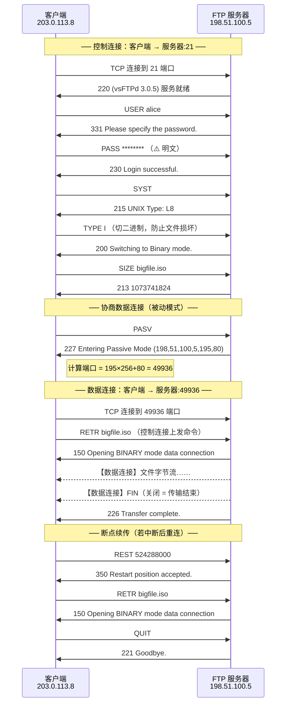
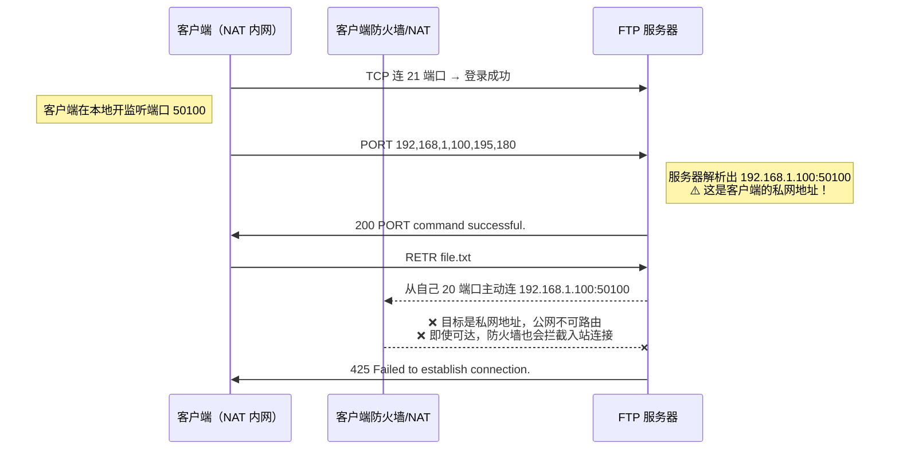
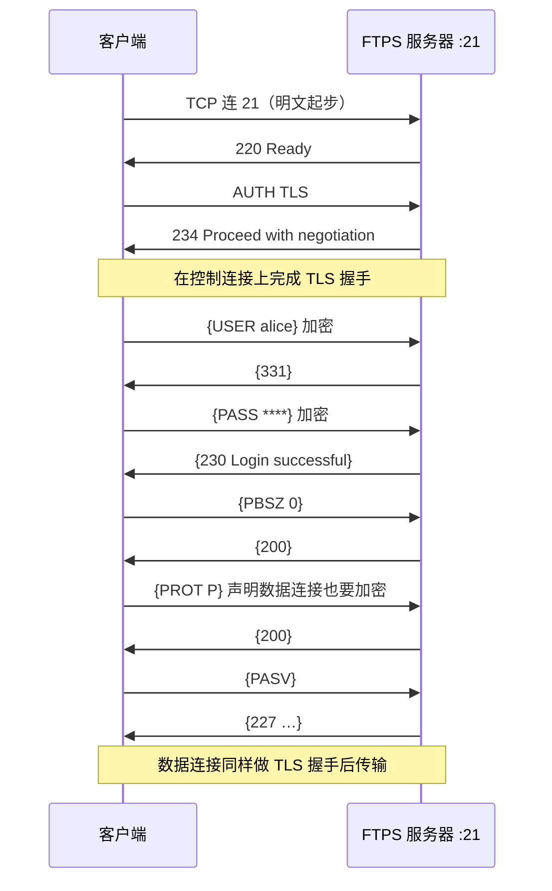
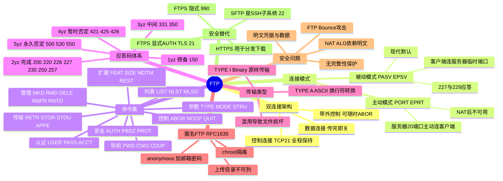

## 🚀 先建立直觉

先别管命令和端口号，用一个画面记住 FTP 的"怪"：

**FTP 同时开着两条线——一条"对讲机"、一条"搬运道"。** 对讲机（控制连接）从你登录到退出一直开着，只用来喊口令："我要下载 xxx""切到二进制模式"。真正搬运文件字节的是另一条临时拉的"搬运道"（数据连接），货搬完这条道立刻撤掉。正因为两条线分开，你才能在搬运途中对着对讲机大喊"停！"（发 `ABOR`）让搬运工立刻住手——如果命令和数据混在一条线上，就做不到这么干脆。

记住这个"双线模型"，后面所有的复杂（主动/被动、防火墙难过）都是因为这第二条线的"门牌号"是口头报出来的、隔着墙就找不到了。

## 🤔 它解决什么问题

FTP 要解决的不是"怎么传文件"一个点，而是一整套"异构机器之间怎么可靠地传文件"：

- **机器不一样**：换行符（CRLF vs LF）、字符编码（ASCII vs EBCDIC）、文件结构（流式 vs 记录式）都不同 → 用 `TYPE` / `STRU` / `MODE` 协商。
- **要能浏览和操作远程文件系统**：列目录、建删目录、改名、删文件 → 一整套文件系统命令（`LIST`/`CWD`/`MKD`/`DELE`/`RNFR`/`RNTO`）。
- **大文件不能一断就重来** → `REST` 断点续传（RFC 3659）。
- **命令不能和字节流搅在一起** → **带外控制**：控制连接与数据连接物理分离，传输中仍可发 `ABOR` 中止。
- **公开分发不想给每人开账号** → **匿名 FTP**（用户名 `anonymous`，密码填邮箱，RFC 1635）。

一句话：FTP 把"传文件"做成了带目录操作、可续传、可中止的完整文件系统会话，而不只是"发一串字节"。

## 🔄 工作流程（简化版）

把一次下载拆开，核心就是"先对讲、再开搬运道、搬完撤道"：

### 双连接模型

FTP 把"说什么"和"传什么"彻底分开：

| 连接 | 端口 | 生命周期 | 承载内容 |
|------|------|---------|---------|
| **控制连接（Control Connection）** | 服务器 TCP **21** | 整个会话期间保持 | Telnet NVT 格式的 ASCII 命令与三位数字应答，以 `\r\n` 结尾 |
| **数据连接（Data Connection）** | 主动模式：服务器 TCP **20**；被动模式：服务器动态端口 | 每次传输单独建立，传完即关 | 纯字节流：文件内容或目录列表，**无任何协议头** |

这样设计的好处是：文件正在传输时，控制连接依然畅通，客户端可以随时发 `ABOR` 中止；而数据连接上不需要任何分隔符或长度字段——**连接关闭本身就是"传输结束"的信号**。

代价是：需要动态协商第二条连接的端口，而这个端口号写在应用层数据里，导致 FTP 与 NAT、防火墙、加密三者天然冲突。

### 一次下载的完整流程

1. 客户端连服务器 21 端口 → 服务器回 `220 服务就绪`。
2. `USER alice` → `331 需要密码`；`PASS ***` → `230 登录成功`。
3. `TYPE I` 切到二进制模式 → `200 OK`（**忘了这步会导致二进制文件损坏**）。
4. `PASV` → 服务器回 `227 Entering Passive Mode (192,168,1,10,195,80)`，客户端算出端口 = 195×256+80 = 49936。
5. 客户端向服务器 49936 端口建立数据连接。
6. `RETR bigfile.iso` → 服务器回 `150 打开数据连接`，随即在数据连接上推送文件字节。
7. 传完服务器关闭数据连接，并在控制连接上回 `226 传输完成`。
8. `QUIT` → `221 再见`，关闭控制连接。

## 📦 报文/头部长什么样

先记住一句话：**FTP 没有二进制头部，命令和应答都是文本行。** 所谓"报文结构"，就是"一行命令 + 一行三位数字应答"，外加第二条连接上纯粹的字节流。

### 常用命令（RFC 959 及扩展）

这张表是 FTP 的"字典"。先记住：**`USER`/`PASS` 登录、`PASV`/`PORT` 协商数据连接、`RETR`/`STOR` 收发文件、`TYPE I` 切二进制——这四组用得最多。**

| 命令 | 参数 | 作用 | 典型应答 |
|------|------|------|---------|
| `USER` | 用户名 | 提交用户名 | 331（需密码）/ 230（无需密码直接登录） |
| `PASS` | 密码 | 提交密码（**明文**） | 230 / 530 |
| `ACCT` | 账户 | 提交账户信息（极少用） | 230 / 202 |
| `SYST` | — | 查询服务器系统类型 | 215 UNIX Type: L8 |
| `FEAT` | — | 查询服务器支持的扩展（RFC 2389） | 211-Features: … |
| `PWD` | — | 显示当前工作目录 | 257 "/home/alice" |
| `CWD` | 路径 | 切换工作目录 | 250 |
| `CDUP` | — | 切换到上级目录 | 200 / 250 |
| `MKD` / `RMD` | 目录名 | 创建 / 删除目录 | 257 / 250 |
| `DELE` | 文件名 | 删除文件 | 250 |
| `RNFR` → `RNTO` | 旧名 → 新名 | 两步重命名 | 350 → 250 |
| `TYPE` | `A` / `I` | ASCII 模式 / 二进制（Image）模式 | 200 |
| `MODE` | `S`/`B`/`C` | 流 / 块 / 压缩传输模式（几乎只用 S） | 200 |
| `STRU` | `F`/`R`/`P` | 文件 / 记录 / 页结构（几乎只用 F） | 200 |
| **`PORT`** | `h1,h2,h3,h4,p1,p2` | **主动模式**：告知服务器连接客户端的哪个地址端口 | 200 |
| **`PASV`** | — | **被动模式**：请求服务器开监听端口 | **227** Entering Passive Mode (h1,h2,h3,h4,p1,p2) |
| `EPRT` / `EPSV` | RFC 2428 扩展 | 支持 IPv6 且格式对 NAT 更友好的主动/被动 | 200 / **229** Entering Extended Passive Mode (\|\|\|端口\|) |
| **`LIST`** | [路径] | 详细目录列表（类 `ls -l`，格式不标准） | 150 → 226 |
| `NLST` | [路径] | 仅文件名列表（便于程序解析） | 150 → 226 |
| `MLSD` / `MLST` | [路径] | **机器可读**的标准化列表（RFC 3659，推荐） | 150 → 226 / 250 |
| **`RETR`** | 文件名 | 下载（Retrieve） | 150 → 226 |
| **`STOR`** | 文件名 | 上传（Store，同名覆盖） | 150 → 226 |
| `STOU` | — | 上传并由服务器生成唯一文件名 | 150 → 226 |
| `APPE` | 文件名 | 追加上传 | 150 → 226 |
| `REST` | 偏移量 | 从指定字节偏移续传（RFC 3659） | 350 |
| `SIZE` | 文件名 | 查询文件字节大小（RFC 3659） | 213 1048576 |
| `MDTM` | 文件名 | 查询最后修改时间 | 213 20260803021500 |
| `ABOR` | — | 中止当前数据传输 | 426 + 226 |
| `NOOP` | — | 空操作，用于保活 | 200 |
| `QUIT` | — | 退出并关闭控制连接 | 221 |
| `AUTH` | `TLS` | 显式升级为 FTPS（RFC 4217） | 234 |
| `PBSZ` / `PROT` | `0` / `P` | 设置保护缓冲区大小 / 数据连接也加密 | 200 |

### 应答码结构（三位数字，每位都有含义）

先看"三位数字怎么读"：第一位定性质（成功/失败/需补充），第二位定类别（语法/连接/认证/文件系统等）。

**第一位 —— 结果类别**

| 首位 | 含义 |
|------|------|
| **1yz** | 预备应答：命令已接受，正在处理，**还会有后续应答** |
| **2yz** | 完成应答：命令成功执行 |
| **3yz** | 中间应答：命令被接受，但**需要更多信息**才能继续 |
| **4yz** | 暂时性否定：本次失败，但**稍后重试可能成功** |
| **5yz** | 永久性否定：命令失败，**重试同样会失败**，需修改后再试 |

**第二位 —— 功能分类**

| 次位 | 含义 |
|------|------|
| x0z | 语法错误类 |
| x1z | 信息类（状态、帮助） |
| x2z | 连接类（控制/数据连接管理） |
| x3z | 认证与账户类 |
| x5z | 文件系统类 |

**高频应答码速查**

| 码 | 含义 |
|----|------|
| 110 | 重启标记应答 |
| **150** | 文件状态正常，**即将打开数据连接** |
| **200** | 命令执行成功 |
| 211 | 系统状态 / 特性列表（FEAT 响应） |
| 213 | 文件状态（SIZE / MDTM 的结果） |
| 215 | 系统类型（SYST 的结果） |
| **220** | 服务就绪（连接后服务器的第一句欢迎语） |
| **221** | 服务关闭控制连接（QUIT 的响应） |
| **226** | 关闭数据连接，**请求的文件操作成功** |
| **227** | 进入被动模式（含 IP 与端口） |
| **229** | 进入扩展被动模式（EPSV，仅含端口） |
| **230** | 用户登录成功 |
| 234 | AUTH TLS 被接受，开始 TLS 握手 |
| **250** | 请求的文件操作完成（CWD/DELE/RNTO 等） |
| **257** | 创建了 "PATHNAME"（MKD / PWD 的响应） |
| **331** | 用户名正确，**需要密码** |
| 350 | 请求的操作待进一步信息（RNFR / REST 之后） |
| **421** | 服务不可用，正在关闭控制连接（超时/连接数满） |
| **425** | **无法打开数据连接**（主动/被动模式或防火墙问题的典型症状） |
| 426 | 连接关闭，传输被中止（ABOR 或网络中断） |
| **500** | 语法错误，**命令无法识别** |
| 501 | 参数语法错误 |
| 502 | 命令未实现 |
| 504 | 该参数下命令未实现 |
| **530** | **未登录 / 登录失败**（密码错误、匿名被禁用） |
| 532 | 存储文件需要账户信息 |
| **550** | 请求的操作未执行：**文件不存在或无权限** |
| 552 | 超出存储配额 |
| 553 | 文件名不允许 |

### PASV 应答的端口计算

`227` 应答把 IP 和端口都写在一行里。端口不是直接给的数字，而是两个字节 `p1,p2` 拼出来的——**端口 = p1 × 256 + p2**：

```
227 Entering Passive Mode (192,168,1,10,195,80)
                           └─── IP ───┘ └ p1,p2 ┘

数据端口 = p1 × 256 + p2 = 195 × 256 + 80 = 49936
```

EPSV（RFC 2428）的应答更简洁，且**不含 IP**（客户端直接复用控制连接的服务器 IP），因此对 NAT 天然友好：

```
229 Entering Extended Passive Mode (|||49936|)
```

## 🔀 交互时序

**一句话看懂这组图**：第一张是今天的标准做法（被动模式下载，客户端去连服务器的临时端口）；第二张说明为什么主动模式在当今网络几乎必挂（服务器反向连私网客户端被拦）；第三张是 FTPS，在 FTP 命令之上套了一层 TLS。

### 被动模式（PASV）下载文件 —— 现代标准做法



### 主动模式（PORT）—— 理解为什么它在今天几乎不可用



**结论**：主动模式要求**服务器反向连接客户端**，这在 NAT 普及和主机防火墙默认拒绝入站的今天几乎必然失败。因此现代客户端（`curl`、`lftp`、浏览器时代的 FileZilla）默认都用被动模式。

### 显式 FTPS（AUTH TLS，RFC 4217）



## 🔧 关键机制/变体

下面几条是 FTP 真正"绕不开"的知识点，每条先点明它解决什么：

### 1. 主动模式 vs 被动模式 —— 解决"第二条连接谁来发起"

| 维度 | 主动模式（Active / PORT） | 被动模式（Passive / PASV） |
|------|--------------------------|---------------------------|
| 谁发起数据连接 | **服务器** → 客户端 | **客户端** → 服务器 |
| 服务器数据源端口 | 固定 **20** | 动态临时端口（如 49152–65535） |
| 关键命令/应答 | `PORT` / `EPRT` → 200 | `PASV` / `EPSV` → **227 / 229** |
| 客户端在 NAT 后 | ❌ 基本不可用 | ✅ 可用 |
| 服务器在 NAT 后 | ✅ 相对容易 | 需配置 `pasv_address` 与端口范围映射 |
| 客户端防火墙压力 | 必须允许入站连接（很难被批准） | 只需允许出站 |
| 服务器防火墙压力 | 只需开 20、21 | 需开放整段被动端口范围 |
| 现代默认 | 已基本弃用 | ✅ 默认 |

一句口诀：**主动模式是"服务器主动来找我"，被动模式是"服务器被动等我去"。** 谁在 NAT 后面，谁就不能被"找"。

### 2. 传输类型：ASCII 与 Binary —— 解决"不同机器文件格式不同"

- **`TYPE A`（ASCII）**：按行传输，自动在不同平台的换行符间转换（网络上统一用 CRLF）。**只能用于纯文本**。
- **`TYPE I`（Image / Binary）**：逐字节原样传输，不做任何转换。

**经典事故**：用 ASCII 模式传 `.zip` / `.exe` / `.jpg`，文件中恰好含 `0x0D 0x0A` 字节序列时会被"转换"，导致文件损坏且大小对不上。**规则很简单：除非明确知道是纯文本，一律先发 `TYPE I`。** 命令行 `ftp` 客户端默认可能是 ASCII，必须显式 `binary`。

### 3. 匿名 FTP（Anonymous FTP，RFC 1635）—— 解决"公开分发不想开账号"

用户名固定为 `anonymous`（或 `ftp`），密码约定填写自己的邮箱地址（服务器通常不校验）。用于公开分发软件、镜像站。安全要点：

- 必须 `chroot` 到独立目录，防止目录穿越到系统文件；
- 默认**只读**，若开放上传必须使用独立的"投递目录"（incoming），且该目录**不可读不可列**，否则会被滥用为盗版/恶意文件中转站（历史上极常见）；
- 限制并发连接数与带宽，防止被当作免费 CDN。

### 4. FTP 的安全缺陷 —— 解决"为什么不能在公网裸奔"

| 缺陷 | 说明 |
|------|------|
| **明文凭据** | `USER`/`PASS` 以明文在控制连接上传输，同网段抓包即可获取 |
| **明文数据** | 文件内容明文传输，可被窃听与篡改 |
| **无完整性保护** | 无法察觉传输过程中数据被修改 |
| **FTP Bounce 攻击** | 利用 `PORT` 命令让服务器向**任意第三方主机端口**发起连接，可用于绕过防火墙做端口扫描或匿名攻击（CVE 类经典漏洞）。现代服务器默认拒绝 `PORT` 指向非客户端 IP 的请求 |
| **暴力破解友好** | 无内建限速，需靠 fail2ban 等外部手段 |
| **NAT ALG 带来的风险** | 防火墙需解析明文载荷改写端口，攻击者可构造伪造应答诱导防火墙打洞 |

**推荐替代**：优先 **SFTP**（SSH 子系统，单连接、全加密、易穿墙）；必须保留 FTP 语义时用 **FTPS**（显式 `AUTH TLS`）；单纯的文件下载分发直接用 **HTTPS**。

### 5. 断点续传与传输保活 —— 解决"大文件中断怎么办"

- `SIZE` 查询远端文件大小 → 与本地已下载字节比较 → `REST <offset>` → `RETR`。上传方向用 `APPE` 或 `REST` + `STOR`（服务器需支持）。
- 大文件传输期间控制连接长时间无数据，容易被 NAT 会话表或防火墙空闲超时踢掉，导致传完后收不到 `226`。解决办法：开启 TCP keepalive，或客户端周期性发 `NOOP`。

## ⚠️ 常见误区

1. **以为 FTP 是"一条连接传文件"**：它其实是两条——控制连接全程在，数据连接每次传文件/列目录都单独开。所以会出现"登录正常、能 `pwd`，但 `ls` 卡住"的典型症状：`ls` 也需要数据连接，问题出在第二条线上，不是控制线。
2. **以为主动和被动"差不多"**：主动模式由服务器从 20 端口**反向连客户端**，NAT 后客户端是私网地址、防火墙也拦入站，几乎必报 `425`。现代一律用被动模式（PASV/EPSV）。
3. **以为 ASCII/Binary 随便选**：二进制文件（zip/exe/jpg）用 ASCII 模式传，`0x0D 0x0A` 会被改写，文件损坏、大小对不上。除明确纯文本外，先 `TYPE I`（`binary`）。
4. **以为 FTPS 和 SFTP 是一回事**：FTPS 是 FTP 套 TLS（仍双连接、21/990 端口、仍有被动模式问题）；SFTP 是 SSH 子系统、单连接 22 端口、二进制协议，**和 RFC 959 毫无继承关系**。选错协议就完全连不上。

## 🧠 速记口诀

1. **两条连接：21 对讲机指挥，20/临时端口搬货；带外控制，传输中可 ABOR。**
2. **主动=服务器来找我，被动=我去找服务器；谁在 NAT 后，谁就别被找 → 一律 PASV。**
3. **传文件先 TYPE I；被动端口 = p1×256+p2；FTPS 是 FTP 加 TLS，SFTP 是 SSH 子系统。**

## 🗺️ 知识框架


