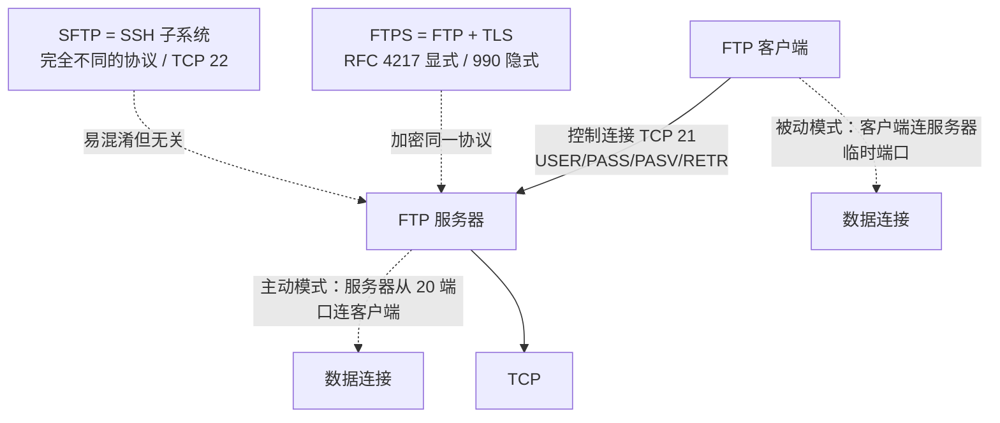

## 协议定位

| 项目 | 信息 |
|------|------|
| 所属层 | 应用层（Application Layer） |
| 英文全称 | File Transfer Protocol |
| 主要 RFC | **RFC 959**（1985，核心规范）、RFC 1635（匿名 FTP 指南）、RFC 2228（安全扩展）、RFC 2389（FEAT/OPTS）、RFC 2428（IPv6 与 NAT 友好的 EPRT/EPSV）、RFC 3659（SIZE/MDTM/MLSD/REST）、RFC 4217（显式 FTPS，AUTH TLS） |
| 端口 | **TCP 21 = 控制连接**；**TCP 20 = 主动模式的数据连接**（服务器源端口）；被动模式数据端口由服务器动态指定；**隐式 FTPS = TCP 990** |
| 封装于 | TCP（两条独立连接） |
| 典型应用 | 传统站点文件发布、软件镜像站（匿名 FTP）、企业间批量文件交换、老旧设备/工控系统固件上传、网络设备配置备份 |

## 一句话理解

**FTP 最与众不同的地方是它用两条 TCP 连接干活**：一条长期存在的**控制连接**（21 端口）只走命令和三位数字应答，像"对讲机"；每次真正传文件或列目录时，再单独开一条**数据连接**传字节流，传完即关，像"临时搬运通道"。理解 FTP 的一切复杂性（主动/被动模式、防火墙难题）都要从这个"双连接"设计出发。

## 它解决什么问题

在 1971 年 FTP 诞生的年代，异构主机之间连"文件是什么"都没有共识。FTP 要解决的问题及其手段：

| 问题 | FTP 的答案 |
|------|-----------|
| 不同主机的字符编码/换行符不同（如 ASCII vs EBCDIC，CRLF vs LF） | `TYPE A`（ASCII 模式，自动转换换行符）与 `TYPE I`（Image/二进制模式，逐字节原样传输） |
| 不同主机的文件结构不同（流式 vs 记录式） | `STRU F/R/P`（文件/记录/页结构）、`MODE S/B/C`（流/块/压缩模式） |
| 需要浏览远程目录、创建删除文件 | 完整的文件系统操作命令集：`LIST`、`CWD`、`MKD`、`DELE`、`RNFR/RNTO` |
| 大文件传输中断后重来成本高 | `REST` 命令 + 断点续传（RFC 3659） |
| 命令与数据混在一起会互相干扰 | **带外控制（Out-of-band Control）**：控制连接与数据连接物理分离，传输过程中仍可发 `ABOR` 中止 |
| 公开分发软件不想给每人开账号 | **匿名 FTP**：用户名 `anonymous`，密码填邮箱（RFC 1635） |

## 核心特征

1. **双连接架构**：控制连接全程保持（Telnet NVT 文本协议），数据连接按需建立、传完即关。**一次目录列表也要开一条数据连接**。
2. **有状态**：服务器为每个会话维护登录身份、当前工作目录、传输类型（ASCII/二进制）、传输模式等状态。这与无状态的 HTTP 形成鲜明对比。
3. **两种数据连接方向**：
   - **主动模式（Active / PORT）**：客户端告诉服务器"连我的 X 端口"，由**服务器**从 20 端口向客户端发起连接。
   - **被动模式（Passive / PASV）**：服务器开一个临时端口并告诉客户端，由**客户端**发起连接。**NAT/防火墙环境下必须用被动模式。**
4. **文本化命令 + 三位数字应答**：命令如 `USER`、`RETR`；应答如 `230 Login successful`。每位数字都有明确含义，便于程序解析。
5. **明文传输是致命缺陷**：用户名、密码、命令、文件内容全部明文。RFC 959 设计于没有安全威胁意识的年代，今天**不应在公网使用裸 FTP**。
6. **安全演进路径**：`FTPS`（FTP over TLS，RFC 4217，仍是 FTP）与 `SFTP`（SSH File Transfer Protocol，完全不同的协议，走 SSH 22 端口）。二者名字像但毫无关系。

## 与其他协议的关系

- **与 TCP**：完全依赖 TCP 的可靠传输，且是少见的"一个应用占用两条 TCP 连接"的协议。
- **与 TLS / FTPS**：`AUTH TLS` 命令在控制连接上升级为 TLS（显式 FTPS，端口仍是 21），再用 `PROT P` 声明数据连接也加密。隐式 FTPS 直接在 990 端口上以 TLS 起始。
- **与 SSH / SFTP**：**SFTP 不是 FTP over SSH**，它是 SSH 协议的一个子系统（subsystem），只用一条 TCP 22 连接，命令是二进制的，与 FTP 没有任何报文层面的关系。现代场景应优先选 SFTP。
- **与 HTTP**：HTTP 单连接、无状态、有丰富的缓存与内容协商机制，在文件下载场景上已全面取代 FTP。浏览器（Chrome 95+、Firefox 90+）已彻底移除 FTP 支持。
- **与 NAT/防火墙**：FTP 是最典型的"NAT 不友好"协议——端口信息写在**应用层载荷里**，NAT 设备必须做深度包检测（ALG，Application Layer Gateway）改写 `PORT`/`227` 应答内容。加密后 ALG 失效，这正是 FTPS 部署困难的根源。
- **与 TFTP**：TFTP（RFC 1350，UDP 69）是极简版，无认证、无目录操作，仅用于 PXE 网络引导和设备固件加载，与 FTP 除名字外无继承关系。

## 本目录学习路线

1. **[01-原理与报文](./01-原理与报文/)** — 双连接模型详解、命令与应答码体系、主动/被动模式的时序图对比、传输类型与断点续传、FTPS 的两种形态。
2. **[02-实战与排错](./02-实战与排错/)** — Wireshark 过滤与提取传输文件、`ftp`/`lftp`/`curl`/`nmap` 实战命令、vsftpd 配置、被动模式端口不通等经典故障、与 SFTP/HTTP 的对比及面试题。

> 学习建议：亲手用 `nc localhost 21` 或 `ftp -d` 打一遍 `USER → PASS → PASV → RETR` 的完整流程，你会瞬间理解为什么 FTP 在防火墙后如此难缠。
