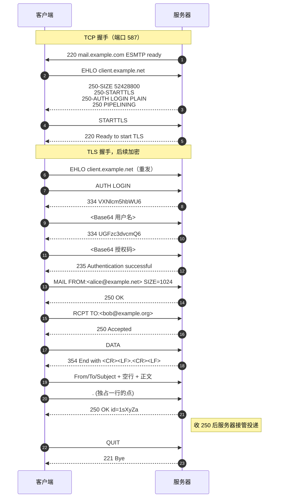
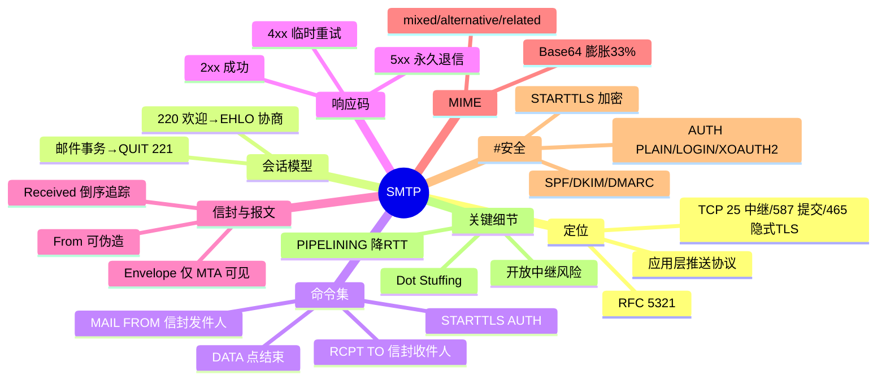

## 1. 工作原理

SMTP 是**面向连接的文本行请求/响应协议**：客户端每发一条命令，服务端回一条以三位数字开头的响应，直到 `QUIT`。一次完整投递分三阶段：

| 阶段 | 动作 | 关键点 |
|------|------|--------|
| 连接与握手 | TCP 握手 → 服务端发 `220` → 客户端 `EHLO 域名` | `EHLO` 应答里公布扩展能力清单 |
| 邮件事务 | `MAIL FROM:` → 多个 `RCPT TO:` → `DATA` → 内容 → `<CRLF>.<CRLF>` | 一条连接可做多个事务；`RSET` 中止 |
| 释放 | `QUIT` → `221` | 服务端收到最终 `250` 后才接管投递 |

**信封（Envelope）与报文（Message）分离**是 SMTP 最关键的设讯：

- **信封**：`MAIL FROM:`（退信地址）+ `RCPT TO:`（投递地址），**只有 MTA 可见**，决定实际投递。
- **报文**：`DATA` 后的「头部 + 空行 + 正文」，`From:`/`To:` 仅用于显示，可与信封不同。

> **Bcc** 只出现在 `RCPT TO:` 信封里、不写入头部，故他人看不到；钓鱼邮件伪造 `From:` 头部而信封发件人是攻击者本人，正是同一机制的误用。

## 2. 报文 / 头部结构

### 2.1 核心命令集（RFC 5321）

| 命令 | 含义 |
|------|------|
| `HELO` / `EHLO` | 握手（EHLO 为 ESMTP，回多行 250 能力清单） |
| `MAIL FROM:<addr>` | 声明信封发件人，可带 `SIZE=` 等扩展参数 |
| `RCPT TO:<addr>` | 声明一个信封收件人，多个收件人重复发送 |
| `DATA` | 服务端回 `354` 后传输报文，以单独一行的 `.` 结束 |
| `RSET` / `NOOP` / `QUIT` | 重置事务 / 保活 / 关闭连接（回 `221`） |
| `VRFY` / `EXPN` | 验证用户 / 展开列表（现代服务器普遍禁用，防枚举） |
| `STARTTLS` | 明文升级为 TLS（RFC 3207），升级后须重发 `EHLO` |
| `AUTH` | 身份认证（RFC 4954），凭据 Base64 传输 |

### 2.2 响应码

响应格式 `<3位数字>[空格|-]<文本>`，连字符表示后续还有行。首位决定客户端行为：

| 首位 | 类别 | 客户端行为 |
|------|------|-----------|
| `2xx` | 成功完成 | 继续下一步 |
| `3xx` | 中间响应（如 `354` 等待正文） | 发送后续数据 |
| `4xx` | **暂时性**否定 | 入队稍后重试 |
| `5xx` | **永久性**否定 | 放弃并生成退信（NDR） |

高频码：`220` 就绪 / `221` 关闭 / `235` 认证成功 / `250` 完成 / `334` 认证质询 / `354` 输入正文 / `421` 服务不可用 / `450` 灰名单临时拒 / `535` 认证失败 / `550` 邮箱不存在或中继被拒 / `552` 超配额 / `554` 策略拒绝（反垃圾）。

### 2.3 报文头部关键字段（RFC 5322）

| 字段 | 含义 |
|------|------|
| `Received:` | 每跳追加一条，**倒序阅读**，最上面是最后一跳，排查路径核心依据 |
| `From:` / `To:` / `Cc:` | 显示用地址；`Bcc` 不出现在最终报文 |
| `Reply-To:` | 回复地址，可与 From 不同 |
| `Subject:` | 非 ASCII 须 RFC 2047 编码 `=?UTF-8?B?...?=` |
| `Message-ID:` | 全局唯一标识，用于去重与会话串联 |
| `Return-Path:` | 最终 MTA 写入的信封发件人（退信地址） |
| `MIME-Version:` | 固定 `1.0` |
| `Content-Type:` | 如 `text/plain; charset=UTF-8`、`multipart/mixed; boundary="B1"` |
| `Content-Transfer-Encoding:` | `7bit`/`8bit`/`base64`/`quoted-printable` |
| `Authentication-Results:` | 接收方写入的 SPF/DKIM/DMARC 校验结果 |

### 2.4 MIME 多部分结构

```
Content-Type: multipart/mixed; boundary="B1"
--B1
Content-Type: multipart/alternative; boundary="B2"   ← 同内容多种呈现
--B2
Content-Type: text/plain; charset=UTF-8             ← 纯文本版
--B2
Content-Type: text/html; charset=UTF-8              ← HTML 版（优先渲染）
--B2--
--B1
Content-Type: application/pdf; name="r.pdf"          ← 附件
Content-Transfer-Encoding: base64
--B1--
```

- `multipart/mixed`：正文 + 附件并列；`multipart/alternative`：同内容不同格式择一渲染；`multipart/related`：HTML 内嵌图片（用 `Content-ID` 引用）。
- Base64 使体积**膨胀约 33%**——这是「10MB 附件限制」实际仅能发约 7.5MB 文件的原因。

## 3. 交互流程



跨域时接收方 MTA 查询收件域 MX 记录，按优先级（数字越小越优先）连目标 MTA 的 25 端口，重复上述事务。

## 4. 关键机制

- **Dot Stuffing（透明填充）**：`<CRLF>.<CRLF>` 是结束标记，正文若有独占一行的 `.` 须在行首再加一个点（`..`），接收端去掉一个。自研程序忽略此细节会截断邮件。
- **中继与开放中继**：中继指转发收发双方均非本域的邮件；不做鉴权的**开放中继**会被垃圾邮件滥用并进入 Spamhaus 黑名单。现代规范：25 端口只做 MTA 入站投递，用户提交走 **587 + AUTH**（RFC 6409）。
- **SMTP AUTH**：`AUTH PLAIN`（一次性 `\0用户\0密码` Base64，非加密须 TLS 内用）、`AUTH LOGIN`（两步交互）、`AUTH CRAM-MD5`（质询-响应，密码不明文过网）、`AUTH XOAUTH2`（Gmail/365 主推）。邮箱要求的「授权码」即 AUTH 独立凭据。
- **反垃圾三件套**：`SPF`（RFC 7208，校验信封 `MAIL FROM` 域的发送 IP）、`DKIM`（RFC 6376，私钥签名头部+正文，DNS 公钥验签）、`DMARC`（RFC 7489，要求 SPF 或 DKIM 至少一项与 `From:` 域对齐，声明 none/quarantine/reject 策略）。
- **PIPELINING**（RFC 2920，连续发命令不等响应，减 RTT）与 **8BITMIME**（RFC 6152，允许 8 位字节，避免中文必须 Base64）。

## 5. 知识框架


