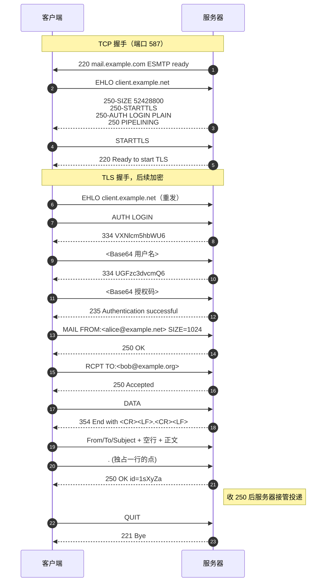
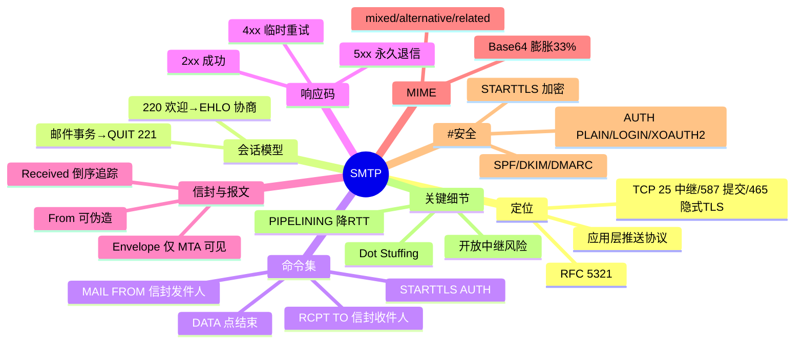

## 先建立直觉

SMTP 干的事情非常朴素：**把一封写好的信，从你手上一站一站送到收信人的邮局**。

它像两个人在电话里对暗号——你说一句"我要寄信"，对方回一句"可以"；你说"寄给张三"，对方回"收到"；你说"内容开始"，对方回"你讲吧"。全程都是人能读懂的大白话，一问一答，谁也不抢话。

送到收信人的邮局就算完事了，**至于收信人什么时候去开信箱，SMTP 一概不管**。

## 它解决什么问题

没有 SMTP 会怎样？每家公司的邮件系统各说各话，A 公司的信根本递不进 B 公司的门。而且就算递进去了，也说不清"这封信到底该退给谁""中途经过了哪几个邮局"。

SMTP 用一套**纯文本、可人工朗读**的命令/响应对话解决了三件事：

1. **谁发、发给谁**：通过 `MAIL FROM:` 与 `RCPT TO:` 建立"信封（Envelope）"，与邮件正文里的 `From:` / `To:` 头部（Header）相互独立。
2. **内容怎么传**：`DATA` 命令后以 `<CRLF>.<CRLF>` 作为结束标记传输报文；二进制附件由 MIME 编码成 7bit ASCII。
3. **跨域怎么走**：查目标域的 **MX 记录**找到对方 MTA，逐跳中继，每跳追加一条 `Received:` 头，形成可追溯的投递路径。

## 工作流程（简化版）

用普通人的语言，一封邮件的投递就 5 步：

1. **敲门**：客户端连上服务器，服务器先说一句"我准备好了"。
2. **自报家门**：客户端说"我是谁"，服务器顺便报出"我支持哪些本事"（能不能加密、能不能认证、单封信最大多大）。
3. **写信封**：客户端说明"这封信谁发的""要给谁"，可以一次写多个收件人。
4. **塞信纸**：客户端说"我要开始给内容了"，然后把标题、正文、附件一股脑发过去，最后用一个约定的结束标记告诉服务器"讲完了"。
5. **道别**：服务器说"这封信我接手了"，客户端说再见，连接关闭。

对应到真实命令，一次完整投递分三阶段：

| 阶段 | 动作 | 关键点 |
|------|------|--------|
| 连接与握手 | TCP 握手 → 服务端发 `220` → 客户端 `EHLO 域名` | `EHLO` 应答里公布扩展能力清单 |
| 邮件事务 | `MAIL FROM:` → 多个 `RCPT TO:` → `DATA` → 内容 → `<CRLF>.<CRLF>` | 一条连接可做多个事务；`RSET` 中止 |
| 释放 | `QUIT` → `221` | 服务端收到最终 `250` 后才接管投递 |

**信封（Envelope）与报文（Message）分离**是 SMTP 最关键的设计：

- **信封**：`MAIL FROM:`（退信地址）+ `RCPT TO:`（投递地址），**只有 MTA 可见**，决定实际投递。
- **报文**：`DATA` 后的「头部 + 空行 + 正文」，`From:`/`To:` 仅用于显示，可与信封不同。

> **Bcc** 只出现在 `RCPT TO:` 信封里、不写入头部，故他人看不到；钓鱼邮件伪造 `From:` 头部而信封发件人是攻击者本人，正是同一机制的误用。

## 报文 / 头部长什么样

### 核心命令集（RFC 5321）

看这张表前先记住：**SMTP 的命令全是 4 个字母，一条命令干一件事，顺序不能乱**——先握手、再写信封、最后才给内容。

| 命令 | 含义 |
|------|------|
| `HELO` / `EHLO` | 握手（EHLO 为 ESMTP，回多行 250 能力清单） |
| `MAIL FROM:<addr>` | 声明信封发件人，可带 `SIZE=` 等扩展参数 |
| `RCPT TO:<addr>` | 声明一个信封收件人，多个收件人重复发送 |
| `DATA` | 服务端回 `354` 后传输报文，以单独一行的 `.` 结束 |
| `RSET` / `NOOP` / `QUIT` | 重置事务 / 保活 / 关闭连接（回 `221`） |
| `VRFY` / `EXPN` | 验证用户 / 展开列表（现代服务器普遍禁用，防枚举） |
| `STARTTLS` | 明文升级为 TLS（RFC 3207），升级后须重发 `EHLO` |
| `AUTH` | 身份认证（RFC 4954），凭据 Base64 传输 |

命令英文全称对照：`HELO` = Hello（问候）；`EHLO` = Extended Hello（扩展问候）；`MAIL FROM` = 信封发件人；`RCPT TO` = Recipient To（信封收件人）；`DATA` = 报文数据；`RSET` = Reset（重置）；`NOOP` = No Operation（空操作/保活）；`VRFY` = Verify（验证用户）；`EXPN` = Expand（展开邮件列表）；`AUTH` = Authentication（认证）。

### 响应码

看这张表前先记住：**只看第一位数字就能决定下一步怎么办**——2 是成了、3 是"你继续"、4 是先等等、5 是没戏了。

响应格式 `<3位数字>[空格|-]<文本>`，连字符表示后续还有行。首位决定客户端行为：

| 首位 | 类别 | 客户端行为 |
|------|------|-----------|
| `2xx` | 成功完成 | 继续下一步 |
| `3xx` | 中间响应（如 `354` 等待正文） | 发送后续数据 |
| `4xx` | **暂时性**否定 | 入队稍后重试 |
| `5xx` | **永久性**否定 | 放弃并生成退信（NDR） |

高频码：`220` 就绪 / `221` 关闭 / `235` 认证成功 / `250` 完成 / `334` 认证质询 / `354` 输入正文 / `421` 服务不可用 / `450` 灰名单临时拒 / `535` 认证失败 / `550` 邮箱不存在或中继被拒 / `552` 超配额 / `554` 策略拒绝（反垃圾）。

### 报文头部关键字段（RFC 5322）

看这张表前先记住：**这些字段是"信纸上印的内容"，收件人能看到，但它们不决定信真正送到哪里**——决定投递的是信封。

| 字段 | 含义 |
|------|------|
| `Received:` | 每跳追加一条，**倒序阅读**，最上面是最后一跳，排查路径核心依据 |
| `From:` / `To:` / `Cc:` | 显示用地址；`Bcc` 不出现在最终报文 |
| `Reply-To:` | 回复地址，可与 From 不同 |
| `Subject:` | 非 ASCII 须 RFC 2047 编码 `=?UTF-8?B?...?=` |
| `Message-ID:` | 全局唯一标识，用于去重与会话串联 |
| `Return-Path:` | 最终 MTA 写入的信封发件人（退信地址） |
| `MIME-Version:` | 固定 `1.0` |
| `Content-Type:` | 如 `text/plain; charset=UTF-8`、`multipart/mixed; boundary="B1"` |
| `Content-Transfer-Encoding:` | `7bit`/`8bit`/`base64`/`quoted-printable` |
| `Authentication-Results:` | 接收方写入的 SPF/DKIM/DMARC 校验结果 |

字段中文全称对照：`Received`（投递轨迹）、`From`（显示发件人）、`To`（显示收件人）、`Cc` = Carbon Copy（抄送）、`Bcc` = Blind Carbon Copy（密送）、`Reply-To`（回复地址）、`Subject`（主题）、`Message-ID`（报文唯一标识）、`Return-Path`（退信路径）、`MIME-Version`（MIME 版本）、`Content-Type`（内容类型）、`Content-Transfer-Encoding`（内容传输编码）、`Authentication-Results`（认证校验结果）。

### MIME 多部分结构

看这段结构前先记住：**MIME 就是给一封信"分格子"**——用 boundary 这条分隔线，把正文、HTML 版、附件各放一格。

```
Content-Type: multipart/mixed; boundary="B1"
--B1
Content-Type: multipart/alternative; boundary="B2" ← 同内容多种呈现
--B2
Content-Type: text/plain; charset=UTF-8 ← 纯文本版
--B2
Content-Type: text/html; charset=UTF-8 ← HTML 版（优先渲染）
--B2--
--B1
Content-Type: application/pdf; name="r.pdf" ← 附件
Content-Transfer-Encoding: base64
--B1--
```

- `multipart/mixed`：正文 + 附件并列；`multipart/alternative`：同内容不同格式择一渲染；`multipart/related`：HTML 内嵌图片（用 `Content-ID` 引用）。
- Base64 使体积**膨胀约 33%**——这是「10MB 附件限制」实际仅能发约 7.5MB 文件的原因。

## 交互时序

一句话看懂这张图：**先打招呼摸清对方能力 → 升级加密 → 报上账号密码 → 写信封 → 给内容 → 说再见**，每一步都是"我说一句、你回一句"。



跨域时接收方 MTA 查询收件域 MX 记录，按优先级（数字越小越优先）连目标 MTA 的 25 端口，重复上述事务。

## 关键机制 / 变体

- **Dot Stuffing（透明填充）**——这是为了**防止正文里的一个点把信提前"掐断"**：`<CRLF>.<CRLF>` 是结束标记，正文若有独占一行的 `.` 须在行首再加一个点（`..`），接收端去掉一个。自研程序忽略此细节会截断邮件。
- **中继与开放中继**——这决定了**你的服务器会不会被垃圾邮件团伙白嫖**：中继指转发收发双方均非本域的邮件；不做鉴权的**开放中继**会被垃圾邮件滥用并进入 Spamhaus 黑名单。现代规范：25 端口只做 MTA 入站投递，用户提交走 **587 + AUTH**（RFC 6409）。
- **SMTP AUTH**——这是**证明"我确实是这个邮箱的主人"**：`AUTH PLAIN`（一次性 `\0用户\0密码` Base64，非加密须 TLS 内用）、`AUTH LOGIN`（两步交互）、`AUTH CRAM-MD5`（质询-响应，密码不明文过网）、`AUTH XOAUTH2`（Gmail/365 主推）。邮箱要求的「授权码」即 AUTH 独立凭据。
- **反垃圾三件套**——这是**收件方用来判断"这封信是不是冒名顶替"**：`SPF`（RFC 7208，校验信封 `MAIL FROM` 域的发送 IP）、`DKIM`（RFC 6376，私钥签名头部+正文，DNS 公钥验签）、`DMARC`（RFC 7489，要求 SPF 或 DKIM 至少一项与 `From:` 域对齐，声明 none/quarantine/reject 策略）。
- **PIPELINING 与 8BITMIME**——这两个是**提速与省编码的优化项**：**PIPELINING**（RFC 2920，连续发命令不等响应，减 RTT）与 **8BITMIME**（RFC 6152，允许 8 位字节，避免中文必须 Base64）。

## 常见误区

1. **"头部 `From:` 就是真实发件人"** —— 错。决定投递和退信的是信封 `MAIL FROM:`，头部 `From:` 只用于显示、可任意填写。所以才需要 DMARC 强制二者对齐。
2. **"`DATA` 之后服务器回 250 表示对方已经收到信了"** —— 不完全对。250 只表示**当前这台服务器接管了投递**，后续还要逐跳中继，中途仍可能退信。
3. **"STARTTLS 用了就一定安全"** —— 未必。STARTTLS 是先明文再升级，存在被剥离降级的风险；升级后还必须**重发 `EHLO`**，否则之前那份能力清单不可信。465 是连上即 TLS，没有明文阶段。
4. **"10MB 附件限制就能发 10MB 文件"** —— 不能。Base64 编码会让体积膨胀约 33%，10MB 的文件编码后约 13.3MB，会被 `552` 拒绝。

## 速记口诀

> **两百二打招呼，三五四等正文，二五零算过关；四是等等再来，五是彻底完蛋。**
>
> **信封决定送到哪，头部只管给人看；点要加倍防截断，Base64 涨三成。**

## 知识框架


