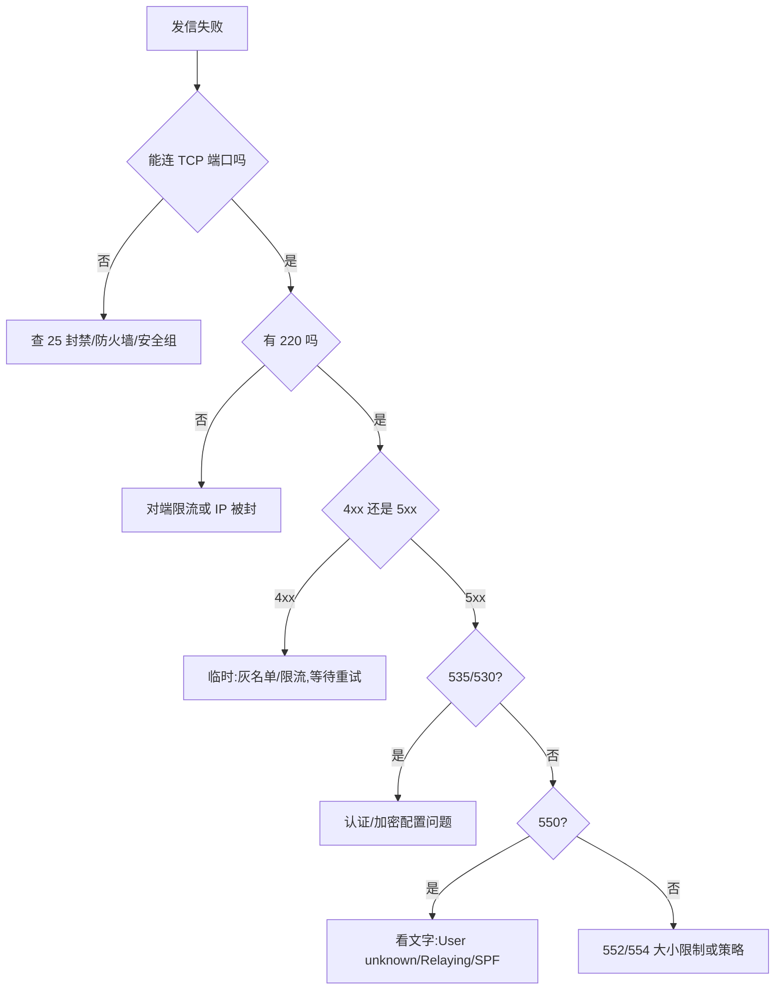

## 🧭 这篇你能学到

- 怎么用 Wireshark / tcpdump 把一次 SMTP 会话完整"看见"，并判断链路到底加没加密。
- 怎么不靠邮件客户端，用 `telnet` / `openssl` / `swaks` 手工敲一封信出去，定位问题到底出在哪一步。
- 拿到一个退信码（550、535、421……）后，怎么三步走定位根因；以及 SMTP/POP3/IMAP 对比与高频面试题。

## 1. 抓包观察

### 1.1 Wireshark 过滤式

下面这些过滤式的作用是：**从一大堆流量里只挑出邮件相关的包**，并进一步缩小到"只看命令""只看错误响应""只看某个收件人"。

| 目的 | 过滤式 |
|------|--------|
| 所有 SMTP 流量 | `smtp` |
| 明文 / 提交 / 隐式 TLS | `tcp.port==25` / `tcp.port==587` / `tcp.port==465` |
| 客户端命令 / 服务端响应 | `smtp.req` / `smtp.rsp` |
| 只看某响应码 / 错误 | `smtp.response.code==550` / `smtp.response.code>=400` |
| 抓 EHLO / STARTTLS 升级点 | `smtp.req.command=="EHLO"` / `"STARTTLS"` |
| 定位收件人 / 主题 | `smtp.req.parameter contains "@x.com"` / `smtp.data.fragment contains "Subject"` |

抓到后右键 **Follow → TCP Stream** 可把整段会话还原为可读文本，是排查最快方式。

### 1.2 关键字段与加密判断

这些字段的作用是：**在包详情里直接读出命令、响应码、报文内容，甚至明文的账号密码**。

| Wireshark 字段 | 说明 |
|---------------|------|
| `smtp.req.command` / `.parameter` | 命令动词与参数 |
| `smtp.response.code` | 三位响应码，排错主看 |
| `smtp.data.fragment` | DATA 阶段报文分片（重组为完整 IMF） |
| `smtp.auth.username` / `password` | 明文 AUTH 可直接解出（必须 TLS） |

若 `STARTTLS` 之后能继续看到 `MAIL FROM` 明文，说明**降级攻击或客户端未强制加密**。

### 1.3 命令行抓包

这两条命令的作用是：**第一条把 25/587 端口的邮件流量整段存成 pcap 文件**，事后用 Wireshark 慢慢分析；**第二条直接在终端里以 ASCII 打印出明文内容**，适合快速瞄一眼。

```bash
sudo tcpdump -i any -nn -s0 'tcp port 25 or tcp port 587' -w smtp.pcap
# 终端看明文内容
sudo tcpdump -i any -nn -A 'tcp port 25 and (tcp[tcpflags] & tcp-push != 0)'
```

## 2. 常用命令 / 配置

这组命令的作用是：**发信前的三项体检**——先查对方邮局在哪（MX），再看端口通不通，最后确认自己的域有没有配好反垃圾记录。

```bash
# 查 MX 记录（发信第一步）；数字为优先级，越小越优先
dig +short MX example.com
nslookup -type=MX example.com        # Windows

# 测端口连通性
nc -zv mail.example.com 587
Test-NetConnection mail.example.com -Port 25     # PowerShell

# 测 SPF/DKIM/DMARC
dig +short TXT example.com                      # v=spf1
dig +short TXT default._domainkey.example.com   # DKIM 公钥
dig +short TXT _dmarc.example.com               # DMARC 策略
```

**telnet 手工会话（明文 25）**——它能干什么：**绕开邮件客户端，纯手打一封信**，服务器每一步的真实回应你都能亲眼看到，是判断"到底卡在哪一步"最直接的办法。流程：`220` → `EHLO` → `MAIL FROM:<a@b>`(250) → `RCPT TO:<c@d>`(250) → `DATA`(354) → 头部+空行+正文 → 独占一行的 `.`(250) → `QUIT`(221)。Subject 与正文**必须空行分隔**，结束的 `.` 必须独占一行。

**openssl 加密通道**——它能干什么：**telnet 的加密版**，当服务器强制 TLS、telnet 连上就被拒时用它。`openssl s_client -starttls smtp -crlf -connect smtp.qq.com:587`（587 先明文后升级）；`openssl s_client -crlf -connect smtp.qq.com:465`（465 直接 TLS）。生成 AUTH 凭据：`printf 'user' | base64`、`printf '\0user\0pass' | base64`（AUTH PLAIN）。

**服务端（Postfix）**——这几条能干什么：**看清"信卡在自己服务器的队列里没走掉"**，并决定是重投还是删掉。`mailq`/`postqueue -p` 看队列、`postcat -q ID` 看内容、`postsuper -d ID` 删除、`postqueue -f` 重试。`swaks --to ... --server ...:587 --tls --auth LOGIN` 是最好用的 SMTP 测试工具（一条命令跑完整套会话）。

## 3. 常见故障与排错

| 现象 | 可能原因 | 排查 |
|------|---------|------|
| 连接超时无 `220` | **先记住结论：多半不是你配错了，是出方向 25 端口被封。** 出方向 25 被 ISP/云厂商封禁；防火墙拦截 | `Test-NetConnection -Port 25`；改测 587/465 |
| `550 5.7.1 Relaying denied` | **先记住结论：服务器不认识你，拒绝帮你转发。** 未认证就往外域投递 | 改 587 + `AUTH` |
| `535 Authentication failed` | **先记住结论：密码错了，而且十有八九是用了登录密码而不是授权码。** 用了登录密码而非授权码；未开 SMTP | 重生成授权码；`printf` 重算 Base64 |
| `530 Must issue STARTTLS` | **先记住结论：服务器要求加密，你却在裸奔。** 服务器强制加密而客户端明文 | 客户端启用 TLS |
| `550 5.1.1 User unknown` | **先记住结论：地址写错了或对方账号已注销。** 收件人地址错或注销 | 核对地址、`dig MX` 确认对端服务 |
| `550 5.7.26 SPF/DMARC failed` | **先记住结论：你的域没给这台发信服务器"背书"。** 发信 IP 不在 SPF；对齐失败 | `dig TXT` 检查 SPF；确认 `From:` 域对齐 |
| `450 Greylisted, try later` | **先记住结论：这不是故障，是对方在考验你会不会重试。** 灰名单首次临时拒 | 正常，等待 MTA 自动重试 |
| `421 Too many connections` | **先记住结论：你发得太猛被限流了。** 触发限流 | 降并发、加大重试间隔 |
| `552 size exceeds` | **先记住结论：附件超了，而且比你以为的更容易超。** 超出对端大小上限 | 看 `EHLO` 的 `SIZE`；注意 Base64 膨胀 33% |
| 正文被截断 | **先记住结论：正文里有一行只写了一个点，被当成结束标记了。** 未做 Dot Stuffing，正文有独占一行的 `.` | 行首 `.` 替换为 `..` |
| 中文主题乱码 | **先记住结论：主题不能直接放中文，必须先编码。** 未按 RFC 2047 编码 | 用 `=?UTF-8?B?<base64>?=` |

排错顺序一句话：**先看能不能连上 → 再看有没有 220 → 最后按 4xx/5xx 分流。**



## 4. 与其他协议对比

| 维度 | SMTP | POP3 | IMAP |
|------|------|------|------|
| 作用 | **发送**（推） | **下载**（拉） | **同步/管理**（拉） |
| 端口 | 25/587/465 | 110/995 | 143/993 |
| RFC | RFC 5321 | RFC 1939 | RFC 3501（rev2: RFC 9051） |
| 邮件存放 | 只转发 | 默认下载即删服务端 | 保留在服务端 |
| 多设备一致性 | 不涉及 | 差 | 好（已读/文件夹全同步） |
| 部分下载 | 不涉及 | 仅 `TOP` 取头部 | 可只取头部/单个 MIME 段 |
| 响应格式 | 三位数字码 | `+OK`/`-ERR` | 标签 + `OK/NO/BAD` |

**25 / 587 / 465**：25 为 MTA↔MTA 中继（机会性 STARTTLS，本域投递通常免 AUTH）；587 为 MUA→MSA 提交（RFC 6409，显式 STARTTLS，**必须** AUTH）；465 为隐式 TLS 提交（RFC 8314，连上即加密，**必须** AUTH）。

## 5. 常见面试题

**Q1 SMTP 与 POP3/IMAP 区别？** SMTP 负责发送（推），POP3/IMAP 负责接收（拉），一次完整收发要三者配合。

**Q2 信封 From 与头部 From 区别？** 信封 `MAIL FROM` 仅 SMTP 会话中、决定退信地址供 SPF 校验、用户看不到；头部 `From:` 可任意伪造。DMARC 要求二者（或 DKIM 域）与 `From:` 对齐。

**Q3 为何用 587 而非 25？** 25 是 MTA 中继端口，禁未认证提交且被 ISP 封出方向；587（Submission）强制 AUTH + STARTTLS，职责清晰（RFC 6409）。

**Q4 EHLO 与 HELO？** HELO 原始握手；EHLO 返回多行 250 扩展能力（SIZE/STARTTLS/AUTH/PIPELINING）。应先 EHLO，被拒不回退 HELO。

**Q5 如何判断 DATA 结束、为何要 Dot Stuffing？** 以 `<CRLF>.<CRLF>` 结束；正文独占一行的 `.` 会被误判，故发送端行首 `.` 变 `..`。

**Q6 STARTTLS 与 465 区别？** STARTTLS 先明文后命令升级，须重发 EHLO；465 连上即 TLS，无明文阶段，不易降级（RFC 8314 推荐）。

**Q7 如何追踪邮件路径？** 读 `Received:` 头，**从下往上**即投递时间顺序，每条含来源主机/IP/时间戳，定位延迟跳点。

**Q8 4xx 与 5xx 处理差异？** 4xx 暂存队列按退避重试（数天）；5xx 立即停重试并生成退信。灰名单正是用 4xx 让正规 MTA 重试、简易垃圾程序放弃。

**Q9 为何 10MB 附件常发不出？** Base64 膨胀约 33%，10MB 编码后约 13.3MB，超 `EHLO` 的 `SIZE` 上限得 `552`。

**Q10 开放中继危害？** 无鉴权转发任意邮件，被垃圾团伙滥用致 IP 进 Spamhaus 黑名单，全域被拒。防护：25 只收本域，外发走 587+AUTH。
