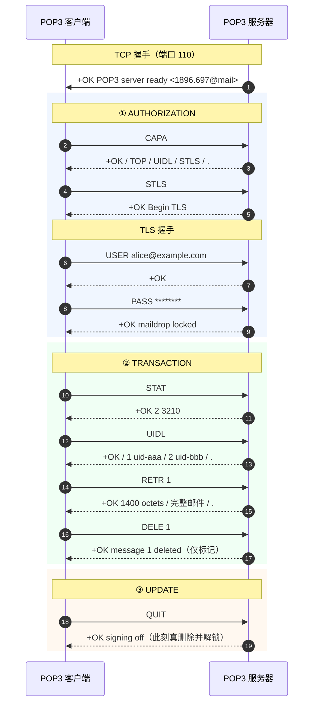
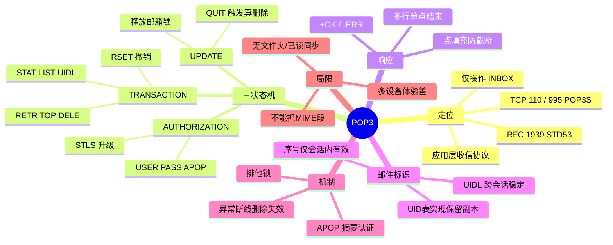

## 1. 工作原理

POP3 是**单连接、单邮箱、命令/响应式**文本协议，生命周期严格遵循三状态且**单向不可逆**：

```
TCP 连接 → 服务器发 +OK 问候
   ↓
【AUTHORIZATION 认证】USER/PASS 或 APOP 或 AUTH（成功则对邮箱加排他锁）
   ↓
【TRANSACTION 事务】STAT/LIST/UIDL/RETR/TOP/DELE/RSET
   ↓ 客户端发 QUIT
【UPDATE 更新】真正删除被标记邮件、释放锁、断开
```

| 状态 | 允许命令 | 说明 |
|------|---------|------|
| **AUTHORIZATION** | `USER` `PASS` `APOP` `AUTH` `STLS` `CAPA` `QUIT` | 未认证不能碰邮件；此状态 `QUIT` 直接断开 |
| **TRANSACTION** | `STAT` `LIST` `UIDL` `RETR` `TOP` `DELE` `RSET` `NOOP` `QUIT` | 邮箱已加锁；`DELE` **只打标记不真删** |
| **UPDATE** | 无（由 `QUIT` 自动进入） | 批量清除标记邮件、解锁、回 `+OK` |

**关键设计**：若客户端在 TRANSACTION 阶段**异常断线**（没发 `QUIT`），服务器不进入 UPDATE，所有 `DELE` 标记作废，邮件仍在——这正是"网络抖动导致邮件被重复下载"的根因。`RSET` 可在 UPDATE 前撤销本会话全部 `DELE`。

**邮件编号**：认证后每封邮件分配 1 起的连续序号，**仅本会话有效**；删除/新邮件都会改变下次编号，故跨会话去重必须靠 `UIDL`。

## 2. 报文 / 头部结构

POP3 无二进制头部，"报文结构"即命令与响应格式。

### 2.1 完整命令集（RFC 1939）

| 命令 | 状态 | 含义 | 响应 |
|------|------|------|------|
| `USER` / `PASS` | AUTH | 账号 / 密码，成功即加锁进入 TRANSACTION | 单行 |
| `APOP` 名称 摘要 | AUTH | `MD5(时间戳+口令)`，口令不过网（可选） | 单行 |
| `AUTH` 机制 | AUTH | SASL 认证（RFC 5034），如 PLAIN/XOAUTH2 | 单/多行 |
| `CAPA` | AUTH/TRANS | 查询能力（RFC 2449） | **多行** |
| `STLS` | AUTH | 明文升级 TLS（RFC 2595），成功后重认证 | 单行 |
| `STAT` | TRANS | 返回邮件总数与字节数，如 `+OK 3 2048` | 单行 |
| `LIST` [序号] | TRANS | 列出序号与大小 | 单/多行 |
| `UIDL` [序号] | TRANS | 返回**跨会话稳定**的唯一标识 | 单/多行 |
| `RETR` 序号 | TRANS | 取完整邮件 | **多行** |
| `TOP` 序号 n | TRANS | 头部 + 正文前 n 行（预览） | **多行** |
| `DELE` 序号 | TRANS | 打删除标记（不立即删） | 单行 |
| `RSET` / `NOOP` | TRANS | 撤销删除标记 / 保活 | 单行 |
| `QUIT` | 任意 | TRANSACTION 发出则进入 UPDATE 真删除 | 单行 |

### 2.2 响应格式

| 类型 | 格式 | 示例 |
|------|------|------|
| 成功 | `+OK [文本]` | `+OK 3 messages (4210 octets)` |
| 失败 | `-ERR [文本]` | `-ERR authentication failed` |
| 多行 | `+OK` + 数据行 + 单独一行的 `.` | `LIST` 返回各序号大小 |

**点填充（Dot-stuffing）**：与 SMTP 同理，数据行以 `.` 开头时服务端行首再加一个点，客户端接收时去掉一个；忽略会导致正文被提前截断。

### 2.3 UIDL 与保留副本

```
C: UIDL
S: +OK
S: 1 whqtswO00WBw418f9t5JxYwZ
S: 2 QhdPYR:00WBw1Ph7x7
S: .
```

实现"保留副本"标准做法：①本地维护 UID 已下载表；②每次 `UIDL` 比对，只对**新 UID** 执行 `RETR`；③**不发 `DELE`**（或按"N 天后删除"策略）。所以"POP3 会删邮件"是**客户端默认行为**，协议本身不强制；若 UID 表丢失（换机/重装）会把邮箱全部重下。

## 3. 交互流程



异常路径：若 `DELE` 后直接掉线而非 `QUIT`，服务器不进 UPDATE，邮件 1 仍在，下次会被再下载。

## 4. 关键机制

- **邮箱排他锁**：认证后加锁防并发修改。手机电脑同时 POP3 收同账号，后来者得 `-ERR mailbox is locked`；客户端崩溃锁可能残留数分钟。
- **APOP**：用 `MD5(时间戳+口令)` 认证，口令不过网，可防被动嗅探；但 MD5 已不安全且需服务端存明文口令，现代一律改 `STLS`/隐式 TLS + `AUTH`。
- **TOP 预览**：`TOP n 0` 取完整头部 + 0 行正文，用于列表渲染——这是 POP3 唯一的"部分获取"，远弱于 IMAP 按 MIME 段精确抓取。
- **加密两方式**：`STLS`（110 显式升级，成功后重认证）；隐式 TLS/POP3S（995 连上即 TLS，RFC 8314 推荐）。不加密时 `USER`/`PASS` 明文裸奔。
- **与 SMTP 分工**：发信走 SMTP（587→25），收信走 POP3（995）；POP3 **完全不能发信**，客户端"发件服务器"必是 SMTP。

## 5. 知识框架


