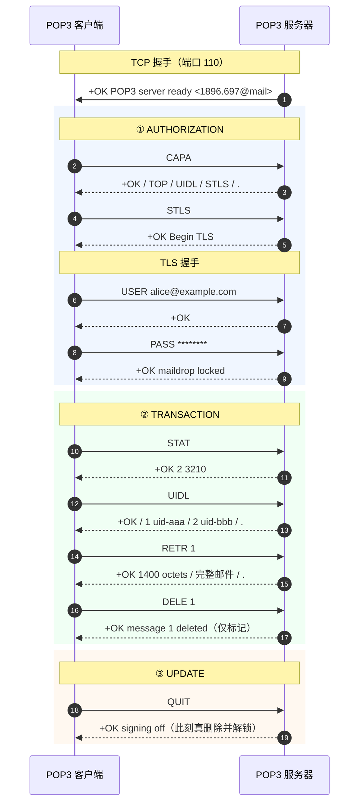
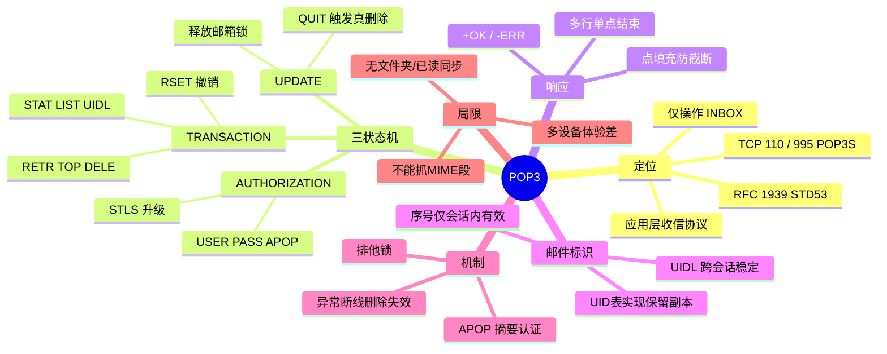

## 🚀 先建立直觉

POP3 干的事只有一件：**去信箱把信取回家**。

想象你下班路过传达室，报上名字和密码，工作人员把你的信一封封递给你，你收好、签字说"这几封我拿走了"，然后转身离开——**你一走出门，这几封信在传达室就没了**。

整个过程简单到几乎没有花样：进门、验明身份、拿信、走人。它不提供"在传达室里分类归档"这种服务，所有整理工作都得回家自己做。

## 🤔 它解决什么问题

没有 POP3 会怎样？信送到了收件服务器，可你的电脑不是一台 24 小时在线的服务器，别人没法直接把信推给你。你需要一个"我什么时候有空、什么时候主动去拿"的办法。

在拨号上网时代这一点尤其要命——上网按分钟计费，你只想快速把信抓回本地就断线，慢慢看。POP3 因此被设计得非常克制：

1. **取信**：SMTP 只负责把邮件送到收件服务器的邮箱，用户主机无法作为 SMTP 目标，必须有一个"主动去拉"的协议。
2. **极简**：命令不到 15 条，响应只有 `+OK` / `-ERR` 两种，几十行代码就能写一个能用的客户端。
3. **离线可用**：邮件下载到本地后，断网也能随时阅读、搜索、归档。

## 🔄 工作流程（简化版）

一次 POP3 收信，普通人语言只有 4 步：

1. **敲门**：连上服务器，服务器说一句"我在，你说"。
2. **验身份**：报上账号和密码，通过之后服务器把你的信箱**锁起来只给你一个人用**。
3. **点货取信**：先问"一共几封、各多大"，再一封封取下来；想删的就打个删除记号（**此时还没真删**）。
4. **结账走人**：说一声"我走了"，服务器这才把打了记号的信真正清掉、解锁信箱、断开连接。

POP3 是**单连接、单邮箱、命令/响应式**文本协议，生命周期严格遵循三状态且**单向不可逆**：

```
TCP 连接 → 服务器发 +OK 问候
   ↓
【AUTHORIZATION 认证】USER/PASS 或 APOP 或 AUTH（成功则对邮箱加排他锁）
   ↓
【TRANSACTION 事务】STAT/LIST/UIDL/RETR/TOP/DELE/RSET
   ↓ 客户端发 QUIT
【UPDATE 更新】真正删除被标记邮件、释放锁、断开
```

| 状态 | 允许命令 | 说明 |
|------|---------|------|
| **AUTHORIZATION** | `USER` `PASS` `APOP` `AUTH` `STLS` `CAPA` `QUIT` | 未认证不能碰邮件；此状态 `QUIT` 直接断开 |
| **TRANSACTION** | `STAT` `LIST` `UIDL` `RETR` `TOP` `DELE` `RSET` `NOOP` `QUIT` | 邮箱已加锁；`DELE` **只打标记不真删** |
| **UPDATE** | 无（由 `QUIT` 自动进入） | 批量清除标记邮件、解锁、回 `+OK` |

**关键设计**：若客户端在 TRANSACTION 阶段**异常断线**（没发 `QUIT`），服务器不进入 UPDATE，所有 `DELE` 标记作废，邮件仍在——这正是"网络抖动导致邮件被重复下载"的根因。`RSET` 可在 UPDATE 前撤销本会话全部 `DELE`。

**邮件编号**：认证后每封邮件分配 1 起的连续序号，**仅本会话有效**；删除/新邮件都会改变下次编号，故跨会话去重必须靠 `UIDL`。

## 📦 报文 / 头部长什么样

POP3 无二进制头部，"报文结构"即命令与响应格式。

### 完整命令集（RFC 1939）

看这张表前先记住：**每条命令只能在特定阶段用**——认证阶段只能验身份，验完了才轮到取信删信。第二列的"状态"就是这个意思。

| 命令 | 状态 | 含义 | 响应 |
|------|------|------|------|
| `USER` / `PASS` | AUTH | 账号 / 密码，成功即加锁进入 TRANSACTION | 单行 |
| `APOP` 名称 摘要 | AUTH | `MD5(时间戳+口令)`，口令不过网（可选） | 单行 |
| `AUTH` 机制 | AUTH | SASL 认证（RFC 5034），如 PLAIN/XOAUTH2 | 单/多行 |
| `CAPA` | AUTH/TRANS | 查询能力（RFC 2449） | **多行** |
| `STLS` | AUTH | 明文升级 TLS（RFC 2595），成功后重认证 | 单行 |
| `STAT` | TRANS | 返回邮件总数与字节数，如 `+OK 3 2048` | 单行 |
| `LIST` [序号] | TRANS | 列出序号与大小 | 单/多行 |
| `UIDL` [序号] | TRANS | 返回**跨会话稳定**的唯一标识 | 单/多行 |
| `RETR` 序号 | TRANS | 取完整邮件 | **多行** |
| `TOP` 序号 n | TRANS | 头部 + 正文前 n 行（预览） | **多行** |
| `DELE` 序号 | TRANS | 打删除标记（不立即删） | 单行 |
| `RSET` / `NOOP` | TRANS | 撤销删除标记 / 保活 | 单行 |
| `QUIT` | 任意 | TRANSACTION 发出则进入 UPDATE 真删除 | 单行 |

命令英文全称对照：`USER`（用户名）、`PASS` = Password（口令）、`APOP` = Authenticated POP（摘要认证）、`AUTH` = Authentication（SASL 认证）、`CAPA` = Capability（能力查询）、`STLS` = Start TLS（启动加密）、`STAT` = Status（邮箱统计）、`LIST`（列表）、`UIDL` = Unique ID Listing（唯一标识列表）、`RETR` = Retrieve（取回邮件）、`TOP`（取头部）、`DELE` = Delete（标记删除）、`RSET` = Reset（重置/撤销标记）、`NOOP` = No Operation（保活）、`QUIT`（结束会话）。

### 响应格式

看这张表前先记住：**POP3 的回应只有"行"和"不行"两种**，没有 SMTP 那样细分的数字码，出了问题全靠后面那句自由文本给线索。

| 类型 | 格式 | 示例 |
|------|------|------|
| 成功 | `+OK [文本]` | `+OK 3 messages (4210 octets)` |
| 失败 | `-ERR [文本]` | `-ERR authentication failed` |
| 多行 | `+OK` + 数据行 + 单独一行的 `.` | `LIST` 返回各序号大小 |

**点填充（Dot-stuffing）**：与 SMTP 同理，数据行以 `.` 开头时服务端行首再加一个点，客户端接收时去掉一个；忽略会导致正文被提前截断。

### UIDL 与保留副本

看这段示例前先记住：**序号会变，UID 不会变**。想实现"手机收了电脑还能再收"，全靠这个不变的 UID 做去重。

```
C: UIDL
S: +OK
S: 1 whqtswO00WBw418f9t5JxYwZ
S: 2 QhdPYR:00WBw1Ph7x7
S: .
```

实现"保留副本"标准做法：①本地维护 UID 已下载表；②每次 `UIDL` 比对，只对**新 UID** 执行 `RETR`；③**不发 `DELE`**（或按"N 天后删除"策略）。所以"POP3 会删邮件"是**客户端默认行为**，协议本身不强制；若 UID 表丢失（换机/重装）会把邮箱全部重下。

## 🔀 交互时序

一句话看懂这张图：**三个色块就是三个阶段**——蓝色验身份、绿色取信打删除标记、橙色发 `QUIT` 才真删除并解锁。



异常路径：若 `DELE` 后直接掉线而非 `QUIT`，服务器不进 UPDATE，邮件 1 仍在，下次会被再下载。

## 🔧 关键机制 / 变体

- **邮箱排他锁**——这是为了**防止两个客户端同时改同一个信箱把状态搞乱**：认证后加锁防并发修改。手机电脑同时 POP3 收同账号，后来者得 `-ERR mailbox is locked`；客户端崩溃锁可能残留数分钟。
- **APOP**——这是**早年间让口令不明文过网的土办法**：用 `MD5(时间戳+口令)` 认证，口令不过网，可防被动嗅探；但 MD5 已不安全且需服务端存明文口令，现代一律改 `STLS`/隐式 TLS + `AUTH`。
- **TOP 预览**——这是为了**只下载信头、先把列表显示出来，省流量**：`TOP n 0` 取完整头部 + 0 行正文，用于列表渲染——这是 POP3 唯一的"部分获取"，远弱于 IMAP 按 MIME 段精确抓取。
- **加密两方式**——这决定了**你的密码会不会被同网段的人抓走**：`STLS`（110 显式升级，成功后重认证）；隐式 TLS/POP3S（995 连上即 TLS，RFC 8314 推荐）。不加密时 `USER`/`PASS` 明文裸奔。
- **与 SMTP 分工**——这解释了**为什么客户端要填两个服务器地址**：发信走 SMTP（587→25），收信走 POP3（995）；POP3 **完全不能发信**，客户端"发件服务器"必是 SMTP。

## ⚠️ 常见误区

1. **"`DELE` 一发邮件就删掉了"** —— 不是。`DELE` 只在服务器上打个标记，必须发 `QUIT` 进入 UPDATE 阶段才真正删除。中途断线，所有标记作废。
2. **"邮件序号是固定 ID，可以存下来下次用"** —— 不行。序号只在本次会话内有效，删除或新邮件到达都会让下次编号全变。跨会话唯一标识只能用 `UIDL` 的 UID。
3. **"POP3 协议规定收完就删"** —— 协议不强制。"下载即删"是**客户端的默认行为**，只要不发 `DELE` 就能保留副本；反过来说，勾了"保留副本"却仍重复下载，问题出在本地 UID 表丢了。
4. **"POP3 能看到我服务器上所有文件夹"** —— 看不到。POP3 只暴露 INBOX 一个邮箱，没有服务器端文件夹概念，也没有已读/星标这类服务端标志。

## 🧠 速记口诀

> **一验二取三提交，`QUIT` 不发删不掉。**
>
> **序号会变别当真，跨次去重认 UIDL；只有一个收件箱，多设备同步找 IMAP。**

## 🗺️ 知识框架


