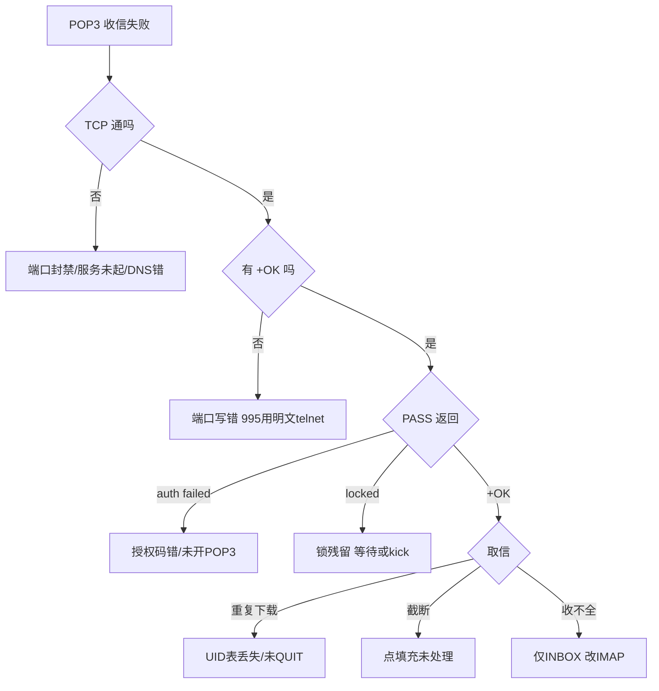

## 这篇你能学到

- 怎么在 Wireshark / tcpdump 里看清一次 POP3 会话，并亲眼确认明文端口上的口令有多"裸奔"。
- 怎么用 `telnet` / `openssl` / `curl` / `poplib` 手工跑完一次完整收信，把问题精确定位到某一条命令。
- 遇到"认证失败""邮箱被锁""邮件反复重复下载"时的结论先行式排查思路，以及 POP3 与 IMAP 的对比速查和高频面试题。

## 1. 抓包观察

### 1.1 Wireshark 过滤式

这些过滤式的作用是：**从混杂流量里只留下 POP3 会话**，并进一步只看命令、只看失败响应，甚至直接把明文口令捞出来。

| 目的 | 过滤式 |
|------|--------|
| 所有 POP3 流量 | `pop`（协议名 `pop`，非 `pop3`） |
| 明文 / 加密端口 | `tcp.port==110` / `tcp.port==995` |
| 客户端命令 / 服务端响应 | `pop.request` / `pop.response` |
| 失败响应 / 认证过程 | `pop.response.indicator=="-ERR"` / `pop.request.command matches "^(USER\|PASS)$"` |
| 取信 / 删除 / 抓口令 | `pop.request.command=="RETR"` / `"DELE"` / `pop contains "PASS"` |

**Follow → TCP Stream** 最高效：POP3 纯文本，流视图即可直接阅读的对话。

### 1.2 关键字段

这些字段的作用是：**逐条读出客户端发了什么命令、服务器答应还是拒绝、拒绝理由是什么**。

| 字段 | 说明 |
|------|------|
| `pop.request.command` / `.parameter` | 命令动词与参数 |
| `pop.response.indicator` | `+OK` 或 `-ERR` |
| `pop.response.description` | 自由文本，**排错信息量全在此** |
| `pop.data` | 多行响应数据体（邮件内容） |

明文风险：110 端口抓包时 `PASS` 参数即**完整明文口令**，必须 995 或 STLS。

### 1.3 命令行抓包

这两条命令的作用是：**第一条把 110/995 的收信流量整段存盘**供事后分析；**第二条直接在终端打印 110 端口的明文内容**，能一眼看到口令有没有裸奔。

```bash
sudo tcpdump -i any -nn -s0 'tcp port 110 or tcp port 995' -w pop3.pcap
sudo tcpdump -i any -nn -A 'tcp port 110' # 看明文
```

## 2. 常用命令 / 配置

这组命令的作用是：**先确认端口通不通，再用 openssl 建一条加密通道手工登录，最后用 curl/fetchmail 做自动化收信验证**。

```bash
# 连通性
nc -zv pop.example.com 995
Test-NetConnection pop.qq.com -Port 995 # PowerShell

# openssl 走 TLS
openssl s_client -crlf -connect pop.qq.com:995 # 995 隐式
openssl s_client -crlf -starttls pop3 -connect host:110 # 110 显式升级

# curl / fetchmail
curl -v "pop3s://pop.qq.com:995/" -u "alice@qq.com:授权码"
curl "pop3s://pop.qq.com:995/1" -u "alice@qq.com:授权码" -X "TOP 1 0" # 仅头部
fetchmail -p POP3 --ssl -u alice@example.com pop.example.com --keep # 保留副本
```

**telnet 手工会话（明文 110）**——它能干什么：**不装任何邮件客户端，纯手敲完整跑一遍收信**，每一步服务器的真实回应都看得见，是判断"卡在认证还是卡在取信"最快的办法。流程：`+OK` → `CAPA`（见 TOP/UIDL/STLS）→ `USER`(ok) → `PASS 授权码`(+OK) → `STAT`(+OK 2 3210) → `LIST` → `UIDL` → `TOP 1 5`（头部+前5行）→ `RETR 1`（全文）→ `DELE 1` → `QUIT`（此刻真删）。

**Python poplib**——它能干什么：**用几行脚本做自动化收信/巡检**，把手工会话变成可重复执行的程序。`poplib.POP3_SSL(host,995).user().pass_()` → `stat()`/`uidl()`/`retr(n)`；`dele(n)` 只打标记，`quit()` 才提交删除。

**服务端（Dovecot）**——这几条能干什么：**站在服务器一侧看"到底谁占着这个邮箱的锁"**，并把残留会话踢掉。`doveconf -n | grep -i pop3`；`doveadm who alice`（查会话）；`doveadm kick alice`（踢残留释放锁）。

## 3. 常见故障与排错

| 现象 | 可能原因 | 排查 |
|------|---------|------|
| 超时无 `+OK` | **先记住结论：连都没连上，八成是端口被拦或服务没起。** 110/995 被拦截；服务未起 | `Test-NetConnection -Port 995`；`ss -lntp \| grep -E '110\|995'` |
| `-ERR authentication failed` | **先记住结论：十有八九是用了登录密码而不是授权码。** 用登录密码非**授权码**；未开 POP3 | 网页版开启并重新生成授权码；用户名写**完整邮箱** |
| `-ERR mailbox is locked` | **先记住结论：不是你密码错，是别人（或上一次没退干净的你）占着这个信箱。** 上会话未 `QUIT` 锁残留；多端同收 | 等 5–10 分钟；`doveadm kick 用户` |
| 反复重复下载 | **先记住结论：不是服务器出错，是本地那张"已下载 UID 表"没了。** UID 表丢失（重装/换机）；`DELE` 未生效 | 开"保留副本+记录 UIDL"；确认 `QUIT` 成功；核对 UIDL 两次一致 |
| 删了下次还在 | **先记住结论：`DELE` 只是标记，没走完 `QUIT` 就等于没删。** 会话异常中断未进 UPDATE；服务端只读 | 抓包确认发出 `QUIT` 并收 `+OK` |
| 手机删了电脑还有 | **先记住结论：这不是故障，POP3 本来就不同步。** **POP3 不同步**，各端独立下载 | 协议固有限制，需同步改 IMAP |
| 正文被截断 | **先记住结论：正文里有一行以点开头，被当成结束标记了。** 未处理点填充 | 按 RFC 1939 去点；以独占一行 `.` 判定结束 |
| `-ERR command not supported` | **先记住结论：不是你命令写错，是这台服务器压根没实现它。** 服务端未实现 TOP/UIDL | 先 `CAPA`；无 UIDL 只能退化全下载 |
| 只收到部分邮件 | **先记住结论：不是丢信，是 POP3 只能看见收件箱。** POP3 只暴露 INBOX | 需访问其它文件夹必须 IMAP |

排错顺序一句话：**先看 TCP 通不通 → 再看有没有 `+OK` → 然后看 `PASS` 返回什么 → 最后才查取信环节。**



## 4. 与其他协议对比

### 4.1 POP3 vs IMAP

| 维度 | POP3 | IMAP |
|------|------|------|
| RFC / 端口 | RFC 1939；110/995 | RFC 3501（rev2 9051）；143/993 |
| 设计理念 | **下载搬走**（离线优先） | **服务器管理**（在线优先） |
| 邮件默认位置 | 本地（服务端删） | 服务器（本地缓存） |
| 多设备同步 | 不支持，各端独立 | 已读/星标/文件夹全同步 |
| 服务器文件夹 | 仅 INBOX | 任意层级 CREATE/RENAME |
| 部分获取 | 仅 `TOP`（头部+前n行） | 按 MIME 段精确 `FETCH BODY[1.2]` |
| 搜索 / 推送 | 无 / 仅轮询 | `SEARCH` 全文；`IDLE`（RFC 2177）推送 |
| 并发 | 排他锁，通常单连接 | 支持多连接 |
| 复杂度 | 极低（约12条命令） | 高（数十条） |

### 4.2 邮件三协议全景

| 协议 | 方向 | 端口 | 状态保存 |
|------|------|------|---------|
| SMTP | 发送（推） | 25/587/465 | 不保存，转发即走 |
| POP3 | 接收（拉） | 110/995 | 客户端本地 |
| IMAP | 接收+管理（拉） | 143/993 | 服务器 |

## 5. 常见面试题

**Q1 POP3 与 IMAP 最本质区别？** 存储与状态归属：POP3 把邮件搬到客户端，状态在本地；IMAP 留在服务器，状态在服务器，天然多设备同步。

**Q2 三状态为何这样设计？** `AUTHORIZATION`→`TRANSACTION`→`UPDATE`。删除在 TRANSACTION 仅打标记，`QUIT` 后进 UPDATE 才真删，保证**事务原子性**：异常中断时删除全部作废，避免下载失败误删。

**Q3 手机删了电脑还在？** 两端都 POP3 时各自独立下载副本，删除只影响本地，设备间无同步。改 IMAP 解决。

**Q4 序号与 UIDL 区别？** 序号是本次会话 1..N 连续编号，下次可能全变；UIDL 的 UID 在邮件生命周期内不变，是跨会话去重、保留副本的唯一可靠依据。

**Q5 保留副本为何仍重复下载？** 依赖本地 UID 已下载表；换机/重装/配置损坏致表丢失，客户端认为全都是新邮件而全量 `RETR`。

**Q6 为何不能同时开两个 POP3 会话？** 认证后服务器加**排他锁**，第二连接得 `-ERR mailbox is locked`；IMAP 支持多连接并发。

**Q7 TOP 有什么用？** `TOP n k` 返回第 n 封头部 + 正文前 k 行，列表渲染只下头部，点开再 `RETR` 全文，省流量。

**Q8 明文风险与加固？** `USER`/`PASS` 明文过网，同网段抓包即得口令。加固：995 隐式 TLS（RFC 8314 推荐）或 110 `STLS`；服务端关明文认证。

**Q9 POP3 能发信吗？** 不能，无任何投递能力；客户端"发件服务器"必是 SMTP，收发两条独立连接。

**Q10 何时 POP3 仍优于 IMAP？** ①需永久本地归档释放配额；②弱网/离线全文检索；③脚本/嵌入式自动化收信求极简；④服务器存储昂贵有硬配额。
