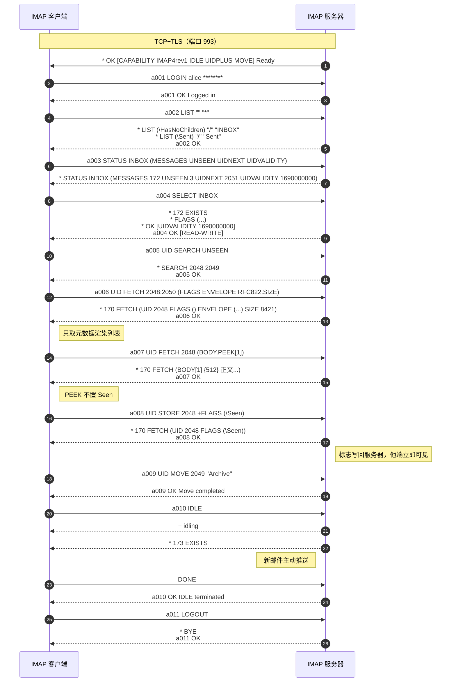
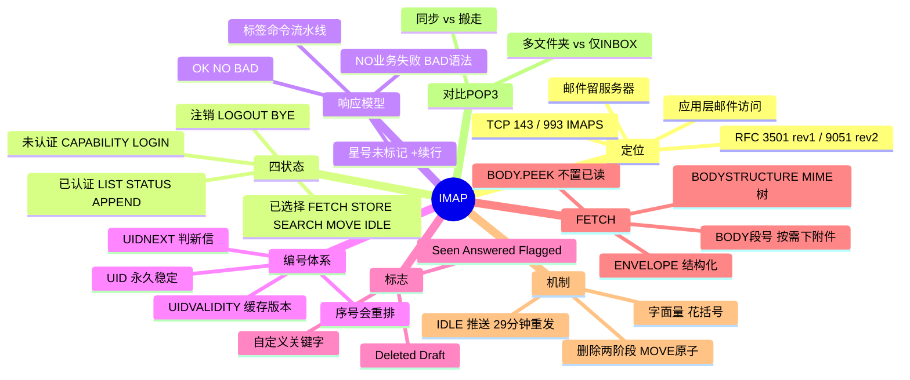

## 1. 工作原理

IMAP 核心模型：**服务器持有邮件与全部元数据，客户端用命令远程操作**。与 POP3"拉走就完事"不同，IMAP 的已读、移动、删除都要写回服务器，故天然多设备同步。

### 1.1 四状态模型

```
TCP/TLS → 未认证 Not Authenticated →LOGIN→ 已认证 Authenticated
        →SELECT/EXAMINE→ 已选择 Selected →LOGOUT/CLOSE→ 注销 Logout
```

| 状态 | 进入 | 可做什么 |
|------|------|---------|
| **未认证** | 连接建立（或 `PREAUTH`） | 能力协商、加密升级、登录 |
| **已认证** | `LOGIN`/`AUTHENTICATE` 成功 | 文件夹增删改查、查询未读数、`APPEND` |
| **已选择** | `SELECT`（读写）/`EXAMINE`（只读） | 抓邮件、改标志、搜索、复制、移动、清除 |
| **注销** | `LOGOUT`/服务器 `BYE` | 连接关闭 |

`EXAMINE` 与 `SELECT` 唯一区别：前者**只读**打开，不会自动置 `\Seen`——即"预览不标已读"的实现。

### 1.2 标签（Tag）与流水线

每条命令必须以**唯一标签**开头，服务器最终响应带同一标签。因标签配对，客户端可**不等响应连发多条**（流水线），服务器可乱序返回，高延迟链路效率远高于 POP3。

```
C: a001 SELECT INBOX
S: * 172 EXISTS
S: * OK [UIDVALIDITY 1690000000]
S: a001 OK [READ-WRITE] SELECT completed   ← 带标签最终响应
```

## 2. 报文 / 头部结构

### 2.1 三类响应

| 类型 | 前缀 | 含义 |
|------|------|------|
| 带标签响应 | `<tag> OK/NO/BAD` | `OK` 成功；`NO` 命令合法但业务失败；`BAD` 语法/状态错误 |
| 未标记响应 | `*` | 推送数据/事件：`* 5 EXISTS`、`* 2 EXPUNGE`、`* BYE` |
| 续行请求 | `+` | 要求客户端继续（字面量、AUTHENTICATE 质询、IDLE 就绪） |

`NO` 与 `BAD` 是排错关键：`NO`=命令写对但业务失败（如 `NO Mailbox doesn't exist`）；`BAD`=语法错或在错误状态下发命令。

### 2.2 核心命令集（RFC 3501）

**任意状态**：`CAPABILITY`（能力）、`NOOP`（触发推送）、`LOGOUT`。
**未认证**：`STARTTLS`、`LOGIN 用户 口令`、`AUTHENTICATE 机制`（PLAIN/LOGIN/XOAUTH2）。
**已认证**：`SELECT`/`EXAMINE`、`CREATE`/`DELETE`/`RENAME`、`LIST 参考 通配`（`%` 匹配一层，`*` 全部）、`SUBSCRIBE`/`LSUB`、`STATUS 邮箱 (MESSAGES UNSEEN UIDNEXT UIDVALIDITY)`、`APPEND 邮箱 [标志] {字节}`。
**已选择**：`FETCH`/`UID FETCH`、`STORE ±FLAGS (.SILENT 抑制回显)`、`SEARCH`（或 `UID SEARCH`）、`COPY`/`MOVE`（RFC 6851 原子移动）、`EXPUNGE`、`CLOSE`（隐式 EXPUNGE）、`UNSELECT`、`IDLE`（RFC 2177 推送）。

### 2.3 系统标志与编号体系

| 系统标志 | 含义 |
|---------|------|
| `\Seen` / `\Answered` / `\Flagged` / `\Draft` | 已读 / 已回复 / 星标 / 草稿 |
| `\Deleted` | 待删除（等 `EXPUNGE`） |
| `\Recent` | 本会话首现新邮件（会话级，rev2 已废弃） |
| `\*`（PERMANENTFLAGS 中） | 允许自定义关键字如 `$Junk` |

| 概念 | 说明 |
|------|------|
| **序号** | 1..N 连续编号，**EXPUNGE 会令后续序号前移** |
| **UID** | 文件夹内单调递增永不复用，删其他邮件不影响它 |
| **UIDVALIDITY** | 文件夹版本号，`SELECT` 返回；**不变则缓存有效，变了须清空全量重同步** |
| **UIDNEXT** | 下一封新邮件 UID，用于判断是否新信 |

增量同步经典写法：记录上次 `UIDVALIDITY` 与最大 UID，本次 `SELECT` 先比对，一致则 `UID FETCH <lastUID+1>:* ...` 只取新信。

### 2.4 FETCH 数据项

| 数据项 | 返回 |
|--------|------|
| `FLAGS` / `UID` / `INTERNALDATE` / `RFC822.SIZE` | 标志 / UID / 服务器收信时间 / 字节数 |
| `ENVELOPE` | 结构化信封（日期/主题/From/To/Message-ID），**不下正文** |
| `BODYSTRUCTURE` | 完整 MIME 树，决定下载哪一段 |
| `BODY[HEADER.FIELDS (FROM SUBJECT DATE)]` | 仅指定头部（列表渲染最省流量） |
| `BODY[1]`/`BODY[2]` | 第 n 个 MIME 段（只下某附件） |
| `BODY.PEEK[...]` | 同 `BODY[...]` 但**不置 `\Seen`**（预览必用） |
| `RFC822` | 整封原始邮件 |

```
a005 UID FETCH 1:* (UID FLAGS INTERNALDATE RFC822.SIZE ENVELOPE)
a006 UID FETCH 1024 (BODY.PEEK[HEADER.FIELDS (FROM TO SUBJECT DATE)])
a008 UID FETCH 1024 (BODY.PEEK[2])     ← 只下第 2 段附件
```

`SEARCH`：`UID SEARCH UNSEEN`/`FROM "x"`/`SUBJECT "发票"`/`SINCE 1-Aug-2026`/`LARGER 5000000`，多条件为「与」，用 `OR`/`NOT` 前缀表「或/非」，全文须 `CHARSET UTF-8 TEXT "合同"`。

## 3. 交互流程



## 4. 关键机制

- **IDLE 准实时推送**（RFC 2177）：客户端进等待态，服务器有变化主动发未标记响应。须**每≤29分钟重发**（NAT/防火墙会回收长连接），且 IDLE 只作用于当前 SELECT 的文件夹，监听多文件夹需多条连接。
- **删除两阶段与 MOVE**：`STORE +FLAGS (\Deleted)` 只打标记，`EXPUNGE` 才真删；多数客户端"删除"实为 `MOVE` 到废纸篓，`MOVE`（RFC 6851）原子操作，优于 `COPY+STORE+EXPUNGE` 三步（中断会重复）。
- **UIDVALIDITY 变更**：若与本地缓存不同，文件夹已非同一（重建/迁移/修索引），所有缓存 UID 失效，须清空全量重同步——"换服务器后邮件全部重下"的技术原因。
- **字面量语法**：含 CRLF 的数据用 `{字节数}` 声明后跟原文，`LITERAL+` 允许 `{n+}` 不等续行省 RTT。
- **认证加密**：`STARTTLS`（143 显式，后重 CAPABILITY）、隐式 TLS（993，RFC 8314 推荐）；`LOGIN`/`AUTHENTICATE PLAIN` 明文须 TLS 内；`XOAUTH2` 是 Gmail/365 主推。授权码同 SMTP/POP3。

## 5. 知识框架


