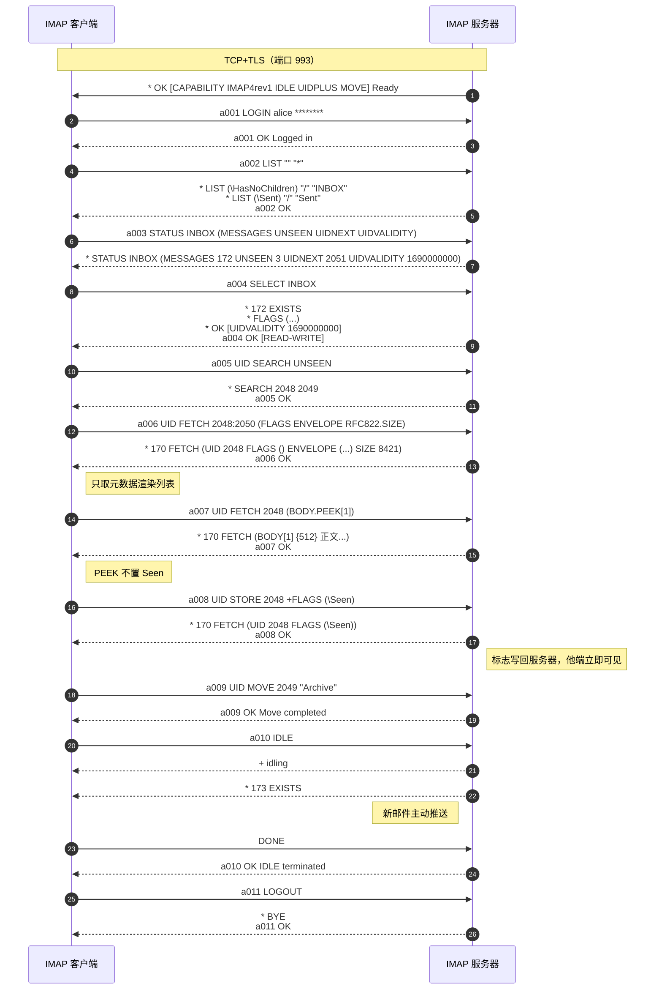
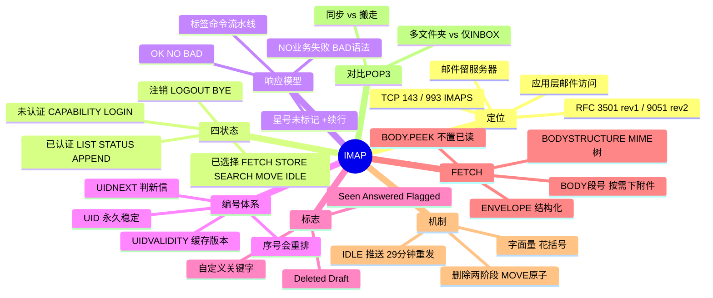

## 🚀 先建立直觉

IMAP 干的事情是：**让你远程操作放在服务器上的那堆信，而不是把信搬回家**。

想象一个云端的书房：书一直在书房里，你在手机上贴的书签、分的类、扔进废纸篓的动作，全都是在书房里真实发生的。所以换台电脑打开，看到的还是同一个书房、同样的摆放。

它还很省事——你可以只把书的**目录页**调出来看看，觉得有兴趣再把某一章单独取出来读，不必把整本书都搬过来。

## 🤔 它解决什么问题

没有 IMAP 会怎样？在手机上收了信，回到电脑上就找不着了；电脑上辛苦分好的文件夹，手机上完全不存在；一封信在这台标了已读，在那台还是未读。这正是 POP3"下载即搬走"模型在多设备时代的困境。

IMAP 针对性地解决四件事：

1. **多端状态一致**：已读、星标、回复过等标志存在服务器，任一端修改，全端同步。
2. **服务器端文件夹**：支持创建、重命名、订阅任意层级的邮箱，归档结构对所有客户端可见。
3. **按需获取（Partial Fetch）**：可以只取头部渲染列表、只取某个 MIME 段下载单个附件，不必整封拉下来。
4. **服务器端搜索与推送**：`SEARCH` 在服务端完成检索，`IDLE` 让服务器主动推送新邮件通知。

## 🔄 工作流程（简化版）

一次 IMAP 使用，用大白话说是 5 步：

1. **登录**：连上服务器、报账号密码，进门。
2. **看有哪些文件夹**：让服务器列一下你的收件箱、已发送、归档等目录。
3. **选中一个文件夹**：告诉服务器"我现在要操作收件箱"，服务器回报里面有多少封、版本号是多少。
4. **按需取内容**：先只拿标题和发件人渲染列表，点开某封才拿正文，要下附件才单独拿那一段。
5. **改状态 / 挂机等新信**：把"已读""移到归档"这些动作写回服务器；然后挂起等待，有新信服务器会主动通知你。

IMAP 核心模型：**服务器持有邮件与全部元数据，客户端用命令远程操作**。与 POP3"拉走就完事"不同，IMAP 的已读、移动、删除都要写回服务器，故天然多设备同步。

### 四状态模型

```
TCP/TLS → 未认证 Not Authenticated →LOGIN→ 已认证 Authenticated
        →SELECT/EXAMINE→ 已选择 Selected →LOGOUT/CLOSE→ 注销 Logout
```

| 状态 | 进入 | 可做什么 |
|------|------|---------|
| **未认证** | 连接建立（或 `PREAUTH`） | 能力协商、加密升级、登录 |
| **已认证** | `LOGIN`/`AUTHENTICATE` 成功 | 文件夹增删改查、查询未读数、`APPEND` |
| **已选择** | `SELECT`（读写）/`EXAMINE`（只读） | 抓邮件、改标志、搜索、复制、移动、清除 |
| **注销** | `LOGOUT`/服务器 `BYE` | 连接关闭 |

`EXAMINE` 与 `SELECT` 唯一区别：前者**只读**打开，不会自动置 `\Seen`——即"预览不标已读"的实现。

### 标签（Tag）与流水线

每条命令必须以**唯一标签**开头，服务器最终响应带同一标签。因标签配对，客户端可**不等响应连发多条**（流水线），服务器可乱序返回，高延迟链路效率远高于 POP3。

```
C: a001 SELECT INBOX
S: * 172 EXISTS
S: * OK [UIDVALIDITY 1690000000]
S: a001 OK [READ-WRITE] SELECT completed   ← 带标签最终响应
```

## 📦 报文 / 头部长什么样

### 三类响应

看这张表前先记住：**看到行首那个字符就知道这行是什么**——有标签的是"这条命令的最终结果"，`*` 开头的是服务器主动告诉你的变化，`+` 开头的是"你继续说"。

| 类型 | 前缀 | 含义 |
|------|------|------|
| 带标签响应 | `<tag> OK/NO/BAD` | `OK` 成功；`NO` 命令合法但业务失败；`BAD` 语法/状态错误 |
| 未标记响应 | `*` | 推送数据/事件：`* 5 EXISTS`、`* 2 EXPUNGE`、`* BYE` |
| 续行请求 | `+` | 要求客户端继续（字面量、AUTHENTICATE 质询、IDLE 就绪） |

`NO` 与 `BAD` 是排错关键：`NO`=命令写对但业务失败（如 `NO Mailbox doesn't exist`）；`BAD`=语法错或在错误状态下发命令。

### 核心命令集（RFC 3501）

看这份清单前先记住：**命令是按状态分组的**——没登录只能做协商和登录，没 `SELECT` 文件夹就不能碰邮件，在错误状态下发命令直接得 `BAD`。

**任意状态**：`CAPABILITY`（能力）、`NOOP`（触发推送）、`LOGOUT`。
**未认证**：`STARTTLS`、`LOGIN 用户 口令`、`AUTHENTICATE 机制`（PLAIN/LOGIN/XOAUTH2）。
**已认证**：`SELECT`/`EXAMINE`、`CREATE`/`DELETE`/`RENAME`、`LIST 参考 通配`（`%` 匹配一层，`*` 全部）、`SUBSCRIBE`/`LSUB`、`STATUS 邮箱 (MESSAGES UNSEEN UIDNEXT UIDVALIDITY)`、`APPEND 邮箱 [标志] {字节}`。
**已选择**：`FETCH`/`UID FETCH`、`STORE ±FLAGS (.SILENT 抑制回显)`、`SEARCH`（或 `UID SEARCH`）、`COPY`/`MOVE`（RFC 6851 原子移动）、`EXPUNGE`、`CLOSE`（隐式 EXPUNGE）、`UNSELECT`、`IDLE`（RFC 2177 推送）。

命令英文全称对照：`CAPABILITY`（能力查询）、`NOOP` = No Operation（空操作/触发推送）、`LOGOUT`（注销）、`STARTTLS`（启动加密）、`AUTHENTICATE`（SASL 认证）、`SELECT`（选择邮箱-读写）、`EXAMINE`（选择邮箱-只读）、`CREATE`/`DELETE`/`RENAME`（建/删/改名邮箱）、`LIST`（列出邮箱）、`SUBSCRIBE`/`LSUB` = List Subscribed（订阅/列出已订阅）、`STATUS`（邮箱状态）、`APPEND`（追加邮件）、`FETCH`（抓取内容）、`STORE`（写标志）、`SEARCH`（服务端搜索）、`COPY`（复制）、`MOVE`（移动）、`EXPUNGE`（清除已删标记的邮件）、`CLOSE`（关闭邮箱）、`UNSELECT`（取消选择）、`IDLE`（挂起等待推送）。

### 系统标志与编号体系

看这两张表前先记住：**标志决定"这封信长什么状态"，编号决定"怎么指认这封信"**——后者是 IMAP 编程最容易翻车的地方。

| 系统标志 | 含义 |
|---------|------|
| `\Seen` / `\Answered` / `\Flagged` / `\Draft` | 已读 / 已回复 / 星标 / 草稿 |
| `\Deleted` | 待删除（等 `EXPUNGE`） |
| `\Recent` | 本会话首现新邮件（会话级，rev2 已废弃） |
| `\*`（PERMANENTFLAGS 中） | 允许自定义关键字如 `$Junk` |

| 概念 | 说明 |
|------|------|
| **序号** | 1..N 连续编号，**EXPUNGE 会令后续序号前移** |
| **UID** | 文件夹内单调递增永不复用，删其他邮件不影响它 |
| **UIDVALIDITY** | 文件夹版本号，`SELECT` 返回；**不变则缓存有效，变了须清空全量重同步** |
| **UIDNEXT** | 下一封新邮件 UID，用于判断是否新信 |

英文全称对照：`UID` = Unique Identifier（唯一标识符）、`UIDVALIDITY`（UID 有效性/文件夹版本号）、`UIDNEXT`（下一个可用 UID）、`\Seen`（已读）、`\Answered`（已回复）、`\Flagged`（已标星）、`\Draft`（草稿）、`\Deleted`（已标记删除）、`\Recent`（最近新到）。

增量同步经典写法：记录上次 `UIDVALIDITY` 与最大 UID，本次 `SELECT` 先比对，一致则 `UID FETCH <lastUID+1>:* ...` 只取新信。

### FETCH 数据项

看这张表前先记住：**`FETCH` 就是一份"点菜单"**——你点什么它给什么，点得越少流量越省。手机客户端之所以省流量，全靠只点前几项。

| 数据项 | 返回 |
|--------|------|
| `FLAGS` / `UID` / `INTERNALDATE` / `RFC822.SIZE` | 标志 / UID / 服务器收信时间 / 字节数 |
| `ENVELOPE` | 结构化信封（日期/主题/From/To/Message-ID），**不下正文** |
| `BODYSTRUCTURE` | 完整 MIME 树，决定下载哪一段 |
| `BODY[HEADER.FIELDS (FROM SUBJECT DATE)]` | 仅指定头部（列表渲染最省流量） |
| `BODY[1]`/`BODY[2]` | 第 n 个 MIME 段（只下某附件） |
| `BODY.PEEK[...]` | 同 `BODY[...]` 但**不置 `\Seen`**（预览必用） |
| `RFC822` | 整封原始邮件 |

数据项中文含义：`FLAGS`（标志集合）、`INTERNALDATE`（服务器内部收信时间）、`RFC822.SIZE`（邮件字节数）、`ENVELOPE`（结构化信封）、`BODYSTRUCTURE`（正文 MIME 结构树）、`BODY`（正文段）、`BODY.PEEK`（偷看正文段，不改已读标志）。

```
a005 UID FETCH 1:* (UID FLAGS INTERNALDATE RFC822.SIZE ENVELOPE)
a006 UID FETCH 1024 (BODY.PEEK[HEADER.FIELDS (FROM TO SUBJECT DATE)])
a008 UID FETCH 1024 (BODY.PEEK[2])     ← 只下第 2 段附件
```

`SEARCH`：`UID SEARCH UNSEEN`/`FROM "x"`/`SUBJECT "发票"`/`SINCE 1-Aug-2026`/`LARGER 5000000`，多条件为「与」，用 `OR`/`NOT` 前缀表「或/非」，全文须 `CHARSET UTF-8 TEXT "合同"`。

## 🔀 交互时序

一句话看懂这张图：**登录 → 看文件夹 → 选中收件箱 → 先取元数据渲染列表、再按需取正文 → 改标志和移动都写回服务器 → 最后挂 `IDLE` 等新信主动推过来**。注意带 `a00x` 标签的行是"这条命令的结果"，`*` 开头的行是服务器推给你的数据。



## 🔧 关键机制 / 变体

- **IDLE 准实时推送**（RFC 2177）——这是让你**手机能"叮"一声收到新邮件而不用每分钟去问一遍**：客户端进等待态，服务器有变化主动发未标记响应。须**每≤29分钟重发**（NAT/防火墙会回收长连接），且 IDLE 只作用于当前 SELECT 的文件夹，监听多文件夹需多条连接。
- **删除两阶段与 MOVE**——这是为了**给"删错了"留后悔的余地，并让移动操作不会半途出错留下两份**：`STORE +FLAGS (\Deleted)` 只打标记，`EXPUNGE` 才真删；多数客户端"删除"实为 `MOVE` 到废纸篓，`MOVE`（RFC 6851）原子操作，优于 `COPY+STORE+EXPUNGE` 三步（中断会重复）。
- **UIDVALIDITY 变更**——这是服务器在告诉你**"这个文件夹已经不是原来那个了，你手上的缓存全作废"**：若与本地缓存不同，文件夹已非同一（重建/迁移/修索引），所有缓存 UID 失效，须清空全量重同步——"换服务器后邮件全部重下"的技术原因。
- **字面量语法**——这是为了**让含换行的大段数据也能在行式协议里安全传输**：含 CRLF 的数据用 `{字节数}` 声明后跟原文，`LITERAL+` 允许 `{n+}` 不等续行省 RTT。
- **认证加密**——这决定了**你的账号口令是不是在裸奔**：`STARTTLS`（143 显式，后重 CAPABILITY）、隐式 TLS（993，RFC 8314 推荐）；`LOGIN`/`AUTHENTICATE PLAIN` 明文须 TLS 内；`XOAUTH2` 是 Gmail/365 主推。授权码同 SMTP/POP3。

## ⚠️ 常见误区

1. **"命令可以像 POP3 那样直接敲"** —— 不行。IMAP 每条命令**必须带唯一标签**，忘了加标签服务器只会回 `BAD`，且看不出是哪里错。
2. **"序号和 UID 差不多，随便用哪个"** —— 差很多。序号会因 `EXPUNGE` 而整体前移，跨命令引用就会指错信；UID 在同一 `UIDVALIDITY` 下永不变，编程一律用 `UID FETCH` / `UID STORE`。
3. **"点开预览了但不想标已读，客户端会自动处理"** —— 不会。用 `BODY[...]` 抓取会**隐式加上 `\Seen`**，想预览不标已读必须用 `BODY.PEEK[...]`，或用 `EXAMINE` 只读打开文件夹。
4. **"`NO` 和 `BAD` 都是报错，一样看"** —— 方向完全不同。`NO` 是命令写对了但业务不允许（如文件夹不存在），该查业务配置；`BAD` 是语法错或在错误状态下发命令，该查自己的命令怎么写的。

## 🧠 速记口诀

> **命令必带标签，星号是推送、加号要续行；`OK` 通过、`NO` 业务错、`BAD` 语法错。**
>
> **认 UID 别认序号，预览用 PEEK 不留痕；删要两步 `EXPUNGE` 才算数，UIDVALIDITY 一变全重来。**

## 🗺️ 知识框架


