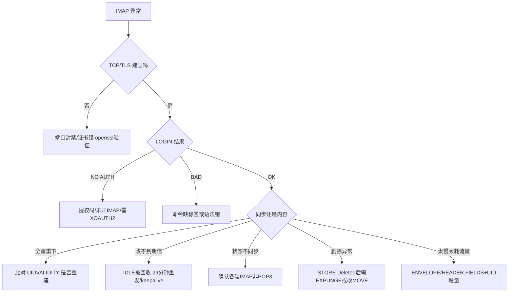

## 1. 抓包观察

### 1.1 Wireshark 过滤式

| 目的 | 过滤式 |
|------|--------|
| 所有 IMAP / 明文 / 加密 | `imap` / `tcp.port==143` / `tcp.port==993` |
| 客户端命令 / 服务端响应 | `imap.request` / `imap.response` |
| 某命令 / 登录 / 失败 | `imap.request.command=="FETCH"` / `"LOGIN"` / `imap.response.status matches "^(NO\|BAD)$"` |
| 抓 IDLE / UIDVALIDITY / TLS 升级 | `imap contains "IDLE"` / `"UIDVALIDITY"` / `"STARTTLS"` |

**Follow → TCP Stream** 看完整标签化对话；因流水线，同一流中命令可能乱序，**按标签配对阅读**。

### 1.2 关键字段与同步判断

| 字段 | 说明 |
|------|------|
| `imap.request.tag` / `.command` / `.parameter` | 标签、命令、参数 |
| `imap.response.tag` | 响应标签；`*` 未标记，`+` 续行 |
| `imap.response.status` | `OK`/`NO`/`BAD`/`PREAUTH`/`BYE` |
| `imap.response.description` | 含 `[UIDVALIDITY xxx]`、`[READ-WRITE]` 等 |

查 `* n EXISTS`（总数）、`* n EXPUNGE`（被删）、`* n FETCH (FLAGS ...)`（标志变更推送）即可还原服务器推给客户端的变化。

### 1.3 命令行抓包

```bash
sudo tcpdump -i any -nn -s0 'tcp port 143 or tcp port 993' -w imap.pcap
sudo tcpdump -i any -nn -A 'tcp port 143'               # 明文
```

## 2. 常用命令 / 配置

```bash
# 连通性 + 服务发现（RFC 6186 SRV）
nc -zv imap.qq.com 993
dig +short SRV _imaps._tcp.example.com
Test-NetConnection imap.qq.com -Port 993               # PowerShell

# openssl 手工
openssl s_client -crlf -connect imap.qq.com:993
openssl s_client -crlf -starttls imap -connect host:143  # 143 显式升级
```

**手工会话（993，每条命令带标签）**：
```
a001 CAPABILITY
a002 LOGIN alice@example.com 授权码
a003 LIST "" "*"
a004 STATUS INBOX (MESSAGES UNSEEN UIDNEXT UIDVALIDITY)
a005 SELECT INBOX
a006 UID SEARCH UNSEEN
a007 UID FETCH 2048:2050 (UID FLAGS RFC822.SIZE ENVELOPE)
a008 UID FETCH 2048 (BODY.PEEK[HEADER.FIELDS (FROM SUBJECT DATE)])
a009 UID FETCH 2048 (BODYSTRUCTURE)
a010 UID FETCH 2048 (BODY.PEEK[2])        ← 只下第2段附件
a011 UID STORE 2048 +FLAGS (\Seen)
a012 UID MOVE 2049 "Archive"
a013 LOGOUT
```
"某信打不开"时先 `UID FETCH n (BODYSTRUCTURE)` 看 MIME 树，再针对段 `BODY.PEEK[x]` 定位。

**curl / Python**：`curl "imaps://imap.qq.com:993/INBOX?UNSEEN" -u user:授权码`；Python `imaplib.IMAP4_SSL(host,993).login()` → `select(readonly=True)`（等价 EXAMINE 不置 Seen）→ `uid('SEARCH',None,'UNSEEN')` → `uid('FETCH',uid,'(BODY.PEEK[HEADER.FIELDS (FROM SUBJECT DATE)])')`。

**服务端（Dovecot）**：`doveconf -n | grep -iE 'protocols|ssl'`；`doveadm who`（会话）；`doveadm mailbox status -u alice all INBOX`（看 UIDVALIDITY）；`doveadm force-resync -u alice INBOX`（索引损坏重建，注意可能改变 UIDVALIDITY）。

## 3. 常见故障与排错

| 现象 | 可能原因 | 排查 |
|------|---------|------|
| 连接超时 | 143/993 被封；未监听 | `Test-NetConnection -Port 993`；`ss -lntp \| grep -E '143\|993'` |
| `NO [AUTHENTICATIONFAILED]` | 用登录密码非授权码；未开 IMAP；需 XOAUTH2 | 开 IMAP 生成授权码；Gmail/M365 用 `AUTHENTICATE XOAUTH2` |
| `BAD Invalid command` | **命令没带标签**；错误状态发命令（未 SELECT 就 FETCH） | 每条命令加唯一标签；`BAD` 先疑语法 |
| `NO Mailbox doesn't exist` | 文件夹名大小写/分隔符错；中文未按 **modified UTF-7** | `LIST "" "*"` 看真实名与分隔符（`/`或`.`），原样用 |
| 全量重新下载 | `UIDVALIDITY` 变化（重建/迁移/force-resync） | 比对 `SELECT` 的 `[UIDVALIDITY]` 与历史；勿随意重建索引 |
| 长时间收不到新信 | IDLE 长连接被 NAT/防火墙回收 | 每≤29分钟重发 IDLE；调大空闲超时；开 TCP keepalive |
| 多设备已读不同步 | 有端实际是 POP3；或 PEEK 却从不 `STORE \Seen` | 检查各端类型；确认发出 `UID STORE +FLAGS (\Seen)` |
| 删了仍在列表 | 只 `STORE \Deleted` 未 `EXPUNGE` | 手工 `EXPUNGE` 验证；核对删除行为设置 |
| 移动后重复 | COPY+STORE+EXPUNGE 三步中途失败 | 支持则改原子 `MOVE`（`CAPABILITY` 含 MOVE） |
| 预览被标已读 | 用 `BODY[...]` 非 `BODY.PEEK[...]`；用 `SELECT` 非 `EXAMINE` | 预览用 `BODY.PEEK`；只读浏览用 `EXAMINE` |
| 同步慢/流量爆炸 | 每封 `FETCH RFC822` 全下；未增量 | 列表只取 `ENVELOPE`/`HEADER.FIELDS`；`UID FETCH <last+1>:*` 增量 |
| 连接数超限 | 每文件夹一条 IDLE，开太多 | 减同时 IDLE 数；调大 `mail_max_userip_connections` |
| 中文主题/文件夹乱码 | 主题未 RFC 2047 解码；文件夹名未 modified UTF-7 | 用成熟库（email/imaplib）而非手工解析 |



## 4. 与其他协议对比

### 4.1 IMAP vs POP3

| 维度 | IMAP | POP3 |
|------|------|------|
| RFC / 端口 | RFC 3501（rev2 9051）；143/993 | RFC 1939；110/995 |
| 主副本位置 | **服务器**（客户端缓存） | **客户端**（服务端默认删） |
| 多设备同步 | 已读/星标/文件夹全同步 | 完全不同步 |
| 服务端文件夹 | 任意层级增删 | 仅 INBOX |
| 部分获取 | 按头部字段、按 MIME 段精确 | 仅 `TOP`（头部+前n行） |
| 搜索 / 推送 | `SEARCH` 多条件全文 / `IDLE` | 无 / 仅轮询 |
| 并发 | 多连接、流水线 | 排他锁单连接 |
| 复杂度 | 高（数十条命令） | 极低（约12条） |

### 4.2 邮件协议端口全景

| 协议 | 职责 | 明文端口 | 加密端口 | RFC |
|------|------|---------|---------|-----|
| SMTP 中继 | MTA 间投递 | 25 | 25+STARTTLS | 5321 |
| SMTP 提交 | 客户端发信 | 587+STARTTLS | 465 隐式 TLS | 6409/8314 |
| POP3 | 下载 | 110 | 995 | 1939 |
| IMAP | 同步管理 | 143 | 993 | 3501/9051 |

### 4.3 IMAP4rev1 vs rev2（RFC 9051）

| 项目 | rev1 | rev2 |
|------|------|------|
| `\Recent` / `LSUB` | 保留 | 移除（LSUB 由 LIST SUBSCRIBED 替代） |
| UTF-8 文件夹名 | modified UTF-7 | 原生 UTF-8 |
| `MOVE`/`UNSELECT`/`SPECIAL-USE` | 需扩展 | 并入核心 |

## 5. 常见面试题

**Q1 IMAP 与 POP3 核心差异？** 状态与主副本归属：IMAP 以服务器为唯一真相源，标志/文件夹操作写回服务器，天然多端同步；POP3 下载到本地默认删服务端副本，设备彼此隔离。

**Q2 四状态与命令？** 未认证（CAPABILITY/STARTTLS/LOGIN）、已认证（LIST/CREATE/STATUS/APPEND/SELECT）、已选择（FETCH/STORE/SEARCH/COPY/MOVE/EXPUNGE/IDLE）、注销（LOGOUT）；错误状态发命令得 `BAD`。

**Q3 为何命令带标签？** 标签配对响应，支持**流水线**：不必等前条响应即可连发，服务器可乱序返回，高延迟下省总耗时；POP3 无标签只能串行。

**Q4 序号/UID/UIDVALIDITY？** 序号 1..N 位置编号，EXPUNGE 会前移，不能跨命令引用；UID 单调递增不复用。`UIDVALIDITY` 是文件夹版本号，不变则缓存有效，变了须清空全量重同步。

**Q5 IDLE 实现推送与坑？** 发 `IDLE` 进等待，服务器变化时主动发 `* n EXISTS`。坑：依赖长连接，NAT/防火墙回收空闲连接，须**每29分钟内重发**；IDLE 只作用于当前 SELECT 文件夹，多文件夹需多连接。

**Q6 预览不标已读？** 用 `EXAMINE` 只读打开；抓取用 `BODY.PEEK[...]` 而非 `BODY[...]`（后者隐式加 `\Seen`）。

**Q7 删除为何两步？** `STORE +FLAGS (\Deleted)` 仅标记，`EXPUNGE` 才移除，便于反悔。实践多改 `MOVE` 到废纸篓，`MOVE`（RFC 6851）原子，避免 COPY+EXPUNGE 中断重复。

**Q8 慢且费流量如何优化？** ①列表只取 `ENVELOPE`/`HEADER.FIELDS`；②`BODYSTRUCTURE` 看树后按段 `BODY.PEEK[段号]` 下附件；③`UID FETCH <上次最大+1>:*` 增量；④`IDLE` 替代高频轮询。

**Q9 中文文件夹乱码？** rev1（RFC 3501）要求 **modified UTF-7** 编码，按 UTF-8 解即乱码。正确按 modified UTF-7 解码，或升级 IMAP4rev2（原生 UTF-8）。

**Q10 IMAP 能发信吗？** 不能，发信走 SMTP（587/465）。发成功后客户端用 IMAP `APPEND` 把副本写入"已发送"文件夹，使其他设备可见发件记录。
