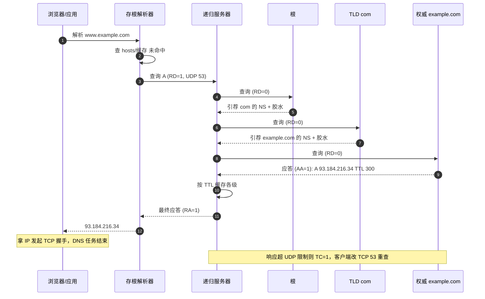
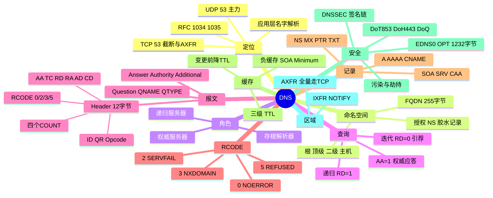

## 先建立直觉

上网时你输入的是 `www.example.com` 这种名字，但网络之间的机器只认 `93.184.216.34` 这种地址。DNS 干的事，就是当"名字"和"地址"之间的翻译官。

可以把它想成一张全球大通讯录：你不用自己翻，只要把名字交给一个"万事通"（本地 DNS 服务器），它替你一路问下去——先问管顶层的，再问管二级的，最后问到真正知道答案的那台机器，然后把地址回给你。绝大多数时候，因为大家之前都问过、答案被记在了附近，根本不用问到最顶层。

一句话：DNS 让你用"名字"上网，而背后是无数台服务器一级一级把名字翻译成机器能用的地址。

## 它解决什么问题

1. **人记名字，机器用地址**：人类记不住 `142.250.72.14`，更记不住 IPv6 的 `2404:6800:4008:c07::71`；DNS 提供了名字到地址的映射。
2. **地址可变而名字稳定**：服务器换 IP、切机房、上 CDN，只需改 DNS 记录，用户侧无感知。
3. **去中心化管理**：早期用一个 `HOSTS.TXT` 文件全网同步，无法扩展。DNS 用**层次化命名 + 授权（Delegation）**把管理权分散到各级，每个组织只维护自己的区域（Zone）。
4. **不止解析 IP**：MX 决定邮件投给谁，SRV 做服务发现，TXT 承载 SPF/DKIM/DMARC 与域名所有权验证，CNAME 支撑 CDN 调度，PTR 做反向解析。

## 工作流程（简化版）

把"查 `www.example.com` 的地址"这件事，用普通人能听懂的话拆开：

1. **先看身边有没有记过**：浏览器、操作系统、本机 `hosts` 里若已有答案，直接拿来用，省去后面所有步骤。
2. **把问题交给"万事通"**：本机把"帮我查到底"的请求丢给本地递归服务器（你只问一次，剩下的它全包了）。
3. **万事通一级一级问**：它先问根（"com 归谁管？"），再问 .com（"example.com 归谁管？"），最后问 example.com 的权威（"www 的地址是多少？"）。
4. **拿到答案顺手记下来**：递归服务器按"保鲜期"把结果存一份，下次别人问同样的，直接回，不用再跑一遍。
5. **把地址交还给你**：你拿到 IP，开始和网站建立连接，DNS 的任务就此结束。

> 一句话版：**客户端偷懒（递归），递归服务器干活（迭代）。**

## 报文 / 头部长什么样

DNS 的查询和响应用的是同一套格式，一共五段。下面把每段拆开看，字段名保留英文缩写并附中文全称。

### 报文总体结构

查询与响应同源格式，共 5 段：**Header（头部，12 字节）+ Question（问题）+ Answer（回答）+ Authority（授权）+ Additional（附加）**。

### 报文头部（12 字节）

下面这张表逐字段说明头部里那 12 个字节都装了什么。

| 字段 | 位宽 | 含义 |
|------|------|------|
| **ID**（Identifier，事务标识） | 16 | 事务标识，请求响应须一致；随机化 ID+源端口是防投毒基础 |
| **QR**（Query/Response，查询/响应标志） | 1 | 0=查询，1=响应 |
| **Opcode**（操作码） | 4 | 0=QUERY（标准查询），4=NOTIFY（区域变更通知），5=UPDATE（动态更新） |
| **AA**（Authoritative Answer，权威回答） | 1 | Authoritative，回答来自权威（缓存为 0） |
| **TC**（Truncation，截断标志） | 1 | TrunCation，超长被截断，客户端应改 TCP 重查 |
| **RD**（Recursion Desired，期望递归） | 1 | Recursion Desired，期望递归 |
| **RA**（Recursion Available，可提供递归） | 1 | Recursion Available，服务器支持递归（权威常 0） |
| **Z**（保留位） | 1 | 保留，恒 0 |
| **AD / CD**（Authentic Data / Checking Disabled） | 1/1 | DNSSEC 验证通过 / 要求不做 DNSSEC 校验 |
| **RCODE**（Response Code，响应码） | 4 | 响应码，见下 |
| **QDCOUNT / ANCOUNT / NSCOUNT / ARCOUNT** | 各16 | 四个区段记录条数（问题数 / 回答数 / 授权数 / 附加数） |

**RCODE（响应码）** 的取值含义如下：

`0 NOERROR`（ANCOUNT=0 表示域名存在但无该类型记录）、`1 FORMERR`（格式错误）、`2 SERVFAIL`（上游不可达/DNSSEC失败/递归超时）、`3 NXDOMAIN`（域名不存在）、`4 NOTIMP`（未实现）、`5 REFUSED`（向权威发递归/ACL 限制）。

> **NXDOMAIN vs "NOERROR+0 条记录"** 是高频考点：前者名字不存在，后者名字存在但无该类型记录（如只有 A 没有 AAAA）。

### Question 与 RR 格式

- Question（问题段）：`QNAME`（查询名，长度前缀标签编码，如 `3www7example3com0`）、`QTYPE`（查询类型，1=A/28=AAAA/5=CNAME/15=MX/2=NS/12=PTR/16=TXT/6=SOA/33=SRV/255=ANY）、`QCLASS`（查询类，恒 1=IN，即 Internet）。
- RR（资源记录，出现在 Answer/Authority/Additional）：`NAME`（常用**消息压缩指针** `0xC0xx` 省空间）、`TYPE`（类型）/`CLASS`（类）/`TTL`(32位，0 表示不缓存)/`RDLENGTH`（RDATA 长度）/`RDATA`（真正的数据）。

### 常见记录类型

这张表列出了最常用的记录类型、它在报文里的值、作用与示例。

| 类型 | 值 | 作用 | 示例 |
|------|----|------|------|
| **A**（Address，IPv4 地址） | 1 | 域名→IPv4 | `www 300 IN A 93.184.216.34` |
| **AAAA**（IPv6 地址） | 28 | 域名→IPv6 | `www 300 IN AAAA 2606:...` |
| **CNAME**（Canonical Name，规范名/别名） | 5 | 别名→规范名；**同名下不能再有其它记录，根域（Zone Apex）不能用 CNAME** | `cdn IN CNAME x.cdn.net.` |
| **NS**（Name Server，域名服务器） | 2 | 区域由哪些权威负责 | `example.com. IN NS ns1.example.com.` |
| **MX**（Mail Exchanger，邮件交换） | 15 | 邮件服务器 + 优先级（**越小越优先**） | `example.com. IN MX 10 mail.example.com.` |
| **PTR**（Pointer，指针） | 12 | 反向 IP→域名（`in-addr.arpa`/`ip6.arpa`） | `34.216.184.93.in-addr.arpa. IN PTR www` |
| **TXT**（Text，文本） | 16 | 文本；承载 SPF/DKIM/DMARC/所有权验证 | `example.com. IN TXT "v=spf1 ~all"` |
| **SOA**（Start Of Authority，起始授权） | 6 | 区域起始授权：主 NS、管理员邮箱、Serial、Refresh/Retry/Expire/Minimum | `example.com. IN SOA ns1 admin (2026080301 7200 3600 1209600 3600)` |
| **SRV**（Service，服务） | 33 | 服务发现：优先级 权重 端口 目标 | `_sip._tcp 10 60 5060 srv` |
| **CAA**（Certification Authority Authorization，证书颁发机构授权） | 257 | 限定哪些 CA 可签发证书 | `example.com. IN CAA 0 issue "letsencrypt.org"` |

**SOA 字段**含义：`Serial`（序列号，每次修改必须递增，从服务器据此同步）；`Refresh/Retry/Expire`（同步节奏）；`Minimum`（负缓存时长，RFC 2308）。

### 命名空间与授权（补充）

DNS 是一棵倒置树，根为 `.`，每个节点是标签（最长 63 字节），FQDN 总长 ≤ 255 字节。`com`/`cn`（TLD）→ `example`（二级域）→ `www`/`mail`（主机）。

**授权（Delegation）**是可扩展关键：父区只存一条 **NS 记录**指明子区由谁负责，加必要的**胶水记录（Glue，即 NS 主机名对应的 A 记录）**——打破"查 NS 地址需先查 NS"的循环依赖。

### 三类角色

| 角色 | 说明 |
|------|------|
| **存根解析器**（Stub Resolver） | OS 内轻量解析器，只把请求丢给递归服务器（`RD=1`），自己不迭代 |
| **递归服务器**（Recursive Server） | 如 `8.8.8.8`/`223.5.5.5`，替客户端跑完整查询链并缓存 |
| **权威服务器**（Authoritative Server） | 持有某区域真实数据，回答时置 `AA=1` |

### 递归 vs 迭代

| 对比 | 递归 | 迭代 |
|------|------|------|
| 发起方 | 客户端 → 递归服务器 | 递归服务器 → 各级权威 |
| 标志 | `RD=1`，响应 `RA=1` | `RD=0` |
| 返回 | 最终答案或 NXDOMAIN | 通常是 NS 引荐（Referral） |

## 交互时序

一句话看懂这张图：它画的是"查 `www.example.com` 的一次完整旅程"——本机把活甩给递归服务器，递归服务器自己跑完根→TLD→权威三级，最后把地址带回给本机；一旦响应超过 UDP 上限，就改走 TCP 重查。

**CNAME 链**：`www` 是 CNAME 指向 `x.cdn.net` 时，权威在 Answer 返回 CNAME，递归再对 `x.cdn.net` 重查，最终 Answer 含 `CNAME + A` 两条。

## 关键机制 / 变体

下面每条机制先点明它是干什么用的，再展开。

- **缓存与 TTL（让绝大多数查询不用跑到根）**：浏览器 / OS / 递归三级，递归命中率最高。**改解析多久生效取决于旧记录剩余 TTL**；最佳实践变更前 24–48 小时把 TTL 先调低（如 300 秒）。**负缓存**（RFC 2308）：NXDOMAIN 也按 SOA Minimum 缓存，故"刚注册仍显示不存在"。
- **UDP 512 字节限制与 EDNS(0)（解决"大响应装不下"的问题）**（RFC 6891）：超 512 字节服务器置 TC=1，客户端改 TCP 重查。EDNS 用 OPT 伪记录协商更大 UDP 载荷（常用 1232、4096）并带 DO 位（支持 DNSSEC）。推荐 **1232 字节**（IPv6 最小 MTU 1280 减头部），避免分片丢包。
- **区域传送与同步（主从服务器之间搬数据）**：**AXFR**（RFC 5936）全量、**必须 TCP 53**；**IXFR**（RFC 1995）只同步 Serial 之后增量；**NOTIFY**（RFC 1996）主变后主动通知从；**动态更新**（RFC 2136，Opcode=5）允许 DHCP 自动注册。AXFR 须做 ACL，否则泄露内网清单。
- **DNSSEC（给答案加签名、防篡改）**（RFC 4033–4035）：用公钥签名建信任链防篡改。`DNSKEY`（区域公钥，分 ZSK/KSK）、`RRSIG`（RRset 数字签名）、`DS`（放父区，子区 KSK 哈希建信任）、`NSEC/NSEC3`（证明某名确实不存在防区域枚举）。信任链：根 Trust Anchor → 根 DS → com DNSKEY → com DS → example.com DNSKEY → RRSIG 验证具体记录。**只保证完整性/真实性，不提供机密性**（仍明文）。
- **污染/劫持与加密 DNS（解决"被冒名顶替/被偷看"）**：污染（UDP 易伪造，抢在真实响应前返回，只需猜中 ID+源端口）、劫持（透明代理 53 改写应答）、NXDOMAIN 劫持（跳广告页）。防护：**DoT**（RFC 7858，TCP 853，端口独立易管控）、**DoH**（RFC 8484，TCP 443，混网页流量难区分）、**DoQ**（RFC 9250，UDP 853，低延迟）、**DNSSEC**（只防篡改不防窥探，互补）、源端口随机化+0x20 编码（缓解）。

## 常见误区

- **误区一：NXDOMAIN 和"NOERROR 但无记录"是一回事。** 错。前者是名字根本不存在，后者是名字存在只是没有你要的那类记录（如只有 A 没有 AAAA）。排查方向完全不同，负缓存策略也不同。
- **误区二：改了 DNS 记录马上全网生效。** 错。各级缓存按旧记录的剩余 TTL 生效，没到期就是不变。正确做法：变更前 24–48 小时先把 TTL 调低，再改记录，等旧 TTL 过完再调回去。
- **误区三：DNSSEC 等于加密。** 错。DNSSEC 只保证答案没被篡改（真实性/完整性），查询内容依旧明文。要防偷看，得上 DoT/DoH。
- **误区四：根域也能用 CNAME 做"跳转"。** 错。RFC 规定一个名字一旦有 CNAME，就不能再有其它记录；而根域必须带 SOA/NS，所以根域不能用 CNAME。需要"根域指向 CDN"时，要用厂商的 ALIAS/ANAME/CNAME Flattening（由权威展开成 A）。

## 速记口诀

- 名字记不住，DNS 来翻译；客户端偷懒走递归，递归服务器迭代跑断腿。
- 想生效先降 TTL，NX 与零结果别混；DNSSEC 管真不管道，明文窥探靠 DoT/DoH。

## 知识框架

