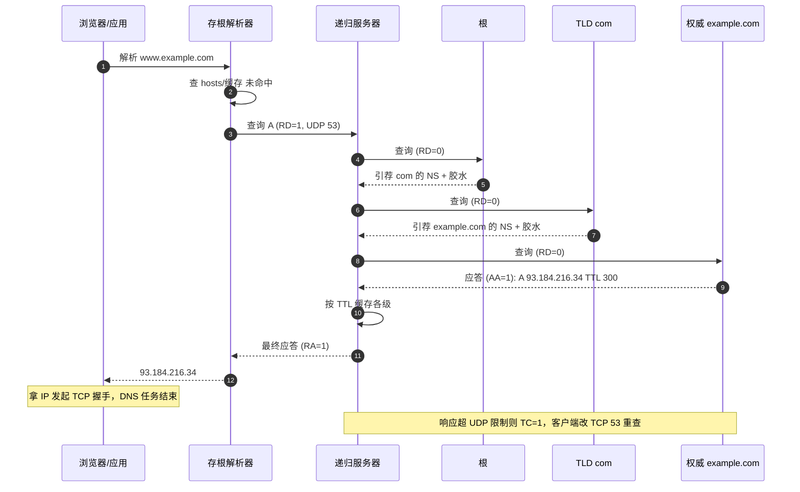
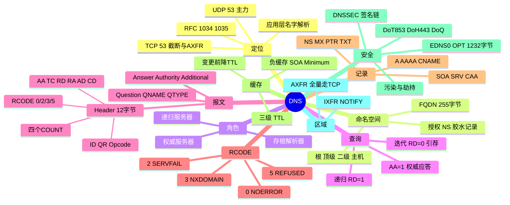

## 1. 工作原理

### 1.1 命名空间与授权

DNS 是一棵倒置树，根为 `.`，每个节点是标签（最长 63 字节），FQDN 总长 ≤ 255 字节。`com`/`cn`（TLD）→ `example`（二级域）→ `www`/`mail`（主机）。

**授权（Delegation）**是可扩展关键：父区只存一条 **NS 记录**指明子区由谁负责，加必要的**胶水记录（Glue）**——即 NS 主机名的 A 记录，打破"查 NS 地址需先查 NS"的循环依赖。

### 1.2 三类角色

| 角色 | 说明 |
|------|------|
| **存根解析器** | OS 内轻量解析器，只把请求丢给递归服务器（`RD=1`），自己不迭代 |
| **递归服务器** | 如 `8.8.8.8`/`223.5.5.5`，替客户端跑完整查询链并缓存 |
| **权威服务器** | 持有某区域真实数据，回答时置 `AA=1` |

### 1.3 递归 vs 迭代

| 对比 | 递归 | 迭代 |
|------|------|------|
| 发起方 | 客户端 → 递归服务器 | 递归服务器 → 各级权威 |
| 标志 | `RD=1`，响应 `RA=1` | `RD=0` |
| 返回 | 最终答案或 NXDOMAIN | 通常是 NS 引荐（Referral） |

一句话：**客户端偷懒（递归），递归服务器干活（迭代）。**

### 1.4 完整解析过程（以 `www.example.com` 为例）

1. 浏览器缓存 → 命中结束；2. OS 缓存与 `hosts` → 命中结束；3. 向递归服务器发 `RD=1`；4. 递归缓存命中则直接返回（`AA=0`）；5. 未命中问**根**→ 返回 `com` 的 NS 引荐；6. 问 **TLD** → `example.com` 的 NS + 胶水；7. 问 **权威** → 返回 A 记录（`AA=1`）；8. 递归按 TTL 缓存各级并返回；9. 客户端拿 IP 发起 TCP 握手。

## 2. 报文 / 头部结构

查询与响应同源格式，共 5 段：**Header（12 字节）+ Question + Answer + Authority + Additional**。

### 2.1 报文头部（12 字节）

| 字段 | 位宽 | 含义 |
|------|------|------|
| **ID** | 16 | 事务标识，请求响应须一致；随机化 ID+源端口是防投毒基础 |
| **QR** | 1 | 0=查询，1=响应 |
| **Opcode** | 4 | 0=QUERY，4=NOTIFY，5=UPDATE（动态更新） |
| **AA** | 1 | Authoritative，回答来自权威（缓存为 0） |
| **TC** | 1 | TrunCation，超长被截断，客户端应改 TCP 重查 |
| **RD** | 1 | Recursion Desired，期望递归 |
| **RA** | 1 | Recursion Available，服务器支持递归（权威常 0） |
| **Z** | 1 | 保留，恒 0 |
| **AD / CD** | 1/1 | DNSSEC 验证通过 / 要求不做 DNSSEC 校验 |
| **RCODE** | 4 | 响应码，见下 |
| **QDCOUNT/ANCOUNT/NSCOUNT/ARCOUNT** | 各16 | 四个区段记录条数 |

**RCODE：** `0 NOERROR`（ANCOUNT=0 表示域名存在但无该类型记录）、`1 FORMERR`、`2 SERVFAIL`（上游不可达/DNSSEC失败/递归超时）、`3 NXDOMAIN`（域名不存在）、`4 NOTIMP`、`5 REFUSED`（向权威发递归/ACL 限制）。

> **NXDOMAIN vs "NOERROR+0 条记录"** 是高频考点：前者名字不存在，后者名字存在但无该类型记录（如只有 A 没有 AAAA）。

### 2.2 Question 与 RR 格式

Question：`QNAME`（长度前缀标签 `3www7example3com0`）、`QTYPE`（1=A/28=AAAA/5=CNAME/15=MX/2=NS/12=PTR/16=TXT/6=SOA/33=SRV/255=ANY）、`QCLASS`（恒 1=IN）。
RR（Answer/Authority/Additional）：`NAME`（常用**消息压缩指针** `0xC0xx`）、`TYPE`/`CLASS`/`TTL`(32位，0 不缓存)/`RDLENGTH`/`RDATA`。

### 2.3 常见记录类型

| 类型 | 值 | 作用 | 示例 |
|------|----|------|------|
| **A** | 1 | 域名→IPv4 | `www 300 IN A 93.184.216.34` |
| **AAAA** | 28 | 域名→IPv6 | `www 300 IN AAAA 2606:...` |
| **CNAME** | 5 | 别名→规范名；**同名下不能再有其它记录，根域（Zone Apex）不能用 CNAME** | `cdn IN CNAME x.cdn.net.` |
| **NS** | 2 | 区域由哪些权威负责 | `example.com. IN NS ns1.example.com.` |
| **MX** | 15 | 邮件服务器 + 优先级（**越小越优先**） | `example.com. IN MX 10 mail.example.com.` |
| **PTR** | 12 | 反向 IP→域名（`in-addr.arpa`/`ip6.arpa`） | `34.216.184.93.in-addr.arpa. IN PTR www` |
| **TXT** | 16 | 文本；承载 SPF/DKIM/DMARC/所有权验证 | `example.com. IN TXT "v=spf1 ~all"` |
| **SOA** | 6 | 区域起始授权：主 NS、管理员邮箱、Serial、Refresh/Retry/Expire/Minimum | `example.com. IN SOA ns1 admin (2026080301 7200 3600 1209600 3600)` |
| **SRV** | 33 | 服务发现：优先级 权重 端口 目标 | `_sip._tcp 10 60 5060 srv` |
| **CAA** | 257 | 限定哪些 CA 可签发证书 | `example.com. IN CAA 0 issue "letsencrypt.org"` |

**SOA 字段**：`Serial` 每次修改必须递增（从服务器据此同步）；`Refresh/Retry/Expire` 同步节奏；`Minimum` 负缓存时长（RFC 2308）。

## 3. 交互流程

**CNAME 链**：`www` 是 CNAME 指向 `x.cdn.net` 时，权威在 Answer 返回 CNAME，递归再对 `x.cdn.net` 重查，最终 Answer 含 `CNAME + A` 两条。

## 4. 关键机制

- **缓存与 TTL**：浏览器 / OS / 递归三级，递归命中率最高。**改解析多久生效取决于旧记录剩余 TTL**；最佳实践变更前 24–48 小时把 TTL 先调低（如 300 秒）。**负缓存**（RFC 2308）：NXDOMAIN 也按 SOA Minimum 缓存，故"刚注册仍显示不存在"。
- **UDP 512 限制与 EDNS(0)**（RFC 6891）：超 512 字节服务器置 TC=1，客户端改 TCP 重查。EDNS 用 OPT 伪记录协商更大 UDP 载荷（常用 1232、4096）并带 DO 位（支持 DNSSEC）。推荐 **1232 字节**（IPv6 最小 MTU 1280 减头部），避免分片丢包。
- **区域传送与同步**：**AXFR**（RFC 5936）全量、**必须 TCP 53**；**IXFR**（RFC 1995）只同步 Serial 之后增量；**NOTIFY**（RFC 1996）主变后主动通知从；**动态更新**（RFC 2136，Opcode=5）允许 DHCP 自动注册。AXFR 须做 ACL，否则泄露内网清单。
- **DNSSEC**（RFC 4033–4035）：用公钥签名建信任链防篡改。`DNSKEY`（区域公钥，分 ZSK/KSK）、`RRSIG`（RRset 数字签名）、`DS`（放父区，子区 KSK 哈希建信任）、`NSEC/NSEC3`（证明某名确实不存在防区域枚举）。信任链：根 Trust Anchor → 根 DS → com DNSKEY → com DS → example.com DNSKEY → RRSIG 验证具体记录。**只保证完整性/真实性，不提供机密性**（仍明文）。
- **污染/劫持与加密 DNS**：污染（UDP 易伪造，抢在真实响应前返回，只需猜中 ID+源端口）、劫持（透明代理 53 改写应答）、NXDOMAIN 劫持（跳广告页）。防护：**DoT**（RFC 7858，TCP 853，端口独立易管控）、**DoH**（RFC 8484，TCP 443，混网页流量难区分）、**DoQ**（RFC 9250，UDP 853，低延迟）、**DNSSEC**（只防篡改不防窥探，互补）、源端口随机化+0x20 编码（缓解）。

## 5. 知识框架

