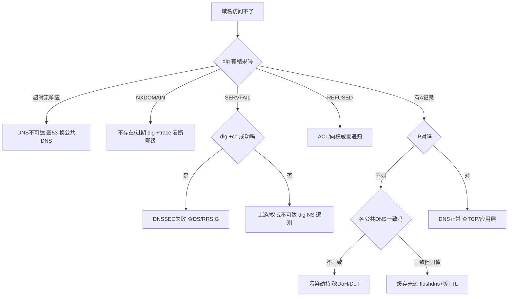

## 🧭 这篇你能学到

- 用 Wireshark 过滤和 tcpdump 抓包，看清 DNS 请求响应的每个字段，并识别污染抢答。
- 用 `dig` / `nslookup` / `ipconfig` / `resolvectl` 实操查询、对比解析器、绕过缓存直问权威。
- 面对 SERVFAIL、NXDOMAIN、改记录不生效、解析慢、污染劫持等故障，按图索骥快速定位。

## 1. 抓包观察

### 1.1 Wireshark 过滤式

下面这张速查表列出最常用的 Wireshark 显示过滤器，照着抄即可：

| 目的 | 过滤式 |
|------|--------|
| 所有 DNS / 仅查询/响应 | `dns` / `dns.flags.response==0` / `==1` |
| 只看某域名 / 类型 | `dns.qry.name=="www.example.com"` / `dns.qry.type==1`(A) `==28`(AAAA) `==15`(MX) `==16`(TXT) |
| 失败 / NXDOMAIN / SERVFAIL | `dns.flags.rcode!=0` / `==3` / `==2` |
| 截断转 TCP / 权威应答 | `dns.flags.truncated==1` / `authoritative==1` |
| TCP DNS（含 AXFR）/ 慢查询 | `tcp.port==53` / `dns.time>1` |
| 加密 DNS | `tcp.port==853`(DoT) / `tcp.port==443 && http2`(DoH) |

### 1.2 关键字段与污染识别

| 字段 | 说明 |
|------|------|
| `dns.id` | 事务 ID，请求响应须一致；**同一 ID 出现两个不同响应 = 疑似污染** |
| `dns.flags.recdesired/recavail/authoritative/truncated` | RD/RA/AA/TC 标志 |
| `dns.qry.name` / `dns.qry.type` | 查询域名与类型 |
| `dns.a`/`dns.aaaa`/`dns.cname`/`dns.mx.mail_exchange` | 各类型 RDATA |
| `dns.resp.ttl` | 剩余 TTL 非整数初值说明来自缓存 |
| `dns.time` | 查询-响应耗时，定位慢解析 |

**污染识别**：过滤响应，若同一 `dns.id` 短时间内收到**两个来源/内容不同的响应**且第一个异常快（RTT 短于真实距离），基本是伪造抢答。

### 1.3 命令行抓包

这两行 tcpdump 命令能干什么：把 53 端口的 DNS 流量抓下来存成 pcap 文件，或实时打印出来，拿去 Wireshark 分析"名字是怎么被翻译成地址的"。

```bash
sudo tcpdump -i any -nn 'port 53' -w dns.pcap
sudo tcpdump -i any -nn -s0 'udp port 53'                 # 实时看
```

## 2. 常用命令 / 配置

下面这组 dig 命令能干什么：它是 DNS 排错的第一利器——查各种记录类型、做反向解析、对比不同公共解析器判断是否被劫持、看根→权威完整下钻、绕过缓存直问权威验证生效、强制 TCP、测 EDNS 载荷、看 DNSSEC 校验、甚至测区域传送。

```bash
# dig（排查首选）
dig www.example.com +short               # 仅结果
dig AAAA / MX / NS / TXT example.com +short
dig SOA example.com                       # 看 Serial
dig -x 93.184.216.34                     # 反向 PTR
dig @8.8.8.8 / @223.5.5.5 域名 +short    # 对比不同解析器判断劫持
dig +trace 域名                          # 看根→TLD→权威完整下钻
dig @ns1.example.com 域名 +norecurse     # 绕过缓存直问权威，验是否生效
dig +tcp 域名                            # 强制 TCP 验 53 是否放行
dig +bufsize=1232 域名                   # EDNS UDP 载荷
dig +dnssec 域名                         # 看 RRSIG/AD
dig +cd 域名                             # 禁用 DNSSEC 校验，定位 SERVFAIL 成因
dig AXFR example.com @ns1.example.com    # 区域传送测试（应被拒，否则隐患）
```

`dig` 头部关键：`flags: qr rd ra`（aa 权威、tc 截断）；`ANSWER SECTION` 中 A 记录前的数字是剩余 TTL（缓存为残值）；`Query time` 为耗时。

下面这组 nslookup 命令能干什么：Windows 自带，临时查某域名/某类型记录，或用 `-vc` 强制走 TCP 验证 53 端口。

```bash
# nslookup（Windows 自带）
nslookup 域名 8.8.8.8
nslookup -type=MX example.com
nslookup -vc 域名                        # 强制 TCP
```

这段 Windows 本机命令能干什么：查/清本机 DNS 缓存、用 PowerShell 查询指定类型、改网卡的首选 DNS 服务器；hosts 文件位置也一并列出。

```powershell
# Windows 本机
ipconfig /displaydns ; ipconfig /flushdns       # 查/清本机缓存
Resolve-DnsName example.com -Type MX
Set-DnsClientServerAddress -InterfaceAlias "以太网" -ServerAddresses 223.5.5.5,8.8.8.8
```
hosts 文件：`C:\Windows\System32\drivers\etc\hosts`（Linux/macOS `/etc/hosts`）。

这段 Linux 命令能干什么：看 systemd-resolved 状态、查本机 resolv 配置、清 BIND 缓存，用于确认"本机到底听谁的"。

```bash
# Linux
resolvectl status / query 域名 / flush-caches   # systemd-resolved
cat /etc/resolv.conf ; grep hosts /etc/nsswitch.conf
sudo rndc flush                                  # BIND
```

下面这行命令能干什么：分别用 DoH（走 HTTPS 接口）和 DoT（走 TLS）验证加密 DNS 是否正常，判断是不是传统 53 端口被运营商动了手脚。

**加密 DNS 测试**：`curl -sH 'accept: application/dns-json' 'https://1.1.1.1/dns-query?name=域名&type=A'`（DoH）；`kdig +tls @1.1.1.1 域名`（DoT）。

## 3. 常见故障与排错

下表每条"现象"下先用一句话给出结论，再看原因与排查。

| 现象 | 可能原因 | 排查 |
|------|---------|------|
| **SERVFAIL**：先记住结论——多半不是你域名写错，而是上游不可达、权威宕机或 DNSSEC 校验失败这一环断了。 | 上游不可达；**DNSSEC 失败**；权威宕机 | `dig @8.8.8.8` 与 `@223.5.5.5` 对比；`dig +cd 域名` 成功则问题在 DNSSEC；`dig NS` 测权威 |
| **NXDOMAIN**：先记住结论——名字在权威侧根本查无此域，或父区没把 NS 授权配好。 | 域名不存在/过期；父区未配 NS | 查拼写；`dig +trace` 看断哪级 |
| **REFUSED**：先记住结论——不是你查不到，而是你向一台"不提供递归"的权威发了递归请求，或它的 ACL 把你挡了。 | 向权威发递归；ACL 限制 | 换公共递归；检查 `allow-query`/`allow-recursion` |
| NOERROR 但 **ANSWER=0**：先记住结论——域名是存在的，只是没有你要的那类记录（如只有 A 没有 AAAA），属正常现象别慌。 | 域名存在但无该类型记录 | 换 A/AAAA 分别测，属正常 |
| **改了解析不生效**：先记住结论——几乎都是旧记录的 TTL 还没到期，缓存还在"保鲜期"里。 | 各级缓存旧 TTL 未过；本地/浏览器缓存 | `flushdns`；`dig @权威 +norecurse` 确认已更新；变更前应降 TTL |
| 部分用户能部分不能：先记住结论——要么多台权威数据没同步一致，要么不同位置缓存的旧值还没过。 | 多权威数据不一致；缓存旧值 | `dig @ns1/@ns2` 逐个对比；`@不同公共DNS` 对比 |
| **解析很慢**：先记住结论——通常是首选 DNS 不可达在超时等待、或 AAAA 查询超时回退拖慢。 | 首选 DNS 不可达超时切备用；AAAA 超时 | `dig \| grep "Query time"`；换近端可达 DNS |
| 解析到错误 IP（污染/劫持）：先记住结论——中间有人抢在你真实应答前伪造回了包，或运营商代理了 53。 | 中间伪造抢答；运营商代理 53 | 对比多公共 DNS；抓包看同 `id` 多响应；改用 DoT/DoH |
| 输错域名跳广告页：先记住结论——这是 NXDOMAIN 劫持，把"不存在"篡改成了"跳广告"。 | NXDOMAIN 劫持 | `dig @8.8.8.8 不存在域名` 应 NXDOMAIN，返回 A 即被劫 |
| 大响应失败/超时：先记住结论——多半是防火墙丢了大 UDP 包，或中间设备不支持 EDNS。 | 防火墙丢大 UDP 包/不支持 EDNS | `dig +bufsize=1232`；`dig +tcp` 成功说明 UDP 大包被丢 |
| `dig +tcp` 失败但 UDP 正常：先记住结论——防火墙只放行了 UDP 53，把 TCP 53 挡了（DNSSEC 与大响应必须用 TCP）。 | 防火墙只放 UDP 53 | 放行 TCP 53（DNSSEC 与大响应必须） |
| 邮件退信找不到主机：先记住结论——MX 记录缺失或指向了不存在的主机，邮件无的放矢。 | MX 缺失或指向不存在主机 | `dig MX` 再对目标 `dig A` |
| 证书签发失败(ACME)：先记住结论——`_acme-challenge` 的 TXT 记录还没生效，ACME 验证取不到。 | `_acme-challenge` TXT 未生效 | `dig TXT _acme-challenge.域名 @权威` |
| 证书报错但解析正常：先记住结论——不是解析问题，是 CAA 记录限制了能签发的 CA。 | CAA 限制 CA | `dig CAA 域名` |



## 4. 与其他协议对比

### 4.1 UDP 与 TCP 使用场景

| 场景 | 传输 | 原因 |
|------|------|------|
| 常规查询 | UDP 53 | 一问一答、报文小、无建连延迟低 |
| 截断 TC=1 | TCP 53 | UDP 放不下需可靠分段 |
| 区域传送 AXFR/IXFR | TCP 53 | 数据量大要完整可靠 |
| DoT / DoH | TCP 853 / 443 | TLS/HTTPS |

### 4.2 DNS 与相关协议

| 协议 | 关系 |
|------|------|
| **DHCP** | Option 6 下发 DNS、Option 15 域名后缀 |
| **SMTP** | 依赖 MX 选投递目标，依赖 TXT 做 SPF/DKIM/DMARC |
| **HTTP/HTTPS** | 建连前先解析；SNI 与证书绑定域名 |
| **ICMP** | `ping`/`traceroute` 显示主机名触发 PTR（`-n` 关闭） |
| **mDNS**（RFC 6762） | 局域网零配置，UDP 5353，后缀 `.local` |
| **LLMNR** | 微软链路本地解析，UDP 5355，存安全隐患常被关 |

### 4.3 加密 DNS 方案对比

| 方案 | 端口/承载 | 优点 | 缺点 |
|------|----------|------|------|
| **DoT** | TCP 853+TLS | 端口独立、易审计管控 | 独立端口易被封锁 |
| **DoH** | TCP 443+HTTPS | 混网页流量抗封锁 | 绕过企业策略难管控 |
| **DoQ** | UDP 853+QUIC | 0-RTT、无队头阻塞低延迟 | 生态仍铺开中 |
| **DNSSEC** | 53 | 答案未被篡改可验证 | **不加密**，查询可见 |

## 5. 常见面试题

**Q1 输入域名后 DNS 怎么解析？** 浏览器缓存→OS缓存/hosts→递归服务器（RD=1）→递归查自身缓存未命中则迭代根/TLD/权威→权威返 A（AA=1）→递归按 TTL 缓存并返回→客户端拿 IP 握手。

**Q2 递归与迭代区别？** 递归"帮我查到底给最终结果"（客户端→递归，RD=1）；迭代"告诉我下一步问谁"（递归→各级权威，RD=0，返引荐）。客户端偷懒，递归干活。

**Q3 为何用 UDP？何时 TCP？** 小报文一问一答，UDP 无握手开销低延迟、丢包应用层重发。TCP 用于：TC=1 截断重查、AXFR/IXFR、DoT。

**Q4 改了记录为何不生效？** 旧记录各级缓存 TTL 未过。排查：`dig @权威 +norecurse` 确认已更新→`flushdns`→等 TTL。最佳实践变更前 24–48h 先降 TTL 至 300s。

**Q5 NXDOMAIN vs NOERROR+0 记录？** 前者域名根本不存在；后者域名存在但无该类型记录（如只有 A 无 AAAA）。负缓存策略不同，前者取 SOA Minimum。

**Q6 根域为何不能 CNAME？** RFC 1034：有 CNAME 的名字不能再有其它记录，而根域必须有 SOA/NS。可用厂商 ALIAS/ANAME/CNAME Flattening 由权威展开为 A。

**Q7 CNAME 的代价？** 多一轮解析（对目标名再查 A，多一次 RTT），链过长显著增延迟甚至触发循环保护失败。

**Q8 缓存投毒与防范？** UDP 易伪造，抢在真实响应前返回（猜中 ID+源端口）毒化缓存。防范：源端口/事务 ID 随机化 + 0x20 编码；根本靠 DNSSEC 签名验真。

**Q9 DNSSEC 与 DoH/DoT 互补？** DNSSEC 签名保**真实完整**不防窥探；DoT/DoH 加密保**机密性**不验数据真伪。理想是加密传输+DNSSEC 验签同启。

**Q10 MX 优先级含义？** 数字越小越优先，先试最小，失败依次更大；相同数字间负载均衡。MX 值须主机名，不能写 IP 或指向 CNAME。

**Q11 `dig +trace` 做什么？为何 `ping` 比 `dig` 慢？** `+trace` 从根模拟递归逐级迭代并打印每步引荐，定位断点最直接。`ping` 慢常因双栈 AAAA 超时回退 A，或做 PTR 反解而反向区不可达（`-n` 关闭验证）。
