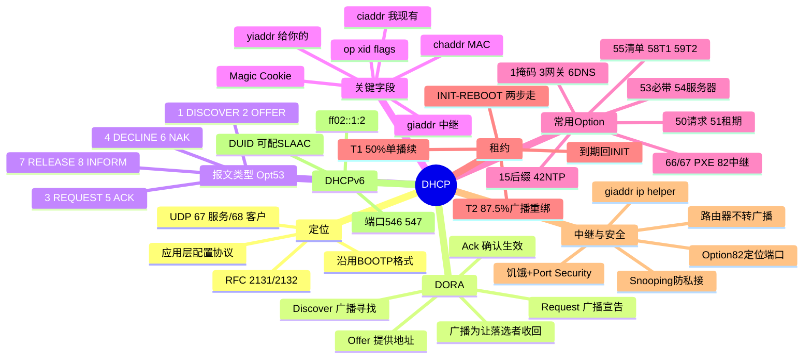

## 先建立直觉

想象你第一次进一家酒店，手里没有任何房卡。你只能在大堂喊一嗓子："还有空房吗？"——这就是 DHCP 的"广播"。前台（DHCP 服务器）听到后，查了查空房，回喊："有，给你 1001 房，早餐在 2 楼，门禁卡有效期一天。"你再喊一声"我就要 1001"，前台确认"好，生效了"，你才正式入住。

整个过程的关键有三点：第一，你**一开始什么地址都没有**，所以只能喊（广播）；第二，房卡（IP）是**借的、有期限**的，到点要续；第三，前台记着一本"谁住哪间、到几号"的账（租约库），这是后来查冲突的凭据。

一句话：DHCP 让一台"啥配置都没有"的新设备，靠几句广播对话就自动拿到上网所需的全套参数。

## 它解决什么问题

手工为每台设备配置 IP、掩码、网关、DNS，在规模稍大的网络里立刻崩溃：容易输错、容易地址冲突、设备移动就要重配、地址回收全靠人记。DHCP 解决了四件事：

1. **自动分配地址**：从地址池中挑一个未被占用的地址下发，避免人工冲突。
2. **一次下发全套参数**：不只是 IP，还包括子网掩码、默认网关、DNS 服务器、域名后缀、NTP 服务器、TFTP/PXE 引导文件等（都通过 Option 携带）。
3. **租约回收复用**：地址是"租"的不是"送"的，设备离线后租约到期即可回收给别人，地址利用率大幅提升。
4. **跨网段服务**：DHCP 报文本是广播不能跨路由，中继代理（Relay Agent）把它单播转发给中心服务器，从而实现全网集中管理。

## 工作流程（简化版）

把"新设备拿到 IP"这件事，用普通人能听懂的话拆开（这就是著名的 DORA 四步）：

1. **Discover（发现）**：设备刚接入，自己还没 IP，于是在局域网里广播喊"有没有 DHCP 服务器？给我个地址"。
2. **Offer（提供）**：服务器从地址池挑一个空闲地址，连子网掩码、网关、DNS、租期一起广播回"这个地址给你"。可能有多台服务器同时 Offer。
3. **Request（请求）**：客户端挑定一台服务器（和其中一个地址），再广播宣布"我要这台给的地址"——广播是为了让落选的服务器知道"地址收回去，别占着"。
4. **Ack（确认）**：被选中的服务器最终确认"地址与参数生效，计时开始"，客户端检测无冲突后正式配置上网。

> 补充：之后地址快到期时，客户端会在 **T1（租期过半）** 单播续租，失败则在 **T2（租期 87.5%）** 广播重绑定；到期仍失败就释放地址重来。

## 报文 / 头部长什么样

DHCP 报文复用 BOOTP 格式。下面逐段拆解，字段名保留英文缩写并附中文全称。

### 为什么要先广播

下面先讲清一个反直觉的点：为什么一开始非得"喊"而不能直接连服务器。

客户端刚接入时**没有 IP、不知网关、不知服务器**，只能在二层广播域喊话：源 IP `0.0.0.0`、目的 IP `255.255.255.255`、目的 MAC `FF:FF:FF:FF:FF:FF`、源端口 68 → 目的端口 67。服务器若客户端仍无可用地址（`ciaddr=0`）且置 **BROADCAST 标志**（广播标志），也以广播回应。客户端靠 **`xid` 事务 ID**（Transaction ID）与 **`chaddr` MAC**（Client Hardware Address，客户端硬件地址）认领自己的应答。

### DORA 四步速查表

下面是四步报文的方向与关键动作对照：

| 步骤 | 报文 | 方向 | 关键动作 |
|------|------|------|---------|
| **D** | `DHCPDISCOVER`（发现） | 客户端→广播 | "有没有服务器？给个地址" |
| **O** | `DHCPOFFER`（提供） | 服务器→客户端 | "有 `192.168.1.100`，租期 86400，附网关/DNS" |
| **R** | `DHCPREQUEST`（请求） | 客户端→**广播** | "选 `192.168.1.100`，来自服务器 A"（广播让落选服务器收回预留） |
| **A** | `DHCPACK`（确认） | 服务器→客户端 | "确认，地址与参数生效，租约计时" |

**Request 为何广播**：多服务器可能同时 Offer，客户端用 **Option 54（Server Identifier，服务器标识）** 声明选中哪台并以广播发出，让未选中的服务器立即释放预留地址。**为何要 Offer 和 Ack 两次**：Offer 到 Request 间该地址可能已被分走，Ack 才做最终确认，确认不了回 `DHCPNAK`（否定确认）。

### 八种报文类型（Option 53）

这张表列出 DHCP 全部报文类型，类型本身由 Option 53（DHCP Message Type，DHCP 消息类型）携带：

`1 DISCOVER`（发现）/`2 OFFER`（提供）/`3 REQUEST`（请求/续租/重绑定/重启确认，一类型四语义）/`4 DECLINE`（冲突拒绝，ARP 探测冲突后拒绝）/`5 ACK`（确认）/`6 NAK`（否定确认：地址不属本网段、租约失效、换网段）/`7 RELEASE`（主动交还，**单播**）/`8 INFORM`（已有静态 IP 只索参数）。

### 报文头部字段（沿用 BOOTP 格式）

下表是固定 236 字节头部 + 可变 Options 的关键字段。注意头部里有一个 **Magic Cookie（魔数，`0x63825363`=99.130.83.99）**，它的作用是标志"后面开始是 DHCP Options"。

| 字段 | 长度 | 含义 |
|------|------|------|
| **op**（Operation，操作码） | 1 | 1=BOOTREQUEST（客户端→服务器），2=BOOTREPLY（服务器→客户端） |
| **htype/hlen**（Hardware Type/Length，硬件类型/长度） | 1/1 | 硬件类型（1=以太网），地址长（6） |
| **hops**（跳数） | 1 | 中继跳数，每经中继+1（防环，限 4 跳） |
| **xid**（Transaction ID，事务 ID） | 4 | 事务 ID，一次 DORA 全程一致，匹配请求应答 |
| **secs**（秒数） | 2 | 客户端开始获取后经过秒数 |
| **flags**（标志） | 2 | 最高位 **BROADCAST 标志**：1=要求广播回应 |
| **ciaddr**（Client IP Address，客户端现有地址） | 4 | 客户端**当前已有**地址（续租填；初次为 0） |
| **yiaddr**（Your IP Address，分配给你的地址） | 4 | **"Your" IP**，服务器分配给客户端的地址（Offer/Ack 核心） |
| **siaddr**（Server IP Address，下一步服务器地址） | 4 | 下一步引导服务器（PXE 的 TFTP） |
| **giaddr**（Relay Agent IP Address，中继代理地址） | 4 | **中继代理**接口地址；服务器据此判断网段与地址池；无中继为 0 |
| **chaddr**（Client Hardware Address，客户端硬件地址） | 16 | 客户端 MAC（前 6 字节有效），用于绑定固定地址 |
| **file**（引导文件） | 128 | 引导文件名（PXE 的 `pxelinux.0`） |
| **Magic Cookie**（魔数） | 4 | `0x63825363`，标志 Options 段开始 |

> **ciaddr / yiaddr / giaddr 易混**：ciaddr=我现在有的；yiaddr=服务器给你的；giaddr=中继代理地址。

### 常用 Option（RFC 2132）

下面这张表是实战最常用的一批选项（Option），编号即其在报文中的标识：

| Option | 名称 | 说明 |
|--------|------|------|
| 1 | Subnet Mask（子网掩码） | 子网掩码 |
| 3 | Router（路由器/网关） | 默认网关 |
| 6 | DNS Servers（DNS 服务器） | DNS 列表 |
| 12 | Host Name（主机名） | 主机名 |
| 15 | Domain Name（域名） | 域名后缀（搜索域） |
| 42 | NTP Servers（时间服务器） | 时间服务器 |
| 50 | Requested IP（请求地址） | 客户端请求指定地址（Discover/Request 携带） |
| 51 | Lease Time（租期） | 租期（秒） |
| 52 | Option Overload（选项过载） | 复用 sname/file 存更多选项 |
| 53 | **DHCP Message Type（DHCP 消息类型）** | 报文类型 1–8，每个 DHCP 必带 |
| 54 | Server Identifier（服务器标识） | 服务器标识，Request 中声明选中哪台 |
| 55 | Parameter Request List（参数请求列表） | 客户端索取参数清单（"我要 1,3,6,15,51"） |
| 56 | Message（消息） | 文本消息（NAK 原因） |
| 58/59 | Renewal T1 / Rebinding T2（续租/重绑定计时器） | 续租/重绑定计时器（默认 0.5/0.875 × 租期） |
| 60 | Vendor Class（厂商标识） | 厂商标识（`PXEClient`/`MSFT 5.0`） |
| 61 | Client Identifier（客户端标识） | 客户端唯一标识（通常 `01+MAC`） |
| 66/67 | TFTP Server/Bootfile（TFTP 服务器/引导文件） | PXE 引导 |
| 82 | **Relay Agent Information（中继代理信息）** | 中继信息（RFC 3046），含 Circuit ID 与 Remote ID |
| 119 | Domain Search（域搜索） | DNS 搜索域 |
| 255 | End（结束） | 选项结束 `0xFF` |

## 交互时序

一句话看懂这张图：它完整画了"两台服务器抢答时客户端如何选一弃一，以及拿到地址后怎么做冲突检测和续租"——注意多服务器场景下，落选服务器看到 Request 里的 Opt54 不是自己，会悄悄把预留的地址收回。

```mermaid
sequenceDiagram
    autonumber
    participant C as 客户端(无IP)
    participant R as 中继(可选)
    participant S1 as 服务器A
    participant S2 as 服务器B
    C->>R: DHCPDISCOVER (Opt53=1) src 0.0.0.0:68→255.255.255.255:67 xid opt55
    R->>S1: 单播, 填 giaddr=网关, hops+1
    R->>S2: 单播转发
    S1-->>R: DHCPOFFER yiaddr=192.168.1.100 + 掩码/网关/DNS/租期/Opt54
    S2-->>R: DHCPOFFER yiaddr=192.168.1.200
    R-->>C: 转发 Offer
    C->>R: DHCPREQUEST 仍广播 Opt50 请求.100 Opt54=服务器A
    R->>S1: 转发
    R->>S2: 转发
    Note right of S2: 看到 Opt54 非自己, 收回 .200
    S1-->>R: DHCPACK yiaddr=.100 + 全部参数
    R-->>C: 转发 ACK
    C->>C: ARP Probe 检测冲突
    Note over C: 无冲突则配 IP, 启 T1/T2, 进 BOUND
    Note over C,S1: T1=50% 单播续租; T2=87.5% 广播重绑定; 到期失败回 INIT
```

## 关键机制 / 变体

下面每条机制先点明它是干什么用的，再展开。

- **租约状态机（描述客户端从"没地址"到"用地址"再到"续/弃"的全过程）**：`INIT`(首接/放弃)→`SELECTING`(收 Offer)→`REQUESTING`(等 ACK/NAK)→`BOUND`(用，启 T1/T2)；`RENEWING`(T1 50% 单播续租)、`REBINDING`(T2 87.5% 广播重绑定)、`INIT-REBOOT`(重启记得旧地址→`REQUEST→ACK` 两步，故抓包常只见两包)。
- **租期（决定地址"借多久"）**：公共 Wi-Fi 30 分~2 时；办公有线 8 时~1 天；服务器/打印机用**静态保留**。过短报文频繁、服务器压力大；过长回收慢、池易竭。
- **中继代理（解决"广播跨不了路由"的问题）**：路由器不转发广播，跨网段须中继（网关/三层交换机）收广播 Discover，填 `giaddr`、hops+1，单播转发中心服务器；服务器按 `giaddr` 选对应地址池。配置：Cisco `ip helper-address 10.0.0.10`；华为 `dhcp select relay`+`dhcp relay server-ip 10.0.0.10`。
- **Option 82（让服务器"按接入位置分配地址"）**：中继插入 Circuit ID（接入端口/VLAN）与 Remote ID（中继标识），服务器可"按端口分配地址"，运营商/企业用以精确定位接入位置。
- **冲突检测（防止把已占用的地址发出去）**：服务器分配前 ping/ARP 探测；客户端收 ACK 后发 **ARP Probe**（RFC 5227），有应答则发 `DHCPDECLINE` 约 10 秒后重 Discover；随后发**免费 ARP** 宣告占用并刷新交换机 MAC 表。
- **APIPA（DHCP 彻底失败时的自我安慰）**：始终收不到 Offer 时 Windows 自动配 `169.254.x.x/16`（RFC 3927）。**看到 169.254.x.x = DHCP 彻底失败**，仅同广播域通信，无网关无 DNS。
- **安全（防私接与饥饿攻击）**：私接 Rogue DHCP（抢答做中间人）→ 交换机 **DHCP Snooping** 仅信任上联口；饥饿攻击（伪造 MAC 耗尽池）→ Port Security + Snooping 限速；地址欺骗 → IP Source Guard + Snooping 绑定表；明文无认证 → 802.1X 先认证再放行。
- **DHCPv6（IPv6 版本）**（RFC 8415）：端口 **547/546**；组播 `ff02::1:2`；流程 Solicit/Advertise/Request/Reply；标识 **DUID**；可与 **SLAAC**（RA 无状态）并用。

## 常见误区

- **误区一：看到 169.254.x.x 是网卡坏了。** 错。那是 APIPA，恰恰说明 DHCP 全程没要到地址（链路、服务、地址池或中继某一环断了），本机网卡多半没问题。
- **误区二：电脑重启一定走完整四步 DORA。** 错。只要旧地址租约还没过期，重启会走 INIT-REBOOT，直接发 Request→ACK 两包；只有被 NAK、租约失效或换网段才走四步。
- **误区三：ciaddr、yiaddr、giaddr 是一个意思。** 错。ciaddr 是客户端"现在已有的"地址（续租时填），yiaddr 是服务器"准备给你的"地址，giaddr 是中继代理的接口地址——三者用途完全不同，排错时千万别张冠李戴。
- **误区四：DHCP 给的地址是永久的、不会变。** 错。地址是"租"的，到期不续就回收；除非在服务器上做 MAC 保留（Reservation），否则随时可能变。需要固定地址的设备（服务器/打印机）应当用保留而非本地手配静态 IP。

## 速记口诀

- DORA 四步莫记反：发现提供请求确认，Request 广播为让落选者把地址收。
- 无 IP 才靠广播喊，xid 与 MAC 认主；yiaddr 给你、ciaddr 我有、giaddr 是中继口。
- 租期过半 T1 续，八成七五 T2 绑；169.254 是失败，Snooping 挡私接防抢答。

## 知识框架


