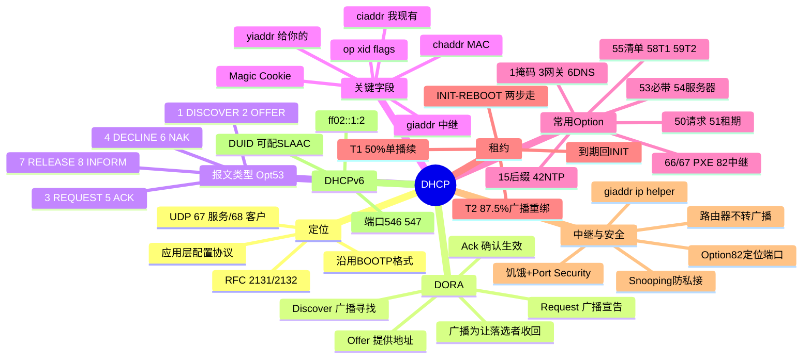

## 1. 工作原理

### 1.1 为什么必须先广播

客户端刚接入时**没有 IP、不知网关、不知服务器**，只能在二层广播域喊话：源 IP `0.0.0.0`、目的 IP `255.255.255.255`、目的 MAC `FF:FF:FF:FF:FF:FF`、源端口 68 → 目的端口 67。服务器若客户端仍无可用地址（`ciaddr=0`）且置 **BROADCAST 标志**，也以广播回应。客户端靠 **`xid` 事务 ID** 与 **`chaddr` MAC** 认领自己的应答。

### 1.2 DORA 四步

| 步骤 | 报文 | 方向 | 关键动作 |
|------|------|------|---------|
| **D** | `DHCPDISCOVER` | 客户端→广播 | "有没有服务器？给个地址" |
| **O** | `DHCPOFFER` | 服务器→客户端 | "有 `192.168.1.100`，租期 86400，附网关/DNS" |
| **R** | `DHCPREQUEST` | 客户端→**广播** | "选 `192.168.1.100`，来自服务器 A"（广播让落选服务器收回预留） |
| **A** | `DHCPACK` | 服务器→客户端 | "确认，地址与参数生效，租约计时" |

**Request 为何广播**：多服务器可能同时 Offer，客户端用 **Option 54（Server Identifier）** 声明选中哪台并以广播发出，让未选中的服务器立即释放预留地址。**为何要 Offer 和 Ack 两次**：Offer 到 Request 间该地址可能已被分走，Ack 才做最终确认，确认不了回 `DHCPNAK`。

### 1.3 八种报文（Option 53）

`1 DISCOVER`/`2 OFFER`/`3 REQUEST`（请求/续租/重绑定/重启确认，一类型四语义）/`4 DECLINE`（ARP 探测冲突后拒绝）/`5 ACK`/`6 NAK`（地址不属本网段、租约失效、换网段）/`7 RELEASE`（主动交还，**单播**）/`8 INFORM`（已有静态 IP 只索参数）。

## 2. 报文 / 头部结构

DHCP 沿用 BOOTP 格式，固定 236 字节 + 可变 Options。关键字段（含 Magic Cookie `0x63825363`=99.130.83.99，标志其后为 DHCP Options）：

| 字段 | 长度 | 含义 |
|------|------|------|
| **op** | 1 | 1=BOOTREQUEST（客→服），2=BOOTREPLY（服→客） |
| **htype/hlen** | 1/1 | 硬件类型（1=以太网），地址长（6） |
| **hops** | 1 | 中继跳数，每经中继+1（防环，限 4 跳） |
| **xid** | 4 | 事务 ID，一次 DORA 全程一致，匹配请求应答 |
| **secs** | 2 | 客户端开始获取后经过秒数 |
| **flags** | 2 | 最高位 **BROADCAST 标志**：1=要求广播回应 |
| **ciaddr** | 4 | 客户端**当前已有**地址（续租填；初次为 0） |
| **yiaddr** | 4 | **"Your" IP**，服务器分配给客户端的地址（Offer/Ack 核心） |
| **siaddr** | 4 | 下一步引导服务器（PXE 的 TFTP） |
| **giaddr** | 4 | **中继代理**接口地址；服务器据此判断网段与地址池；无中继为 0 |
| **chaddr** | 16 | 客户端 MAC（前 6 字节有效），用于绑定固定地址 |
| **file** | 128 | 引导文件名（PXE 的 `pxelinux.0`） |
| **Magic Cookie** | 4 | `0x63825363`，标志 Options 段开始 |

> **ciaddr/yiaddr/giaddr 易混**：ciaddr=我现在有的；yiaddr=服务器给你的；giaddr=中继代理地址。

### 2.2 常用 Option（RFC 2132）

| Option | 名称 | 说明 |
|--------|------|------|
| 1 | Subnet Mask | 子网掩码 |
| 3 | Router | 默认网关 |
| 6 | DNS Servers | DNS 列表 |
| 12 | Host Name | 主机名 |
| 15 | Domain Name | 域名后缀（搜索域） |
| 42 | NTP Servers | 时间服务器 |
| 50 | Requested IP | 客户端请求指定地址（Discover/Request 携带） |
| 51 | Lease Time | 租期（秒） |
| 52 | Option Overload | 复用 sname/file 存更多选项 |
| 53 | **DHCP Message Type** | 报文类型 1–8，每个 DHCP 必带 |
| 54 | Server Identifier | 服务器标识，Request 中声明选中哪台 |
| 55 | Parameter Request List | 客户端索取参数清单（"我要 1,3,6,15,51"） |
| 56 | Message | 文本消息（NAK 原因） |
| 58/59 | Renewal T1 / Rebinding T2 | 续租/重绑定计时器（默认 0.5/0.875 × 租期） |
| 60 | Vendor Class | 厂商标识（`PXEClient`/`MSFT 5.0`） |
| 61 | Client Identifier | 客户端唯一标识（通常 `01+MAC`） |
| 66/67 | TFTP Server/Bootfile | PXE 引导 |
| 82 | **Relay Agent Information** | 中继信息（RFC 3046），含 Circuit ID 与 Remote ID |
| 119 | Domain Search | DNS 搜索域 |
| 255 | End | 选项结束 `0xFF` |

## 3. 交互流程

```mermaid
sequenceDiagram
    autonumber
    participant C as 客户端(无IP)
    participant R as 中继(可选)
    participant S1 as 服务器A
    participant S2 as 服务器B
    C->>R: DHCPDISCOVER (Opt53=1) src 0.0.0.0:68→255.255.255.255:67 xid opt55
    R->>S1: 单播, 填 giaddr=网关, hops+1
    R->>S2: 单播转发
    S1-->>R: DHCPOFFER yiaddr=192.168.1.100 + 掩码/网关/DNS/租期/Opt54
    S2-->>R: DHCPOFFER yiaddr=192.168.1.200
    R-->>C: 转发 Offer
    C->>R: DHCPREQUEST 仍广播 Opt50 请求.100 Opt54=服务器A
    R->>S1: 转发
    R->>S2: 转发
    Note right of S2: 看到 Opt54 非自己, 收回 .200
    S1-->>R: DHCPACK yiaddr=.100 + 全部参数
    R-->>C: 转发 ACK
    C->>C: ARP Probe 检测冲突
    Note over C: 无冲突则配 IP, 启 T1/T2, 进 BOUND
    Note over C,S1: T1=50% 单播续租; T2=87.5% 广播重绑定; 到期失败回 INIT
```

## 4. 关键机制

- **租约状态机**：`INIT`(首接/放弃)→`SELECTING`(收 Offer)→`REQUESTING`(等 ACK/NAK)→`BOUND`(用，启 T1/T2)；`RENEWING`(T1 50% 单播续租)、`REBINDING`(T2 87.5% 广播重绑定)、`INIT-REBOOT`(重启记得旧地址→`REQUEST→ACK` 两步，故抓包常只见两包)。
- **租期**：公共 Wi-Fi 30 分~2 时；办公有线 8 时~1 天；服务器/打印机用**静态保留**。过短报文频繁、服务器压力大；过长回收慢、池易竭。
- **中继代理**：路由器不转发广播，跨网段须中继（网关/三层交换机）收广播 Discover，填 `giaddr`、hops+1，单播转发中心服务器；服务器按 `giaddr` 选对应地址池。配置：Cisco `ip helper-address 10.0.0.10`；华为 `dhcp select relay`+`dhcp relay server-ip 10.0.0.10`。
- **Option 82**：中继插入 Circuit ID（接入端口/VLAN）与 Remote ID（中继标识），服务器可"按端口分配地址"，运营商/企业用以精确定位接入位置。
- **冲突检测**：服务器分配前 ping/ARP 探测；客户端收 ACK 后发 **ARP Probe**（RFC 5227），有应答则发 `DHCPDECLINE` 约 10 秒后重 Discover；随后发**免费 ARP** 宣告占用并刷新交换机 MAC 表。
- **APIPA**：始终收不到 Offer 时 Windows 自动配 `169.254.x.x/16`（RFC 3927）。**看到 169.254.x.x = DHCP 彻底失败**，仅同广播域通信，无网关无 DNS。
- **安全**：私接 Rogue DHCP（抢答做中间人）→ 交换机 **DHCP Snooping** 仅信任上联口；饥饿攻击（伪造 MAC 耗尽池）→ Port Security + Snooping 限速；地址欺骗 → IP Source Guard + Snooping 绑定表；明文无认证 → 802.1X 先认证再放行。
- **DHCPv6**（RFC 8415）：端口 **547/546**；组播 `ff02::1:2`；流程 Solicit/Advertise/Request/Reply；标识 **DUID**；可与 **SLAAC**（RA 无状态）并用。

## 5. 知识框架


