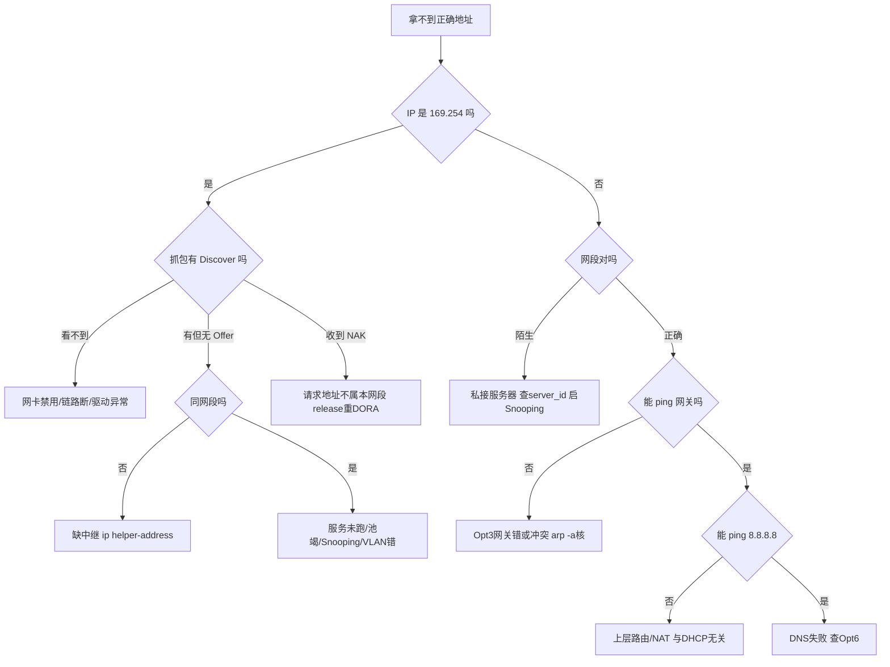

## 这篇你能学到

- 用 Wireshark 过滤和 tcpdump 抓出完整 DORA 四步，学会从 xid/yiaddr/server_id 读懂每次交互。
- 用 `ipconfig` / `dhclient` / `nmcli` 实操释放、续租、查租约，并在服务器/交换机上做基础配置。
- 面对 169.254、拿不到地址、IP 冲突、私接服务器等故障，按图索骥快速定位根因。

## 1. 抓包观察

### 1.1 Wireshark 过滤式

下面这张速查表列出最常用的 Wireshark 显示过滤器，照着抄即可：

| 目的 | 过滤式 |
|------|--------|
| 所有 DHCP / 按端口 | `dhcp`（旧版 `bootp`）/ `udp.port==67 || udp.port==68` |
| 按类型 | `dhcp.option.dhcp==1`(Discover) `==2`(Offer) `==3`(Request) `==4`(Decline) `==5`(ACK) `==6`(NAK) `==7`(Release) |
| 跟踪某主机 / 一次 DORA | `dhcp.hw.mac_addr==aa:bb:cc:dd:ee:ff` / `dhcp.id==0x3d1e5a7c` |
| 分配地址 / 经中继 | `dhcp.ip.your==192.168.1.100` / `dhcp.ip.relay != 0.0.0.0` |
| **查私接服务器** | `dhcp.option.dhcp_server_id` |
| Option 82 | `dhcp.option.agent_information_option` |

**查私接 DHCP** 标准手法：过滤 `dhcp.option.dhcp==2`(Offer)，看 `dhcp.option.dhcp_server_id` 与源 IP/MAC，出现非授权标识即 Rogue DHCP，按 MAC 到交换机定位端口。

### 1.2 关键字段

| 字段 | 说明 |
|------|------|
| `dhcp.id` | xid，同次 DORA 四包相同——串联流程关键 |
| `dhcp.flags.bc` | 广播标志位 |
| `dhcp.ip.client`(ciaddr)/`dhcp.ip.your`(yiaddr)/`dhcp.ip.relay`(giaddr) | 我现有/给你的/中继 |
| `dhcp.hw.mac_addr`(chaddr) | 客户端 MAC |
| `dhcp.option.dhcp`(53)/`dhcp_server_id`(54)/`requested_ip_address`(50)/`ip_address_lease_time`(51) | 类型/服务器/请求地址/租期 |
| `dhcp.option.subnet_mask`/`router`/`domain_name_server` | Option 1/3/6 |

### 1.3 复现 DORA 与抓包

这几条命令能干什么：在 Windows 上先开 Wireshark 过滤 `dhcp`，再用 `release`/`renew` 强制走一次完整交互；Linux 上用 `dhclient` 释放再重新申请，并用 `tcpdump` 实时看 67/68 端口流量。

```powershell
# Windows：Wireshark 先过滤 dhcp 抓包，再
ipconfig /release ; ipconfig /renew
```
```bash
# Linux
sudo dhclient -r eth0 && sudo dhclient -v eth0
sudo tcpdump -i any -nn -v 'port 67 or port 68'
```
> `release` 发 DHCPRELEASE（单播）；`renew` 若记得旧地址可能只走 INIT-REBOOT 两步。看完整四步须先 release 再断重连或清租约。

## 2. 常用命令 / 配置

这段 Windows 客户端命令能干什么：批量查看本机是否走 DHCP、服务器是谁、租约起止时间，以及把"静态 IP"改回"自动获取"。

```powershell
# Windows 客户端
ipconfig /all # 确认 DHCP启用/服务器/租约起止/网关/DNS
ipconfig /release # 发 RELEASE
ipconfig /renew
Get-CimInstance Win32_NetworkAdapterConfiguration -Filter "IPEnabled=True" |
  Select Description, DHCPEnabled, DHCPServer, DHCPLeaseObtained, DHCPLeaseExpires
Set-NetIPInterface -InterfaceAlias "以太网" -Dhcp Enabled # 静态改回自动
```

这段 Linux 客户端命令能干什么：查看接口地址/路由/DNS 解析状态，释放或重新申请租约，并翻出本地租约文件与 NetworkManager 拿到的 DHCP 信息。

```bash
# Linux 客户端
ip addr ; ip route ; resolvectl status
sudo dhclient -v eth0 ; sudo dhclient -r eth0
cat /var/lib/dhcp/dhclient.leases
nmcli device show eth0 | grep -iE 'IP4|DHCP'
```

下面这份服务端配置（ISC DHCP / dnsmasq 风格）能干什么：定义地址池范围、网关、掩码、DNS、域名后缀，并把某台打印机的 MAC 绑成固定地址（保留）。

**服务端（ISC DHCP / dnsmasq）**：
```
default-lease-time 43200; max-lease-time 86400; authoritative;
subnet 192.168.1.0 netmask 255.255.255.0 {
  range 192.168.1.100 192.168.1.200;
  option routers 192.168.1.1; # Opt3
  option subnet-mask 255.255.255.0; # Opt1
  option domain-name-servers 223.5.5.5,8.8.8.8; # Opt6
  option domain-name "corp.example.com"; # Opt15
}
host printer-01 { hardware ethernet aa:bb:cc:dd:ee:ff; fixed-address 192.168.1.50; } # MAC 保留
```
`dhcpd -t -cf /etc/dhcp/dhcpd.conf`（语法校验）；`cat /var/lib/dhcp/dhcpd.leases`（租约库）；`cat /var/lib/misc/dnsmasq.leases`。

这段 Windows Server 命令能干什么：查看作用域与租约、加地址保留，并确认服务器已在域控授权（防私接）。

**Windows Server**：`Get-DhcpServerv4Scope`/`Get-DhcpServerv4Lease -ScopeId 192.168.1.0`/`Add-DhcpServerv4Reservation`；`Get-DhcpServerInDC`（已授权服务器，防私接）。

这段网络设备配置能干什么：在网关上配 DHCP 中继把跨网段广播转给中心服务器，并开启 DHCP Snooping 只信任上联口、限速用户口，挡掉私接服务器。

**网络设备**：
```
# 中继 Cisco / 华为
interface Vlan10
 ip helper-address 10.0.0.10 # Cisco
 dhcp select relay ; dhcp relay server-ip 10.0.0.10 # 华为
# DHCP Snooping 防私接
ip dhcp snooping ; ip dhcp snooping vlan 10
interface GigabitEthernet0/1 # 上联合法服务器
 ip dhcp snooping trust
interface range Gi0/2-24 # 用户口
 ip dhcp snooping limit rate 10
```

## 3. 常见故障与排错

下表每条"现象"下先用一句话给出结论，再看原因与排查。

| 现象 | 可能原因 | 排查 |
|------|---------|------|
| **169.254.x.x（APIPA）**：先记住结论——DHCP 彻底没要到地址，本机在自我安慰式自配，问题在链路/服务/池/中继，不是网卡坏。 | 完全无 Offer：链路断、服务停、池竭、VLAN 错、跨网段无中继 | 抓包有无 Discover/Offer；查链路；`ping` 网关；查服务状态与池剩余 |
| Discover 无 Offer：先记住结论——广播根本没被服务器收到或回应，多半是跨网段缺中继、池空、服务没监听，或被 Snooping 拦了。 | 跨网段未配中继；池竭；未监听该接口；Snooping 拦截 | 配 `ip helper-address`；查 leases；查 Snooping trust 口 |
| **DHCPNAK**：先记住结论——你请求的地址现在不归这个网段（典型是带旧地址换了 Wi-Fi/网段），必须释放后重来。 | 请求地址不属当前网段（**换 Wi-Fi/网段后常见**）；租约过期；配置变更 | `release` 后 `renew` 强制完整 DORA |
| 有地址**上不了网**：先记住结论——地址拿到了但"套餐"不全，多半是网关(Opt3)或 DNS(Opt6) 没下发对，或网关本身故障。 | Opt3 网关或 Opt6 DNS 错；网关故障 | `ipconfig /all` 核网关 DNS；`ping 网关`→`ping 8.8.8.8`→`nslookup` 三段定位 |
| **IP 冲突**告警：先记住结论——有人手工配了池内静态地址，或两台服务器地址池重叠，客户端 ARP 探测后才发现撞车。 | 有人手工配了池内静态；两服务器池重叠 | 抓 `dhcp.option.dhcp==4`（DECLINE）；`arp -a` 查该 IP 的 MAC；静态地址移出池；启服务器端 ping 探测 |
| 陌生网段地址：先记住结论——网里混进了私接的 DHCP 服务器（常见私接家用路由）在抢答，得按 MAC 抓出来。 | 私接路由器（Rogue DHCP） | 抓 Offer 看 `dhcp_server_id`；交换机 MAC 表定位端口；启 Snooping |
| 地址频繁变：先记住结论——要么租期设太短，要么客户端用了随机 MAC（如手机私有地址），要么有多台服务器抢答。 | 租期过短；手机"私有 Wi-Fi 地址"随机 MAC；多服务器抢答 | 调大租期；关随机 MAC；查重复服务器 |
| 池很快竭：先记住结论——租期长+流动大、遭遇饥饿攻击，或有僵尸租约占着不释放。 | 租期长+流动大；饥饿攻击；僵尸租约 | 缩短租期；查异常 MAC；Port Security+Snooping 限速 |
| 跨网段拿不到：先记住结论——中继没配或指错服务器，或服务器没有匹配 `giaddr` 的地址池。 | 未配中继；`giaddr` 对应池不存在；中继指向错服务器 | 抓包看 `dhcp.ip.relay`；服务器确认有匹配该 giaddr 的 subnet |
| 只两包 Request→ACK：先记住结论——这是 INIT-REBOOT 沿用旧地址，**正常现象**，不是少了步骤。 | INIT-REBOOT 沿用旧地址，**正常** | 想看完整 DORA 须先 release 清租约 |
| PXE 启动失败：先记住结论——引导服务器/文件路径没下发（Opt66/67 或 siaddr/file），或 TFTP 不可达。 | Opt66/67 或 `siaddr`/`file` 未配；TFTP 不可达 | 抓 ACK 看 66/67；`tftp` 手工下载引导文件 |



## 4. 与其他协议对比

### 4.1 DHCP vs 静态 IP

| 维度 | DHCP 动态 | 静态 IP |
|------|----------|---------|
| 配置成本 | 接入即用零配置 | 每台手工，易错 |
| 冲突概率 | 服务器统一管理低 | 人工台账易冲突 |
| 利用率 | 高（租约回收） | 低（长期占用） |
| 稳定性 | 可能变（除非 MAC 保留） | 永久固定 |
| 移动性 | 换网段自动重获 | 须手工改 |
| 依赖性 | 依赖服务器，单点故障 | 无依赖 |
| 适用 | PC/手机/访客 | 服务器/网关/打印机/网设 |

**折中：DHCP 保留（Reservation）**——服务器上把 MAC 绑固定 IP，既集中管理统一下发参数又保证不变，服务器/打印机推荐做法。

### 4.2 DHCPv4 vs DHCPv6 vs SLAAC

| 维度 | DHCPv4 | DHCPv6（8415） | SLAAC（4862） |
|------|--------|---------------|---------------|
| 端口 | 67/68 | 547/546 | 无（ICMPv6 RA） |
| 寻址 | 广播 255.255.255.255 | 组播 ff02::1:2 | 组播 ff02::1 |
| 流程 | D/O/R/A | Solicit/Advertise/Request/Reply | RS→RA 自动生成 |
| 标识 | chaddr(MAC) | DUID | 接口标识符 |
| DNS | Opt6 | Opt23 | RA RDNSS（8106） |

### 4.3 与相邻协议

| 协议 | 关系 |
|------|------|
| **BOOTP** | 前身，格式同；Magic Cookie+Opt53 区分，DHCP 是其超集 |
| **ARP** | 收 ACK 后 ARP Probe 检测冲突，并免费 ARP 宣告占用 |
| **DNS** | Opt6 下发 DNS、Opt15 后缀；DDNS 可自动注册主机记录 |
| **TFTP** | PXE 经 Opt66/67 指明引导服务器与文件，传输由 TFTP 完成 |
| **802.1X** | 常先端口认证再放行 DHCP |

## 5. 常见面试题

**Q1 完整 DORA？** ①Discover（`0.0.0.0:68→255.255.255.255:67`，带 xid+MAC）；②Offer（服务器从池选地址经 yiaddr 连同掩码/网关/DNS/租期提供）；③Request（**仍广播**声明选谁，Opt54 服务器、Opt50 请求地址）；④Ack（最终确认生效，客户端 ARP 检测后配置）。

**Q2 Request 为何广播？** 多服务器可能都 Offer，广播让所有服务器看到客户端选了谁（Opt54），未选中的立即释放预留，避免地址被无谓占用。

**Q3 为何用 UDP 而非 TCP？** 客户端尚**无 IP**，无法 TCP 握手；且须依靠**广播**发现服务器，TCP 不支持广播。UDP 无连接开销小适合发现型交互。

**Q4 ciaddr/yiaddr/giaddr？** ciaddr=客户端当前已有地址（仅续租填，初为0）；yiaddr=服务器分配给你的（Offer/Ack 核心）；giaddr=中继代理接口地址，服务器据此判网段选池。

**Q5 跨网段如何获取？** 路由器不转发广播，须在网关配 **DHCP 中继（ip helper-address）**。中继收广播 Discover 填 giaddr、hops+1，单播转中心服务器；服务器按 giaddr 选对应池，应答经中继回客户端。

**Q6 T1/T2 何时触发做什么？** T1=租期**50%**单播向原服务器续租；T2=**87.5%**若仍失败改广播向任意服务器重绑定；到期仍未成功则放弃地址回 INIT 重 DORA。

**Q7 169.254.x.x 说明什么？** DHCP 彻底失败，客户端启 **APIPA（RFC 3927）** 自配。仅同广播域通信，无网关无 DNS。排查：链路通否、有无 Discover/Offer、跨网段是否配中继、池是否竭。

**Q8 何时回 DHCPNAK？** 请求地址不属当前网段（典型：笔记本带旧地址回家）、租约过期被分他人、配置变更致地址不合法。收 NAK 回 INIT 重走完整 DORA。

**Q9 私接 DHCP 服务器及防范？** 未授权设备（常见私接家用路由）抢答 Offer 指向自己做中间人。发现：抓 Offer 看 `dhcp_server_id` 是否授权，用其 MAC 在交换机定位端口。防范：交换机 **DHCP Snooping** 仅上联口 trust，其余口 Offer/ACK 丢弃。

**Q10 如何避免分配已占用地址？** 双向检测：服务器分配前 ICMP/ARP 探测，有响应则跳过；客户端收 ACK 发 **ARP Probe**，有应答发 **DHCPDECLINE** 约10秒后重 Discover；最后发免费 ARP 宣告占用。

**Q11 重启必走完整 DORA？** 不一定：记得旧地址且租约未过期则进 **INIT-REBOOT**，直接带 Opt50 的 Request 请求沿用，服务器回 ACK——**仅两包**；被 NAK/租约失效/换网段才走四步。

**Q12 保留与静态 IP 区别？** 静态在客户端本地手工配，服务器不知情易冲突；保留在服务器把 MAC 绑固定地址，客户端仍走正常 DORA，地址由服务器统一管理并能下发网关/DNS。**服务器/打印机推荐保留而非本地静态。**
