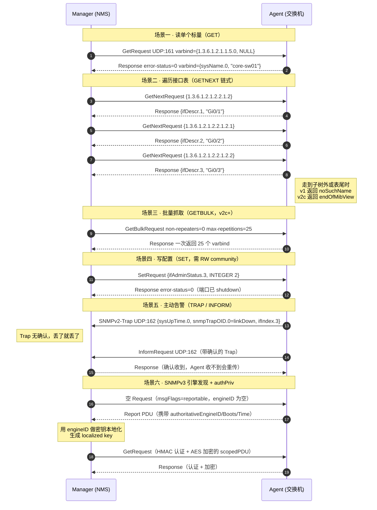
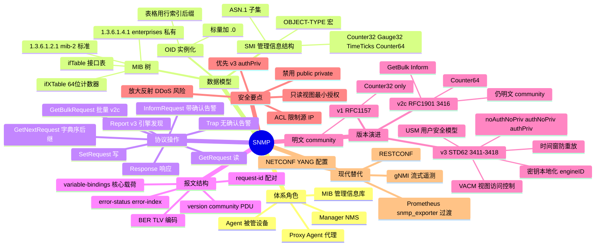

## 先建立直觉

SNMP 干的事情特别朴素：让一台"管理电脑"能隔着网络，问机房里任何一台设备一句话——"你现在的某个数值是多少？"，设备就老老实实答一个数。

你可以把每台设备想成一个装满了小抽屉的柜子，每个抽屉里放着一个随时在变的数字（跑了多少流量、开机多久、温度多高）。SNMP 规定了全世界统一的抽屉编号法，于是管理电脑不用懂这台设备是什么牌子，只要报编号就能拉开抽屉看一眼。

反过来，设备自己出了事（比如某根网线被拔了），也可以主动喊一嗓子通知管理电脑。整个协议，就这两件事。

## 它解决什么问题

没有 SNMP 会怎样？你得给每一台设备单独登录进去，用它自己那套命令行敲命令、再用眼睛读输出。一百台设备就是一百套命令、一百种输出格式，而且你没法每分钟都手动登录一遍。

更麻烦的是"看不见"：网速慢了，到底是哪台交换机的哪个口被打满了？没有统一采集，你只能靠猜和逐台排查。

SNMP 把"读一个数"这件事标准化了，于是才可能有 Zabbix、Cacti 这类系统 7×24 小时自动画图、自动告警。

## 工作流程（简化版）

先用五步看懂全流程，具体的字段和结构在后面几节展开：

1. 被管设备上跑一个常驻小程序（Agent），它把设备内部的各种状态整理成一堆带编号的"变量"。
2. 管理端（Manager）想知道什么，就发一个请求过去，请求里写上想读的变量编号（OID）。
3. Agent 收到后查一下自己的"变量目录"（MIB），取出当前真实值，打包成响应发回去。
4. 想批量看一整张表（比如所有接口），管理端就用"取下一个"的方式一路往后翻，直到翻出这张表为止。
5. 设备自己出了状况，不等管理端来问，直接主动发一条告警消息（Trap）到管理端。

## 报文 / 头部长什么样

SNMP 报文整体是一个 ASN.1 `SEQUENCE`，用 **BER**（Basic Encoding Rules）编码为 TLV 二进制流。

### 先分清三个最容易混的概念：SMI / MIB / OID

看这张表前先记住：**SMI 是"写字典的语法规范"，MIB 是"字典本身"，OID 是"字典里某个词条的页码"**。三者是层层递进的关系，不是同义词。

| 概念 | 是什么 | 类比 |
|------|--------|------|
| **SMI**（管理信息结构） | 定义 MIB **怎么写**的元语言，是 ASN.1 的一个子集。规定了数据类型（INTEGER、OCTET STRING、Counter32、Gauge32、TimeTicks、Counter64…）和 `OBJECT-TYPE` 宏语法 | 数据库的 **DDL 语法规范** |
| **MIB**（管理信息库） | 用 SMI 语法写成的**对象定义文件**（如 `IF-MIB.txt`），描述某类设备有哪些可管理对象、类型、读写权限。设备上真正存放数据的地方也叫 MIB | 数据库的 **表结构定义 + 表数据** |
| **OID**（对象标识符） | MIB 树中某节点的**绝对路径**，点分数字形式 | 表的 **主键/字段全限定名** |

**MIB 树的关键分支**（记住这几条就够用了）：

```
1 iso
└── 3 org
    └── 6 dod（美国国防部）
        └── 1 internet
            ├── 2 mgmt
            │ └── 1 mib-2 ← 1.3.6.1.2.1 标准 MIB-II，最常用
            │ ├── 1 system sysDescr / sysUpTime / sysName / sysLocation
            │ ├── 2 interfaces ifTable（接口流量表）
            │ ├── 4 ip
            │ ├── 6 tcp
            │ ├── 7 udp
            │ ├── 25 host hrProcessorLoad / hrStorage（主机资源）
            │ └── 31 ifMIB ifXTable（64 位高速计数器）
            ├── 4 private
            │ └── 1 enterprises ← 1.3.6.1.4.1 厂商私有分支
            │ ├── 9 Cisco
            │ ├── 2011 华为
            │ ├── 2636 Juniper
            │ └── 8072 net-snmp
            └── 6 snmpV2
```

**常用 OID 速记**：

看这张表前先记住：**日常监控 90% 的活儿，就靠下面这十来个 OID**，其中 `.N` 表示接口编号，换成 1、2、3 就是第几号口。

| OID | 名称 | 含义 |
|-----|------|------|
| `1.3.6.1.2.1.1.1.0` | sysDescr.0（系统描述） | 设备描述（型号、OS 版本） |
| `1.3.6.1.2.1.1.3.0` | sysUpTime.0（系统运行时间） | 运行时间（TimeTicks，单位 1/100 秒） |
| `1.3.6.1.2.1.1.5.0` | sysName.0（系统名称） | 设备主机名 |
| `1.3.6.1.2.1.2.1.0` | ifNumber.0（接口数量） | 接口总数 |
| `1.3.6.1.2.1.2.2.1.2.N` | ifDescr.N（接口描述） | 第 N 号接口名（如 GigabitEthernet0/1） |
| `1.3.6.1.2.1.2.2.1.8.N` | ifOperStatus.N（接口运行状态） | 接口当前状态（1=up, 2=down, 3=testing） |
| `1.3.6.1.2.1.2.2.1.10.N` | ifInOctets.N（接口入字节数） | 入方向字节数（Counter32，**千兆口约 34 秒回绕**） |
| `1.3.6.1.2.1.2.2.1.16.N` | ifOutOctets.N（接口出字节数） | 出方向字节数（Counter32） |
| `1.3.6.1.2.1.31.1.1.1.6.N` | ifHCInOctets.N（接口高容量入字节数） | 入方向字节数（**Counter64**，万兆环境必须用这个） |

> **重要陷阱**：`ifInOctets` 是 32 位计数器，最大 4294967295。10 Gbps 满速跑约 **3.4 秒**就回绕一次；1 Gbps 约 34 秒。轮询间隔大于回绕周期时数据完全失真。高速接口一律改用 `ifHCInOctets` / `ifHCOutOctets`（Counter64，来自 RFC 2863 的 ifXTable）。

### 标量对象 vs 表格对象的实例化

MIB 里定义的是**对象类型（Object Type）**，抓包里传的是**对象实例（Instance）**：

- **标量对象**：全局只有一个值，实例 OID = 对象 OID + `.0`。例：`sysName` 是 `1.3.6.1.2.1.1.5`，读它必须写 `1.3.6.1.2.1.1.5.0`。
- **表格对象**：MIB 中没有"二维表"这种类型，SNMP 用 **OID 后缀作为行索引**把表"拉平"。`ifTable` 的第 3 行第 10 列，OID 就是 `1.3.6.1.2.1.2.2.1.10.3`（`.1` 是 ifEntry，`.10` 是列号 ifInOctets，`.3` 是行索引 ifIndex）。

这正是 SNMP 只用一个"读单变量"的操作就能表达任意复杂数据结构的原因。

### Manager / Agent 两端模型

```
┌──────────────────┐ UDP 161 (Get/GetNext/GetBulk/Set) ┌─────────────────┐
│ Manager (NMS) │ ────────────────────────────────────► │ Agent (设备) │
│ Zabbix / Cacti │ ◄──────────────────────────────────── │ 维护本地 MIB │
│ snmp_exporter │ Response │ 读硬件计数器 │
│ │ ◄──────────────────────────────────── │ │
└──────────────────┘ UDP 162 (Trap / Inform 主动上报) └─────────────────┘
```

- **Agent** 常驻被管设备，把设备内部状态（接口计数器、CPU、温度、路由表）**映射**为 MIB 中的对象实例。
- **Manager** 用 OID 作为"变量名"发起读写。Agent 收到请求后查 MIB → 取实时值 → 打包 Response。
- **代理式 Agent（Proxy Agent）**：不支持 SNMP 的设备（如老式串口 UPS）可由一台代理机器读取其私有协议后，以 SNMP 形式对外暴露。

### SNMPv1 / v2c 报文（RFC 1157 / RFC 3416）

```
┌───────────────────────────────────────────────────────┐
│ SEQUENCE (整个 Message) │
│ ┌──────────────┬───────────────┬───────────────────┐ │
│ │ version │ community │ PDU │ │
│ │ INTEGER │ OCTET STRING │ (见下表) │ │
│ │ 0=v1 │ "public" │ │ │
│ │ 1=v2c │ 明文! │ │ │
│ │ 3=v3 │ │ │ │
│ └──────────────┴───────────────┴───────────────────┘ │
└───────────────────────────────────────────────────────┘
```

看这张表前先记住：**v1/v2c 的报文只有三段——"我是几版"+"口令是啥"+"要干啥"**，安全性全押在中间那个明文字符串上。

| 字段 | 类型 | 含义 |
|------|------|------|
| `version`（版本号） | INTEGER | 版本号。**注意 v2c 编码为 1、v3 编码为 3，没有 2**（数值 2 曾属废弃的 SNMPv2p） |
| `community`（团体字符串） | OCTET STRING | 团体字符串，v1/v2c 唯一凭据，**明文**。默认值 `public`（RO）/ `private`（RW） |
| `PDU`（协议数据单元） | 上下文标记 | PDU 类型由 BER 上下文标签（0xA0~0xA8）区分 |

### 通用 PDU（Get / GetNext / Response / Set / Inform / SNMPv2-Trap / Report）

看这张表前先记住：**除了 v1 的 Trap，其余所有 PDU 都长一个样**，区别只在最前面那个类型标签，以及 `variable-bindings` 里装了什么。

| 字段 | 类型 | 含义 |
|------|------|------|
| `PDU type`（PDU 类型） | 上下文 tag | 0xA0 GetRequest / 0xA1 GetNextRequest / 0xA2 Response / 0xA3 SetRequest / 0xA4 Trap(v1) / 0xA5 GetBulkRequest / 0xA6 InformRequest / 0xA7 SNMPv2-Trap / 0xA8 Report |
| `request-id`（请求标识） | INTEGER | 请求标识，用于把 Response 与 Request 配对（UDP 无连接，必须靠它）；也用于抵御简单的报文重放 |
| `error-status`（错误状态） | INTEGER | 错误码，仅 Response 有意义。0 noError / 1 tooBig / 2 noSuchName / 3 badValue / 4 readOnly / 5 genErr；v2 增加 6 noAccess、10 wrongValue、16 authorizationError、17 notWritable 等 |
| `error-index`（错误索引） | INTEGER | 出错的是第几个变量绑定（从 1 开始），0 表示无错 |
| `variable-bindings`（变量绑定列表） | SEQUENCE OF | **变量绑定列表**，核心载荷。每项是 `{ OID, value }` 二元组。请求时 value 通常为 `NULL`；响应时填实际值 |

### GetBulkRequest 的字段替换（v2c 起）

看这张表前先记住：**GetBulk 没有新造一种报文，它只是把两个用不上的错误字段"借来"改作它用**。

`GetBulkRequest` 复用 PDU 结构，但把 error-status / error-index 两个位置换成：

| 字段 | 含义 |
|------|------|
| `non-repeaters`（不重复变量数） | 前 N 个变量只取一次 next（相当于 N 次 GetNext） |
| `max-repetitions`（最大重复次数） | 剩余变量各自向后连续取 M 个实例 |

一次 GetBulk 可返回上百行，**遍历大表时比逐条 GetNext 快一个数量级**，是 v2c 相对 v1 最实用的改进。

### SNMPv1 Trap PDU（结构特殊，与其它 PDU 不同）

看这张表前先记住：**这是整个协议里唯一的"异形"报文**，v1 时代单独设计，v2c 起已经被统一掉了，看到它基本说明对端是老设备。

| 字段 | 含义 |
|------|------|
| `enterprise`（企业标识） | 发出 Trap 的厂商 OID（`1.3.6.1.4.1.x`） |
| `agent-addr`（代理地址） | Agent 的 IPv4 地址（**只能是 IPv4，v2c 已废弃此字段**） |
| `generic-trap`（通用 Trap 类型） | 0 coldStart（冷启动）/ 1 warmStart / 2 **linkDown** / 3 **linkUp** / 4 authenticationFailure / 5 egpNeighborLoss / 6 enterpriseSpecific |
| `specific-trap`（厂商特定 Trap 编号） | 厂商自定义 Trap 编号（generic=6 时有效） |
| `time-stamp`（时间戳） | 自 Agent 初始化以来的 TimeTicks |
| `variable-bindings`（变量绑定列表） | 附带的变量列表 |

> **v2c 起统一了**：`SNMPv2-Trap-PDU`（0xA7）改用通用 PDU 结构，前两个 varbind 固定为 `sysUpTime.0` 和 `snmpTrapOID.0`（`1.3.6.1.6.3.1.1.4.1.0`），后续才是自定义变量。这使 Trap 与其它 PDU 的解析逻辑统一。

### SNMPv3 报文（RFC 3412 / RFC 3414）

看这张表前先记住：**v3 没有推翻 PDU，只是在外面套了两层信封**——一层写"这封信怎么寄"（msgGlobalData），一层写"寄信人是谁、防伪码是多少"（msgSecurityParameters），最里面才是原来那个 PDU。

v3 在 PDU 外面套了两层：

| 部分 | 字段 | 含义 |
|------|------|------|
| **msgGlobalData**（消息全局数据） | `msgID`（消息 ID） | 消息 ID，与 request-id 独立，用于消息层配对 |
| | `msgMaxSize`（最大报文长度） | 发送方能接收的最大报文长度 |
| | `msgFlags`（消息标志位） | 3 个标志位：`reportableFlag`（可回 Report）、`privFlag`（已加密）、`authFlag`（已认证）。组合出三种安全级别 |
| | `msgSecurityModel`（安全模型） | 安全模型编号，3 = USM |
| **msgSecurityParameters**（消息安全参数） | `msgAuthoritativeEngineID`（权威引擎 ID） | **权威引擎 ID**，唯一标识一个 SNMP 实体（通常是 Agent），是密钥本地化的关键输入 |
| | `msgAuthoritativeEngineBoots`（引擎启动次数） | 引擎重启次数 |
| | `msgAuthoritativeEngineTime`（引擎运行时间） | 引擎运行秒数。Boots+Time 构成**时间窗（±150 秒）**，用于**防重放攻击** |
| | `msgUserName`（用户名） | 用户名（明文，不加密） |
| | `msgAuthenticationParameters`（认证参数） | HMAC 摘要（12 字节，HMAC-MD5-96/HMAC-SHA-96；RFC 7860 的 SHA-2 系列为 16/24/32/48 字节） |
| | `msgPrivacyParameters`（加密参数） | 加密所用的 salt / IV |
| **scopedPDU**（作用域 PDU，authPriv 时整体加密） | `contextEngineID`（上下文引擎 ID） | 目标上下文引擎 |
| | `contextName`（上下文名） | 上下文名（用于同一 Agent 代理多个逻辑设备，如 VRF） |
| | `data`（数据） | 真正的 PDU |

**三种安全级别**：

看这张表前先记住：**authFlag 管"是不是你本人"，privFlag 管"别人能不能偷看"**，两个开关组合出三档。

| securityLevel | authFlag | privFlag | 含义 |
|---------------|----------|----------|------|
| `noAuthNoPriv` | 0 | 0 | 不认证不加密（仅比 v2c 多了用户名概念） |
| `authNoPriv` | 1 | 0 | HMAC 认证，内容仍明文 |
| `authPriv` | 1 | 1 | 认证 + 加密（DES / **AES-128**，RFC 3826），**生产环境唯一推荐** |

## 交互时序

一句话看懂这张图：**前四个场景是"管理端问、设备答"的一问一答，第五个是设备主动报警，第六个是 v3 必须先握个手拿到 engineID 才能开始正式对话**。



## 关键机制 / 变体

### 1. GetNext 的"字典序后继"语义

**这是干什么的**：让管理端在完全不知道设备有几个接口、索引是多少的情况下，也能把整张表摸清楚。

GetNext 返回的是 **MIB 树中按 OID 字典序排列、严格大于请求 OID 的下一个存在的实例**。这个语义非常巧妙：

- Manager **不需要预先知道**设备上有几个接口、索引是多少，只要从子树根 OID 一路 next 下去就能发现全部实例；
- 判断"走完了"的条件是**返回的 OID 不再以请求的子树前缀开头**（`snmpwalk` 就是这么实现的）；
- 排序按 **OID 各段数值大小**逐段比较，不是字符串比较（`.9` 排在 `.10` 前面）。

### 2. Counter 回绕与差值计算

**这是干什么的**：把设备给的"累计总数"换算成人看得懂的"当前速率"，并处理数字转满一圈归零的情况。

`Counter32` / `Counter64` 是**单调递增、溢出后归零**的计数器。Manager 拿到的是累计值，必须**自己做两次采样求差**：

```
速率 (bps) = (V2 - V1) × 8 / (T2 - T1)
若 V2 < V1（发生回绕）: V2 + 2^32 - V1 （Counter32）
```

设备重启会让计数器归零，此时必须靠 `sysUpTime` 变小来识别并丢弃这个数据点，否则会算出一个巨大的假峰值。

### 3. SNMPv3 密钥本地化（Key Localization）

**这是干什么的**：让同一个口令在每台设备上算出不同的真实密钥，做到"攻破一台不牵连全网"。

USM 不直接用用户口令做 HMAC 密钥，而是：

```
1) 口令 → 密钥扩展（重复填充到 1MB）→ 摘要 → Ku（用户主密钥，与设备无关）
2) Kul = Hash( Ku || authoritativeEngineID || Ku ) ← 与具体 Agent 绑定
```

**意义**：同一个口令在不同设备上派生出不同的实际密钥。攻破一台设备**不会**导致其它设备的密钥泄露。这也是为什么 v3 必须先做 **Engine Discovery**（发现 engineID）才能发正式请求。

### 4. VACM 访问控制四要素

**这是干什么的**：解决"这个账号到底能看哪些 OID、能不能改"，把权限切到子树级别。

RFC 3415 定义的授权模型，把"谁能访问什么"拆成：

| 要素 | 说明 |
|------|------|
| **Group** | 把 (securityModel, securityName) 映射到组 |
| **View** | 用 OID 子树 + 掩码定义可见范围，可 `included` / `excluded` |
| **Access** | 组 + 安全级别 + 上下文 → 读视图 / 写视图 / 通知视图 |
| **Context** | 逻辑设备划分（同一物理设备的多个 VRF/VLAN 实例） |

生产实践：**只开放必要子树**（如只给监控系统 `1.3.6.1.2.1` 只读），绝不给全树读写。

### 5. Trap vs Inform

**这是干什么的**：解决"告警发出去了，但对方到底收没收到"这个 UDP 天生的问题。

| 维度 | Trap | Inform（v2c 起） |
|------|------|------------------|
| 确认 | 无 | 有，Manager 回 Response |
| 重传 | 不重传，丢失即永久丢失 | Agent 超时重传（可配重试次数） |
| Agent 开销 | 极低，发完即忘 | 需缓存报文等待确认，占内存 |
| 适用 | 高频、可容忍丢失的事件 | 关键告警（如设备重启、链路中断） |

### 6. 为什么 SNMP 的 SET 很少被用于配置

**这是干什么的**：解释一个常见困惑——协议明明支持写，为什么现实中没人拿它改配置。

- **无事务性**：一个 SetRequest 里多个 varbind 理论上要求"全成功或全失败"，但很多设备实现得并不严格；跨多个 SetRequest 的配置更无法回滚。
- **无 candidate 配置**：不像 NETCONF 有 candidate/commit/confirmed-commit 机制。
- **MIB 覆盖不全**：厂商往往只把只读指标写进 MIB，可写对象寥寥。

结论：**SNMP 在生产中 99% 的用途是只读监控**，配置请用 NETCONF / CLI 自动化。

## 常见误区

1. **"版本号 2 就是 v2c"** —— 错。`version` 字段里 v1=0、v2c=1、v3=3，**数值 2 是空缺的**（曾属废弃的 SNMPv2p）。抓包看到 `version: v2c (1)` 不要以为解码错了。

2. **"读 sysName 就写 sysName"** —— 错。MIB 里定义的是对象类型，报文里传的必须是对象实例。标量对象一律要加 `.0`：`1.3.6.1.2.1.1.5` 是类型，`1.3.6.1.2.1.1.5.0` 才是能读的实例。

3. **"超时了肯定是网络不通"** —— 错。community 写错时，**绝大多数 Agent 是静默丢弃、不回任何错误的**，表现和防火墙拦截、Agent 没起来完全一样。所以排查必须逐层来，不能只 ping 一下就下结论。

4. **"v2c 比 v1 安全"** —— 错。v2c 的 "c" 就是 community-based，community 依然是**明文**传输，抓包即得。v2c 相对 v1 的改进是 GetBulk、Inform、Counter64 这三项效率与功能改进，安全性没有任何提升，真正的安全版本只有 v3。

## 速记口诀

- **版本口诀**：一零、二c一、三是三，**唯独没有二**。
- **读数口诀**：标量加点零，表格挂行号；GetNext 挨个翻，GetBulk 一把抓。
- **v3 口诀**：先发现引擎（engineID），再本地化密钥；auth 防冒充，priv 防偷看，authPriv 才叫真安全。
- **计数口诀**：32 位跑得快就绕圈，千兆 34 秒、万兆 3.4 秒；高速口认准 **HC**（ifHCInOctets）。

## 知识框架


