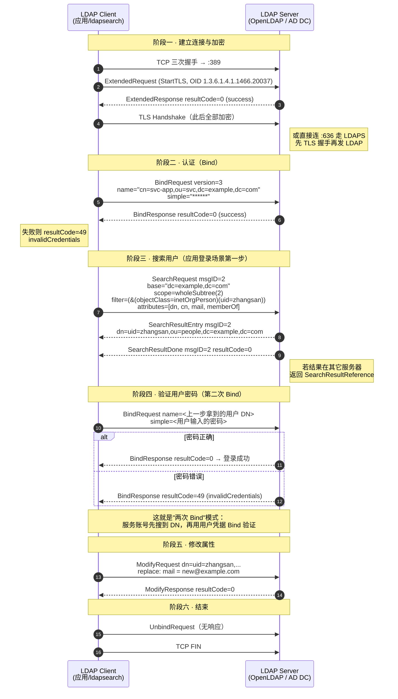
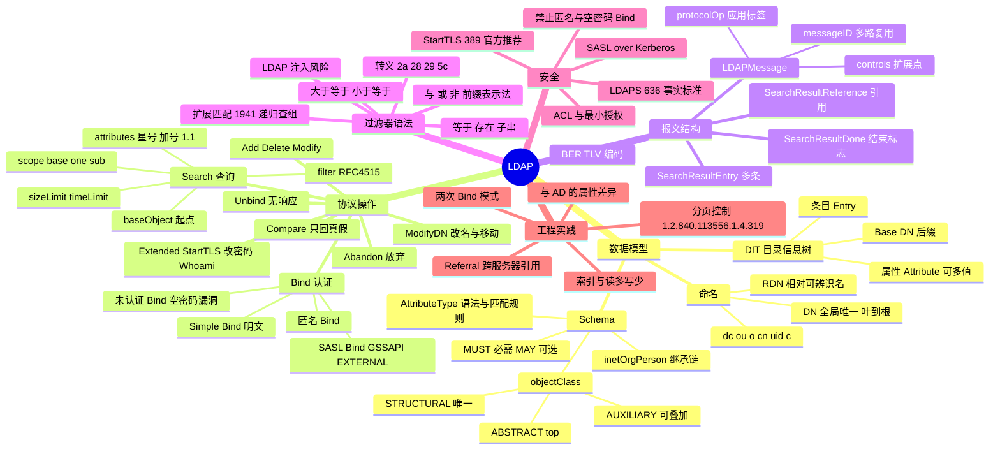

## 工作原理

### 1. DIT：一棵有名字的树

LDAP 服务器维护一棵 **DIT（Directory Information Tree，目录信息树）**：

```
                    dc=example,dc=com          ← Base DN / 后缀（Suffix）
                    ┌──────┴───────┐
              ou=people        ou=groups
              ┌───┴───┐         ┌───┴────┐
      uid=zhangsan  uid=lisi   cn=dev   cn=ops
      ─────────────────────────────────────────
      条目内容示例（uid=zhangsan,ou=people,dc=example,dc=com）:
         objectClass: inetOrgPerson
         objectClass: posixAccount
         uid:  zhangsan
         cn:   张三
         sn:   张
         mail: zhangsan@example.com          ← 属性可多值
         mail: z.san@example.com
         uidNumber: 10001
         memberOf: cn=dev,ou=groups,dc=example,dc=com
```

**命名规则**：

| 概念 | 例子 | 说明 |
|------|------|------|
| **RDN**（相对可辨识名） | `uid=zhangsan` | 条目在**同一父节点下**必须唯一；可以是多值 RDN，用 `+` 连接：`cn=张三+uid=zs` |
| **DN**（可辨识名） | `uid=zhangsan,ou=people,dc=example,dc=com` | RDN 从叶到根用 `,` 连接，**全局唯一**，相当于主键 |
| **Base DN / Suffix** | `dc=example,dc=com` | 该服务器管辖的子树根 |
| **常用命名属性** | `dc`（domainComponent，域名分量）<br>`ou`（organizationalUnit，组织单元）<br>`o`（organization，组织）<br>`cn`（commonName，通用名）<br>`uid`（userid）<br>`c`（country） | AD 中常用 `CN=` 和 `OU=`，OpenLDAP 常用 `uid=` 和 `ou=` |

> **顺序陷阱**：DN 是**从叶到根**书写的，与文件路径 `/dc/example/ou/people` 方向相反。`cn=admin,dc=example,dc=com` 中，`dc=com` 是最顶层。

### 2. Schema：objectClass 决定条目长什么样

每个条目**必须**至少有一个 `objectClass` 属性，它决定了这个条目允许/必须拥有哪些属性。

| 概念 | 说明 |
|------|------|
| **AttributeType**（属性类型） | 定义一个属性的 OID、名称、语法（syntax）、匹配规则（EQUALITY / SUBSTR / ORDERING）、是否单值 |
| **objectClass** | 定义一组属性的集合，分 `MUST`（必需）与 `MAY`（可选） |
| **STRUCTURAL** | 结构类，决定条目"是什么"，**每个条目有且仅有一条结构类继承链**（如 `inetOrgPerson`） |
| **AUXILIARY** | 辅助类，给条目"加料"，可叠加多个（如 `posixAccount` 加 Unix 属性、`shadowAccount` 加密码策略） |
| **ABSTRACT** | 抽象类，只能被继承，如所有类的根 `top` |

常见继承链：`top` → `person`（MUST: cn, sn）→ `organizationalPerson` → **`inetOrgPerson`**（MAY: mail, uid, employeeNumber, jpegPhoto…）

**匹配规则很关键**（决定搜索行为）：

| 属性 | EQUALITY 匹配规则 | 效果 |
|------|-------------------|------|
| `cn`, `mail`, `uid` | `caseIgnoreMatch` | **大小写不敏感**，`ZhangSan` 能匹配 `zhangsan` |
| `userPassword` | `octetStringMatch` | 二进制精确匹配 |
| `uidNumber` | `integerMatch` | 数值比较，`10002 > 999` 成立（若按字符串则不成立） |

### 3. 一条 TCP 连接上的多路复用

LDAP 是**有状态**协议，但一条 TCP 连接上可以**并发发起多个操作**：

- 每个请求带一个 **messageID**（客户端递增分配），响应用同一个 messageID 关联；
- 服务器可以**乱序返回**，客户端靠 messageID 对号入座；
- 一次 Search 的结果由**多条消息**组成：N 个 `SearchResultEntry` + 0~N 个 `SearchResultReference` + **1 个 `SearchResultDone`**（收到它才算搜完）；
- 客户端可用 `AbandonRequest` 中途放弃一个操作（无响应）。

**连接的认证状态是连接级的**：Bind 一次后，该连接上后续所有操作都以该身份执行。再次 Bind 会**替换**当前身份。

## 报文 / 头部结构

LDAP 报文用 **BER**（Basic Encoding Rules）编码 ASN.1，与 SNMP 同源。

### LDAPMessage 外层（RFC 4511 §4.1.1）

```
┌─────────────────────────────────────────────────────────┐
│ LDAPMessage ::= SEQUENCE {                              │
│     messageID   MessageID (INTEGER 0..2147483647)       │
│     protocolOp  CHOICE { bindRequest, searchRequest, ...}│
│     controls    [0] Controls OPTIONAL                   │
│ }                                                        │
└─────────────────────────────────────────────────────────┘
```

| 字段 | 含义 |
|------|------|
| `messageID` | 请求/响应配对标识。同一连接内对未完成的操作必须唯一；**0 保留给 Unsolicited Notification**（服务器主动通知，如"即将断开") |
| `protocolOp` | 具体操作，由 BER 应用类标签区分（见下表） |
| `controls` | **控制项**，协议的扩展点。携带 OID + 值，如分页（`1.2.840.113556.1.4.319`）、排序、AD 的 `LDAP_SERVER_SHOW_DELETED_OID` |

### protocolOp 应用标签一览

| Tag | 操作 | 方向 | 说明 |
|-----|------|------|------|
| `[APPLICATION 0]` | **BindRequest** | C→S | 认证 |
| `[APPLICATION 1]` | BindResponse | S→C | |
| `[APPLICATION 2]` | **UnbindRequest** | C→S | **无响应**，通知服务器关闭连接 |
| `[APPLICATION 3]` | **SearchRequest** | C→S | 查询 |
| `[APPLICATION 4]` | SearchResultEntry | S→C | 每条结果一个 |
| `[APPLICATION 5]` | **SearchResultDone** | S→C | 搜索结束标志 + 结果码 |
| `[APPLICATION 6]` | ModifyRequest | C→S | 改属性 |
| `[APPLICATION 7]` | ModifyResponse | S→C | |
| `[APPLICATION 8]` | AddRequest | C→S | 加条目 |
| `[APPLICATION 9]` | AddResponse | S→C | |
| `[APPLICATION 10]` | DelRequest | C→S | 删条目（**只能删叶子节点**） |
| `[APPLICATION 11]` | DelResponse | S→C | |
| `[APPLICATION 12]` | ModifyDNRequest | C→S | 改名 / 移动子树 |
| `[APPLICATION 13]` | ModifyDNResponse | S→C | |
| `[APPLICATION 14]` | CompareRequest | C→S | 比较属性值（**不返回值，只返回真假**） |
| `[APPLICATION 15]` | CompareResponse | S→C | |
| `[APPLICATION 16]` | AbandonRequest | C→S | 放弃操作，**无响应** |
| `[APPLICATION 19]` | SearchResultReference | S→C | 引用（referral），指向别的服务器 |
| `[APPLICATION 23]` | **ExtendedRequest** | C→S | 扩展操作（StartTLS、改密码、Whoami） |
| `[APPLICATION 24]` | ExtendedResponse | S→C | |
| `[APPLICATION 25]` | IntermediateResponse | S→C | 中间响应（如同步复制推送） |

### BindRequest 字段

| 字段 | 类型 | 含义 |
|------|------|------|
| `version` | INTEGER (1..127) | 协议版本，**LDAPv3 固定为 3** |
| `name` | LDAPDN | 要认证的 DN（如 `cn=admin,dc=example,dc=com`）。**匿名 Bind 时为空串** |
| `authentication` | CHOICE | `simple [0] OCTET STRING`（**明文密码！**）或 `sasl [3] SaslCredentials{ mechanism, credentials }` |

**三种 Bind 形态**：

| 形态 | name | 密码 | 安全性 |
|------|------|------|--------|
| **匿名 Bind** | 空 | 空 | 只能访问允许匿名的公开条目 |
| **未认证 Bind** | 有 DN | **空串** | ⚠ **RFC 4513 明确警告**：许多服务器会误判为"匿名成功"，是经典漏洞。客户端必须自己拒绝空密码 |
| **Simple Bind** | 有 DN | 明文 | **裸奔**，必须叠加 TLS |
| **SASL Bind** | 空（身份在 SASL 里） | mechanism=GSSAPI/EXTERNAL/DIGEST-MD5 | 推荐。GSSAPI 即 Kerberos，EXTERNAL 即客户端证书 |

### SearchRequest 字段（最重要）

| 字段 | 类型 | 含义 |
|------|------|------|
| `baseObject` | LDAPDN | **搜索起点**，从哪个 DN 开始 |
| `scope` | ENUMERATED | **搜索范围**：`0 baseObject`（只查该条目本身）/ `1 singleLevel`（只查直接子节点，**不含自己**）/ `2 wholeSubtree`（整棵子树，**含自己**） |
| `derefAliases` | ENUMERATED | 别名解引用策略：0 neverDerefAliases / 1 derefInSearching / 2 derefFindingBaseObj / 3 derefAlways |
| `sizeLimit` | INTEGER | 客户端要求的最大返回条数（0=无限制）。**服务器端还有自己的硬上限，取两者较小值** |
| `timeLimit` | INTEGER | 秒数上限 |
| `typesOnly` | BOOLEAN | TRUE 时**只返回属性名不返回值**（探测 Schema 用） |
| `filter` | Filter | **过滤器**（见下节） |
| `attributes` | SEQUENCE OF | 要返回的属性列表。空列表 = 返回所有**用户属性**；`*` = 所有用户属性；`+` = 所有**操作属性**（如 `createTimestamp`、`entryUUID`）；`1.1` = **不返回任何属性**（只要 DN） |

### 过滤器语法（RFC 4515）

**前缀（波兰）表示法，整体必须用括号包裹**：

| 类型 | 语法 | 例子 |
|------|------|------|
| 等于 | `(attr=value)` | `(uid=zhangsan)` |
| **存在** | `(attr=*)` | `(mail=*)` — 有邮箱的条目 |
| **子串** | `(attr=前*中*后)` | `(cn=张*)`、`(mail=*@example.com)` |
| 大于等于 | `(attr>=value)` | `(uidNumber>=10000)`（**没有 `>`，只有 `>=`**） |
| 小于等于 | `(attr<=value)` | `(uidNumber<=19999)` |
| 近似 | `(attr~=value)` | `(cn~=zhangsan)`（实现依赖，很少用） |
| **与** | `(&(A)(B)(C))` | `(&(objectClass=person)(department=研发))` |
| **或** | `(|(A)(B))` | `(|(uid=zs)(uid=ls))` |
| **非** | `(!(A))` | `(!(objectClass=computer))` |
| 扩展匹配 | `(attr:rule:=value)` | AD 递归查组：`(memberOf:1.2.840.113556.1.4.1941:=CN=dev,...)` |

**必须转义的字符**（RFC 4515 §3）：

| 字符 | 转义 |
|------|------|
| `*` | `\2a` |
| `(` | `\28` |
| `)` | `\29` |
| `\` | `\5c` |
| NUL | `\00` |

> ⚠ **LDAP 注入**：把用户输入直接拼进过滤器是高危漏洞。用户输入 `*)(uid=*))(|(uid=*` 可以让 `(uid=<输入>)` 变成永真式，绕过认证。**必须对上述字符转义**。

### 常见结果码（BindResponse / SearchResultDone 等共用）

| 码 | 名称 | 含义 / 排错方向 |
|----|------|----------------|
| 0 | success | 成功 |
| 1 | operationsError | 操作顺序错（如 StartTLS 后又 StartTLS） |
| 3 | timeLimitExceeded | 超时，缩小搜索范围或加索引 |
| 4 | **sizeLimitExceeded** | 结果超过上限，**需要分页** |
| 7 | authMethodNotSupported | 认证机制不支持 |
| 8 | strongerAuthRequired | 服务器要求 TLS/SASL（`ldap_bind: Confidentiality required`） |
| 10 | **referral** | 条目在别的服务器上，跟随引用 |
| 11 | adminLimitExceeded | AD 默认单次最多返回 **1000** 条 |
| 16 | noSuchAttribute | 要改/删的属性不存在 |
| 17 | undefinedAttributeType | Schema 里没这个属性 |
| 19 | constraintViolation | 违反约束（如密码复杂度不足、单值属性给了多值） |
| 20 | attributeOrValueExists | 添加了已存在的属性值 |
| 21 | invalidAttributeSyntax | 值格式不符合语法 |
| **32** | **noSuchObject** | **Base DN 写错**（最高频错误之一） |
| 34 | invalidDNSyntax | DN 格式错误（少逗号、多空格） |
| 49 | **invalidCredentials** | **用户名或密码错**（最高频） |
| 50 | **insufficientAccessRights** | 权限不足，检查 ACL |
| 53 | unwillingToPerform | 服务器拒绝（如账号禁用、试图删非空子树、AD 无 SSL 改密码） |
| 64 | namingViolation | RDN 与条目属性不匹配 |
| 65 | **objectClassViolation** | **缺少 MUST 属性**或 objectClass 组合非法 |
| 66 | notAllowedOnNonLeaf | **试图删除有子节点的条目** |
| 68 | entryAlreadyExists | DN 已存在 |

## 交互流程



## 关键机制

### 1. "两次 Bind" —— 应用集成 LDAP 的标准姿势

几乎所有应用（GitLab、Jenkins、Grafana）对接 LDAP 都是这个流程：

```
① 用【服务账号】Bind        → 获得搜索权限
② Search 过滤用户名          → 拿到用户的完整 DN
③ 用【用户 DN + 用户输入的密码】再 Bind → Bind 成功即密码正确
④ （可选）Search memberOf     → 拿到用户所属组，做授权
```

**为什么不直接用用户名 Bind？** 因为 Bind 需要**完整 DN**，而用户只会输 `zhangsan`。不同组织的 DN 结构千差万别（可能在 `ou=people` 也可能在 `ou=北京,ou=分公司`），只能先搜。

**为什么不直接读 `userPassword` 属性比对？** ① 密码通常是加盐哈希（`{SSHA}...`），格式不定；② 服务器一般禁止读取 `userPassword`；③ AD 根本不通过 LDAP 暴露密码哈希。**用 Bind 让服务器自己验证是唯一正确做法**。

### 2. Scope 的三种范围（最易错的概念）

以 `base = ou=people,dc=example,dc=com` 为例：

| scope | 搜索范围 | 是否含 base 自身 |
|-------|---------|-----------------|
| `base`（0） | 仅 `ou=people` 这一个条目 | ✅ 只有它 |
| `one`（1） | `ou=people` 的**直接子节点**（`uid=zhangsan`、`uid=lisi`），**不含孙节点，不含自己** | ❌ |
| `sub`（2） | `ou=people` 及其**所有后代**，无限深度 | ✅ |

> 实践：应用集成一律用 `sub`；只想验证某个 DN 是否存在用 `base` + `filter=(objectClass=*)`；列举某 OU 下的直接成员用 `one`。

### 3. 分页控制（Simple Paged Results，RFC 2696）

服务器有硬性返回上限（**AD 默认 1000 条**，OpenLDAP `sizelimit` 默认 500）。超过就返回 `sizeLimitExceeded(4)` 或 `adminLimitExceeded(11)`，**且已返回的部分结果不完整**。

解法是分页控制（Control OID `1.2.840.113556.1.4.319`）：

```
① 客户端在 SearchRequest 的 controls 里带 { size=500, cookie="" }
② 服务器返回 500 条 + SearchResultDone（带 cookie）
③ 客户端用该 cookie 再发下一次 SearchRequest
④ 直到服务器返回空 cookie
```

命令行：`ldapsearch -E pr=500/noprompt ...`

### 4. StartTLS vs LDAPS

| 维度 | StartTLS | LDAPS |
|------|----------|-------|
| 端口 | **389**（与明文同端口） | **636**（独立端口） |
| 机制 | 先建明文 TCP，再用 ExtendedRequest（OID `1.3.6.1.4.1.1466.20037`）**协商升级** | 连上就直接 TLS 握手（隐式 TLS） |
| 标准化 | **RFC 4513 正式定义，官方推荐** | **无 RFC，事实标准**（源自 LDAPv2 时代） |
| 风险 | 存在**降级攻击**风险（中间人剥离 StartTLS 能力），客户端必须强制要求成功 |  无降级风险，但需额外端口 |
| URI | `ldap://host:389` + `-ZZ` | `ldaps://host:636` |

> **必须加密的理由**：Simple Bind 密码是**明文**的。抓包直接就能看到。RFC 4513 明确要求：不在受保护的传输上不得使用 Simple Bind。

### 5. Referral（引用）与 Alias（别名）

- **Referral**：服务器说"我这儿没有，去 `ldap://other.example.com/dc=sub,dc=example,dc=com` 找"。返回 `resultCode=10` 或 `SearchResultReference`。客户端需自己发起新连接（`ldapsearch -C` 开启自动跟随）。**AD 的多域森林大量使用 referral**，跨域搜索时容易报错。
- **Alias**：条目级的"符号链接"（objectClass=alias + aliasedObjectName）。由 `derefAliases` 参数控制是否解引用。**易造成环路，生产环境慎用**。

### 6. AD 与标准 LDAP 的关键差异

| 项 | OpenLDAP（标准） | Active Directory |
|----|------------------|------------------|
| 用户 objectClass | `inetOrgPerson` / `posixAccount` | **`user`**（结构类是 `user`，`person`→`organizationalPerson`→`user`） |
| 组 objectClass | `groupOfNames` / `posixGroup` | **`group`** |
| 登录名属性 | `uid` | **`sAMAccountName`**（NetBIOS 名，≤20 字符）<br>**`userPrincipalName`**（UPN，形如 `zhangsan@example.com`） |
| 组成员 | `member`（组上）/ `memberOf`（overlay 提供） | `member` + **`memberOf`（自动维护，只读）** |
| 递归查组 | 需客户端自己递归 | 扩展匹配规则 **`1.2.840.113556.1.4.1941`**（LDAP_MATCHING_RULE_IN_CHAIN） |
| 账号禁用 | 各实现不同 | **`userAccountControl`** 位掩码，`& 2` 为禁用；过滤禁用账号：`(!(userAccountControl:1.2.840.113556.1.4.803:=2))` |
| 改密码 | ExtendedOp（RFC 3062）或直接改 `userPassword` | **必须走 LDAPS/StartTLS**，写 `unicodePwd`（UTF-16LE + 双引号包裹 + Base64） |
| 单次返回上限 | `sizelimit`（默认 500） | **MaxPageSize 默认 1000** |
| 匿名访问 | 可配 | **默认禁止**，必须 Bind |
| 全局编录 | 无 | 端口 **3268/3269**，跨域搜索但**只含部分属性** |

## 知识框架


