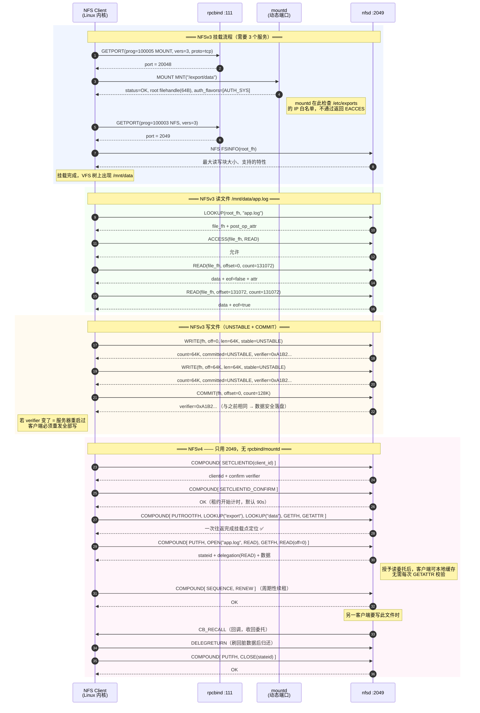
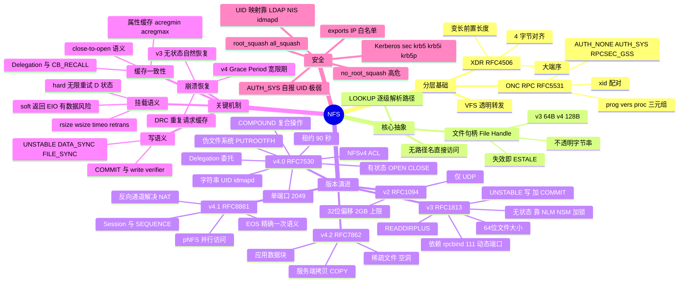

## 先建立直觉

先别管报文格式和字段偏移，我们只要回答一个问题：**你敲下 `cat /mnt/data/report.txt` 时，背后到底发生了什么？**

- 这台机器上并没有 `report.txt` 这个真实文件，`/mnt/data` 是一棵"虚拟书架"，实实在在的数据在另一台机器的磁盘里。
- 你用的命令（`cat`、`vim`、`cp`）**一行代码都没改**，它根本不知道自己在访问网络。是内核的 VFS 层发现"这个路径属于 NFS 挂载点"，悄悄把 `read()` 这种系统调用翻译成了一次网络请求。
- 但这不是一个"把整个文件传过来"的协议（那像 FTP）。NFS 传的是**一次文件系统操作**：`READ(offset=0, count=4096)`、`WRITE(offset=4096, ...)` 这种粒度，和你在本地读写文件是一一对应的。
- 既然是网络请求，就得有人负责"寻址、打包、编码、传输"。NFS 自己不干这些脏活，它站在 **ONC RPC**（负责远程调用）和 **XDR**（负责统一编码）这两层肩膀上。所以你抓包时会看到双层结构：外层 `RPC`、内层 `NFS`。

一句话：**NFS = 把本地文件操作原样"转手"成网络请求。** 下文的所有细节，都是在回答"怎么转手、怎么打包、怎么保证不出错"。

## 它解决什么问题

在 NFS 之前，多台机器之间"共享一份文件"几乎没有优雅解法：文件锁在某台机器磁盘里，或靠 FTP 来回拷——拷来拷去出现 N 个版本、改了不同步、每台机器都重复占磁盘。

NFS（1984 年，Sun）的关键思路是：**不发明新的文件访问方式，而是把已有的 Unix 文件系统调用透明地转发到网络上。** 这样带来的几个子问题，以及 NFS 的解法：

| 问题 | NFS 的解法 |
|------|-----------|
| 应用要改代码才能访问远程文件 | **VFS 层拦截**：应用照常调 `open()`/`read()`/`write()`，内核判断这是 NFS 挂载点后转成 RPC |
| 不同机器的字节序/数据表示不同 | **XDR**（External Data Representation，外部数据表示，RFC 4506）统一编码，大端序 + 4 字节对齐 |
| 网络调用怎么写才像本地函数 | **ONC RPC**（RFC 5531）：定义程序号/版本号/过程号三元组，客户端像调本地函数一样发请求 |
| 服务器崩溃重启后客户端怎么办 | **v2/v3 无状态设计**：服务器不记住任何客户端信息，每个请求自带全部上下文（文件句柄 + 偏移量），重启后客户端重试即可恢复 |
| 磁盘空间浪费在每台机器 | 集中存储，统一备份、统一扩容 |

## 工作流程（简化版）

一次最典型的"读文件"走下来，大致是 5 步（以 NFSv3 为例；v4 会把其中多步打包进一次 COMPOUND）：

1. **挂载（Mount）**：客户端先问 rpcbind（111 端口）"mountd 在哪"，再连 mountd 拿到**根文件句柄**，VFS 树上长出 `/mnt/data`。
2. **解析路径（LOOKUP）**：想读 `/mnt/data/app.log`，客户端拿根句柄逐级 `LOOKUP("data")` → `LOOKUP("app.log")`，换到目标文件的句柄。
3. **权限确认（ACCESS / GETATTR）**：用句柄问服务器"我能不能读、"文件多大、mtime 多少"。
4. **读写数据（READ / WRITE）**：带上句柄 + 偏移量 + 长度，一次读/写一块（通常 1MB）。写可以"先写内存"（UNSTABLE）最后统一 COMMIT 落盘。
5. **关 / 续租 / 刷回**：v3 无状态，请求自带上下文，服务器宕机客户端重试即可；v4 有状态，靠租约（默认 90s）续命、靠 Delegation 减少来回确认。

> 是不是发现一个反复出现的东西——**文件句柄**？它才是 NFS 能"无路径访问"的真正钥匙，下文会专门拆开讲。

## 报文 / 头部长什么样

NFS 的"报文"是套娃结构：最外层是 ONC RPC 头和 XDR 编码，里面才是 NFS 过程参数。先建立"套娃"的层次感，再看各层字段。

### 1. 一次调用的完整旅程（VFS → RPC → XDR）

下面这张图把"从 `read()` 到网络包"的每一层都画出来了，**重点是看数据怎么一层层被包进去**：

```
应用进程
   │ read(fd, buf, 4096) ← 普通系统调用，应用无感知
   ▼
┌────────────────────────────────────────┐
│ 内核 VFS（虚拟文件系统层） │ 判断该 inode 属于 nfs 文件系统
└────────────────────────────────────────┘
   ▼
┌────────────────────────────────────────┐
│ NFS Client（内核模块 nfs / nfsv4） │ 查页缓存 → 未命中 → 构造 READ 请求
│ { filehandle, offset, count } │
└────────────────────────────────────────┘
   ▼
┌────────────────────────────────────────┐
│ ONC RPC 层（sunrpc） │ 加 RPC 头：xid / prog=100003 /
│ │ vers=3或4 / proc=READ / 认证凭据
└────────────────────────────────────────┘
   ▼
┌────────────────────────────────────────┐
│ XDR 编码 │ 大端序、4 字节对齐序列化
└────────────────────────────────────────┘
   ▼
   TCP（记录标记 Record Marking）→ IP → 网卡 ── 网络 ──► 服务端逆向解开
                                                          ▼
                                            nfsd 内核线程 → VFS → 本地 ext4/xfs
```

**关键点**：NFS 不是"文件传输协议"（不像 FTP 整文件搬运），而是**远程文件系统调用协议**——传的是 `LOOKUP`、`GETATTR`、`READ(offset, count)` 这样的操作，粒度是"一次系统调用"。

### 2. ONC RPC 三层定位：三元组

每个 RPC 请求用 `{程序号, 版本号, 过程号}` 唯一定位要调用的函数。下表是 NFS 世界里常见的几个"程序号"——**记住 100003（NFS）和 100005（MOUNT）最常用**：

| 服务 | 程序号 | 版本 | 说明 |
|------|--------|------|------|
| **portmapper / rpcbind** | 100000 | 2/3/4 | 端口映射，固定 111 |
| **NFS** | **100003** | 2/3/4 | 主服务，固定 2049 |
| **MOUNT** | 100005 | 1/3 | v3 挂载协议，动态端口 |
| **NLM**（锁管理） | 100021 | 1/3/4 | v3 文件锁，动态端口 |
| **NSM / statd**（状态监视） | 100024 | 1 | 崩溃恢复通知，动态端口 |
| **rquotad**（配额） | 100011 | 1/2 | 动态端口 |

**RPC 消息头字段**——下面是每个 RPC 请求外层都带的信息，**`xid` 是配对和去重的关键**：

| 字段 | 含义 |
|------|------|
| `xid` | Transaction ID，请求/响应配对（**也是重传检测和 DRC 去重缓存的键**） |
| `msg_type` | 0 = CALL（请求），1 = REPLY（响应） |
| `rpcvers` | RPC 版本，固定 2 |
| `prog` / `vers` / `proc` | 程序号 / 版本号 / 过程号 |
| `cred`（凭据） | 认证信息，见下表 |
| `verf`（验证器） | 校验器，AUTH_SYS 时为空 |

**认证风味（Authentication Flavor）**——NFS 的安全强薄弱，基本看这一项：

| flavor | 值 | 含义 |
|--------|-----|------|
| `AUTH_NONE` | 0 | 无认证 |
| **`AUTH_SYS`**（AUTH_UNIX） | **1** | **客户端自报 UID/GID/辅助组，服务器无条件信任 —— 这是 NFS 最大的安全弱点** |
| `RPCSEC_GSS` | 6 | Kerberos 等强认证（`sec=krb5/krb5i/krb5p`） |

> **AUTH_SYS 的本质**：报文里就是一串明文的 `uid=1001, gid=1001, gids=[10,100]`。攻击者只要能连上 2049 端口，在自己机器上 `useradd -u 0` 就能以 root 身份访问（除非有 `root_squash`）。**因此 NFS 必须靠网络隔离 + exports 白名单 + Kerberos 三重防护**。

### 3. XDR 编码规则

XDR 是 RPC 的"统一语言"，解决不同机器字节序/对齐差异。**下面几条规则，最要紧的是"大端序 + 4 字节对齐"**：

| 规则 | 说明 |
|------|------|
| 字节序 | **大端序（Big-Endian）**，与网络字节序一致 |
| 对齐 | 所有数据 **4 字节对齐**，不足补 0 |
| 整数 | int / unsigned int 4 字节；hyper / unsigned hyper 8 字节（**v3 起文件大小用 64 位，突破 v2 的 2GB 限制**） |
| 变长数据 | 前置 4 字节长度，后跟内容 + 补齐字节 |
| 字符串 | 同变长数据（**不含结尾 `\0`**） |
| 可选值 | 前置 4 字节布尔（0 = 无，1 = 有） |

### 4. 文件句柄（File Handle）：NFS 的"远程 inode"

客户端**不能用路径名读写文件**。流程一定是"先拿句柄、再逐级 LOOKUP"——下面把 `/data/logs/app.log` 的解析过程画全：

```
路径 /data/logs/app.log 的访问过程：
  ① 拿到根句柄（v3: MOUNT 协议返回；v4: PUTROOTFH 操作）
  ② LOOKUP(根句柄, "data") → 得到 /data 的句柄
  ③ LOOKUP(/data 句柄, "logs") → 得到 /data/logs 的句柄
  ④ LOOKUP(/data/logs 句柄, "app.log") → 得到文件句柄
  ⑤ READ(文件句柄, offset=0, count=4096)
```

**句柄特性**——它"不透明、有长度上限、会失效"，这三点是 NFS 很多行为的根源：

| 特性 | 说明 |
|------|------|
| **不透明（Opaque）** | 对客户端是一串无意义的字节，只能原样回传。服务器内部通常编码 `{fsid, inode号, generation号}` |
| 长度 | v2 固定 32 字节；**v3 最长 64 字节**；**v4 最长 128 字节** |
| **持久性** | 设计上应跨服务器重启保持有效（这是 v3 无状态恢复的基础） |
| **失效** | 文件被删除、文件系统重新导出、`fsid` 变化 → 句柄失效 → 返回 **`ESTALE`（Stale file handle）** |

> **`Stale file handle` 的本质**：客户端手里的句柄指向的 inode 已经不存在（文件被别人删了、服务端 remount 了、fsid 变了）。这是 NFS 最著名的错误之一。

### 5. v3 无状态 vs v4 有状态

这是理解 NFS 演进的**主线**。一张表看清两个版本在"服务器记不记客户端"上的根本差异：

| 维度 | NFSv3（无状态） | NFSv4（有状态） |
|------|----------------|----------------|
| 服务器是否记住客户端 | **不记住**。每个请求自带全部上下文 | **记住**：ClientID、OpenState、LockState |
| 打开文件 | **没有 OPEN 过程**！客户端本地记录"打开"，直接用句柄 READ/WRITE | 有 **OPEN/CLOSE**，服务器维护 stateid |
| 文件锁 | 靠外挂 **NLM + NSM** 协议 | **整合进主协议**（LOCK/LOCKU/LOCKT） |
| 服务器崩溃恢复 | 客户端无限重试（`hard` 挂载），服务器起来后自动继续 | **Grace Period（宽限期，默认 90 秒）**：只接受锁恢复请求，不接受新锁 |
| 客户端崩溃 | 服务器无需清理（本来就没状态） | **租约（Lease）到期**（默认 90 秒）自动回收状态 |
| 端口 | 2049 + 111 + mountd/statd/lockd **动态端口** | **只有 2049** |
| 挂载 | 需要 MOUNT 协议 | **伪文件系统** + PUTROOTFH |
| 权限模型 | 数字 UID/GID | **字符串 `user@domain`**（需 `idmapd` 或 AUTH_SYS 数字直传） |
| ACL | 无（只有 POSIX mode 位） | 支持 **NFSv4 ACL**（类 Windows ACL） |
| 缓存一致性 | **弱**（close-to-open 语义 + 属性缓存超时） | **强**（Delegation 委托机制） |

### 6. 报文头部结构（RPC 层 + 各版本过程）

下面是**实际线序上**每个 NFS 报文外层长什么样（TCP 之上先有 4 字节 Record Marking）：

```
TCP 之上先有 4 字节 Record Marking:
┌─┬───────────────────────────────┐
│F│ fragment length (31 bit) │ F=1 表示最后一个分片
└─┴───────────────────────────────┘
┌──────────────────────────────────────────────────────┐
│ RPC CALL │
│ xid(4) │ msg_type=0 │ rpcvers=2 │ prog=100003 │
│ vers=3或4 │ proc=<过程号> │ cred{flavor,body} │ verf │
├──────────────────────────────────────────────────────┤
│ NFS 过程参数（XDR 编码） │
└──────────────────────────────────────────────────────┘
```

**NFSv3 主要过程（RFC 1813，共 22 个）**——这是 v3 的"能力清单"，过程号在抓包过滤和排错时极常用（如 `nfs.procedure_v3 == 6` 就是 READ）：

| Proc | 名称 | 作用 | 关键参数 |
|------|------|------|---------|
| 0 | NULL | 心跳/探活 | 无 |
| **1** | **GETATTR** | 取文件属性（大小、mtime、mode） | fh |
| 2 | SETATTR | 设属性（chmod/chown/truncate） | fh, sattr |
| **3** | **LOOKUP** | **在目录中按名字查文件 → 返回句柄** | dir_fh, name |
| 4 | ACCESS | 检查权限（服务端判定，避免客户端 UID 误判） | fh, access_mask |
| 5 | READLINK | 读符号链接目标 | fh |
| **6** | **READ** | 读数据 | fh, **offset(64bit)**, count |
| **7** | **WRITE** | 写数据 | fh, offset, count, **stable**, data |
| 8 | CREATE | 创建普通文件 | dir_fh, name, how |
| 9 | MKDIR | 创建目录 | dir_fh, name, attr |
| 10 | SYMLINK | 创建符号链接 | dir_fh, name, target |
| 11 | MKNOD | 创建设备/FIFO 节点 | dir_fh, name, type |
| 12 | REMOVE | 删文件 | dir_fh, name |
| 13 | RMDIR | 删空目录 | dir_fh, name |
| 14 | RENAME | 改名/移动 | from{fh,name}, to{fh,name} |
| 15 | LINK | 创建硬链接 | fh, dir_fh, name |
| 16 | READDIR | 列目录（**只返回名字+cookie**） | dir_fh, cookie, count |
| **17** | **READDIRPLUS** | 列目录**同时返回每项属性和句柄**（`ls -l` 快得多） | dir_fh, cookie, dircount, maxcount |
| 18 | FSSTAT | 文件系统空间统计（`df` 用） | fh |
| 19 | FSINFO | 文件系统能力（最大读写块、是否支持链接） | fh |
| 20 | PATHCONF | POSIX pathconf 信息（最大文件名长度等） | fh |
| **21** | **COMMIT** | **把之前 UNSTABLE 的写落盘** | fh, offset, count |

**WRITE 的三种稳定性（stable_how）—— 性能与安全的核心权衡**：

| 值 | 语义 | 服务器行为 |
|----|------|-----------|
| `UNSTABLE(0)` | 可以只写内存 | **立即返回，最快**。数据可能还在服务器 page cache，掉电即丢 |
| `DATA_SYNC(1)` | 数据必须落盘（元数据可后延） | 中等 |
| `FILE_SYNC(2)` | 数据+元数据全部落盘 | **最慢最安全** |

配套的 **COMMIT** 过程：客户端先用 UNSTABLE 高速批量写，最后发一个 COMMIT 让服务器 flush。服务器返回 **write verifier（8 字节）**；若两次 verifier 不同，说明服务器**重启过、缓存中的数据丢了**，客户端必须**重发全部未确认的写**。这是 NFS 兼顾性能与可靠性的精妙设计。

**NFSv4 的 COMPOUND（RFC 7530）**——v4 **只有两个 RPC 过程**：`NULL(0)` 和 **`COMPOUND(1)`**。所有实际操作都是 COMPOUND 里的"操作数组"：

```
COMPOUND {
    tag: "read file"
    minorversion: 0 ← 0=v4.0 1=v4.1 2=v4.2
    argarray: [
        PUTFH(dir_handle) ← 设置"当前文件句柄"(Current FH)
        LOOKUP("app.log") ← Current FH 变为该文件
        GETATTR(size|mtime)
        READ(stateid, offset=0, count=65536)
    ]
}
```

**核心概念：Current Filehandle（当前文件句柄）** —— 像一个游标，`PUTFH`/`LOOKUP`/`PUTROOTFH` 会改变它，后续操作隐式作用于它。这让一次 RPC 能完成"查找+读取"的组合。

**COMPOUND 的执行语义**：**顺序执行，遇到第一个错误就停止**，返回已执行部分的结果。不是事务，**没有回滚**。

**v4 主要操作**（部分）：

| Op | 名称 | 作用 |
|----|------|------|
| 3 | ACCESS | 权限检查 |
| 4 | CLOSE | 关闭（释放 stateid） |
| 5 | COMMIT | 落盘 |
| 6 | CREATE | 创建非普通文件 |
| 9 | GETATTR | 取属性 |
| 10 | GETFH | 取当前句柄 |
| 12 | LINK | 硬链接 |
| 13 | LOCK / 14 LOCKT / 15 LOCKU | **加锁 / 测试锁 / 解锁（已整合进主协议）** |
| 15 | LOOKUP | 查找 |
| 18 | **OPEN** | **打开文件，返回 stateid，可能获得 Delegation** |
| 22 | PUTFH | 设置当前句柄 |
| 24 | **PUTROOTFH** | **设置为伪文件系统根**（v4 挂载起点） |
| 25 | READ | 读 |
| 26 | READDIR | 列目录 |
| 31 | RENEW | **续租**（v4.0；v4.1 用 SEQUENCE 隐式续租） |
| 34 | SETATTR | 设属性 |
| 35 | SETCLIENTID | 客户端注册（v4.0） |
| 38 | WRITE | 写 |
| 42 | **EXCHANGE_ID** | v4.1 的客户端注册 |
| 43 | CREATE_SESSION | v4.1 建会话 |
| 53 | **SEQUENCE** | **v4.1 每个 COMPOUND 的第一个操作，提供 EOS 精确一次语义** |

## 交互时序

下面这张图把 v3 挂载/读/写 和 v4 挂载/读/续租/委托回调 的完整交互都画了出来。**一句话看懂这张图**：v3 为了一次挂载要"挨个问"rpcbind、mountd、nfsd 三个服务，而 v4 只用 2049 一个端口，把"找路径、读文件、续租、收回委托"全塞进 COMPOUND 往返里；写文件则是 v3 用 `UNSTABLE` 高速写 + 最后 `COMMIT` 落盘，靠 write verifier 防丢数据。



## 关键机制 / 变体

下面 6 个机制，解释了 NFS"为什么有时慢、有时卡死、有时数据对不上"。每条先给一句话定位，再看细节。

### 1. 缓存一致性：Close-to-Open（CTO）语义

（一句话：NFS **不保证实时一致**，只保证"你关了文件我再打开时能看到你的完整修改"。）

```
客户端 A：write() ... close() ← close 时把脏页全部 flush 到服务器
客户端 B：open() ... read() ← open 时用 GETATTR 校验 mtime/size，失效则丢弃缓存
保证：B 在 A close 之后 open，一定能读到 A 的完整修改
不保证：A 还没 close 时 B 读到什么（可能是旧数据、可能是半截）
```

**属性缓存超时**（这就是"改了文件另一台机器要等几秒才看到"的原因）：

| 挂载参数 | 默认值 | 含义 |
|---------|--------|------|
| `acregmin` / `acregmax` | 3s / **60s** | 普通文件属性缓存的最小/最大时长 |
| `acdirmin` / `acdirmax` | 30s / **60s** | 目录属性缓存时长 |
| `actimeo=N` | — | 一次性把上面四个都设为 N |
| `noac` | — | 关闭属性缓存（**并强制同步写**，性能极差，仅特殊场景用） |

> **重要**：**NFS 上不能可靠地运行需要严格并发一致性的程序**——SQLite/MySQL 数据文件放 NFS 是经典的踩坑（锁语义 + 缓存都不可靠）。

### 2. Delegation（委托）—— v4 的一致性利器

（一句话：服务器把文件的读写控制权"下放"给客户端，单客户端独占时大幅减少来回确认。）

| 类型 | 客户端可以做什么 |
|------|-----------------|
| **READ Delegation** | 本地缓存读，**不必反复 GETATTR 校验**。服务器保证期间无人写 |
| **WRITE Delegation** | 本地缓存写和加锁，**批量写完再刷**。服务器保证期间独占 |

当**第二个客户端**要访问该文件时，服务器发起 **CB_RECALL 回调**（服务器主动连客户端，v4.0 需要客户端开放回调端口；**v4.1 用会话反向通道解决了 NAT 穿透问题**），客户端刷回脏数据后 `DELEGRETURN`。

**收益**：单客户端独占访问的场景（最常见），网络往返次数下降一个数量级。

### 3. hard vs soft 挂载 —— 最重要的挂载决策

（一句话：**`hard` 保数据但可能卡死进程，`soft` 不卡死但可能悄悄坏数据**——默认且推荐 `hard`。）

| 参数 | 服务器无响应时的行为 | 后果 |
|------|---------------------|------|
| **`hard`（默认，推荐）** | **无限重试**，进程在 I/O 上永久阻塞 | 进程进入 **D 状态（不可中断睡眠）**，`kill -9` 都杀不掉，`df`/`ls` 全部 hang 死。但**数据绝不丢失** |
| `soft` | 重试 `retrans` 次后返回 **EIO** | 进程能继续跑，但**应用可能拿到不完整数据 → 静默数据损坏** |
| **`intr`** | 允许信号中断（**Linux 2.6.25 起已废弃/无效**） | 现代内核用 `hard` + `Ctrl-C` 已可中断部分操作 |

**结论**：**读写数据一律用 `hard`**；只有对纯只读、可容忍失败的场景（如只读的配置分发）才考虑 `soft`，且必须配 `timeo` 和 `retrans`。要避免 hang 死，正确做法是配 `_netdev` + 网络监控 + autofs 自动卸载，而不是改成 `soft`。

### 4. root_squash：UID 映射和安全

（一句话：`root_squash` 把客户端的 root 贬成 `nobody`，防止它借 NFS 在服务端以 root 身份乱来。）

| exports 选项 | 行为 |
|-------------|------|
| **`root_squash`（默认）** | 客户端 **UID 0（root）** 被映射为 **`nobody`/`nfsnobody`（65534）**。客户端 root 无法以 root 身份操作服务端文件 |
| **`no_root_squash`** | **客户端 root = 服务端 root**。**极度危险**：任何能挂载的机器上的 root 就是服务器的 root，可写 SUID 二进制提权 |
| `all_squash` | **所有** UID 都映射为 anonymous，适合公开只读共享 |
| `anonuid=N` / `anongid=N` | 指定 squash 后的目标 UID/GID |

> **UID 一致性问题**：NFSv3 传的是**数字 UID**。服务器上 `zhangsan` 是 1001，客户端上 `zhangsan` 是 1050 —— 那么客户端看到的文件属主会是"1001"这个陌生数字，且权限判断全错。**解法**：用 LDAP/NIS 统一 UID，或用 NFSv4 + `idmapd`（传 `user@domain` 字符串）。

### 5. NFSv4 的 Grace Period 与租约

（一句话：v4 是"有状态"的，靠 **90 秒租约**续命、靠 **90 秒宽限期**在重启后安全恢复锁状态。）

| 机制 | 说明 |
|------|------|
| **Lease（租约）** | 客户端持有的状态（打开的文件、锁）有有效期，**默认 90 秒**。客户端必须周期性 RENEW（v4.1 靠 SEQUENCE 隐式续租）。**租约过期 → 服务器回收所有状态** |
| **Grace Period（宽限期）** | 服务器**重启后**进入宽限期（默认 90 秒），此期间**只接受老客户端的状态恢复请求（RECLAIM），拒绝新的 OPEN/LOCK**。防止 A 崩溃期间 B 抢走了 A 的锁 |
| 调整 | `/proc/fs/nfsd/nfsv4leasetime`、`/proc/fs/nfsd/nfsv4gracetime` |

> **运维现象**：NFSv4 服务器重启后，客户端会 hang 住约 90 秒才恢复——这就是 Grace Period 在起作用，是正常行为，不要慌。

### 6. DRC：重复请求缓存

（一句话：网络会丢响应导致客户端重传，服务器用 **DRC** 把"已经做过的请求"缓存下来直接回放，避免 `REMOVE`/`RENAME` 这类非幂等操作被重复执行。）

UDP/TCP 都可能发生"服务器执行了操作但响应丢了"，客户端重传会导致**非幂等操作重复执行**（如 `REMOVE` 第二次返回 ENOENT、`RENAME` 出错）。

**DRC（Duplicate Request Cache，重复请求缓存）**：服务器按 `{xid, 客户端地址, 过程号}` 缓存最近的响应，重传命中缓存则直接回放上次结果，不重复执行。

**v4.1 用 Session + SEQUENCE 操作**（带 slot id + sequence id）提供了协议级的 **EOS（Exactly Once Semantics，精确一次语义）**，彻底解决了这个问题——这是 v4.1 相对 v4.0 最重要的改进之一。

## 常见误区

1. **"NFS 是文件传输协议，像 FTP 一样传整个文件"** —— 错。NFS 传的是**一次文件系统操作**（`READ(offset, count)`、`WRITE(...)`），粒度是系统调用。这是它"对应用透明"的根本原因。
2. **"用路径名就能直接读写远程文件"** —— 错。NFS 靠**不透明的文件句柄**寻址，客户端必须先 LOOKUP 逐级换成句柄。路径名只在 LOOKUP 的参数里出现，不能塞进 READ/WRITE。
3. **"NFS 多客户端共享文件是实时一致的"** —— 错。v3 只有 **close-to-open** 弱语义，属性缓存默认 60 秒；哪怕 v4 有 Delegation，也不是"任意时刻强一致"。把数据库/SQLite 直接放 NFS 是经典踩坑。
4. **"`soft` 挂载能避免 hang 死，比 `hard` 好"** —— 错。`soft` 拿到 EIO 后应用可能吞下**不完整数据**造成静默损坏；`hard` 虽可能让进程进 D 状态，但**数据绝不丢**。正确解法是 autofs/automount + 监控，不是改 `soft`。
5. **"v4 还是要开 111 和 mountd 端口"** —— 错。v4 **只需 2049 一个端口**，rpcbind/mountd/NLM 全废弃（锁整合进主协议、挂载用 PUTROOTFH）。这是 v4 最好部署的原因。

## 速记口诀

- **"无句柄，不读写"**：NFS 一切寻址靠 File Handle，路径只用来 LOOKUP 换句柄。
- **"v3 三件套，v4 一端口"**：v3 要 rpcbind(111)+mountd+statd/lockd 一堆动态端口；v4 只要 2049。
- **"hard 保数据、soft 坏数据"**：怕 hang 就上 autofs，别拿 `soft` 赌数据。
- **"UNSTABLE 快写，COMMIT 落盘，verifier 变就重来"**：写性能与可靠性的平衡点。
- **"squash 降级、krb5 加密"**：`root_squash` 是底线，`sec=krb5p` 才是真安全；AUTH_SYS 明文 UID 谁都能冒充。

## 知识框架


