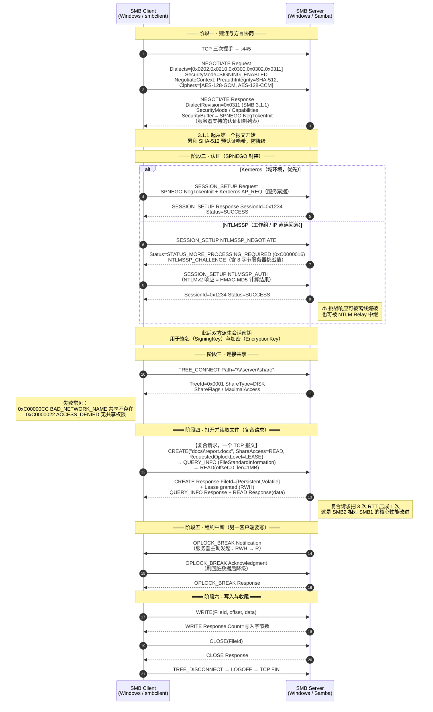
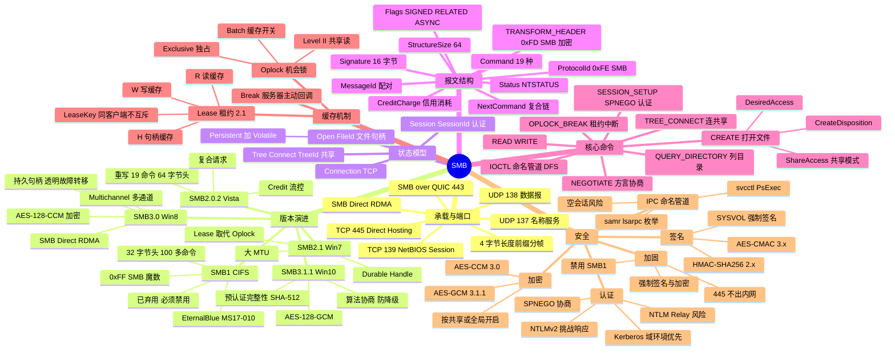

## 🚀 先建立直觉

先别管头部字段和状态码，记住一件事：**SMB 是 Windows 这台机器对外的"统一前台"**。它把 Win32 的文件操作（`CreateFile`/`ReadFile`/`WriteFile`）几乎一一搬到网络上，而且不止管文件——打印、远程管理、命名管道全走它。

几个直觉要点：

- **SMB 非常"讲规矩"**：它是有状态的。你要先"取号"（认证拿 SessionId）→"开柜子"（连共享拿 TreeId）→"拿文件标签"（打开文件拿 FileId）。这三层缺一层都不行——所以服务器一重启，NFSv3 客户端能自动恢复，而 SMB 会话直接全断。
- **SMB 和 NFS 气质相反**：NFS 是"松散代存取"，SMB 是"强制锁 + 强一致"。别人正打开的文件，你可以被直接拒绝访问——这是 Windows 语义，不是 bug。
- **版本跨度极大**：SMB1（CIFS）和 SMB2/3 几乎是两个协议。现代只认 SMB2/3，SMB1 是必须禁用的历史遗留。
- **安全内建**：签名、加密、Kerberos/NTLM 都打包在协议里，不像 NFS 还得额外铺 Kerberos。

一句话：**SMB = Windows 文件系统语义 + 完整安全机制，原样搬到网络上的"带前台总台"。** 下文逐层拆开。

## 🤔 它解决什么问题

在 SMB 之前，DOS/Windows 机器共享磁盘和打印机没有标准协议，而且 Windows 有一整套 Unix 没有的"规矩"（文件被打开时不能删、强制锁、ACL、不区分大小写）。SMB 要解决的就是"把这套 Windows 规矩无损地搬到网络上"，还顺带把打印和远程管理一起办了：

| 问题 | SMB 的解法 |
|------|-----------|
| 远程访问文件要和本地一样 | 完整映射 Win32 文件语义：共享模式（`FILE_SHARE_READ/WRITE/DELETE`）、属性、备用数据流（ADS）、**不区分大小写但保留大小写** |
| **Windows 的强制文件锁怎么跨网络实现** | 打开文件时携带 `ShareAccess` 与 `DesiredAccess`，服务器做冲突检测。这是与 NFS（咨询锁）最大的语义差异 |
| 网络往返太多导致性能差 | **Oplock / Lease（机会锁/租约）** 让客户端安全地本地缓存读写；SMB2 的 **复合请求（Compounding）** 把多个命令打包进一条 TCP 报文 |
| 认证与授权 | 内置 **NTLM / Kerberos**（通过 **SPNEGO/GSS-API** 协商），权限直接用 **NTFS ACL**，与 AD 域账号天然打通 |
| 不只是文件 | 共享类型除 `DISK` 外还有 `PRINTQ`（打印队列）、**`IPC`（进程间通信，命名管道）**。大量 Windows 远程管理（服务控制、注册表、WMI、DCOM）实际是**跑在 SMB 的 `IPC$` 命名管道之上的 MSRPC** |
| 局域网里怎么找到服务器 | 早期靠 **NetBIOS 名称广播**（UDP 137）+ 浏览器服务；现代靠 **DNS + AD** |

## 🔄 工作流程（简化版）

一次最典型的 SMB 访问，按"建连 → 认证 → 连共享 → 开文件/读 → 收尾"走：

1. **建连与方言协商（NEGOTIATE）**：TCP 连上 445 后，客户端甩出自己支持的方言列表（2.0.2 / 2.1 / 3.0 / 3.1.1…），服务器回一个协商出的版本（现代通常是 3.1.1）。
2. **认证（SESSION_SETUP）**：通过 SPNEGO 协商，域环境走 Kerberos，工作组/IP 直连回落 NTLM 挑战响应。成功后拿到 `SessionId`。
3. **连共享（TREE_CONNECT）**：连 `\\server\share`，拿到 `TreeId`。这步同时检查**共享级权限**。
4. **打开并读写（CREATE → READ/WRITE）**：打开文件拿 `FileId`；可把"打开+查属性+读"用**复合请求**压成一次 RTT。这步检查**文件系统级权限**。
5. **租约中断 / 收尾**：别人要写时服务器主动 `OPLOCK_BREAK` 收回缓存；写完 `CLOSE` → `TREE_DISCONNECT` → `LOGOFF` → TCP FIN。

> 注意第 2、3 步就是前文说的"两层权限"分界线：TREE_CONNECT 卡住是共享级，CREATE 卡住是文件系统级。

## 📦 报文 / 头部长什么样

SMB 的报文首先是"怎么承载"的问题（139 还是 445），再看 SMB2 自己的 64 字节头。下面分层来看。

### 1. 两种承载方式：NetBIOS(139) vs Direct Hosting(445)

```
【旧方式 · SMB over NetBIOS over TCP，端口 139】
┌──────────────────────────────────────────┐
│  SMB 消息                                 │
├──────────────────────────────────────────┤
│  NetBIOS Session Service 头（4 字节）      │  Type(1) + Flags(1) + Length(2)
├──────────────────────────────────────────┤
│  TCP :139                                 │
└──────────────────────────────────────────┘
   还需要 UDP 137（名称解析）、UDP 138（数据报）配合

【现代方式 · Direct Hosting，端口 445】
┌──────────────────────────────────────────┐
│  SMB 消息                                 │
├──────────────────────────────────────────┤
│  4 字节长度前缀（NBSS 头的简化残留）        │  0x00 + Length(3 字节)
├──────────────────────────────────────────┤
│  TCP :445                                 │
└──────────────────────────────────────────┘
   名称解析交给 DNS，不再需要 NetBIOS
```

> **有意思的细节**：445 直连虽然叫"Direct Hosting"，报文前**仍保留了 4 字节的长度前缀**（第 1 字节固定 0x00，后 3 字节是长度）。这是从 NBSS 头继承下来的，用于在字节流上做消息分帧。

**Windows 客户端访问 `\\server\share` 的连接顺序**：先并发尝试 **TCP 445**，同时尝试 139；445 成功则用 445。**两个都不通时还会回落尝试 WebDAV（HTTP）** ——这是一个容易被忽略的攻击面。

### 2. 三层状态模型

SMB 是重度有状态的协议，客户端必须逐层建立：

```
TCP 连接（Connection）
  └── Session（会话）        ← SESSION_SETUP 认证后获得 SessionId
        │                      一个连接上可有多个会话（多用户）
        └── Tree Connect（树连接）  ← TREE_CONNECT 到 \\server\share 获得 TreeId
              │                       一个会话可连多个共享
              └── Open（文件句柄）    ← CREATE 打开文件获得 FileId
                                       {Persistent, Volatile} 各 8 字节
```

对应到报文头，`SessionId` / `TreeId` / `FileId` 三个字段就是这三层状态的标识。**任何一层失效，上层全部失效**——这就是为什么服务器重启后客户端会话全断，而 NFSv3 不会。

### 3. SMB1 与 SMB2 的本质差异

下面这张表说明为什么 SMB1 可以（也应该）彻底禁用——它不是小版本，是彻底重写：

| 维度 | SMB1 / CIFS | SMB2+ |
|------|-------------|-------|
| 魔数 | `0xFF 'S' 'M' 'B'` | `0xFE 'S' 'M' 'B'`（3.1.1 加密后为 `0xFD 'S' 'M' 'B'`） |
| 头部 | 32 字节 | **64 字节** |
| 命令数量 | **100+ 个**（很多是 DOS 遗留） | **19 个** |
| 单次读写上限 | 64 KB | **可协商到 8 MB**（大 MTU） |
| 流控 | 固定的 MaxMpxCount | **Credit（信用）动态授予** |
| 请求打包 | ANDX 链（复杂且受限） | **Compounding 复合请求**（NextCommand 链） |
| 文件 ID | 16 位 | **128 位**（Persistent + Volatile，支持断线重连） |
| 签名 | MD5（弱） | HMAC-SHA256（2.x）→ **AES-CMAC**（3.x） |
| 加密 | 无 | **AES-CCM/GCM**（3.0+） |
| 状态码 | DOS 错误码 + NT 状态码混用 | 统一 **NTSTATUS** |

> SMB2 不是 SMB1 的小版本升级，而是**彻底重写**。这也是为什么可以（也应该）完全禁用 SMB1。

### 4. SMB2 同步头部（64 字节，MS-SMB2 §2.2.1.2）

这是 SMB2/3 每个报文最外层的结构。先扫字段名，**`ProtocolId`、`Command`、`Status`、`MessageId`、`SessionId`/`TreeId`/`FileId` 最关键**：

```
 0                   1                   2                   3
 0 1 2 3 4 5 6 7 8 9 0 1 2 3 4 5 6 7 8 9 0 1 2 3 4 5 6 7 8 9 0 1
┌───────────────────────────────────────────────────────────────┐
│         ProtocolId  = 0xFE 'S' 'M' 'B'   (4 字节)              │
├───────────────────────────────┬───────────────────────────────┤
│   StructureSize = 64 (2B)     │      CreditCharge (2B)        │
├───────────────────────────────┴───────────────────────────────┤
│      Status (响应) / ChannelSequence+Reserved (请求)  (4B)     │
├───────────────────────────────┬───────────────────────────────┤
│         Command (2B)          │  CreditRequest/Response (2B)  │
├───────────────────────────────┴───────────────────────────────┤
│                        Flags (4B)                             │
├───────────────────────────────────────────────────────────────┤
│                     NextCommand (4B)  复合请求偏移              │
├───────────────────────────────────────────────────────────────┤
│                     MessageId (8B)                            │
│                                                               │
├───────────────────────────────────────────────────────────────┤
│      Reserved (4B) / AsyncId 前半                              │
├───────────────────────────────────────────────────────────────┤
│                      TreeId (4B) / AsyncId 后半                │
├───────────────────────────────────────────────────────────────┤
│                      SessionId (8B)                           │
│                                                               │
├───────────────────────────────────────────────────────────────┤
│                     Signature (16B)                           │
│                                                               │
│                                                               │
│                                                               │
└───────────────────────────────────────────────────────────────┘
```

| 字段 | 长度 | 含义 |
|------|------|------|
| `ProtocolId` | 4 | **`0xFE 534D42`**（`\xFESMB`）。SMB1 是 `0xFF534D42`；**SMB3 加密报文（TRANSFORM_HEADER）是 `0xFD534D42`** |
| `StructureSize` | 2 | 固定 **64**，用于版本校验 |
| `CreditCharge` | 2 | 本请求消耗多少信用（大 I/O 消耗多个）。2.0.2 中固定为 0 |
| `Status` | 4 | **响应**中的 NTSTATUS 错误码（`0x00000000` = STATUS_SUCCESS）。请求中此位置是 `ChannelSequence`（3.x 多通道用） |
| `Command` | 2 | 命令码，见下表 |
| `CreditRequest/Response` | 2 | 请求：希望获得多少信用；响应：服务器授予多少 |
| `Flags` | 4 | 位标志（见下表） |
| `NextCommand` | 4 | **复合请求**中下一条命令的偏移量（字节）；0 表示这是最后一条 |
| `MessageId` | 8 | 消息序号，**请求响应配对**用；服务器用它做重放检测 |
| `TreeId` | 4 | 树连接标识（`TREE_CONNECT` 后获得） |
| `SessionId` | 8 | 会话标识（`SESSION_SETUP` 后获得） |
| `Signature` | 16 | **消息签名**（HMAC-SHA256 截断 16 字节 / AES-CMAC / AES-GMAC），未签名时全 0 |

**Flags 位定义**：

| 位 | 名称 | 含义 |
|----|------|------|
| `0x00000001` | SERVER_TO_REDIR | 这是**响应**（服务器→客户端） |
| `0x00000002` | ASYNC_COMMAND | 异步命令，此时 Reserved+TreeId 合并为 `AsyncId` |
| `0x00000004` | RELATED_OPERATIONS | **复合请求中的后续操作**，复用前一个操作的 FileId/SessionId/TreeId |
| `0x00000008` | **SIGNED** | 报文已签名 |
| `0x10000000` | DFS_OPERATIONS | DFS 命名空间操作 |
| `0x20000000` | REPLAY_OPERATION | 重放操作（3.x 多通道故障转移） |

### 5. SMB2 的 19 个命令

这是 SMB2/3 全部的命令码，记住 `NEGOTIATE(0)`/`SESSION_SETUP(1)`/`TREE_CONNECT(3)`/`CREATE(5)`/`READ(8)`/`WRITE(9)`/`OPLOCK_BREAK(0x12)` 这几个主线即可：

| Code | 命令 | 作用 |
|------|------|------|
| `0x0000` | **NEGOTIATE** | 协议方言协商（版本、能力、加密/签名算法） |
| `0x0001` | **SESSION_SETUP** | 认证（SPNEGO 封装 NTLM/Kerberos），可能多轮 |
| `0x0002` | LOGOFF | 注销会话 |
| `0x0003` | **TREE_CONNECT** | 连接共享 `\\server\share` |
| `0x0004` | TREE_DISCONNECT | 断开共享 |
| `0x0005` | **CREATE** | **打开/创建文件或目录**（对应 Win32 `CreateFile`，是最重要也最复杂的命令） |
| `0x0006` | CLOSE | 关闭句柄 |
| `0x0007` | FLUSH | 刷盘 |
| `0x0008` | **READ** | 读数据 |
| `0x0009` | **WRITE** | 写数据 |
| `0x000A` | LOCK | 字节范围锁 |
| `0x000B` | **IOCTL** | 设备控制 / **命名管道传输**（MSRPC 走这里）/ DFS 引用 / 复制卸载 |
| `0x000C` | CANCEL | 取消未完成的请求 |
| `0x000D` | ECHO | 心跳保活 |
| `0x000E` | **QUERY_DIRECTORY** | 列目录（对应 `FindFirstFile`/`FindNextFile`） |
| `0x000F` | CHANGE_NOTIFY | **目录变更通知**（异步长挂起） |
| `0x0010` | QUERY_INFO | 查询文件/文件系统/安全（ACL）信息 |
| `0x0011` | SET_INFO | 设置信息（改名、删除标记、改 ACL） |
| `0x0012` | **OPLOCK_BREAK** | **机会锁/租约中断**（服务器可主动发起） |

### 6. 关键请求的重要字段

**NEGOTIATE Request**——协商阶段客户端"亮家底"的地方，方言列表、签名要求、能力、加密算法偏好都在这里：

| 字段 | 含义 |
|------|------|
| `DialectCount` / `Dialects[]` | 客户端支持的方言列表：`0x0202`(2.0.2)、`0x0210`(2.1)、`0x0300`(3.0)、`0x0302`(3.0.2)、`0x0311`(**3.1.1**)、`0x02FF`(通配，用于 SMB1 多协议协商) |
| `SecurityMode` | `0x01` 启用签名 / `0x02` **要求签名** |
| `Capabilities` | DFS、Leasing、大 MTU、多通道、持久句柄、目录租约、**加密** |
| `ClientGuid` | 客户端唯一标识 |
| `NegotiateContextList` | **3.1.1 专用**：预认证完整性算法（SHA-512）、加密算法偏好（AES-128-GCM / AES-128-CCM / AES-256-GCM / AES-256-CCM）、压缩算法、签名算法（AES-CMAC / AES-GMAC） |

**CREATE Request**（最复杂的命令）——`ShareAccess` 是"文件被占用"的根源，`CreateContexts` 里的 `RqLs` 就是租约请求：

| 字段 | 含义 |
|------|------|
| `RequestedOplockLevel` | 请求的 Oplock 级别：NONE(0) / II(1) / EXCLUSIVE(8) / BATCH(9) / **LEASE(0xFF)** |
| `ImpersonationLevel` | 模拟级别（Anonymous / Identification / **Impersonation** / Delegate） |
| `DesiredAccess` | 想要的访问权限（`FILE_READ_DATA`、`FILE_WRITE_DATA`、`DELETE`、`GENERIC_ALL`…） |
| **`ShareAccess`** | **允许他人并发的操作**：`FILE_SHARE_READ(1)` / `WRITE(2)` / `DELETE(4)`。**这是 Windows"文件被占用"的根源** —— 若为 0，则文件独占，别人连读都打不开 |
| `CreateDisposition` | SUPERSEDE / **OPEN** / CREATE / **OPEN_IF** / OVERWRITE / OVERWRITE_IF |
| `CreateOptions` | DIRECTORY_FILE、NON_DIRECTORY_FILE、**DELETE_ON_CLOSE**、NO_INTERMEDIATE_BUFFERING 等 |
| `Name` | 相对共享根的路径（UTF-16LE，**不含 `\\server\share` 前缀） |
| `CreateContexts` | 扩展上下文：`DHnQ`（持久句柄请求）、`RqLs`（租约请求）、`MxAc`（最大访问权限查询）、`ExtA`（扩展属性） |

**常见 NTSTATUS 错误码**——排错时对着码查原因，`0xC000006D`/`0xC0000022`/`0xC00000CC`/`0xC0000043` 最常见：

| 值 | 名称 | 含义 |
|----|------|------|
| `0x00000000` | STATUS_SUCCESS | 成功 |
| `0x00000103` | STATUS_PENDING | **异步处理中**（如 CHANGE_NOTIFY），后续会有真正的响应 |
| `0xC000006D` | **STATUS_LOGON_FAILURE** | **用户名或密码错误** |
| `0xC000006A` | STATUS_WRONG_PASSWORD | 密码错 |
| `0xC0000071` | STATUS_PASSWORD_EXPIRED | 密码过期 |
| `0xC0000072` | STATUS_ACCOUNT_DISABLED | 账号禁用 |
| `0xC000015B` | STATUS_LOGON_TYPE_NOT_GRANTED | 不允许此类型登录 |
| `0xC0000022` | **STATUS_ACCESS_DENIED** | **权限不足**（共享权限或 NTFS ACL） |
| `0xC000003A` | STATUS_OBJECT_PATH_NOT_FOUND | 路径不存在 |
| `0xC0000034` | STATUS_OBJECT_NAME_NOT_FOUND | 文件不存在 |
| `0xC00000CC` | **STATUS_BAD_NETWORK_NAME** | **共享名不存在**（`\\server\不存在的share`） |
| `0xC00000BB` | STATUS_NOT_SUPPORTED | 不支持（常见于版本/方言不匹配） |
| `0xC0000203` | STATUS_USER_SESSION_DELETED | 会话已失效，需重新认证 |
| `0xC0000043` | **STATUS_SHARING_VIOLATION** | **文件被占用**（ShareAccess 冲突） |
| `0xC0000054` | STATUS_FILE_LOCK_CONFLICT | 字节范围锁冲突 |
| `0xC000007F` | STATUS_DISK_FULL | 磁盘满 |
| `0xC05D0000` | STATUS_SMB_NO_PREAUTH_INTEGRITY_HASH_OVERLAP | 3.1.1 预认证算法不匹配 |

## 🔀 交互时序

下面这张图把"建连 → 协商 → 认证（Kerberos/NTLM 两条分支）→ 连共享 → 复合请求打开读 → 租约中断 → 写入收尾"完整画了出来。**一句话看懂这张图**：客户端先和服务器"谈版本、做认证、开共享"三步走，之后把"打开+查属性+读"用复合请求压成一次 RTT（SMB2 相对 SMB1 的核心性能改进）；当第二个客户端要写时，服务器主动发 `OPLOCK_BREAK` 收回租约，持有者刷回脏数据再降级。



## 🔧 关键机制 / 变体

下面 6 个机制，是 SMB "性能好、一致性强、还能做远程管理"的底层原因。每条先一句话定位。

### 1. Oplock 与 Lease —— SMB 缓存一致性的核心

（一句话：客户端为了少跑网络会本地缓存文件，但靠**服务器主动回调**保证"别人改了我能立刻知道"，这就是强一致性的来源。）

客户端想在本地缓存文件内容以避免网络往返，但必须保证"别人改了我能知道"。SMB 用**服务器主动回调**解决：

**Oplock（Opportunistic Lock，机会锁，SMB1/2.0）**：

| 级别 | 客户端可以做什么 |
|------|-----------------|
| **Level II（共享读）** | 缓存**读**。多个客户端可同时持有 |
| **Exclusive（独占）** | 缓存**读+写**。独占持有 |
| **Batch（批处理）** | Exclusive 基础上还能**缓存 open/close**（脚本反复开关同一文件时极有用） |
| None | 不缓存，每次都走网络 |

**Lease（租约，SMB 2.1+，取代 Oplock）**：把缓存权限拆成三个独立的位，粒度更细：

| 位 | 含义 |
|----|------|
| **R**（Read Caching） | 可缓存读 |
| **W**（Write Caching） | 可缓存写 |
| **H**（Handle Caching） | **可缓存文件句柄**——即使应用 close 了也不真的关，下次 open 直接复用 |

**Lease 相对 Oplock 的关键优势**：Oplock 绑定"打开实例"，**同一台机器上两个进程打开同一文件会导致 Oplock 被打破**；Lease 用 **LeaseKey** 绑定"客户端 + 文件"，同一客户端的多个进程共享同一租约，**不会互相打断**。

**Break（中断）流程**：当第二个客户端的访问与现有租约冲突时，服务器**主动**发 `OPLOCK_BREAK Notification` 给持有者，持有者刷回脏数据、降级、回 ACK。这期间新客户端的请求会被挂起（表现为短暂延迟）。

### 2. Credit（信用）流控

（一句话：SMB2 用"服务器发信用额度、客户端按额度发请求"来精确控并发，比 SMB1 的固定窗口灵活得多。）

SMB2 的独特设计。**服务器授予客户端信用额度，客户端每发一个请求消耗信用**：

- 请求头的 `CreditCharge` 表示本次消耗多少（大 I/O 按 64KB 为单位计算，1MB 的读消耗 16 个信用）；
- `CreditRequest` 表示希望补充多少，服务器在响应的 `CreditResponse` 中授予；
- 信用为 0 时客户端**必须停止发送**。

**作用**：服务器能精确控制每个客户端的并发度，防止单个客户端打爆服务器；也是 SMB2 支持大量并发请求（相比 SMB1 的 `MaxMpxCount` 固定窗口）的基础。

**运维现象**：`Get-SmbClientNetworkInterface` 和性能计数器里能看到信用不足导致的停顿，通常是服务器过载的信号。

### 3. 签名（Signing）与加密（Encryption）

（一句话：SMB 自带"签名防篡改 + 加密防窃听 + 预认证完整性防降级"，安全是协议内建的，不用额外铺 Kerberos。）

| 版本 | 签名算法 | 加密算法 |
|------|---------|---------|
| SMB 2.0.2 / 2.1 | **HMAC-SHA256**（取前 16 字节） | 不支持 |
| SMB 3.0 / 3.0.2 | **AES-128-CMAC** | **AES-128-CCM** |
| SMB 3.1.1 | AES-128-CMAC，**可协商 AES-128-GMAC**（Windows Server 2022+） | **AES-128-GCM**（默认）、AES-128-CCM，**可协商 AES-256-GCM/CCM** |

**签名**：防篡改与中间人。**域控的 SYSVOL/NETLOGON 共享强制要求签名**（否则组策略可被篡改）。签名有 CPU 开销，但现代 CPU 的 AES-NI 指令让 AES-CMAC 几乎免费。

**加密**：SMB3 的端到端加密。加密后的报文用 **TRANSFORM_HEADER**（魔数 `0xFD534D42`）包裹，**Wireshark 看不到内部命令**。可按共享粒度开启（`Set-SmbShare -EncryptData $true`）或全局强制。

**预认证完整性（Pre-Authentication Integrity，3.1.1 核心安全特性）**：

```
从 NEGOTIATE 开始，双方各自累积计算 SHA-512 哈希链：
  H0 = SHA512(0...0 || NEGOTIATE Request)
  H1 = SHA512(H0 || NEGOTIATE Response)
  H2 = SHA512(H1 || SESSION_SETUP Request)
  ...
最终的哈希值参与派生会话密钥。
```

**作用**：如果中间人篡改了 NEGOTIATE 报文试图**降级方言或降低加密强度**，双方算出的哈希不同 → 密钥不同 → 后续签名校验失败 → 连接中断。这彻底堵死了 SMB1/2 时代的降级攻击。

### 4. 复合请求（Compounding）

（一句话：靠头部的 `NextCommand` 把"打开→查属性→读→关"串进**一个 TCP 报文**，把 4 次 RTT 压成 1 次，高延迟链路收益最大。）

通过头部的 `NextCommand` 字段把多个命令串成链，装进**一个 TCP 报文**：

```
[SMB2 Header (NextCommand=X)] [CREATE Req]
[SMB2 Header (NextCommand=Y, Flags|=RELATED)] [QUERY_INFO Req]
[SMB2 Header (NextCommand=0, Flags|=RELATED)] [READ Req]
```

`RELATED_OPERATIONS` 标志表示"复用前一个操作产生的 FileId/SessionId/TreeId"（FileId 填全 `0xFF`）。这让 "打开→查属性→读→关闭" 从 4 次 RTT 降到 1 次，**在广域网/高延迟链路上效果巨大**。

### 5. 持久句柄与多通道（SMB3 高可用）

（一句话：SMB3 用持久句柄抗网络抖动、用多通道聚合带宽+自动切链路、用 RDMA 走极低延迟，专门为高可用和高性能存储设计。）

| 特性 | 说明 |
|------|------|
| **Durable Handle（持久句柄，2.1）** | 短暂网络中断后，客户端可用同一 FileId 重连恢复，应用无感知 |
| **Persistent Handle（3.0）** | 更强的保证，用于**持续可用共享（Continuously Available Share）**，服务器故障转移到集群另一节点后句柄仍有效 |
| **Multichannel（多通道，3.0）** | **一个 SMB 会话跨多张网卡/多条 TCP 连接**并行传输，自动聚合带宽 + 链路故障自动切换。客户端通过 `FSCTL_QUERY_NETWORK_INTERFACE_INFO` 发现服务器网卡 |
| **SMB Direct（RDMA，3.0）** | 走 InfiniBand/RoCE/iWARP，绕过 TCP 栈，**极低延迟 + 零拷贝**，用于 Hyper-V/SQL Server |

### 6. `IPC$` 与命名管道 —— SMB 不只是文件共享

（一句话：`IPC$` 承载命名管道，大量 Windows 远程管理协议（服务控制、注册表、SAM）实际跑在 SMB 之上，所以"关文件共享 ≠ 安全"。）

每台 Windows 都有一个隐藏共享 **`IPC$`**（共享类型 `PIPE`），它承载**命名管道（Named Pipe）**。大量 Windows 远程管理协议实际是 **MSRPC over SMB Named Pipe**：

| 管道 | 承载的接口 | 用途 |
|------|-----------|------|
| `\svcctl` | Service Control Manager | 远程创建/启动服务 —— **PsExec、横向移动的原理** |
| `\winreg` | Remote Registry | 远程注册表 |
| `\samr` | SAM Remote | 枚举本地用户和组 |
| `\lsarpc` | LSA | 枚举域信任、SID 转换 |
| `\atsvc` | AT Service | 远程计划任务 |
| `\srvsvc` | Server Service | 枚举共享列表（`net view` 的原理） |
| `\netlogon` | Netlogon | 域认证通道 —— **Zerologon(CVE-2020-1472) 的攻击面** |

> **安全含义**：仅仅"关闭文件共享"是不够的，只要 445 端口开着且 `IPC$` 可访问，攻击者就能通过这些管道做大量事情。**空会话（Null Session）**（匿名连 `IPC$`）在老系统上能匿名枚举用户列表，是内网信息收集的经典手法。

## ⚠️ 常见误区

1. **"SMB 只是个文件共享协议"** —— 错。它还是 Windows 的"总线"：`IPC$` 命名管道上跑着服务控制、远程注册表、SAM 枚举等大量管理协议，445 开着就等于开了很多后门面。
2. **"445 和 139 差不多，开哪个都行"** —— 错。139 是 NBT，依赖 UDP 137/138，NBT-NS 广播是内网 Responder 投毒的入口；现代环境应**只用 445，彻底关 137/138/139**。445 报文前那个 4 字节长度前缀只是历史残留。
3. **"SMB 权限不够就查文件系统 ACL"** —— 错。SMB 有**两层权限取交集**：共享级（TREE_CONNECT 检查）和文件系统级（CREATE 检查）。`TREE_CONNECT` 就拒是共享级问题，连上后 CREATE 才拒是文件系统级——抓包一眼区分。
4. **"为兼容老设备重新开 SMB1 没关系"** —— 大错特错。SMB1 无强制签名、认证弱，是 EternalBlue（MS17-010）等勒索软件传播通道，微软已弃用。应升级设备/隔离老设备，绝不为兼容而重开。
5. **"签名/加密开了会拖慢很多"** —— 多半误解。现代 CPU 有 AES-NI，AES-CMAC/CCM/GCM 几乎免费；3.1.1 的 AES-128-GCM 比 3.0 的 CCM 还快。安全内建是 SMB 相对默认 NFS 的明显优势，该开就开。

## 🧠 速记口诀

- **"三层状态：会话→树→文件"**：SessionId / TreeId / FileId，缺一层全断——这点和 NFSv3 无状态相反。
- **"445 直连、137/138/139 是包袱"**：现代只认 445，NetBIOS 旧端口是投毒入口。
- **"复合请求压 RTT，Lease 缓存保一致"**：SMB2/3 性能与强一致的两大支柱。
- **"Credit 是额度，用完得停"**：SMB2 流控核心，信用为 0 客户端必须收手。
- **"SMB1 必禁、签名加密必开、445 不出内网"**：安全三件套，少一条都是勒索软件欢迎信。

## 🗺️ 知识框架


