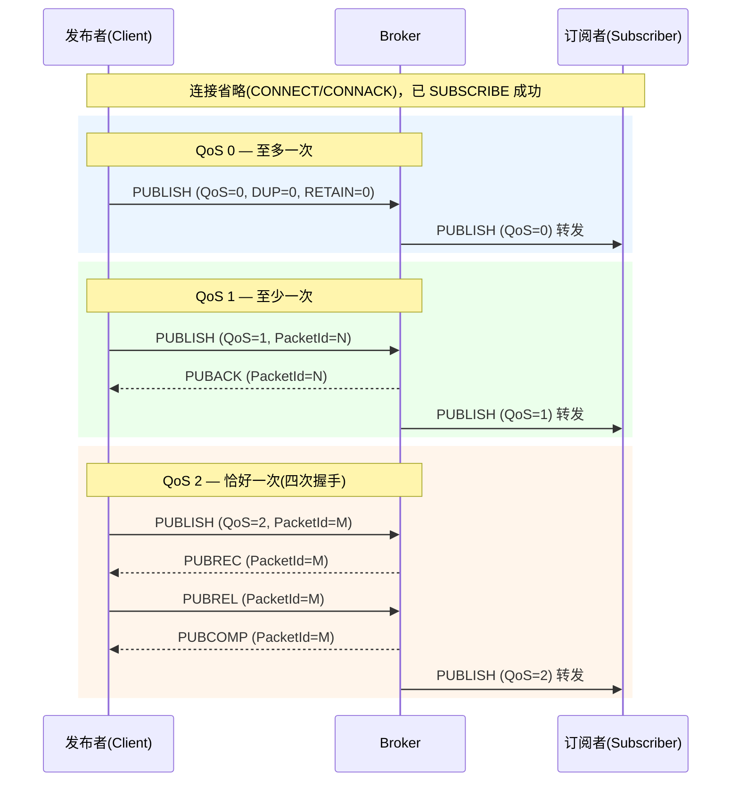
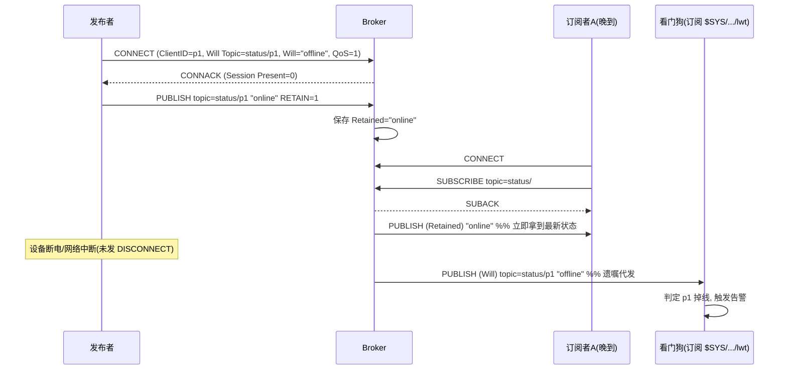
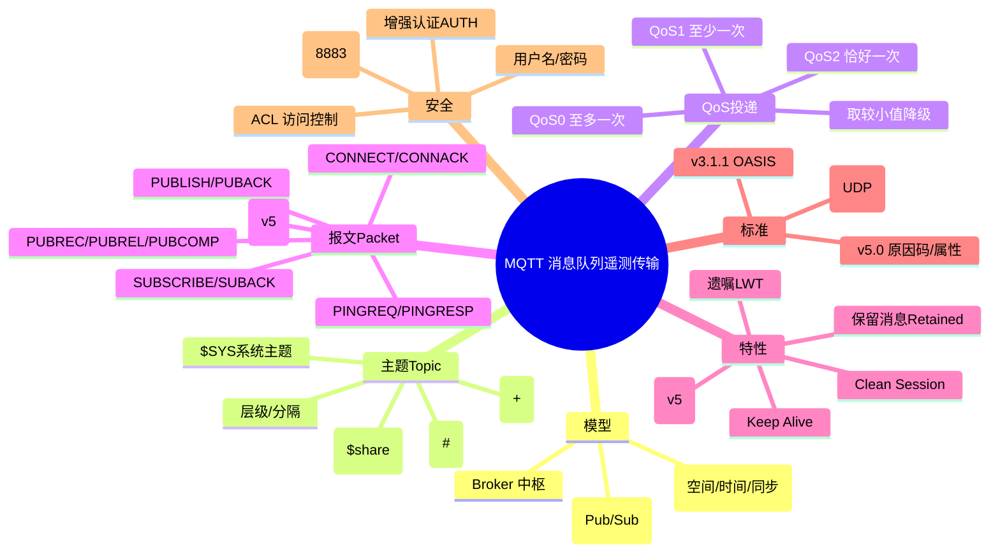

## 先建立直觉

先别管报文格式和控制位，记住 MQTT 的三件套：**发布者、订阅者、Broker（中转站）**。设备之间从不直接说话，所有消息都先交给 Broker，由它按"主题"转发给关心的人。

几个直觉要点：

- **大家都只连 Broker 一个点**：成千上万设备不再是两两直连（那会是 O(n²) 条连接爆炸），而是星型——每个设备一条到 Broker 的长连接。这是 MQTT 在物联网里能 scale 的根本原因。
- **主题（Topic）是"地址"也是"频道"**：消息不是发给某个人，而是发到 `factory/line1/temp` 这样一个以 `/` 分层的"频道名"上；谁订阅了这个频道（或它的通配符）谁就收到。
- **投递质量可选**：你可以选"发了就忘"（QoS 0）、"至少送到一次"（QoS 1）、"恰好一次"（QoS 2），按重要性和省电需求权衡。
- **几个"贴心"机制**：新来的订阅者能立刻拿到最新值（保留消息）、设备暴毙时 Broker 会代发"我挂了"（遗嘱）、断线重连还能补收离线消息（会话）。

一句话：**MQTT = 设备只跟 Broker 说话、Broker 按主题分发、轻量长连接的"公告板网络"。** 下文逐层拆开。

## 它解决什么问题

在物联网场景里，MQTT 要解决的不是"能不能传"，而是"在设备巨多、网络差、电量少的条件下怎么传得省"：

- **设备多、网络差、电量少**：HTTP 这类"一问一答 + 重头部"的协议在百万级传感器、弱网、2G/NB-IoT 下太重。MQTT 头部最小仅 **2 字节**，采用长连接 + 心跳，极大节省带宽与电量。
- **多对多通信的拓扑爆炸**：若设备两两直连，连接数为 O(n²)。引入 Broker 后，每个设备只需一条到 Broker 的连接，拓扑变为星型，连接数降为 O(n)。
- **异步与离线投递**：发布者发完即可离线；订阅者上线后通过**保留消息（Retained）**拿到最新状态，通过**持久会话**拿到离线期间的消息。
- **一对多 / 多对一广播**：一个传感器读数可同时被大屏、告警引擎、数据库写入等多个消费者订阅（发布/订阅的天然 fan-out）。

## 工作流程（简化版）

一次最典型的 MQTT 交互，按"建连 → 订阅 → 发布/转发 → 保活/断开"走：

1. **建连（CONNECT / CONNACK）**：客户端 TCP 连上 1883/8883，发 CONNECT（带 ClientID、凭据、是否清理会话、还可以声明遗嘱），Broker 回 CONNACK（含 Session Present、返回码/原因码）。
2. **订阅（SUBSCRIBE / SUBACK）**：订阅者声明关心的 Topic 过滤器（可带 `+`/`#` 通配符）和期望 QoS；Broker 回 SUBACK 告诉实际授予的 QoS。
3. **发布与扇出（PUBLISH）**：发布者往某 Topic 发消息；Broker 查订阅表，把消息**扇出**给所有匹配的订阅者。**最终 QoS = 发布 QoS 与订阅 QoS 取较小值**。
4. **保活 / 断开**：闲时客户端定时 PINGREQ、Broker 回 PINGRESP 维持长连接；正常结束发 DISCONNECT，异常断线则触发遗嘱 LWT。

> 注意第 3 步的"取小值"——这是 QoS 排错的高频坑，下文会专门讲。

## 报文 / 头部长什么样

MQTT 报文都很小，先记住"固定头 + 可变头 + 载荷"的三段式，再看具体字段。

### 1. 发布/订阅与 Broker 中转模型

下面这张图把"发布者只管发、订阅者只管收、Broker 居中扇出"的关系画出来，配合理解后面的报文流向：

```
         发布者(Publisher) 订阅者(Subscriber)
        ┌──────────────┐ ┌──────────────┐
        │ 传感器/App │ │ 大屏/告警引擎 │
        └──────┬───────┘ └──────▲───────┘
               │ PUBLISH │ 推送
               │ topic=factory/line1/temp │
               ▼ │
        ┌────────────────────────────────────┐
        │ Broker (代理) │
        │ 维护: 主题树 / 订阅表 / 保留消息 │
        │ 会话 / 遗嘱 / 桥接 │
        └────────────────────────────────────┘
               ▲ │
               │ SUBSCRIBE │ PUBLISH
               │ topic=factory/+/temp │
        ┌──────┴───────┐ ┌──────┴───────┐
        │ 手机 App 订阅 │ │ 数据库写入程序 │
        └──────────────┘ └──────────────┘
```

- **发布者（Publisher）** 只管往某个 Topic 发消息，不知道谁在收。
- **订阅者（Subscriber）** 只管声明关心哪些 Topic（可用通配符），不需要知道谁在发。
- **Broker（消息代理）** 是中枢：接收 PUBLISH，根据订阅表把消息**扇出（fan-out）**给所有匹配订阅者；同时维护保留消息、会话状态、遗嘱。

### 2. Topic（主题）层级与通配符

主题是一个以 `/` 分隔的 UTF-8 字符串层级树，区分大小写，可包含空格，但**不能包含通配符字符作为字面量**（即主题名本身不能用 `+` `#`）。

| 通配符 | 名称 | 含义 | 示例 |
|--------|------|------|------|
| `+` | 单层通配（Single-level） | 匹配**恰好一层**中任意名 | `factory/+/temp` 匹配 `factory/line1/temp`、`factory/line2/temp`，但**不匹配** `factory/line1/machineA/temp`（层数不符） |
| `#` | 多层通配（Multi-level） | 匹配**其后所有层级**（含自身层），必须放在主题**最末尾** | `factory/#` 匹配 `factory` 及其下任意深层主题 |
| （无） | 精确主题 | 精确字符串匹配 | `factory/line1/temp` 仅匹配自身 |

- **以 `$` 开头的主题**为 Broker 内部/系统主题（如 `$SYS/broker/load/bytes/received`、`$share/group/topic`），普通通配符订阅**不会**匹配 `$` 开头主题（须显式订阅）。
- **共享订阅（MQTT 5 / 多数 v3.1.1 实现扩展）**：`$share/<group>/<topic>`，同一 group 内多个消费者**分摊**消息（负载均衡），而非每人一份。

### 3. 连接生命周期

```
客户端 ──TCP 三次握手──► Broker
客户端 ──CONNECT──► Broker
客户端 ◄──CONNACK── Broker
   （此后可任意 PUBLISH / SUBSCRIBE / 收 PUBLISH）
周期性: 客户端 ──PINGREQ──► Broker ──PINGRESP──► 客户端
断开: 客户端 ──DISCONNECT──► Broker （或异常断线触发遗嘱 LWT）
```

### 4. 固定头（Fixed Header，所有报文都有）

```
 byte 1: 控制报文类型(高4bit) + 标志位(低4bit, Flags)
 byte 2..5: 剩余长度(Remaining Length, 变长编码, 1~4 字节)
```

- **控制报文类型（Control Packet Type）**：高 4 位，取值 1~15（见下表）。
- **剩余长度**：除固定头外所有后续字节数，采用 **128 进制变长编码**（每字节最高位为"延续位"，低 7 位为数据），最大 4 字节（≤ 268,435,455 字节 ≈ 256 MB）。

| 类型值 | 报文名 | 方向 | 用途 | 低 4 位 Flags |
|--------|--------|------|------|---------------|
| 1 | CONNECT | C→B | 客户端连接请求（含 ClientID、遗嘱、凭据、Clean Session） | 0000（保留，必须为 0） |
| 2 | CONNACK | B→C | 连接确认（返回返回码/原因码、Session Present） | 0000 |
| 3 | PUBLISH | 双向 | 发布应用消息（核心） | DUP(1) QoS(2) RETAIN(1) |
| 4 | PUBACK | 双向 | QoS 1 确认 | 0000 |
| 5 | PUBREC | 双向 | QoS 2 第一步确认 | 0000 |
| 6 | PUBREL | 双向 | QoS 2 释放（**Flags 必须为 0010**） | 0010 |
| 7 | PUBCOMP | 双向 | QoS 2 完成 | 0000 |
| 8 | SUBSCRIBE | C→B | 订阅主题（含通配符与期望 QoS） | 0010 |
| 9 | SUBACK | B→C | 订阅确认（逐主题返回 QoS 或失败码） | 0000 |
| 10 | UNSUBSCRIBE | C→B | 取消订阅 | 0010 |
| 11 | UNSUBACK | B→C | 取消订阅确认 | 0000 |
| 12 | PINGREQ | C→B | 心跳请求 | 0000 |
| 13 | PINGRESP | B→C | 心跳响应 | 0000 |
| 14 | DISCONNECT | 双向 | 断开（MQTT 5 可带原因码） | 0000 |
| 15 | AUTH | 双向 | MQTT 5 增强认证（SCRAM 等） | 0000 |

### 5. CONNECT 可变头 + 载荷（v3.1.1）

可变头字段（顺序固定）：

| 字段 | 长度 | 说明 |
|------|------|------|
| Protocol Name | 变长 | 固定字符串 `MQTT`（前两字节长度 0x0004） |
| Protocol Level | 1B | **4 = v3.1.1**；**5 = v5.0** |
| Connect Flags | 1B | 见下 |
| Keep Alive | 2B | 保活秒数（服务端 1.5 倍未收到即断） |

**Connect Flags 位布局（1 字节，从上到下为高位→低位）**：

```
bit7 Username Flag (有用户名)
bit6 Password Flag (有密码)
bit5 Will Retain (遗嘱消息是否 retained)
bit4-3 Will QoS (遗嘱 QoS, 2 bit)
bit2 Will Flag (声明遗嘱)
bit1 Clean Session (v3.1.1；v5 改为 Clean Start)
bit0 保留(Reserved) (必须为 1，v3.1.1 规范规定)
```

- 载荷顺序（当对应 Flag 置位才出现）：ClientID → Will Topic → Will Message → User Name → Password。
- **ClientID** 必须全局唯一；若 Clean Session=1 且 ClientID 为空（长度 0），Broker 分配临时 ID（仅 v3.1.1 允许空 ID）。

### 6. PUBLISH / SUBSCRIBE 报文结构

**PUBLISH**：

- 固定头 Flags：**DUP**（重传标志，仅 QoS>0 重传时置 1）、**QoS**（2 bit）、**RETAIN**（1=保留消息）。
- 可变头：`Topic Name`（变长字符串）+ `Packet Identifier`（仅 QoS>0 时有 2 字节报文标识符）。
- 载荷（Payload）：应用消息体，二进制透明（PUBLISH 不携带"类型"，由 Topic 或 MQTT 5 的 Payload Format Indicator 约定）。

**SUBSCRIBE / SUBACK**：

- 请求载荷：一组 `(Topic Filter, Requested QoS)` 对，带一个 Packet Identifier。
- 响应 SUBACK：逐主题返回授予的 QoS（0/1/2）或失败码（0x80 = 失败，MQTT 5 用原因码细化）。

### 7. MQTT 5.0 关键增强

MQTT 5 在几乎所有报文的头/载荷后新增了"属性块"和细化原因码，下面是它相对 3.1.1 的主要升级：

- **原因码（Reason Code）**：替代 v3.1.1 单一的 CONNACK 返回码，几乎所有响应都有细化原因（如 0x80 失败、0x91 不支持的 QoS、0x97 收配额超限）。
- **Properties**（属性块）：可变头/载荷后新增属性区，含 `Session Expiry Interval`、`Receive Maximum`、`Topic Alias`（主题别名，省带宽）、`Message Expiry`、`User Property`、`Content Type`、`Response Topic`（实现请求/响应模式）、`Correlation Data` 等。
- **Clean Start + Session Expiry Interval** 取代 Clean Session：更精细地控制会话持久化时长（0 = 断开即清，0xFFFFFFFF = 永不过期）。
- **共享订阅 `$share`、消息过期、载荷格式指示、增强认证 AUTH** 均为 v5 引入或标准化。

## 交互时序

下面两张图分别演示"QoS 0/1/2 三种发布握手"和"连接、订阅、保留消息、遗嘱"的完整交互。**一句话看懂这两张图**：第一张说明 QoS 越高握手越多（QoS2 是 PUBREC→PUBREL→PUBCOMP 四次握手）；第二张说明 Broker 怎么替发布者"记住当前值"（Retained）和"代发遗言"（LWT）——新订阅者一上线就拿到 online，设备暴毙时看门狗收到 offline。

### 场景一：QoS 0 / QoS 1 / QoS 2 发布握手



### 场景二：连接、订阅、保留消息与遗嘱



## 关键机制 / 变体

下面 6 个机制，解释了 MQTT "为什么有时重复、有时丢、晚来者怎么拿到当前值、设备挂了怎么知道"。每条先一句话定位。

### 1. QoS 的"木桶效应"与降级

（一句话：消息最终投递质量 = **发布 QoS 与订阅 QoS 取较小值**，Broker 按订阅者请求的 QoS 转发——这是"以为 QoS2 就不丢不重"误解的根源。）

- 消息最终投递质量 = **发布时 QoS 与订阅时 QoS 取较小值**（Broker 转发时按订阅者请求的 QoS 投递）。
- 例如发布 QoS 2、订阅者请求 QoS 1，则 Broker 以 QoS 1 转发（只做 PUBACK，不做完整四次握手）。

### 2. 保留消息（Retained Message）

（一句话：Broker 替每个 Topic 存"最后一条 retained"，新订阅者一上线立刻拿到当前值，不用干等下一次发布。）

- 任意 QoS 的 PUBLISH 带 RETAIN=1，Broker 会**用新值覆盖**该 Topic 的保留消息。
- 新订阅者 SUBACK 后立即收到最新保留值，无需等待下次发布——常用于"上线即知当前状态"（如设备在线/离线、当前温度）。
- 发送一条 RETAIN=1 且**空载荷（零长度）**的 PUBLISH 可**清除**该 Topic 的保留消息。

### 3. 遗嘱消息（LWT）

（一句话：在 CONNECT 时"立遗嘱"，只有异常断线时 Broker 才代发，正常 DISCONNECT 不触发。）

- 连接在 CONNECT 时通过 Will Flag + Will Topic + Will Message 声明；Broker 在连接**非正常关闭**（TCP 异常断、心跳超时、未发 DISCONNECT）时自动发布遗嘱。
- **正常 DISCONNECT 不会触发遗嘱**。遗嘱本身也有 QoS/Retain，可设为保留消息让"offline"持久可见。

### 4. Clean Session / 会话持久化

（一句话：控制"断线后我的订阅和离线消息还在不在"——v3.1.1 用 Clean Session 一个开关，v5 拆成 Clean Start + Session Expiry 更精细。）

- **v3.1.1 Clean Session=1**：断线即清除该 ClientID 的订阅与离线消息；=0 则 Broker 保存订阅与 QoS1/2 离线消息供重连后补发。
- **MQTT 5**：`Clean Start`（连接时是否从头开始）+ `Session Expiry Interval`（会话保留时长）解耦，控制更灵活。
- CONNACK 的 **Session Present** 位告诉客户端"你的旧会话是否还在"（避免重复订阅/重发历史）。

### 5. Keep Alive 与心跳

（一句话：客户端声明保活间隔，1.5 倍没动静 Broker 就判定掉线、触发遗嘱；闲时靠 PINGREQ/PINGRESP 维持长连接。）

- 客户端在 CONNECT 声明 Keep Alive（秒）。若 1.5×Keep Alive 内无任何报文（含 PUBLISH），Broker 视为掉线并触发遗嘱。
- 客户端可发 **PINGREQ**，Broker 回 **PINGRESP** 证明连接存活（即使没有业务数据也维持长连接）。

### 6. MQTT 5 的请求/响应模式

（一句话：靠 `Response Topic` + `Correlation Data` 两个属性，订阅者可在收到消息后向指定主题回发，实现类 RPC 双向交互而不必预约定外主题。）

- 通过属性 `Response Topic` + `Correlation Data`，订阅者收到消息后可向指定 Response Topic 回发，实现类 RPC 的双向交互，而无需预先约定额外主题。

## 常见误区

1. **"我发了 QoS 2，消息就一定恰好一次送达"** —— 错。最终投递质量取**发布与订阅 QoS 的较小值**。你发 QoS2，但订阅者只请求 QoS1，Broker 就按 QoS1 转发（只 PUBACK，不跑四次握手），仍可能重复。
2. **"晚订阅的客户端会补收历史消息"** —— 错。普通 PUBLISH 不发 retained，晚来者只会收到"以后的"消息，永远不会拿到"当前值"。要上线即知当前状态必须 `RETAIN=1`。
3. **"客户端退出就会触发遗嘱"** —— 错。只有**异常断线/心跳超时**才触发遗嘱，**正常 DISCONNECT 不触发**。调试遗嘱要拔网线/断电，不能靠优雅退出。
4. **"MQTT 自带加密，1883 公网随便开"** —— 大错。1883 是**明文**，用户名密码和消息都裸奔；公网必须关匿名、上 8883 TLS、配 ACL。
5. **"主题里能随便用 `+`/`#` 当普通字符"** —— 错。`+` 和 `#` 是通配符保留字，主题名本身不能包含它们；而且 `$` 开头的系统主题普通通配符订阅匹配不到，必须显式订阅。

## 速记口诀

- **"只连 Broker 一个点，主题当频道发"**：星型拓扑 + 发布/订阅，这是 MQTT 能扛海量设备的根基。
- **"QoS 取小值，别指望高"**：发布 2、订阅 1，实际就按 1 跑。
- **"上线要当前值，RETAIN 不能少"**：关键状态用保留消息，晚订阅者才不抓瞎。
- **"遗嘱只管暴毙，优雅退出不触发"**：正常 DISCONNECT 不发 LWT。
- **"1883 明文、8883 TLS"**：公网明文必出事。

## 知识框架


