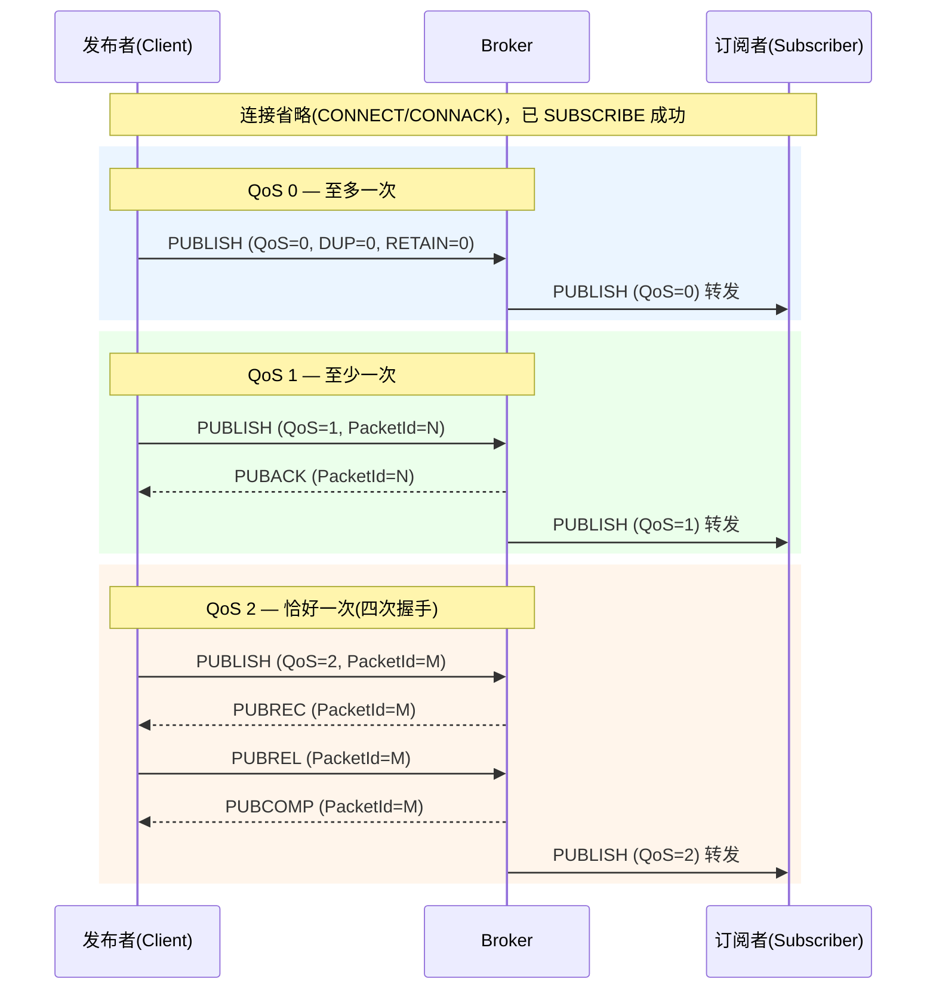
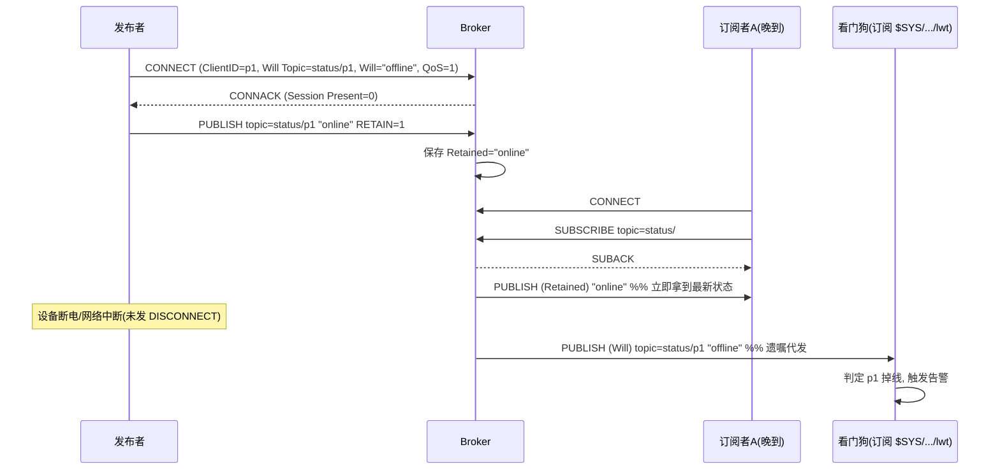
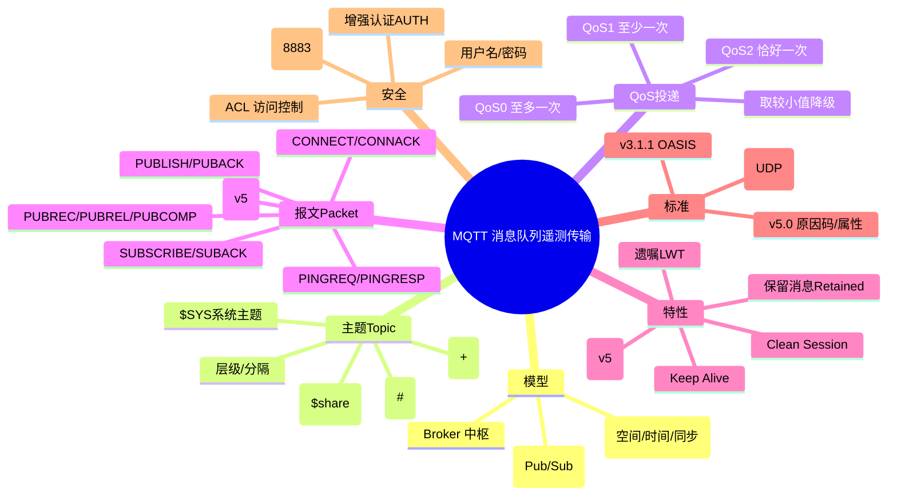

## 工作原理

### 1. 发布/订阅与 Broker 中转模型

```
         发布者(Publisher)              订阅者(Subscriber)
        ┌──────────────┐              ┌──────────────┐
        │  传感器/App   │              │  大屏/告警引擎 │
        └──────┬───────┘              └──────▲───────┘
               │ PUBLISH                     │ 推送
               │ topic=factory/line1/temp    │
               ▼                             │
        ┌────────────────────────────────────┐
        │            Broker (代理)            │
        │  维护: 主题树 / 订阅表 / 保留消息     │
        │  会话 / 遗嘱 / 桥接                  │
        └────────────────────────────────────┘
               ▲                             │
               │ SUBSCRIBE                   │ PUBLISH
               │ topic=factory/+/temp        │
        ┌──────┴───────┐              ┌──────┴───────┐
        │ 手机 App 订阅 │              │ 数据库写入程序 │
        └──────────────┘              └──────────────┘
```

- **发布者（Publisher）** 只管往某个 Topic 发消息，不知道谁在收。
- **订阅者（Subscriber）** 只管声明关心哪些 Topic（可用通配符），不需要知道谁在发。
- **Broker（消息代理）** 是中枢：接收 PUBLISH，根据订阅表把消息**扇出（fan-out）**给所有匹配订阅者；同时维护保留消息、会话状态、遗嘱。

### 2. Topic（主题）层级与通配符

- 主题是一个以 `/` 分隔的 UTF-8 字符串层级树，区分大小写，可包含空格，但**不能包含通配符字符作为字面量**（即主题名本身不能用 `+` `#`）。
- 每层可以任意命名，例如：`factory/line1/machineA/temp`。

| 通配符 | 名称 | 含义 | 示例 |
|--------|------|------|------|
| `+` | 单层通配（Single-level） | 匹配**恰好一层**中任意名 | `factory/+/temp` 匹配 `factory/line1/temp`、`factory/line2/temp`，但**不匹配** `factory/line1/machineA/temp`（层数不符） |
| `#` | 多层通配（Multi-level） | 匹配**其后所有层级**（含自身层），必须放在主题**最末尾** | `factory/#` 匹配 `factory` 及其下任意深层主题 |
| （无） | 精确主题 | 精确字符串匹配 | `factory/line1/temp` 仅匹配自身 |

- **以 `$` 开头的主题**为 Broker 内部/系统主题（如 `$SYS/broker/load/bytes/received`、`$share/group/topic`），普通通配符订阅**不会**匹配 `$` 开头主题（须显式订阅）。
- **共享订阅（MQTT 5 / 多数 v3.1.1 实现扩展）**：`$share/<group>/<topic>`，同一 group 内多个消费者**分摊**消息（负载均衡），而非每人一份。

### 3. 连接生命周期

```
客户端 ──TCP 三次握手──► Broker
客户端 ──CONNECT──► Broker
客户端 ◄──CONNACK──  Broker
   （此后可任意 PUBLISH / SUBSCRIBE / 收 PUBLISH）
周期性: 客户端 ──PINGREQ──► Broker ──PINGRESP──► 客户端
断开: 客户端 ──DISCONNECT──► Broker  （或异常断线触发遗嘱 LWT）
```

## 报文 / 头部结构

### 1. 固定头（Fixed Header，所有报文都有）

```
 byte 1:    控制报文类型(高4bit) + 标志位(低4bit, Flags)
 byte 2..5: 剩余长度(Remaining Length, 变长编码, 1~4 字节)
```

- **控制报文类型（Control Packet Type）**：高 4 位，取值 1~15（见下表）。
- **剩余长度**：除固定头外所有后续字节数，采用 **128 进制变长编码**（每字节最高位为"延续位"，低 7 位为数据），最大 4 字节（≤ 268,435,455 字节 ≈ 256 MB）。

| 类型值 | 报文名 | 方向 | 用途 | 低 4 位 Flags |
|--------|--------|------|------|---------------|
| 1 | CONNECT | C→B | 客户端连接请求（含 ClientID、遗嘱、凭据、Clean Session） | 0000（保留，必须为 0） |
| 2 | CONNACK | B→C | 连接确认（返回返回码/原因码、Session Present） | 0000 |
| 3 | PUBLISH | 双向 | 发布应用消息（核心） | DUP(1) QoS(2) RETAIN(1) |
| 4 | PUBACK | 双向 | QoS 1 确认 | 0000 |
| 5 | PUBREC | 双向 | QoS 2 第一步确认 | 0000 |
| 6 | PUBREL | 双向 | QoS 2 释放（**Flags 必须为 0010**） | 0010 |
| 7 | PUBCOMP | 双向 | QoS 2 完成 | 0000 |
| 8 | SUBSCRIBE | C→B | 订阅主题（含通配符与期望 QoS） | 0010 |
| 9 | SUBACK | B→C | 订阅确认（逐主题返回 QoS 或失败码） | 0000 |
| 10 | UNSUBSCRIBE | C→B | 取消订阅 | 0010 |
| 11 | UNSUBACK | B→C | 取消订阅确认 | 0000 |
| 12 | PINGREQ | C→B | 心跳请求 | 0000 |
| 13 | PINGRESP | B→C | 心跳响应 | 0000 |
| 14 | DISCONNECT | 双向 | 断开（MQTT 5 可带原因码） | 0000 |
| 15 | AUTH | 双向 | MQTT 5 增强认证（SCRAM 等） | 0000 |

### 2. CONNECT 可变头 + 载荷（v3.1.1）

可变头字段（顺序固定）：

| 字段 | 长度 | 说明 |
|------|------|------|
| Protocol Name | 变长 | 固定字符串 `MQTT`（前两字节长度 0x0004） |
| Protocol Level | 1B | **4 = v3.1.1**；**5 = v5.0** |
| Connect Flags | 1B | 见下 |
| Keep Alive | 2B | 保活秒数（服务端 1.5 倍未收到即断） |

**Connect Flags 位布局（1 字节，从上到下为高位→低位）**：

```
bit7  Username Flag       (有用户名)
bit6  Password Flag       (有密码)
bit5  Will Retain         (遗嘱消息是否 retained)
bit4-3 Will QoS           (遗嘱 QoS, 2 bit)
bit2  Will Flag           (声明遗嘱)
bit1  Clean Session       (v3.1.1；v5 改为 Clean Start)
bit0  保留(Reserved)       (必须为 1，v3.1.1 规范规定)
```

- 载荷顺序（当对应 Flag 置位才出现）：ClientID → Will Topic → Will Message → User Name → Password。
- **ClientID** 必须全局唯一；若 Clean Session=1 且 ClientID 为空（长度 0），Broker 分配临时 ID（仅 v3.1.1 允许空 ID）。

### 3. PUBLISH 报文结构

- 固定头 Flags：**DUP**（重传标志，仅 QoS>0 重传时置 1）、**QoS**（2 bit）、**RETAIN**（1=保留消息）。
- 可变头：`Topic Name`（变长字符串）+ `Packet Identifier`（仅 QoS>0 时有 2 字节报文标识符）。
- 载荷（Payload）：应用消息体，二进制透明（PUBLISH 不携带"类型"，由 Topic 或 MQTT 5 的 Payload Format Indicator 约定）。

### 4. SUBSCRIBE / SUBACK

- 请求载荷：一组 `(Topic Filter, Requested QoS)` 对，带一个 Packet Identifier。
- 响应 SUBACK：逐主题返回授予的 QoS（0/1/2）或失败码（0x80 = 失败，MQTT 5 用原因码细化）。

### 5. MQTT 5.0 关键增强（CONNACK / 报文均引入）

- **原因码（Reason Code）**：替代 v3.1.1 单一的 CONNACK 返回码，几乎所有响应都有细化原因（如 0x80 失败、0x91 不支持的 QoS、0x97 收配额超限）。
- **Properties**（属性块）：可变头/载荷后新增属性区，含 `Session Expiry Interval`、`Receive Maximum`、`Topic Alias`（主题别名，省带宽）、`Message Expiry`、`User Property`、`Content Type`、`Response Topic`（实现请求/响应模式）、`Correlation Data` 等。
- **Clean Start + Session Expiry Interval** 取代 Clean Session：更精细地控制会话持久化时长（0 = 断开即清，0xFFFFFFFF = 永不过期）。
- **共享订阅 `$share`、消息过期、载荷格式指示、增强认证 AUTH** 均为 v5 引入或标准化。

## 交互流程（mermaid 时序图）

### 场景一：QoS 0 / QoS 1 / QoS 2 发布握手



### 场景二：连接、订阅、保留消息与遗嘱



## 关键机制

### 1. QoS 的"木桶效应"与降级

- 消息最终投递质量 = **发布时 QoS 与订阅时 QoS 取较小值**（Broker 转发时按订阅者请求的 QoS 投递）。
- 例如发布 QoS 2、订阅者请求 QoS 1，则 Broker 以 QoS 1 转发（只做 PUBACK，不做完整四次握手）。

### 2. 保留消息（Retained Message）

- 任意 QoS 的 PUBLISH 带 RETAIN=1，Broker 会**用新值覆盖**该 Topic 的保留消息。
- 新订阅者 SUBACK 后立即收到最新保留值，无需等待下次发布——常用于"上线即知当前状态"（如设备在线/离线、当前温度）。
- 发送一条 RETAIN=1 且**空载荷（零长度）**的 PUBLISH 可**清除**该 Topic 的保留消息。

### 3. 遗嘱消息（LWT）

- 连接在 CONNECT 时通过 Will Flag + Will Topic + Will Message 声明；Broker 在连接**非正常关闭**（TCP 异常断、心跳超时、未发 DISCONNECT）时自动发布遗嘱。
- **正常 DISCONNECT 不会触发遗嘱**。遗嘱本身也有 QoS/Retain，可设为保留消息让"offline"持久可见。

### 4. Clean Session / 会话持久化

- **v3.1.1 Clean Session=1**：断线即清除该 ClientID 的订阅与离线消息；=0 则 Broker 保存订阅与 QoS1/2 离线消息供重连后补发。
- **MQTT 5**：`Clean Start`（连接时是否从头开始）+ `Session Expiry Interval`（会话保留时长）解耦，控制更灵活。
- CONNACK 的 **Session Present** 位告诉客户端"你的旧会话是否还在"（避免重复订阅/重发历史）。

### 5. Keep Alive 与心跳

- 客户端在 CONNECT 声明 Keep Alive（秒）。若 1.5×Keep Alive 内无任何报文（含 PUBLISH），Broker 视为掉线并触发遗嘱。
- 客户端可发 **PINGREQ**，Broker 回 **PINGRESP** 证明连接存活（即使没有业务数据也维持长连接）。

### 6. MQTT 5 的请求/响应模式

- 通过属性 `Response Topic` + `Correlation Data`，订阅者收到消息后可向指定 Response Topic 回发，实现类 RPC 的双向交互，而无需预先约定额外主题。

## 知识框架（mermaid 思维导图）


