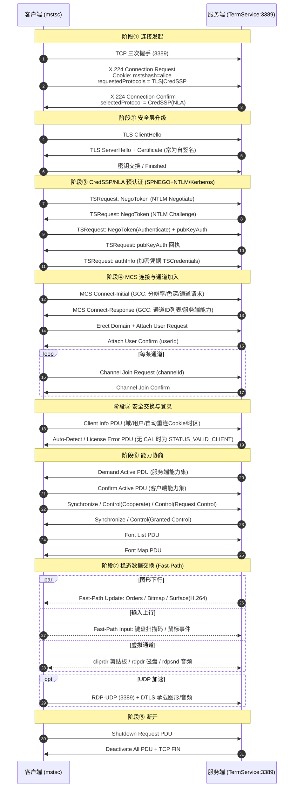
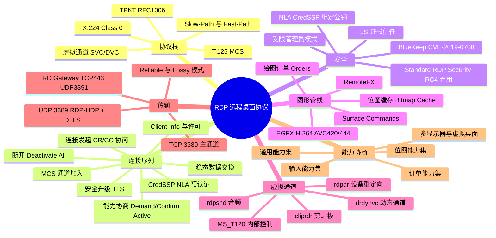

## 1. 工作原理

RDP 的本质是一条 TCP 连接上跑的**多通道会议协议**。它继承自 ITU-T T.120 多点会议系列，因此栈比一般应用层协议"厚"：

```
应用数据（图形订单 / 输入事件 / 剪贴板 / 音频 / 驱动器）
        ↓
虚拟通道（Static VC 最多 31 条 + Dynamic VC）
        ↓
T.125 MCS（Multipoint Communication Service，通道 Join / Send Data）
        ↓
X.224 Class 0（连接请求 CR / 确认 CC / 数据 DT）
        ↓
TPKT（RFC 1006，4 字节头，给 X.224 加长度定界）
        ↓
TLS / CredSSP（可选但现代部署必开）
        ↓
TCP 3389
```

**核心工作循环**：

1. **服务端 → 客户端**：发送 *Graphics Update*。不是发整屏图片，而是优先发**绘图订单（Orders）**（如 `MemBlt` 位图块传送、`ScrBlt` 屏幕块搬移、`PatBlt` 图案填充、`GlyphIndex` 文字绘制）；无法用订单表达的区域退化为**位图更新**（RLE 压缩）或 **Surface Command**（RemoteFX / H.264 编码帧）。
2. **客户端 → 服务端**：发送 *Input Event PDU*（键盘扫描码、鼠标坐标与按键、Unicode 输入、同步事件）。
3. **双向**：虚拟通道数据（剪贴板内容、打印任务、音频 PCM/压缩流、重定向磁盘的 I/O 请求）与控制 PDU（心跳、错误、会话注销）。

**两种数据路径**：

| 路径 | 说明 | 用途 |
|------|------|------|
| **Slow-Path** | 完整走 TPKT + X.224 + MCS + Security Header，头部开销大 | 连接建立、能力协商、控制类 PDU |
| **Fast-Path** | 精简头部（首字节即动作标志，省掉 X.224/MCS 头），最小 2 字节 | 稳态阶段的输入事件与图形更新，降低每包开销 |

**带宽优化三板斧**：位图缓存（Bitmap Cache，客户端持久化缓存，命中则只传缓存键）、绘图订单（矢量指令代替像素）、批量压缩（MPPC / RDP 6.1 bulk compression、后续 H.264）。

## 2. 报文 / 头部结构

### 2.1 TPKT 头（RFC 1006，4 字节）

| 字段 | 长度 | 含义 |
|------|------|------|
| `version` | 1 字节 | 固定 `0x03`（**抓包识别 RDP 的第一特征**） |
| `reserved` | 1 字节 | 保留，`0x00` |
| `length` | 2 字节 | 整个 TPKT 包长（含 4 字节头），大端序 |

### 2.2 X.224 Class 0 头

| 字段 | 长度 | 含义 |
|------|------|------|
| `LI` (Length Indicator) | 1 字节 | X.224 头长度（不含本字节） |
| `TPDU Code` | 1 字节 | `0xE0`=Connection Request(CR)、`0xD0`=Connection Confirm(CC)、`0xF0`=Data(DT) |
| `DST-REF / SRC-REF` | 各 2 字节 | 目的/源引用（RDP 中通常为 0） |
| `Class Option` | 1 字节 | Class 0 → `0x00` |

CR/CC 报文尾部携带 **RDP Negotiation Request/Response**，这是安全协商的关键：

| 字段 | 值 | 含义 |
|------|-----|------|
| `type` | `0x01` Request / `0x02` Response / `0x03` Failure | 协商类型 |
| `requestedProtocols` | 位图 | `0x00`=Standard RDP Security；`0x01`=**TLS**；`0x02`=**CredSSP(NLA)**；`0x08`=RDSTLS；`0x10`=CredSSP with Early User Auth |
| `flags` | 位图 | 如 `RESTRICTED_ADMIN_MODE_REQUIRED`（受限管理员模式） |

CR 中还常见明文的 **Cookie**：`Cookie: mstshash=<用户名>\r\n`——这是抓包中**唯一可见的明文用户提示**，也是负载均衡路由依据（RDS Connection Broker 用它做会话定向）。

### 2.3 T.125 MCS 关键 PDU

| PDU | 作用 |
|------|------|
| `Connect-Initial` / `Connect-Response` | 交换 GCC Conference Create Request/Response，内含**客户端核心数据**（分辨率、色深、客户端名、键盘布局、build 号）与**服务端核心数据**（RDP 版本、通道 ID 列表、证书） |
| `Erect Domain Request` | 建立 MCS 域 |
| `Attach User Request/Confirm` | 分配用户通道 ID |
| `Channel Join Request/Confirm` | 逐条 Join 通道（用户通道、I/O 通道 `1003`、各静态虚拟通道） |
| `Send Data Request/Indication` | 承载后续所有业务数据，带 `channelId` 区分通道 |

### 2.4 Share Control / Share Data 头（Slow-Path 业务 PDU）

| 字段 | 含义 |
|------|------|
| `totalLength` | PDU 总长 |
| `pduType` | 低 4 位：`1`=Demand Active、`3`=Confirm Active、`6`=Deactivate All、`7`=Data PDU |
| `PDUSource` | 发送方通道 ID |
| `shareId` | 会话共享标识 |
| `pduType2` (Data PDU) | `2`=Update、`28`=Input、`31`=Synchronize、`20`=Control、`39`=Logon、`33`=Shutdown Request |
| `compressedType` | 压缩算法与标志（MPPC 8K/64K 等） |

### 2.5 Fast-Path 输出头

| 字段 | 长度 | 含义 |
|------|------|------|
| `fpOutputHeader` | 1 字节 | 低 2 位 action（`0`=FASTPATH_OUTPUT）、加密与压缩标志位 |
| `length1/length2` | 1~2 字节 | 变长长度编码（最高位标识是否 2 字节） |
| `fpOutputUpdates` | 变长 | 更新数据：`0`=Orders、`1`=Bitmap、`2`=Palette、`3`=Synchronize、`4`=Surface Commands、`5`=Pointer 相关 |

### 2.6 常见静态虚拟通道名

| 通道名 | 用途 |
|--------|------|
| `rdpdr` | 设备重定向（磁盘、打印机、串并口、智能卡） |
| `cliprdr` | 剪贴板同步 |
| `rdpsnd` | 音频输出 |
| `drdynvc` | 动态虚拟通道容器（内含 `AUDIO_INPUT`、`Microsoft::Windows::RDS::Graphics`(EGFX)、`RDCamera` 等） |
| `MS_T120` | 内部控制通道（**CVE-2019-0708 "BlueKeep" 即滥用此通道的释放后重用**） |

## 3. 交互流程



## 4. 关键机制

### 4.1 安全协商三档

| 模式 | 加密 | 认证时机 | 风险 |
|------|------|---------|------|
| **Standard RDP Security** | RC4（40/56/128 bit），服务端 RSA 密钥对 | 建立会话后在登录界面认证 | 已彻底弃用，易被中间人与降级攻击 |
| **TLS (SSL)** | TLS 1.0~1.3 | 会话建立后认证 | 证书多为自签名，需手工信任否则不防 MITM |
| **CredSSP / NLA** | TLS + SPNEGO(NTLM/Kerberos) | **连接前预认证** | 推荐。可防未认证会话消耗资源，缓解 BlueKeep 类漏洞 |

**NLA 的核心巧思**：CredSSP 用 `pubKeyAuth` 字段把 TLS 服务端公钥经会话密钥签名回传，绑定 TLS 通道与认证过程，阻断中间人重放。

### 4.2 虚拟通道与动态虚拟通道

- **静态虚拟通道（SVC）**：连接时在 GCC 阶段一次性声明，最多 31 条，每条 chunk 上限 1600 字节，需要分片重组（`CHANNEL_FLAG_FIRST/LAST`）。
- **动态虚拟通道（DVC）**：跑在 `drdynvc` 之上，可在会话中**按需创建/销毁**，突破 31 条限制。RemoteFX 图形（EGFX）、摄像头、音频输入均走 DVC。

### 4.3 图形管线演进

| 代际 | 技术 | 特点 |
|------|------|------|
| RDP 4/5 | Orders + Bitmap Cache | 面向 GDI 的 2D 指令，文字与窗口极省带宽 |
| RDP 7 | RemoteFX（RemoteFX Codec） | 面向富媒体，服务端 GPU/软件编码，渐进式传输 |
| RDP 8+ | **EGFX 管线**（Graphics Pipeline Extension）+ **H.264/AVC 420**、UDP 传输 | 视频与动画场景大幅改善，支持 Progressive Codec |
| RDP 10+ | **AVC 444**（全彩子采样） | 解决 H.264 4:2:0 下文字发虚问题 |

### 4.4 RDP-UDP（MS-RDPEUDP）

- 两种模式：**Reliable（RDPUDP_PROTOCOL_VERSION 1，带 ACK/重传）** 与 **Lossy（尽力交付，用于音视频）**。
- 加密使用 **DTLS**，密钥来源于 TCP 主通道协商出的会话上下文。
- UDP 只是**辅助传输**：TCP 通道始终存在，UDP 不通时自动回退，表现为"能连但拖动窗口卡顿"。

### 4.5 会话与授权

- **会话保持**：断线后 `TermService` 保留会话（默认不注销），可用 Auto-Reconnect Cookie 静默重连。
- **RDS CAL 授权**：Windows Server 作为多会话主机需要 RD 授权服务器发放 CAL；宽限期 120 天到期后会拒绝连接（License Error PDU）。工作站版 Windows 只允许 1 个交互会话。

## 5. 知识框架


