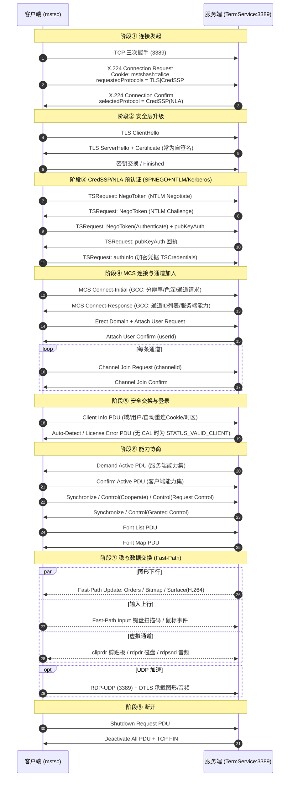
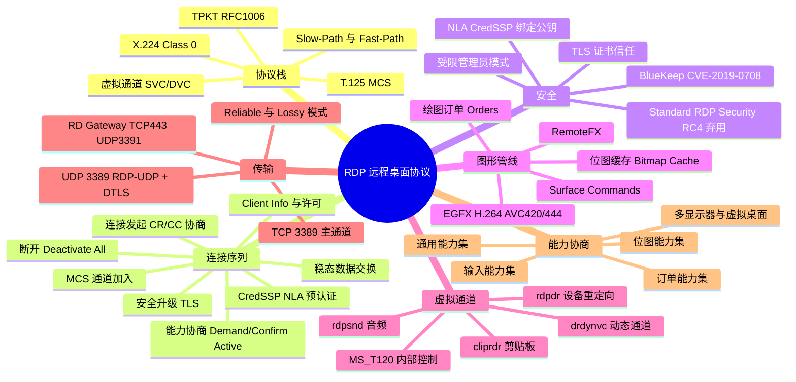

## 先建立直觉

RDP 干的事，说白了就是"**让你隔空操作另一台电脑，像坐在它面前一样**"。

你可以把它想成一场跨城市的现场直播加遥控：远端电脑不停地告诉你"画面上哪一块变成了什么样"，你则不停地把手上的键盘敲击和鼠标动作寄回去。为了让直播更省流量，它不发完整画面，而是发"该怎么画"的指令；为了让体验更像本机，它还额外拉了几条独立管道，把你的剪贴板、音箱、打印机、U 盘都"接"到远端去。

整篇教程剩下的所有复杂度，都只是在回答一个问题：这些管道怎么建、怎么谈、怎么加密、怎么省流量。

## 它解决什么问题

设想没有 RDP 的世界：Windows 上大量管理工作（AD 管理器、数据库管理工具、IIS 管理器）必须点鼠标才能完成，而字符终端只能敲命令——你要么亲自跑去机房，要么无从下手。

即便有了"传屏幕"的想法，直接把屏幕当视频传也不现实：一屏 1080p 真彩画面动辄几 MB，几百 Kbps 的链路根本扛不住。于是 RDP 选择只传"绘图动作"和"缓存里已有的那块图"，把带宽压到可用范围。

再往下一步，人在远端操作时总要复制粘贴、要打印、要读本地 U 盘上的文件——如果每次都得先上传到服务器，体验会碎掉。RDP 用虚拟通道把这些本地设备直接"借"到远端会话里，才让远程办公真正成立。

## 工作流程（简化版）

1. **敲门并谈安全等级**：客户端连上服务端的 TCP 3389，先问一句"我们用哪种加密和认证方式"。
2. **升级加密并（可选）提前验明身份**：套上 TLS；如果启用 NLA，还会在建立桌面会话之前就把账号密码验完。
3. **开管道**：双方协商出一堆通道（画面通道、剪贴板通道、磁盘通道、声音通道……），逐条"接通"。
4. **对表能力**：互相通报"我支持多大分辨率、什么色深、哪些绘图指令、哪种编码"，取交集。
5. **进入稳态循环**：服务端不停下发画面更新，客户端不停上传键鼠事件，虚拟通道上的数据双向流动，直到断开。

以上每一步的具体字段、PDU 名称和状态值，都在下面各节展开。

## 1. 工作原理

RDP 的本质是一条 TCP 连接上跑的**多通道会议协议**。它继承自 ITU-T T.120 多点会议系列，因此栈比一般应用层协议"厚"：

```
应用数据（图形订单 / 输入事件 / 剪贴板 / 音频 / 驱动器）
        ↓
虚拟通道（Static VC 最多 31 条 + Dynamic VC）
        ↓
T.125 MCS（Multipoint Communication Service，通道 Join / Send Data）
        ↓
X.224 Class 0（连接请求 CR / 确认 CC / 数据 DT）
        ↓
TPKT（RFC 1006，4 字节头，给 X.224 加长度定界）
        ↓
TLS / CredSSP（可选但现代部署必开）
        ↓
TCP 3389
```

**核心工作循环**：

1. **服务端 → 客户端**：发送 *Graphics Update*。不是发整屏图片，而是优先发**绘图订单（Orders）**（如 `MemBlt` 位图块传送、`ScrBlt` 屏幕块搬移、`PatBlt` 图案填充、`GlyphIndex` 文字绘制）；无法用订单表达的区域退化为**位图更新**（RLE 压缩）或 **Surface Command**（RemoteFX / H.264 编码帧）。
2. **客户端 → 服务端**：发送 *Input Event PDU*（键盘扫描码、鼠标坐标与按键、Unicode 输入、同步事件）。
3. **双向**：虚拟通道数据（剪贴板内容、打印任务、音频 PCM/压缩流、重定向磁盘的 I/O 请求）与控制 PDU（心跳、错误、会话注销）。

**两种数据路径**：

| 路径 | 说明 | 用途 |
|------|------|------|
| **Slow-Path** | 完整走 TPKT + X.224 + MCS + Security Header，头部开销大 | 连接建立、能力协商、控制类 PDU |
| **Fast-Path** | 精简头部（首字节即动作标志，省掉 X.224/MCS 头），最小 2 字节 | 稳态阶段的输入事件与图形更新，降低每包开销 |

**带宽优化三板斧**：位图缓存（Bitmap Cache，客户端持久化缓存，命中则只传缓存键）、绘图订单（矢量指令代替像素）、批量压缩（MPPC / RDP 6.1 bulk compression、后续 H.264）。

## 报文 / 头部长什么样

### 2.1 TPKT 头（RFC 1006，4 字节）

> 看这张表前先记住：**TPKT 就是给不懂"消息边界"的 TCP 加一个信封**，告诉对方"这一包有多长"。它只有 4 个字节，第一个字节永远是 `0x03`，这是你在抓包里一眼认出 RDP 的标志。

| 字段 | 长度 | 含义 |
|------|------|------|
| `version` | 1 字节 | 固定 `0x03`（**抓包识别 RDP 的第一特征**）／版本号 |
| `reserved` | 1 字节 | 保留（Reserved），`0x00` |
| `length` | 2 字节 | 整个 TPKT 包长（含 4 字节头），大端序 |

### 2.2 X.224 Class 0 头

> 看这张表前先记住：**X.224 负责"连接的开场白"**——谁请求、谁确认、之后哪些是普通数据。整个 RDP 会话里，它主要在开头露一次脸。

| 字段 | 长度 | 含义 |
|------|------|------|
| `LI` (Length Indicator，长度指示) | 1 字节 | X.224 头长度（不含本字节） |
| `TPDU Code`（传输协议数据单元类型码） | 1 字节 | `0xE0`=Connection Request(CR，连接请求)、`0xD0`=Connection Confirm(CC，连接确认)、`0xF0`=Data(DT，数据) |
| `DST-REF / SRC-REF`（目的/源引用） | 各 2 字节 | 目的/源引用（RDP 中通常为 0） |
| `Class Option`（类别选项） | 1 字节 | Class 0 → `0x00` |

CR/CC 报文尾部携带 **RDP Negotiation Request/Response**（协商请求/响应），这是安全协商的关键：

> 看这张表前先记住：**这就是双方"用哪种锁"的谈判记录**——客户端列出自己能接受的加密/认证方式，服务端挑一个回来。

| 字段 | 值 | 含义 |
|------|-----|------|
| `type`（类型） | `0x01` Request / `0x02` Response / `0x03` Failure | 协商类型 |
| `requestedProtocols`（请求的协议） | 位图 | `0x00`=Standard RDP Security；`0x01`=**TLS**；`0x02`=**CredSSP(NLA)**；`0x08`=RDSTLS；`0x10`=CredSSP with Early User Auth |
| `flags`（标志位） | 位图 | 如 `RESTRICTED_ADMIN_MODE_REQUIRED`（受限管理员模式） |

CR 中还常见明文的 **Cookie**：`Cookie: mstshash=<用户名>\r\n`——这是抓包中**唯一可见的明文用户提示**，也是负载均衡路由依据（RDS Connection Broker 用它做会话定向）。

### 2.3 T.125 MCS 关键 PDU

> 看这张表前先记住：**MCS 是"总机接线员"**——先建域、给你分个用户号，再让你一条一条地"接通"要用的通道；接通之后所有业务数据都从 `Send Data` 里走，靠 `channelId` 区分是哪条线。

| PDU（协议数据单元） | 作用 |
|------|------|
| `Connect-Initial` / `Connect-Response`（连接初始/连接响应） | 交换 GCC Conference Create Request/Response，内含**客户端核心数据**（分辨率、色深、客户端名、键盘布局、build 号）与**服务端核心数据**（RDP 版本、通道 ID 列表、证书） |
| `Erect Domain Request`（建立域请求） | 建立 MCS 域 |
| `Attach User Request/Confirm`（附加用户请求/确认） | 分配用户通道 ID |
| `Channel Join Request/Confirm`（通道加入请求/确认） | 逐条 Join 通道（用户通道、I/O 通道 `1003`、各静态虚拟通道） |
| `Send Data Request/Indication`（发送数据请求/指示） | 承载后续所有业务数据，带 `channelId` 区分通道 |

### 2.4 Share Control / Share Data 头（Slow-Path 业务 PDU）

> 看这张表前先记住：**这层头回答"这条消息是干嘛的"**——是服务端在通报能力、是客户端在回应、还是一次普通的画面更新或输入事件。`pduType` 与 `pduType2` 两个字段就是它的"分类标签"。

| 字段 | 含义 |
|------|------|
| `totalLength`（总长度） | PDU 总长 |
| `pduType`（PDU 类型） | 低 4 位：`1`=Demand Active、`3`=Confirm Active、`6`=Deactivate All、`7`=Data PDU |
| `PDUSource`（PDU 来源） | 发送方通道 ID |
| `shareId`（共享标识） | 会话共享标识 |
| `pduType2` (Data PDU，数据 PDU 子类型) | `2`=Update、`28`=Input、`31`=Synchronize、`20`=Control、`39`=Logon、`33`=Shutdown Request |
| `compressedType`（压缩类型） | 压缩算法与标志（MPPC 8K/64K 等） |

### 2.5 Fast-Path 输出头

> 看这张表前先记住：**这是"省字节版"的头**——连接谈完之后，画面和键鼠事件每秒要发很多包，再背着 X.224/MCS 那一大坨头太浪费，于是压缩到最少 2 字节。

| 字段 | 长度 | 含义 |
|------|------|------|
| `fpOutputHeader`（Fast-Path 输出头首字节） | 1 字节 | 低 2 位 action（`0`=FASTPATH_OUTPUT）、加密与压缩标志位 |
| `length1/length2`（长度字段） | 1~2 字节 | 变长长度编码（最高位标识是否 2 字节） |
| `fpOutputUpdates`（输出更新数据） | 变长 | 更新数据：`0`=Orders、`1`=Bitmap、`2`=Palette、`3`=Synchronize、`4`=Surface Commands、`5`=Pointer 相关 |

### 2.6 常见静态虚拟通道名

> 看这张表前先记住：**每个名字对应一类"额外功能"**——你在客户端勾选的"共享剪贴板、共享磁盘、播放声音"，落到协议上就是有没有这几条通道。

| 通道名 | 用途 |
|--------|------|
| `rdpdr` | 设备重定向（磁盘、打印机、串并口、智能卡） |
| `cliprdr` | 剪贴板同步 |
| `rdpsnd` | 音频输出 |
| `drdynvc` | 动态虚拟通道容器（内含 `AUDIO_INPUT`、`Microsoft::Windows::RDS::Graphics`(EGFX)、`RDCamera` 等） |
| `MS_T120` | 内部控制通道（**CVE-2019-0708 "BlueKeep" 即滥用此通道的释放后重用**） |

## 交互时序

> 一句话看懂这张图：**先谈安全 → 再验身份 → 然后一条条接通管道 → 双方对表能力 → 最后进入"画面下行、键鼠上行"的稳态循环**，中间任何一步谈崩，你在客户端看到的就是各种连接失败弹窗。



## 关键机制 / 变体

### 4.1 安全协商三档

**这是干什么的**：决定"数据怎么加密"和"什么时候验身份"这两件事，三档从旧到新、从弱到强。

| 模式 | 加密 | 认证时机 | 风险 |
|------|------|---------|------|
| **Standard RDP Security** | RC4（40/56/128 bit），服务端 RSA 密钥对 | 建立会话后在登录界面认证 | 已彻底弃用，易被中间人与降级攻击 |
| **TLS (SSL)** | TLS 1.0~1.3 | 会话建立后认证 | 证书多为自签名，需手工信任否则不防 MITM |
| **CredSSP / NLA** | TLS + SPNEGO(NTLM/Kerberos) | **连接前预认证** | 推荐。可防未认证会话消耗资源，缓解 BlueKeep 类漏洞 |

**NLA 的核心巧思**：CredSSP 用 `pubKeyAuth` 字段把 TLS 服务端公钥经会话密钥签名回传，绑定 TLS 通道与认证过程，阻断中间人重放。

### 4.2 虚拟通道与动态虚拟通道

**这是干什么的**：解决"一条连接里怎么同时跑画面、剪贴板、声音、磁盘"的问题，并突破早期设计留下的通道数量上限。

- **静态虚拟通道（SVC）**：连接时在 GCC 阶段一次性声明，最多 31 条，每条 chunk 上限 1600 字节，需要分片重组（`CHANNEL_FLAG_FIRST/LAST`）。
- **动态虚拟通道（DVC）**：跑在 `drdynvc` 之上，可在会话中**按需创建/销毁**，突破 31 条限制。RemoteFX 图形（EGFX）、摄像头、音频输入均走 DVC。

### 4.3 图形管线演进

**这是干什么的**：回答"画面到底怎么编码传输"——从早年的 2D 绘图指令，一路演进到今天的 H.264 视频编码。

| 代际 | 技术 | 特点 |
|------|------|------|
| RDP 4/5 | Orders + Bitmap Cache | 面向 GDI 的 2D 指令，文字与窗口极省带宽 |
| RDP 7 | RemoteFX（RemoteFX Codec） | 面向富媒体，服务端 GPU/软件编码，渐进式传输 |
| RDP 8+ | **EGFX 管线**（Graphics Pipeline Extension）+ **H.264/AVC 420**、UDP 传输 | 视频与动画场景大幅改善，支持 Progressive Codec |
| RDP 10+ | **AVC 444**（全彩子采样） | 解决 H.264 4:2:0 下文字发虚问题 |

### 4.4 RDP-UDP（MS-RDPEUDP）

**这是干什么的**：给对时延敏感的画面和声音开一条"不追求每一包都送达、但求快"的旁路，避免 TCP 重传拖慢体验。

- 两种模式：**Reliable（RDPUDP_PROTOCOL_VERSION 1，带 ACK/重传）** 与 **Lossy（尽力交付，用于音视频）**。
- 加密使用 **DTLS**，密钥来源于 TCP 主通道协商出的会话上下文。
- UDP 只是**辅助传输**：TCP 通道始终存在，UDP 不通时自动回退，表现为"能连但拖动窗口卡顿"。

### 4.5 会话与授权

**这是干什么的**：解决"断线后我的窗口还在不在"以及"这台服务器最多允许几个人同时登"这两类现实问题。

- **会话保持**：断线后 `TermService` 保留会话（默认不注销），可用 Auto-Reconnect Cookie 静默重连。
- **RDS CAL 授权**：Windows Server 作为多会话主机需要 RD 授权服务器发放 CAL；宽限期 120 天到期后会拒绝连接（License Error PDU）。工作站版 Windows 只允许 1 个交互会话。

## 常见误区

1. **误以为 RDP 像录屏一样逐帧传视频**。实际优先传的是**绘图订单**（`MemBlt`/`ScrBlt`/`PatBlt`/`GlyphIndex`），加上**位图缓存**命中时只传缓存键；只有订单表达不了的区域才退化为位图更新或 H.264 编码帧。这正是它在几百 Kbps 下仍可用的原因。

2. **误以为 UDP 通道断了 RDP 就连不上**。UDP（RDP-UDP）只是**辅助传输**，TCP 主通道始终存在；UDP 不通会自动回退，症状是"能连上但拖动窗口卡顿"，而不是连不上。

3. **误以为抓包全程都是密文、看不到任何信息**。X.224 Connection Request 里的 `Cookie: mstshash=<用户名>` 是**明文**，TLS 握手中的服务端证书主体也可见——这是不该把 3389 直接暴露公网的理由之一。

4. **误以为 TPKT 首字节 `0x03` 消失就是连接出问题了**。稳态阶段会切换到 **Fast-Path**，首字节变成 `0x00/0x04` 之类的短包，这是正常的性能优化，不是故障。

5. **误以为磁盘重定向要靠 SMB（445 端口）**。驱动器重定向走的是 RDP 自己的 `rdpdr` 虚拟通道，不依赖 445。

## 速记口诀

- **分层口诀**：「**T 打包、X 敲门、M 分道、V 载货**」——TPKT 定长度，X.224 谈连接，MCS 分通道，虚拟通道运业务。
- **安全三档口诀**：「**RC4 已死、TLS 只加密、NLA 先验人**」。
- **省流量口诀**：「**能画就别贴图，贴过就别再贴**」——订单优先于位图，位图缓存命中只传键。
- **端口口诀**：「**3389 TCP 加 UDP，网关走 443 配 3391，没有 3390**」。

## 知识框架


