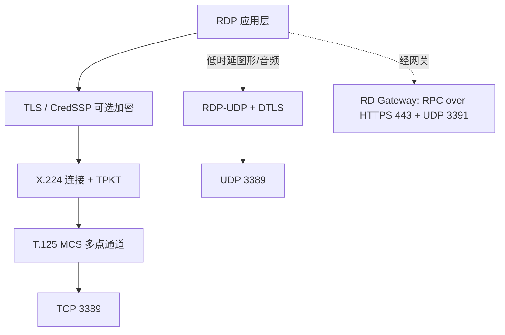

## 1. 协议定位

| 项目 | 信息 |
|------|------|
| 所属层 | 应用层（Application Layer） |
| 英文全称 | Remote Desktop Protocol（远程桌面协议） |
| 主要规范 | 微软开放规范 **[MS-RDPBCGR]**（Basic Connectivity and Graphics Remoting）；UDP 传输见 **[MS-RDPEUDP]**；早期血统为 ITU-T **T.128 / T.120** 多点通信系列。**RDP 没有 IETF RFC** |
| 端口 | **TCP 3389**（主）、**UDP 3389**（RDP-UDP 加速传输）；经 RD 网关时为 **TCP 443**（HTTPS 隧道）+ **UDP 3391**。IANA 服务名 `ms-wbt-server` |
| 封装于 | TCP（可选 TLS/CredSSP）→ **X.224 (TPKT)** → **T.125 MCS** → 多路虚拟通道；UDP 侧为 RDP-UDP + DTLS |
| 典型应用 | Windows 远程桌面（mstsc）、远程桌面服务 RDS / 终端服务、Azure Virtual Desktop、VDI 虚拟桌面、跳板机运维、远程技术支持 |

> **端口勘误**：常见资料写"RDP 用 UDP 3390"是错误的。标准 RDP 的 UDP 传输与 TCP **同为 3389**；**3391** 是 **RD Gateway** 的 UDP over RDP 端口。3390 并非 RDP 端口。

## 2. 一句话理解

**RDP = 把远端机器的"屏幕、键盘、鼠标"通过网络搬到你面前**：远端只发送**绘图指令与图像更新**，本地只上传**输入事件**，中间再叠加剪贴板、音频、打印机、磁盘等多条**虚拟通道**。

它与 SSH 的根本差别是：SSH 传的是**字符流**，RDP 传的是**图形与设备重定向**。

## 3. 它解决什么问题

1. **图形化远程操作**：Windows 大量管理工作依赖 GUI（AD 管理器、SQL Server Management Studio、IIS 管理器），字符终端无法替代。
2. **带宽敏感的屏幕传输**：RDP 不是逐帧传视频，而是尽量传**绘图原语**（画矩形、贴位图、滚动区域）与**缓存引用**，并配合 RemoteFX / H.264 编码，在几百 Kbps 下也能可用。
3. **本地外设映射到远端**：剪贴板、打印机、串口、本地磁盘、智能卡、USB 通过**虚拟通道**重定向，让远端会话"像在本机操作"。
4. **多会话与集中化桌面**：RDS/VDI 场景下，一台服务器承载多个用户会话，应用与数据集中在数据中心，终端只做显示。
5. **弱网体验优化**：UDP 传输通道（MS-RDPEUDP）用于对丢包不敏感的图像/音频，降低 TCP 重传带来的卡顿。

## 4. 核心特征

| 特征 | 说明 |
|------|------|
| **多通道复用（Multi-Channel）** | 基于 T.125 MCS，在一条连接内复用多个虚拟通道：`rdpdr`（设备重定向）、`cliprdr`（剪贴板）、`rdpsnd`（音频）、`drdynvc`（动态虚拟通道）等 |
| **图形远程化** | 传输顺序命令（Orders）、位图更新（Bitmap Update）、位图缓存（Bitmap Cache）、Surface Commands；新版支持 **RemoteFX**、**H.264/AVC 420/444** 编码 |
| **双传输栈** | TCP 保证可靠（输入、控制、通道协商）；UDP（RDP-UDP，可靠/尽力两种模式 + DTLS）承载图形与音频以降低时延 |
| **安全层可协商** | Standard RDP Security（RC4，已弃用）→ **TLS** → **CredSSP/NLA**（网络级身份验证，连接前先认证，抵御未认证会话耗尽与部分漏洞利用） |
| **设备重定向** | 剪贴板、驱动器、打印机（Easy Print）、音频输入输出、智能卡、摄像头、USB |
| **会话保持与重连** | 断线后会话在服务端保留（可配置），支持自动重连（Auto-Reconnect Cookie） |
| **服务端有状态** | 与 VNC 的"纯像素同步"不同，RDP 服务端理解 Windows GDI 绘图语义，是操作系统深度集成的协议 |

## 5. 与其他协议的关系

- **与 TLS**：现代 RDP 默认在 TLS 之上跑，服务器证书默认自签名，因此常见"无法验证证书"告警。
- **与 CredSSP/NTLM/Kerberos**：NLA 借助 CredSSP 把凭据在 TLS 内传给服务端预认证，底层认证由 NTLM 或 Kerberos 完成。
- **与 SMB**：驱动器重定向走 RDP 自己的 `rdpdr` 通道，**不依赖** 445；但 RDS 部署中管理面会用到 SMB/RPC。
- **与 VNC/SSH**：VNC（RFB 协议，5900）是跨平台的帧缓冲同步；SSH（22）是加密字符终端 + 隧道。三者常配合：`ssh -L` 隧道内跑 RDP 是安全暴露 3389 的经典做法。
- **与 SPICE / X11 / PCoIP**：同为远程显示协议家族，SPICE 面向 KVM 虚拟机，X11 是 Unix 图形转发（带宽消耗大），PCoIP 面向 VMware Horizon。

## 6. 本目录学习路线

1. **[01-原理与报文](01-原理与报文.md)** — X.224/MCS 分层如何叠出 RDP、连接序列的 10 个阶段、TPKT 与 PDU 头部字段、虚拟通道机制、安全协商与 NLA 时序图。
2. **[02-实战与排错](02-实战与排错.md)** — Wireshark 过滤 `tcp.port==3389 || rdp`、`mstsc` / `xfreerdp` / PowerShell 配置命令、"无法连接/CredSSP 加密数据库修正/黑屏/证书告警"排错，以及与 VNC/SSH/SPICE 的横向对比与速查表。

> 学习建议：先弄懂"**为什么 RDP 要套 X.224 和 MCS 这两层老古董**"（答案在 T.120 会议系统血统里），再看虚拟通道，最后动手抓一次完整连接握手，RDP 的复杂度就基本拆解完了。
