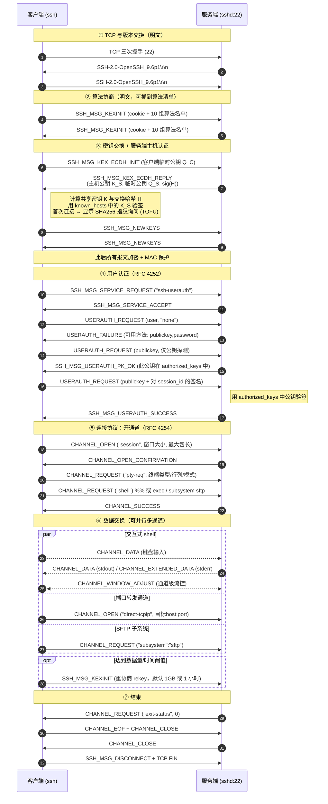
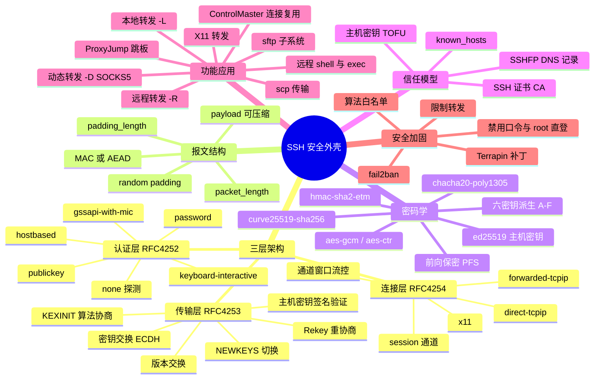

## 1. 工作原理

SSH 由三个相互叠加的子协议构成，这是理解 SSH 的第一把钥匙：

| 层 | RFC | 职责 |
|----|-----|------|
| **传输层协议**（Transport Layer Protocol） | RFC 4253 | 建立加密通道：版本交换 → 算法协商 → 密钥交换 → **服务端主机认证** → 加密与完整性保护 → 定期 rekey |
| **用户认证协议**（Authentication Protocol） | RFC 4252 | 在已加密通道内认证**客户端用户**：publickey / password / keyboard-interactive / gssapi / hostbased |
| **连接协议**（Connection Protocol） | RFC 4254 | 在认证后的连接上开多个**通道（channel）**：session（shell/exec/subsystem）、direct-tcpip（本地转发）、forwarded-tcpip（远程转发）、x11 |

**关键设计要点**：

- **先加密，后认证**。与 Telnet 相反，SSH 在任何凭据传输之前就已完成密钥交换，因此口令认证也不会明文暴露（但仍不如公钥安全，因为口令会到达服务端）。
- **服务端认证靠主机密钥**。密钥交换过程中服务端用**主机私钥**对交换哈希 `H` 签名，客户端用 `known_hosts` 里记录的公钥验签，从而确认"对面确实是上次那台机器"。
- **每方向独立密钥**。同一次 KEX 派生出 6 个值：两个 IV、两个加密密钥、两个 MAC 密钥（C→S 与 S→C 各一套）。
- **首次会话哈希 = session_id**。`H` 在首次 KEX 后固定为 `session_id`，后续认证签名、rekey 派生都绑定它，防止跨会话重放。

## 2. 报文 / 头部结构

### 2.1 版本交换（唯一的明文行）

连接建立后双方各发一行 ASCII，以 `CR LF` 结尾：

```
SSH-2.0-OpenSSH_9.6p1 Ubuntu-3ubuntu13.5
SSH-2.0-PuTTY_Release_0.80
```

格式：`SSH-protoversion-softwareversion SP comments CRLF`。**这一行在抓包中完全可见**，是指纹识别与版本探测的依据。

### 2.2 二进制包协议（Binary Packet Protocol，RFC 4253 §6）

| 字段 | 长度 | 含义 |
|------|------|------|
| `packet_length` | 4 字节 | 后续内容长度（不含本字段、不含 MAC）。AEAD 模式下此字段单独加密或作为 AAD |
| `padding_length` | 1 字节 | 随机填充长度，**至少 4 字节** |
| `payload` | 可变 | 消息内容（可能已被 zlib 压缩） |
| `random padding` | `padding_length` 字节 | 随机字节，使总长为 **8 或加密块大小的整数倍**（隐藏真实长度） |
| `MAC` | 0 / 16 / 32 字节 | 消息认证码，覆盖 `sequence_number ‖ 未加密包`（EtM 模式则覆盖密文） |

> `packet_length + padding_length + payload + padding` 的总长必须 ≥ 16 字节且是块大小的整数倍。默认最大包长 35000 字节。

### 2.3 关键消息类型（SSH_MSG_*，RFC 4250）

| 编号 | 名称 | 用途 |
|------|------|------|
| 1 | `SSH_MSG_DISCONNECT` | 断开并带原因码 |
| 2 | `SSH_MSG_IGNORE` | 流量填充/保活 |
| 5 / 6 | `SSH_MSG_SERVICE_REQUEST` / `ACCEPT` | 请求 `ssh-userauth` 或 `ssh-connection` 服务 |
| **20** | `SSH_MSG_KEXINIT` | **算法协商**（双方各发一次，列出支持的算法） |
| 21 | `SSH_MSG_NEWKEYS` | 切换到新密钥，之后的包全部用新密钥 |
| 30 / 31 | `SSH_MSG_KEX_ECDH_INIT` / `REPLY` | ECDH 密钥交换（曲线/DH 各有对应编号，30~49 为 KEX 专用） |
| **50** | `SSH_MSG_USERAUTH_REQUEST` | 认证请求（携带方法名与凭据） |
| 51 | `SSH_MSG_USERAUTH_FAILURE` | 认证失败，返回**仍可继续尝试的方法列表** |
| 52 | `SSH_MSG_USERAUTH_SUCCESS` | 认证成功 |
| 60 | `SSH_MSG_USERAUTH_PK_OK` | 公钥可用（探测阶段响应） |
| 80~82 | `GLOBAL_REQUEST` / `REQUEST_SUCCESS` / `FAILURE` | 全局请求，如 `tcpip-forward`（远程转发） |
| **90** | `SSH_MSG_CHANNEL_OPEN` | 打开通道（`session` / `direct-tcpip` / `x11`） |
| 91 / 92 | `CHANNEL_OPEN_CONFIRMATION` / `FAILURE` | 通道打开结果 |
| 93 | `SSH_MSG_CHANNEL_WINDOW_ADJUST` | **通道级流控**窗口调整 |
| 94 / 95 | `CHANNEL_DATA` / `CHANNEL_EXTENDED_DATA` | 通道数据 / 扩展数据（stderr，type=1） |
| 96~98 | `CHANNEL_EOF` / `CLOSE` / `REQUEST` | 通道结束/关闭/请求（`pty-req`、`shell`、`exec`、`subsystem`、`env`、`window-change`、`exit-status`） |

### 2.4 SSH_MSG_KEXINIT 的算法名单（10 个 name-list）

| 字段 | 示例值 |
|------|--------|
| `cookie` | 16 字节随机数（防止一方单独决定交换哈希） |
| `kex_algorithms` | `curve25519-sha256`, `ecdh-sha2-nistp256`, `diffie-hellman-group16-sha512`, `sntrup761x25519-sha512@openssh.com`（后量子混合） |
| `server_host_key_algorithms` | `ssh-ed25519`, `rsa-sha2-512`, `rsa-sha2-256`, `ecdsa-sha2-nistp256` |
| `encryption_algorithms_client_to_server` / `..._server_to_client` | `chacha20-poly1305@openssh.com`, `aes256-gcm@openssh.com`, `aes128-ctr` |
| `mac_algorithms_c2s` / `s2c` | `hmac-sha2-256-etm@openssh.com`, `hmac-sha2-512`（AEAD 时该项被忽略） |
| `compression_algorithms_c2s` / `s2c` | `none`, `zlib@openssh.com` |
| `languages_c2s` / `s2c` | 通常为空 |
| `first_kex_packet_follows` | 是否已乐观发送 KEX 首包 |

**协商规则**：取**客户端列表中第一个、服务端也支持**的算法（客户端偏好优先）。

### 2.5 会话密钥派生（RFC 4253 §7.2）

共享密钥 `K` 与交换哈希 `H` 得出后：

```
IV    C→S = HASH(K ‖ H ‖ "A" ‖ session_id)
IV    S→C = HASH(K ‖ H ‖ "B" ‖ session_id)
EncKey C→S = HASH(K ‖ H ‖ "C" ‖ session_id)
EncKey S→C = HASH(K ‖ H ‖ "D" ‖ session_id)
MACKey C→S = HASH(K ‖ H ‖ "E" ‖ session_id)
MACKey S→C = HASH(K ‖ H ‖ "F" ‖ session_id)
```

密钥不够长时用 `HASH(K ‖ H ‖ 已生成部分)` 迭代扩展。

## 3. 交互流程



## 4. 关键机制

### 4.1 主机密钥与 TOFU 信任模型

- 服务端主机密钥存于 `/etc/ssh/ssh_host_{ed25519,rsa,ecdsa}_key(.pub)`。
- 客户端首次连接显示指纹并写入 `~/.ssh/known_hosts`（可 `HashKnownHosts yes` 哈希主机名）。
- 之后主机密钥变化 → `WARNING: REMOTE HOST IDENTIFICATION HAS CHANGED!`，可能是重装系统，也可能是**中间人攻击**。
- 规避 TOFU 的两种工程化方案：**SSHFP DNS 记录**（需 DNSSEC）与 **SSH 证书**（用 CA 签发主机证书与用户证书，`TrustedUserCAKeys` / `@cert-authority`）。

### 4.2 公钥认证的签名内容

客户端签名的不是随机 challenge，而是一段确定性拼接：

```
string   session_id
byte     SSH_MSG_USERAUTH_REQUEST (50)
string   user name
string   service name ("ssh-connection")
string   "publickey"
boolean  TRUE
string   public key algorithm name
string   public key blob
```

因为绑定了 `session_id`（含本次 KEX 的临时密钥），签名**无法跨会话重放**，服务端也无法拿它去冒充你登录第三方（这正是 `ForwardAgent` 需要谨慎的原因——转发的是 agent 的签名能力，不是签名本身）。

### 4.3 三种端口转发的通道类型

| 形态 | 命令 | 通道类型 | 数据流向 |
|------|------|---------|---------|
| **本地转发** | `ssh -L 3306:db:3306 gw` | `direct-tcpip` | 本地监听 → 经 SSH → 服务端向 `db:3306` 发起连接 |
| **远程转发** | `ssh -R 8080:localhost:80 gw` | `tcpip-forward`（全局请求）+ `forwarded-tcpip` | 服务端监听 → 经 SSH → 客户端向本地 80 发起连接 |
| **动态转发** | `ssh -D 1080 gw` | `direct-tcpip`（按 SOCKS 请求动态创建） | 本地 SOCKS5 代理 → 目标由应用指定 |

### 4.4 通道级流控（Window）

TCP 已有流控，SSH 为何还要？因为**一条 TCP 上复用多个通道**，若某通道读取缓慢会阻塞整条连接。SSH 给每个通道一个**初始窗口**（OpenSSH 默认 2 MB）与**最大包长**（32 KB），接收方消费数据后发 `CHANNEL_WINDOW_ADJUST` 补充配额。窗口过小是高带宽时延积（长肥管道）链路上 SSH 吞吐上不去的常见原因，HPN-SSH 补丁即针对此优化。

### 4.5 密钥重协商（Rekey）

OpenSSH 默认在传输 **1 GB 数据**或经过 **1 小时**后触发 rekey（`RekeyLimit`），重新执行 KEX 产生新会话密钥，限制单密钥的数据量、增强前向保密。

### 4.6 常见安全加固点

| 风险 | 加固 |
|------|------|
| 口令爆破 | `PasswordAuthentication no`，仅公钥；配 fail2ban |
| root 直登 | `PermitRootLogin no` 或 `prohibit-password` |
| 弱算法降级 | 显式配置 `KexAlgorithms` / `Ciphers` / `MACs` 白名单，禁用 `ssh-rsa`(SHA-1)、CBC、`hmac-sha1` |
| Agent 转发被滥用 | 避免 `ForwardAgent yes`，改用 `ProxyJump`（`ssh -J`） |
| 端口转发被当跳板 | `AllowTcpForwarding no`、`PermitOpen host:port`、`GatewayPorts no` |
| 中间人 | 分发 known_hosts 或部署 SSH CA；核对 SHA256 指纹 |
| Terrapin 攻击(CVE-2023-48795) | 升级 OpenSSH ≥ 9.6（支持 `strict KEX`），或禁用 `chacha20-poly1305` 与 `-etm` CBC 组合 |

## 5. 知识框架


