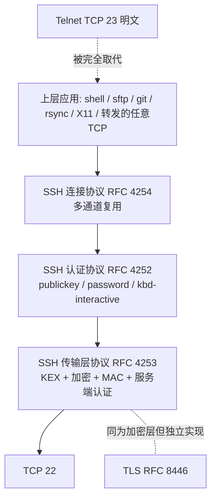

## 1. 协议定位

| 项目 | 信息 |
|------|------|
| 所属层 | 应用层（Application Layer） |
| 英文全称 | Secure Shell Protocol（安全外壳协议） |
| 主要 RFC | **RFC 4251** 协议架构（Architecture）· **RFC 4252** 认证协议 · **RFC 4253** 传输层协议 · **RFC 4254** 连接协议 · RFC 4250 编号分配 · RFC 4256 键盘交互认证 · RFC 8332（rsa-sha2-256/512）· RFC 8709（Ed25519）· RFC 9142（密钥交换更新） |
| 端口 | **TCP 22**（IANA 服务名 `ssh`） |
| 封装于 | TCP（SSH 自带完整加密层，**不依赖 TLS**） |
| 典型应用 | 远程命令行登录、`scp`/`sftp` 文件传输、端口转发/隧道、Git over SSH、Ansible 等自动化运维、跳板机（Jump Host）、SOCKS 代理 |

## 2. 一句话理解

**SSH = 一条经过身份认证与加密的 TCP 隧道，上面可以跑 shell、跑文件传输、也可以跑任意别的 TCP 连接。**

它把 Telnet/rlogin/rsh/rcp 这一整套明文远程工具全部替换掉，并额外提供了 Telnet 从来没有的能力：**公钥认证**、**主机身份校验**、**多路复用的通道**与**端口转发**。

## 💡 生活化类比

想象你要给远方的朋友寄一份机密文件。Telnet 的做法是写一张明信片，邮路上任何人都能看；SSH 的做法是先和对方约定一把只有你俩知道的锁，把内容装进上锁的箱子再寄。

更关键的是"验明正身"：你还会先核对对方的**签名笔迹**（主机密钥），确认收件人真是你朋友而不是冒名顶替者。而且这条邮路一旦建好，就不止能寄信——你可以在同一条路上同时寄文件、传包裹、甚至让朋友代你去访问他那边的其他人（端口转发）。

## 3. 它解决什么问题

为什么没有它，网络就"缺了一块"：

1. **明文传输的致命缺陷**：Telnet/rlogin 把用户名、口令、命令、输出全部明文发送，同网段任何人 `tcpdump` 一抓就能拿到 root 口令。SSH 在传输层就完成加密。
2. **服务器身份无法确认**：Telnet 无法防中间人。SSH 用**主机密钥（Host Key）+ known_hosts** 建立 TOFU（Trust On First Use）信任，服务器被替换会立刻告警。
3. **口令认证不够安全**：SSH 提供**公钥认证**，私钥不出本机、口令不上网络，天然抗爆破与重放；配合证书认证可实现大规模密钥治理。
4. **数据完整性与防篡改**：每个报文带 MAC（或使用 AEAD 如 `chacha20-poly1305`、`aes-gcm`），攻击者无法静默篡改。
5. **一条连接干多件事**：连接协议（RFC 4254）在单个加密连接内复用多个**通道（channel）**——shell、exec、sftp 子系统、X11 转发、TCP 转发可同时进行。
6. **穿透与代理**：本地/远程/动态端口转发让 SSH 成为轻量 VPN，可访问内网数据库、绕过临时网络限制、构建 SOCKS5 代理。

## 4. 核心特征

| 特征 | 说明 |
|------|------|
| **三层子协议架构** | 【分工明确】传输层协议（加密、完整性、服务端认证）→ 用户认证协议 → 连接协议（多通道复用） |
| **算法全可协商** | 【与时俱进】密钥交换（`curve25519-sha256`、`ecdh-sha2-nistp256`、`diffie-hellman-group14/16-sha256`）、主机密钥（`ssh-ed25519`、`rsa-sha2-512`、`ecdsa-sha2-nistp256`）、对称加密（`chacha20-poly1305@openssh.com`、`aes256-gcm@openssh.com`、`aes128-ctr`）、MAC（`hmac-sha2-256-etm@openssh.com`） |
| **前向保密（PFS）** | 【今天泄密救不回昨天】使用临时 DH/ECDH 密钥交换，主机私钥泄露也无法解密历史流量；且支持**密钥重协商（rekey）** |
| **多种认证方式** | 【不止密码】`publickey`（推荐）、`password`、`keyboard-interactive`（含 OTP/2FA）、`gssapi-with-mic`（Kerberos）、`hostbased`、OpenSSH 证书、FIDO2/U2F（`ed25519-sk`）、`none`（探测） |
| **多路通道复用** | 【一条连接干多件事】单连接内并行开 shell、sftp、端口转发、X11；OpenSSH 的 `ControlMaster` 还能让多个 ssh 命令共用一条 TCP 连接 |
| **端口转发三形态** | 【轻量 VPN】本地 `-L`、远程 `-R`、动态 `-D`（SOCKS5） |
| **文件传输** | 【自带传文件能力】`scp`（旧，OpenSSH 9.0 起底层改用 SFTP）、`sftp`（子系统，功能完整）、`rsync -e ssh` |
| **主机密钥指纹** | 【认机器不认证书链】SHA256 指纹 + `known_hosts`；企业可用 SSHFP DNS 记录或 SSH CA 证书替代 TOFU |

## 5. 与其他协议的关系

- **与 Telnet**：功能对标，但 SSH 全程加密并提供主机认证与公钥认证，Telnet 已仅用于端口探测。详见 [28-Telnet](../28-telnet/)。
- **与 TLS**：都是加密层，但 SSH **自成体系**，不使用 X.509 证书链与 CA 生态，而用主机密钥 TOFU 或 SSH 自有 CA。
- **与 FTP/FTPS**：SFTP 是 SSH 的**子系统**，与 FTP 毫无协议关系（不要混淆 SFTP 与 FTPS）。
- **与 SCP/RCP**：`scp` 是 `rcp` 的加密替代品；OpenSSH 9.0+ 默认改用 SFTP 协议作为底层传输。
- **与 HTTP/HTTPS**：`ssh -D` 提供 SOCKS5 代理，浏览器可经其访问内网；Git 支持 `ssh://` 与 `https://` 两种传输。
- **与 Kerberos**：`gssapi-with-mic` 认证方式可对接 AD/Kerberos 域，实现 SSH 单点登录。

## 6. 本目录学习路线

1. **[01-原理与报文](01-原理与报文/)** — 版本交换字符串、二进制包格式（`packet_length`/`padding`/`payload`/`MAC`）、算法协商 `SSH_MSG_KEXINIT`、Curve25519 密钥交换与会话密钥派生、认证流程、通道生命周期，配完整握手时序图与知识框架图。
2. **[02-实战与排错](02-实战与排错/)** — Wireshark 过滤 `ssh`、`ssh/scp/sftp/ssh-keygen/ssh-copy-id/ssh-agent` 全套命令、三种端口转发实操、`sshd_config` 加固、"Permission denied (publickey)"/"Host key verification failed"/连接慢等经典故障排查、与 Telnet/TLS/VPN 对比与面试题。

> 学习建议：先把 **"传输层 → 认证 → 连接"三层**在脑子里分清楚，再动手做一遍 **公钥登录 + 三种端口转发**，SSH 就基本吃透了。

> ⚠️ 初学者最常踩的坑：**把 SFTP 和 FTPS 当成一回事**——SFTP 是 SSH 的子系统，走 TCP 22 单端口；FTPS 是 FTP 加 TLS，仍是控制加数据的双通道模型，两者毫无协议关系。另一个高频坑是**公钥登录失败时到处找配置问题**，实际最常见的原因是 `~/.ssh`、`authorized_keys` 或家目录**权限过宽**。
