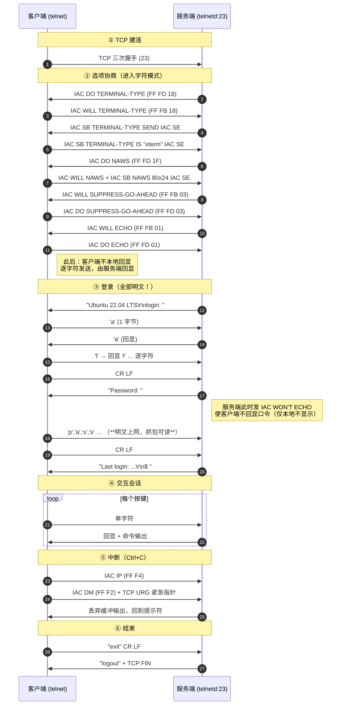
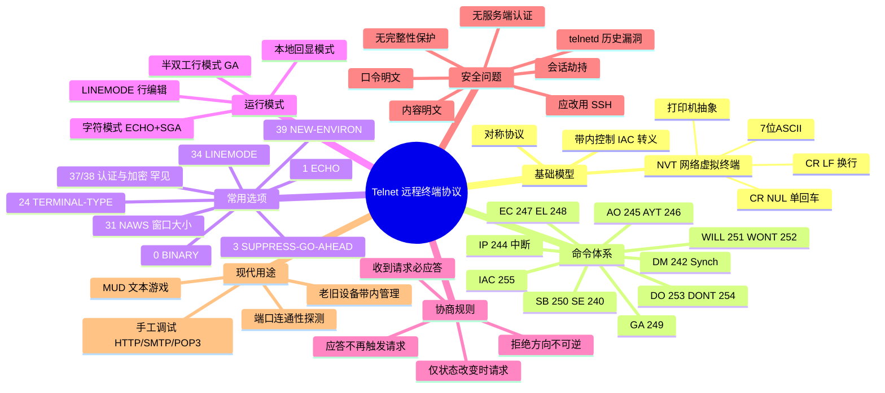

## 1. 工作原理

Telnet 建立在三个核心概念之上（RFC 854）：

### 1.1 网络虚拟终端（NVT）

双方不直接理解对方的物理终端，而是各自与一台**想象中的标准终端**对话：

- **字符集**：7 位 US-ASCII，装在 8 位字节里传输，高位置 0（启用 BINARY 选项后才允许 8 位）。
- **打印机模型**：无限宽行、无限长页，收到不认识的控制码应忽略。
- **换行约定**：**`CR LF`(0x0D 0x0A)** 表示换行；**单独的 CR 必须写成 `CR NUL`(0x0D 0x00)**——这条规则是 Telnet 与其他文本协议互操作时的经典坑。
- **必需控制码**：`NUL`、`LF`、`CR`、`BEL`(7)、`BS`(8)、`HT`(9)、`VT`(11)、`FF`(12)。

### 1.2 协商原则："商定的选项"

RFC 854 的设计哲学：**协议核心保持最小，能力通过选项按需叠加**，且遵守两条防死循环规则：

1. 只有在**改变状态**时才发送请求；已处于目标状态时收到请求不再回应。
2. 收到请求必须回应（同意或拒绝），但同意后不得再重复请求。

### 1.3 对称性

客户端与服务端在协议层完全对等，任何一方都能发起协商。实际部署中的角色差异（谁提供 shell）由上层决定。

### 1.4 典型运行模式

| 模式 | 协商组合 | 行为 |
|------|---------|------|
| **半双工行模式**（原始默认） | 无 ECHO、无 SGA，用 `GA` 交替控制 | 逐行发送，效率高但交互差；现代几乎不用 |
| **字符模式**（character-at-a-time，最常见） | 服务端 `WILL ECHO` + 双方 `SUPPRESS-GO-AHEAD` | 每敲一个键立即发一个 TCP 包，由**服务端回显**；`vi`、Tab 补全等交互功能可用；小包极多 |
| **行模式**（LINEMODE，RFC 1184） | 双方协商 `LINEMODE` | 客户端本地编辑整行，回车后一次性发送；省包但需要客户端支持 |
| **本地回显行模式** | 客户端 `ECHO`，服务端不回显 | 老式设备/BBS 常见 |

> **抓包判断技巧**：一次连接里出现大量 1 字节 payload 的 TCP 包 → 字符模式；出现整行文本的包 → 行模式。

## 2. 报文 / 头部结构

**Telnet 没有固定头部**。它是纯字节流协议，控制信息通过 `IAC (Interpret As Command, 0xFF/255)` 转义嵌入数据流。

### 2.1 IAC 命令码表（RFC 854）

| 十进制 | 十六进制 | 名称 | 含义 |
|--------|---------|------|------|
| 255 | `0xFF` | **IAC** | 命令解释引导符；数据中的 0xFF 需写成 `IAC IAC` |
| 254 | `0xFE` | **DON'T** | 要求对方**停止**使用某选项 |
| 253 | `0xFD` | **DO** | 要求对方**启用**某选项 |
| 252 | `0xFC` | **WON'T** | 声明自己**不会**使用某选项 |
| 251 | `0xFB` | **WILL** | 声明自己**将要**使用某选项 |
| 250 | `0xFA` | **SB** | 子协商开始（Subnegotiation Begin） |
| 249 | `0xF9` | GA | Go Ahead，半双工下交出发送权 |
| 248 | `0xF8` | EL | Erase Line，擦除当前行 |
| 247 | `0xF7` | EC | Erase Character，擦除前一字符 |
| 246 | `0xF6` | AYT | Are You There，探活（服务端通常回一行提示） |
| 245 | `0xF5` | AO | Abort Output，丢弃尚未送达的输出 |
| 244 | `0xF4` | **IP** | Interrupt Process，中断进程（对应 Ctrl+C） |
| 243 | `0xF3` | BRK | Break，映射到终端 BREAK 键 |
| 242 | `0xF2` | **DM** | Data Mark，Synch 的同步标记，配合 TCP 紧急指针 |
| 241 | `0xF1` | NOP | 无操作 |
| 240 | `0xF0` | **SE** | 子协商结束（Subnegotiation End） |

### 2.2 命令格式

| 形式 | 字节序列 | 说明 |
|------|---------|------|
| 双字节命令 | `IAC <cmd>` | 如 `FF F4` = 中断进程 |
| 三字节协商 | `IAC <WILL/WONT/DO/DONT> <option>` | 如 `FF FD 18` = DO TERMINAL-TYPE |
| 子协商 | `IAC SB <option> <参数...> IAC SE` | 如 `FF FA 18 00 78 74 65 72 6D FF F0` = 终端类型 "xterm" |
| 数据中的 0xFF | `IAC IAC`（`FF FF`） | 转义，表示一个字面量 255 |

### 2.3 常用选项码（RFC 855 及后续）

| 选项码 | 名称 | RFC | 作用 |
|--------|------|-----|------|
| 0 | **BINARY** | RFC 856 | 8 位二进制传输（关闭 NVT 7 位限制） |
| 1 | **ECHO** | RFC 857 | 谁负责回显。服务端 `WILL ECHO` = 远端回显 |
| 3 | **SUPPRESS-GO-AHEAD (SGA)** | RFC 858 | 抑制 GA 信号，进入全双工字符模式 |
| 5 | STATUS | RFC 859 | 查询选项状态 |
| 6 | TIMING-MARK | RFC 860 | 同步标记 |
| 24 | **TERMINAL-TYPE** | RFC 1091 | 子协商传递 `xterm` / `vt100` / `ansi` |
| 31 | **NAWS** (Negotiate About Window Size) | RFC 1073 | 子协商传递列数/行数（16 位各一） |
| 32 | TERMINAL-SPEED | RFC 1079 | 终端速率 |
| 33 | TOGGLE-FLOW-CONTROL | RFC 1372 | 远端流控开关 |
| 34 | **LINEMODE** | RFC 1184 | 行模式，客户端本地行编辑 |
| 35 | X-DISPLAY-LOCATION | RFC 1096 | X 显示位置 |
| 36 / 39 | ENVIRON / **NEW-ENVIRON** | RFC 1408 / 1572 | 传递环境变量（曾被用于 `USER` 免认证攻击） |
| 37 | **AUTHENTICATION** | RFC 2941 | 认证扩展（Kerberos/SRP），实现率极低 |
| 38 | **ENCRYPTION** | RFC 2946 | 加密扩展，实现率极低且历史漏洞多 |

### 2.4 NAWS 子协商示例（窗口 80×24）

```
FF FA 1F 00 50 00 18 FF F0
│  │  │  └─┬─┘ └─┬─┘ │  └── SE  子协商结束
│  │  │    │     └───────── 高16位行数 = 0x0018 = 24
│  │  │    └─────────────── 高16位列数 = 0x0050 = 80
│  │  └──────────────────── 选项 31 (0x1F) = NAWS
│  └─────────────────────── SB  子协商开始
└────────────────────────── IAC
```

## 3. 交互流程



## 4. 关键机制

### 4.1 协商防死循环规则（RFC 854 的精髓）

若无约束，A 发 `WILL X`、B 回 `DO X`、A 又回 `WILL X`……会无限循环。RFC 854 规定：

1. **只在状态改变时发请求**：若已启用某选项，不再重复发 `WILL`。
2. **收到请求必须应答**：`DO`↔`WILL/WON'T`，`WILL`↔`DO/DON'T`。
3. **应答不触发新请求**：收到的是对自己请求的应答时，不再回应。
4. **拒绝方向不可逆**：一方 `WON'T`，另一方只能 `DON'T`（无法强迫对方启用）。

四元组的语义要点：`WILL/WON'T` 说的是**"我"**要不要做；`DO/DON'T` 说的是**"你"**要不要做。

### 4.2 ECHO 的三种组合

| 组合 | 效果 | 场景 |
|------|------|------|
| 服务端 `WILL ECHO` | 远端回显，客户端关本地回显 | Unix 交互 shell（最常见） |
| 服务端 `WON'T ECHO` | 客户端本地回显 | 输入口令时服务端临时切到此状态（所以你看不到 `*`） |
| 双方都不回显 | 屏幕无显示 | 密码输入的实际状态 |

> 注意：口令"看不见"只是**本地不显示**，网络上依然是**明文字节**。

### 4.3 Synch 机制（IAC DM + TCP URG）

用户按 Ctrl+C 时，服务端可能还有大量未发完的输出堆在缓冲里。Telnet 的解法：

1. 客户端发 `IAC IP`（中断进程）；
2. 紧接着发 `IAC DM`，并把 TCP **紧急指针（URG）** 指向 DM 字节；
3. 服务端 TCP 收到紧急数据后进入"紧急模式"，**丢弃数据流直到 DM**，只处理其中的 Telnet 命令；
4. DM 之后恢复正常处理。

这是应用协议少见地直接依赖 TCP 紧急指针的例子。

### 4.4 为什么 Telnet 不安全（六条）

| 风险 | 说明 |
|------|------|
| **明文口令** | 同网段 ARP 欺骗 / 交换机镜像 / 上游任意节点均可抓取；Wireshark 有 "Follow TCP Stream" 一键还原 |
| **明文会话内容** | 命令与输出（包括查看的配置、密钥）全部暴露 |
| **无服务端认证** | 无法确认对端身份，中间人可完整代理并篡改 |
| **无完整性保护** | 攻击者可注入字节，实现命令注入（TCP 序号已知时的会话劫持） |
| **会话劫持** | 经典 hunt/juggernaut 类工具即针对 Telnet 设计 |
| **环境变量注入** | `NEW-ENVIRON` 曾被用于传递 `USER`/`LD_PRELOAD` 绕过认证（如 CVE-2011-4862 之外的多起 telnetd 漏洞） |

历史上 telnetd 还爆出过多个远程预认证溢出漏洞（如 FreeBSD/Heimdal telnetd 的 `encrypt_keyid` 溢出 CVE-2011-4862），进一步坐实其淘汰命运。

### 4.5 与 SSH 的对应关系

SSH 保留了 Telnet 的诸多语义并将其结构化：

| Telnet 机制 | SSH 对应 |
|------------|---------|
| TERMINAL-TYPE 子协商 | `CHANNEL_REQUEST "pty-req"` 中的 TERM 字段 |
| NAWS 窗口大小 | `pty-req` 的行列参数 + `window-change` 请求 |
| ECHO / SGA 等终端模式 | `pty-req` 的 encoded terminal modes（**沿用 Telnet 的模式编号思路**） |
| IAC IP 中断 | 信号通过 `CHANNEL_REQUEST "signal"` 传递 |
| 明文口令 | 加密通道内的 `password` 认证方法 |

## 5. 知识框架


