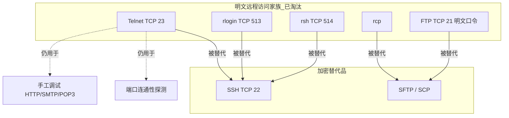

## 1. 协议定位

| 项目 | 信息 |
|------|------|
| 所属层 | 应用层（Application Layer） |
| 英文全称 | Telnet（TELetype NETwork / Terminal Network，远程终端协议） |
| 主要 RFC | **RFC 854** Telnet 协议规范 · **RFC 855** Telnet 选项规范 · RFC 856 二进制传输 · RFC 857 回显 · RFC 858 抑制继续前进 · RFC 1091 终端类型 · RFC 1073 窗口大小 · RFC 2941/2946 认证与加密（极少实现） |
| 端口 | **TCP 23**（IANA 服务名 `telnet`）；TLS 变体 telnets 为 TCP 992（罕见） |
| 封装于 | TCP，**无任何加密** |
| 典型应用 | ①（历史）Unix/主机远程登录；② **端口连通性探测**（今天的主要用途）；③ 老网络设备/嵌入式设备带内管理；④ 手工调试文本协议（HTTP/SMTP/POP3）；⑤ MUD 等文本游戏 |

> **安全提醒**：Telnet 明文传输**包含口令在内的一切数据**。除隔离实验网络与端口探测外，生产环境应一律用 [SSH](../27-ssh/) 替代。

## 2. 一句话理解

**Telnet = 把两台机器的键盘和屏幕用一条裸 TCP 连起来**，双方约定一套虚拟终端（NVT）规范，并用带内的 `IAC` 转义序列协商终端能力。

它诞生于 1969 年（RFC 15），是 ARPANET 最早的应用协议之一，早于"网络攻击"这个概念——**没有加密不是设计缺陷，而是时代背景**。

## 💡 生活化类比

Telnet 就像两个人之间拉了一根**对讲机专线**：你说的每句话原封不动地传到对面，对面说的也原封不动传回来，中间没有任何加密，任何搭线的人都能听得一清二楚。

它还有个特别之处：控制指令和说话内容走同一根线。就像你在对讲机里既能说正事，也能喊"喂，你那边声音开大点"——为了让对方分清这两种话，Telnet 约定了一个特殊的"提示音"（`IAC`）：一听到这个音，后面跟着的就是指令而不是内容。

## 3. 它解决什么问题

为什么没有它，网络就"缺了一块"：

**它当年解决了什么**：

1. **终端异构性**：1970 年代各厂商终端（VT100、IBM 3270、ASR-33）控制序列互不兼容。Telnet 定义了 **NVT（Network Virtual Terminal，网络虚拟终端）**这一"最小公共分母"——7 位 ASCII、以 `CR LF` 换行、固定控制字符集，两端各自负责本地终端 ↔ NVT 的转换。
2. **远程使用昂贵主机**：终端用户可通过网络登录到远端大型机分时系统。
3. **可扩展的能力协商**：通过 `DO/DON'T/WILL/WON'T` 四元组机制，双方可按需启用回显、二进制模式、行模式、窗口大小等选项，协议本身保持极简。

**它今天还在解决什么**：

- **TCP 端口连通性探测**：`telnet host port` 是最普及的"这个端口通不通"检测手段。
- **手工调试文本协议**：直接敲 HTTP 请求头、SMTP 命令、Redis 命令，观察原始响应。
- **老旧设备兜底管理**：部分交换机、路由器、PLC、串口服务器只提供 Telnet。

**它没有解决、也无法解决的**：加密、完整性、服务端身份认证、防重放——这些正是 SSH 存在的理由。

## 4. 核心特征

| 特征 | 说明 |
|------|------|
| **NVT 网络虚拟终端** | 【最小公共分母】统一的 7 位 ASCII 字符与控制码抽象；换行为 `CR LF`，单独回车为 `CR NUL` |
| **带内协商（in-band）** | 【指令与数据同一条流】控制信息与数据走同一条流，用 `IAC (255)` 转义区分；数据中的字节 255 需转义为 `IAC IAC` |
| **对称协议** | 【双方地位对等】客户端与服务端在协议层地位对等，双方都可发起选项协商 |
| **选项协商四动词** | 【我做 vs 你做】`WILL`(251) / `WON'T`(252) / `DO`(253) / `DON'T`(254)，避免协商死循环的规则见 RFC 854 |
| **子协商 SB/SE** | 【传复杂参数】复杂参数用 `IAC SB <option> ... IAC SE`（如终端类型、窗口尺寸） |
| **默认逐字符发送** | 【每敲一键发一包】常见模式为服务端 `WILL ECHO` + `WILL SUPPRESS-GO-AHEAD`（字符-at-a-time 模式），每个按键一个 TCP 包 |
| **明文** | 【全裸传输】用户名、口令、命令、输出全部明文，`tcpdump` 直接可读 |
| **无内建认证** | 【协议不管登录】认证完全交给上层登录程序（`login`/`getty`），协议本身不参与 |
| **同步信号** | 【借用 TCP 紧急指针】`IAC DM`（Data Mark）+ TCP 紧急指针实现 Synch，用于 Ctrl+C 中断时清理缓冲 |

## 5. 与其他协议的关系

- **与 SSH**：功能对标关系。SSH 保留了 Telnet 的"远程终端"语义（甚至 `pty-req` 中的终端模式编码沿用了 Telnet 的思路），但增加了加密、主机认证、公钥认证与多通道。
- **与 rlogin/rsh**：同为 BSD 时代明文远程工具，rlogin（513）传递终端环境更自动，rsh（514）执行单条命令；均已被 SSH 取代。
- **与 SMTP/POP3/HTTP**：这些都是**基于行的文本协议**，因此 `telnet host 25` / `telnet host 80` 可以手工"扮演客户端"，这是 Telnet 至今的教学价值。
- **与 netcat/nc**：`nc` 是更纯粹的 TCP 管道（不做 NVT 转换、不做 IAC 协商），做端口探测与二进制传输时比 telnet 更合适。
- **与串口 Console**：网络设备的 Telnet 管理是 Console 口的"带内"版本；带外管理仍靠串口/IPMI。

## 6. 本目录学习路线

1. **[01-原理与报文](01-原理与报文/)** — NVT 规范、IAC 命令码表、选项协商四动词与防循环规则、子协商格式、行模式 vs 字符模式，配完整协商时序图与知识框架图。
2. **[02-实战与排错](02-实战与排错/)** — Wireshark 中"明文口令"实验、`telnet`/`nc`/`Test-NetConnection` 端口探测、用 Telnet 手工发 HTTP/SMTP 请求、Linux/Windows/网络设备上禁用 Telnet 的正确姿势、与 SSH/nc 对比与面试题。

> 学习建议：Telnet 的**技术价值**在于理解"带内协商"这种古典设计，**实用价值**在于端口探测与文本协议调试；**运维价值**在于知道怎么把它彻底关掉。三者都值得掌握。

> ⚠️ 初学者最常踩的坑：**以为输入口令时屏幕不显示就说明口令被加密了**。那只是服务端发 `IAC WON'T ECHO` 让客户端停止回显，纯粹是显示层面的处理，口令字节在网络上依然是明文。另一个常见误判是**把"telnet 能连上"当成服务健康**——它只证明 TCP 三次握手成功，不代表应用层正常。
