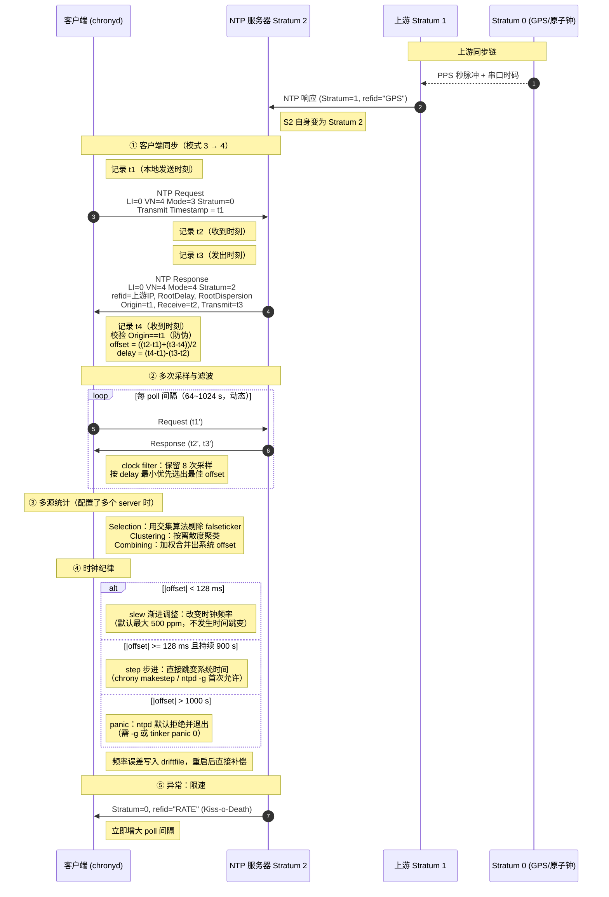
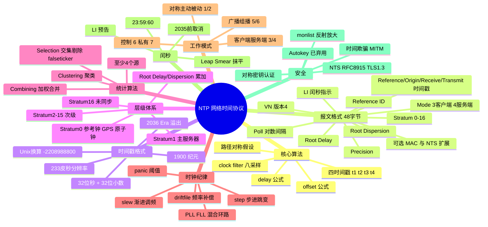

## 1. 工作原理

NTP 的核心任务是回答两个问题：**我的时钟和参考时钟差多少（offset）？这条链路的往返延迟是多少（delay）？**

### 1.1 四时间戳模型

一次客户端-服务端交换产生 4 个时间戳：

| 时间戳 | 记录方 | 时机 | 报文字段 |
|--------|--------|------|---------|
| `t1` | 客户端 | 发出请求的瞬间 | Transmit Timestamp（请求包） |
| `t2` | 服务端 | 收到请求的瞬间 | Receive Timestamp（响应包） |
| `t3` | 服务端 | 发出响应的瞬间 | Transmit Timestamp（响应包） |
| `t4` | 客户端 | 收到响应的瞬间 | 本地记录，不在报文中 |

推导（**关键假设：网络往返路径对称**）：

```
去程耗时  d1 = t2 - t1 - θ      （θ 为客户端相对服务端的钟差）
回程耗时  d2 = t4 - t3 + θ

往返时延  delay  = d1 + d2 = (t4 - t1) - (t3 - t2)
时钟偏移  offset = θ = ((t2 - t1) + (t3 - t4)) / 2
```

**直觉解释**：`(t2-t1)` 是"去程观测差"（含钟差 + 去程延迟），`(t3-t4)` 是"回程观测差"（含钟差 - 回程延迟），两者取平均恰好抵消掉延迟，剩下钟差。

**注意**：`(t3 - t2)` 是服务端**处理耗时**，从往返总时间中扣除它才是真正的网络时延。

### 1.2 路径不对称是最大误差源

若去程 10 ms、回程 30 ms，NTP 会误认为各 20 ms，产生 **10 ms 的系统性偏差**。这就是：

- 广域网 NTP 精度通常只有几毫秒到几十毫秒；
- 非对称链路（ADSL 上下行不同、跨运营商绕行）会引入固定偏差；
- PTP 通过硬件时戳 + 路径测量把这一误差降到亚微秒。

### 1.3 从"测量"到"调时"

单次测量含噪声，NTP 不会立即照搬 offset，而是：

1. **多次采样**（poll 间隔 64~1024 秒，动态调整），维护每个源的 8 次采样滤波器（clock filter，按 delay 最小优先选取）；
2. **多源统计**：Selection → Clustering → Combining（见 §4.2）；
3. **时钟纪律（Clock Discipline）**：用 PLL/FLL 混合环路调整**本地时钟频率**，使其缓慢逼近正确时间，同时把频率误差写入 drift 文件，下次启动直接补偿。

## 2. 报文 / 头部结构

NTP 报文头固定 **48 字节**（可选追加认证扩展与 MAC）。

```
 0                   1                   2                   3
 0 1 2 3 4 5 6 7 8 9 0 1 2 3 4 5 6 7 8 9 0 1 2 3 4 5 6 7 8 9 0 1
+-+-+-+-+-+-+-+-+-+-+-+-+-+-+-+-+-+-+-+-+-+-+-+-+-+-+-+-+-+-+-+-+
|LI | VN  |Mode |    Stratum    |     Poll      |   Precision   |
+-+-+-+-+-+-+-+-+-+-+-+-+-+-+-+-+-+-+-+-+-+-+-+-+-+-+-+-+-+-+-+-+
|                         Root Delay                            |
+-+-+-+-+-+-+-+-+-+-+-+-+-+-+-+-+-+-+-+-+-+-+-+-+-+-+-+-+-+-+-+-+
|                      Root Dispersion                          |
+-+-+-+-+-+-+-+-+-+-+-+-+-+-+-+-+-+-+-+-+-+-+-+-+-+-+-+-+-+-+-+-+
|                     Reference ID (refid)                      |
+-+-+-+-+-+-+-+-+-+-+-+-+-+-+-+-+-+-+-+-+-+-+-+-+-+-+-+-+-+-+-+-+
|                  Reference Timestamp (64)                     |
+-+-+-+-+-+-+-+-+-+-+-+-+-+-+-+-+-+-+-+-+-+-+-+-+-+-+-+-+-+-+-+-+
|                  Origin Timestamp  t1 (64)                    |
+-+-+-+-+-+-+-+-+-+-+-+-+-+-+-+-+-+-+-+-+-+-+-+-+-+-+-+-+-+-+-+-+
|                  Receive Timestamp t2 (64)                    |
+-+-+-+-+-+-+-+-+-+-+-+-+-+-+-+-+-+-+-+-+-+-+-+-+-+-+-+-+-+-+-+-+
|                  Transmit Timestamp t3 (64)                   |
+-+-+-+-+-+-+-+-+-+-+-+-+-+-+-+-+-+-+-+-+-+-+-+-+-+-+-+-+-+-+-+-+
|          （可选）Extension Fields / Key ID / MAC              |
+-+-+-+-+-+-+-+-+-+-+-+-+-+-+-+-+-+-+-+-+-+-+-+-+-+-+-+-+-+-+-+-+
```

### 2.1 字段详解

| 字段 | 位宽 | 含义与取值 |
|------|------|-----------|
| **LI** (Leap Indicator) | 2 bit | `0`=无警告；`1`=当天最后一分钟有 **61** 秒（插入闰秒）；`2`=最后一分钟有 **59** 秒（删除闰秒）；`3`=**时钟未同步**（告警状态） |
| **VN** (Version Number) | 3 bit | 协议版本，当前为 **4**（NTPv4）；3 为 NTPv3 |
| **Mode** | 3 bit | `0`=保留；`1`=对称主动；`2`=对称被动；**`3`=客户端**；**`4`=服务端**；`5`=广播；`6`=控制（ntpq）；`7`=私有保留（**monlist 即在此模式，反射放大源头**） |
| **Stratum** | 8 bit | `0`=**Kiss-o-Death**（未指定/无效，refid 载 KoD 码）；`1`=主服务器（直连参考钟）；`2~15`=次级服务器；**`16`=未同步**；`17~255`=保留 |
| **Poll** | 8 bit | 有符号，最大轮询间隔的 **log₂ 秒**。`6`=64 s、`10`=1024 s；chrony 常见 `6~10` |
| **Precision** | 8 bit | 有符号，本地时钟精度的 log₂ 秒。`-20` ≈ 1 μs，`-24` ≈ 60 ns |
| **Root Delay** | 32 bit | 到 Stratum 1 参考源的**总往返延迟**，16.16 定点秒 |
| **Root Dispersion** | 32 bit | 到参考源的**最大累积误差**，16.16 定点秒。二者共同构成"根离散"，用于评估可信度 |
| **Reference ID** | 32 bit | Stratum 1 时为 4 字符 ASCII 源码（`GPS`、`PPS`、`DCF`、`ATOM`、`GOES`、`PTP`）；Stratum ≥ 2 时为**上游服务器 IPv4 地址**（IPv6 为地址哈希前 4 字节）；Stratum 0 时为 KoD 码（`RATE`、`DENY`、`RSTR`） |
| **Reference Timestamp** | 64 bit | 本地时钟**最近一次被校准**的时刻 |
| **Origin Timestamp** | 64 bit | **t1**：服务端原样回填客户端的发送时间戳（用于匹配请求，也是防伪造的弱校验） |
| **Receive Timestamp** | 64 bit | **t2**：服务端收到请求的时刻 |
| **Transmit Timestamp** | 64 bit | **t3**：服务端发出响应的时刻（在请求包中则是 t1） |
| **Extension / MAC** | 变长 | 可选：NTS 扩展字段；或 Key ID(4B) + Message Digest(16/20B) 对称密钥认证 |

### 2.2 NTP 时间戳格式（64 位）

| 部分 | 位宽 | 含义 |
|------|------|------|
| Seconds | 32 bit | 自 **1900-01-01 00:00:00 UTC** 起的秒数（**注意不是 Unix 纪元 1970**） |
| Fraction | 32 bit | 秒的小数部分，分辨率 = 2⁻³² s ≈ **233 皮秒** |

换算关系：

```
Unix 时间戳 = NTP 秒数 - 2208988800        # 1900→1970 相差 70 年 = 2208988800 秒
```

**Era 问题**：32 位秒数在 **2036-02-07 06:28:16 UTC** 溢出（约 136 年一个 Era）。NTPv4 通过 Era Number 概念处理，实现上要求节点初始时间误差在 68 年内即可正确归属 Era。

### 2.3 Kiss-o-Death（KoD）码

Stratum = 0 时，refid 携带 4 字符 ASCII 告知客户端"别再打了"：

| KoD 码 | 含义 | 客户端应对 |
|--------|------|-----------|
| `RATE` | 轮询过于频繁，超出限速 | **立即增大 poll 间隔** |
| `DENY` | 服务器拒绝服务 | 停止访问该服务器 |
| `RSTR` | 访问被策略限制 | 停止访问 |
| `ACST` | 任播服务器（信息性） | — |
| `AUTH` | 认证失败 | 检查密钥配置 |
| `INIT` / `STEP` | 服务端正在初始化 / 步进调整中 | 稍后重试 |

## 3. 交互流程



## 4. 关键机制

### 4.1 Stratum 层级与"根"度量

| Stratum | 含义 | 示例 |
|---------|------|------|
| **0** | 参考时钟本体（不直接联网） | 铯原子钟、GPS/北斗接收机、DCF77 长波、PPS 秒脉冲 |
| **1** | 直连 Stratum 0 的主服务器 | `time.nist.gov`、`ntp.aliyun.com`、国家授时中心 |
| **2** | 同步自 Stratum 1 | 企业内网时间服务器 |
| **3~15** | 逐级下降 | 业务服务器、交换机、终端 |
| **16** | **未同步**（不可用） | 刚启动或失联的节点 |

每经过一级，`Root Delay` 与 `Root Dispersion` 累加，可信度下降。**Stratum 数字小 ≠ 一定更准**——如果 Stratum 1 在地球另一端、RTT 300 ms，还不如同机房的 Stratum 3 靠谱。选源应综合 stratum、delay、jitter、dispersion。

### 4.2 选择-聚类-合并三步算法（NTP 精髓）

| 步骤 | 目的 | 做法 |
|------|------|------|
| **Selection（选择）** | 剔除**falseticker**（说谎的时间源） | 用 **Marzullo/交集算法**：每个源给出置信区间 `[offset-δ, offset+δ]`，找被最多区间覆盖的交集；不在交集内的源被判为 falseticker 淘汰 |
| **Clustering（聚类）** | 从幸存者中筛出最一致的一组 | 反复剔除离散度（jitter/dispersion）最大的外围源，直到剩余源足够一致 |
| **Combining（合并）** | 得出单一系统偏移 | 按各源权重（与 root distance 成反比）加权平均 |

**推论**：**配置的服务器数量很关键**。
- 1 个源：无法检测其是否说谎；
- 2 个源：分歧时无法判断谁对；
- **3 个源**：可识别 1 个 falseticker（但幸存者只剩 2 个，勉强）；
- **≥4 个源**：能可靠剔除 1 个错误源，是**生产推荐最小配置**。

### 4.3 时钟纪律：slew vs step

| 方式 | 触发条件 | 行为 | 风险 |
|------|---------|------|------|
| **slew（渐进）** | 偏差较小（chrony 默认 <1 s 用 slew；ntpd <128 ms） | 通过 `adjtimex()` 修改时钟**频率**（最大 500 ppm，即每秒最多追 0.5 ms），时间**单调不倒退** | 追大偏差很慢：128 ms 需约 256 秒 |
| **step（步进）** | 偏差大或启动时 | 直接 `settimeofday()` 跳变 | **时间可能倒退**，破坏依赖单调时间的程序（数据库、定时器、日志顺序） |
| **panic** | ntpd 默认偏差 > 1000 s | 拒绝调整并退出，防止误配置造成灾难 | 需 `ntpd -g` 或 `tinker panic 0` 放行 |

工程实践：**启动时允许一次 step，运行中只 slew**。chrony 的 `makestep 1.0 3` 即"前 3 次更新中若偏差 >1 s 则 step，之后只 slew"。

### 4.4 频率补偿（drift）

晶振偏差是**系统性**的（如恒定快 12 ppm）。NTP 测出该频率误差后写入 drift 文件（`/var/lib/ntp/ntp.drift` 或 `/var/lib/chrony/drift`），下次启动直接加载，即使断网也能维持较好精度——这叫**自由运行（free-running）保持能力**。

### 4.5 工作模式

| Mode | 名称 | 场景 |
|------|------|------|
| 1 / 2 | 对称主动 / 被动 | 同级服务器互为对等体（peer），互相校验，常用于 Stratum 1 之间 |
| **3 / 4** | **客户端 / 服务端** | 最常见的单播模式 |
| 5 / 6 | 广播 / 组播 | 服务端周期性广播（224.0.1.1 / ff05::101），客户端被动接收；**无法测量延迟**，精度差且易被伪造，不推荐 |
| 6 | 控制 | `ntpq` 查询（NTPv2 控制报文） |
| 7 | 私有 | `ntpdc` 的 `monlist` 等，**必须禁用** |

### 4.6 闰秒（Leap Second）

- UTC 为跟上地球自转不均匀，会在 6/30 或 12/31 末尾插入一秒（`23:59:60`）。
- NTP 通过 **LI 字段**在闰秒当天提前告知客户端。
- 历史上闰秒引发过大规模故障（2012 年 Linux 内核 hrtimer 死锁导致 Reddit、LinkedIn 等宕机）。
- **现代主流方案：闰秒抹平（Leap Smear）**——Google/AWS/阿里云的 NTP 服务把这 1 秒分散到前后 12~24 小时内微调（每秒慢约 11.6 μs），客户端全程无感、无 23:59:60。
- **注意**：抹平源与非抹平源**不能混用**，否则两组源会互判为 falseticker。
- 国际计量大会（2022 CGPM）已决议**最晚 2035 年前取消闰秒**。

### 4.7 安全问题与防护

| 威胁 | 说明 | 防护 |
|------|------|------|
| **monlist 反射放大 DDoS** | mode 7 的 `monlist` 请求 234 字节可返回最多 600 条记录（约 48 KB），**放大约 556 倍**（CVE-2013-5211） | 升级 ntpd ≥ 4.2.7p26；`disable monitor`；`restrict ... noquery`；改用 chrony（不实现 mode 7） |
| **时间欺骗（MITM）** | 伪造 NTP 响应把时间调远，可使过期证书重新"有效"、令 TOTP 失效、绕过 Kerberos 票据有效期 | 多源配置、`maxdistance` 限制、NTS 或对称密钥认证 |
| **抢答/伪造** | 攻击者猜测 Origin Timestamp 伪造响应 | t1 是 64 位高精度随机化时间戳，猜中概率极低；NTS 提供密码学保证 |
| **NTS（RFC 8915）** | 基于 **TLS 1.3** 在 **TCP 4460** 完成密钥交换（NTS-KE），再用 AEAD 保护 UDP 123 上的 NTP 报文；含 Unique Identifier 与 cookie 机制防重放与追踪 | 推荐：`server time.cloudflare.com iburst nts` |
| **对称密钥认证** | 共享密钥 + MD5/AES-CMAC，密钥分发困难，仅适合可控内网 | `keys` / `trustedkey` 配置 |

## 5. 知识框架


