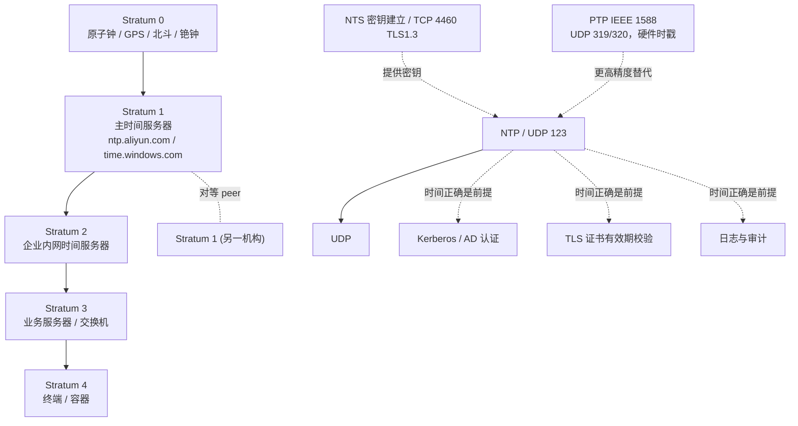

## 1. 协议定位

| 项目 | 信息 |
|------|------|
| 所属层 | 应用层（Application Layer） |
| 英文全称 | Network Time Protocol（网络时间协议） |
| 主要 RFC | **RFC 5905** NTPv4 协议与算法规范（取代 RFC 1305/4330）· RFC 5906 自主密钥（Autokey）· RFC 5907 MIB · RFC 5908 DHCP 选项 · RFC 8915 **NTS**（Network Time Security，网络时间安全）· RFC 4330 SNTPv4（已被 5905 归并） |
| 端口 | **UDP 123**（客户端与服务端同用；对称模式下源与目的均为 123） |
| 封装于 | UDP（无连接、低开销；单播/广播/组播/任播均可） |
| 典型应用 | 服务器时钟同步、日志时间戳一致性、Kerberos/AD 认证前提、证书有效期校验、分布式系统事件排序、金融交易时戳合规、数据库主从一致性 |

## 2. 一句话理解

**NTP = 用四个时间戳算出"我的表和你的表差多少"，再慢慢把我的表拧过去。**

它的精妙之处在于：只需一次往返（4 个时间戳），就能同时解出**时钟偏移（offset）**与**往返时延（delay）**，并在此基础上用多源统计过滤把误差压到局域网亚毫秒、广域网数毫秒级。

## 生活化类比

- **对表**：NTP 就像两个人打电话对表。你喊"我这里 10:00:00（t1）"，对方记下来、看自己表是 10:00:03（t2），回话"我 10:00:04 收到、现在 10:00:05 发回（t3）"，你收到是 10:00:08（t4）。只要默认"去和回在路上花的时间一样"，就能算出你比他慢了 3 秒——NTP 干的就是这个，只不过精度到微秒、还能对成百上千台机器。
- **乐队指挥 vs 各自戴表**：如果全公司只有一台标准钟，大家每隔一会儿跑去看一眼，误差会累积；NTP 的做法是让每台机器都"看标准钟 + 记住自己表走得快慢（drift）"，这样即使暂时看不着钟，自己也能将就走得很准——这就是它断网也不崩的原因。

## 3. 它解决什么问题

为什么没有它，网络就"缺了一块"：现代系统只要涉及"顺序""凭证""计费"，全都要先回答"现在几点"这个最基本的问题；一旦各机器时间各走各的，整个分布式世界就失去了共同的参照系。具体表现为：

1. **石英晶振必然漂移**：普通计算机晶振精度约 ±10~100 ppm，即每天可漂移 **1~10 秒**；温度变化会加剧漂移。不校准的机器一个月就能差出几分钟。
2. **日志无法关联**：分布式系统中若各节点时间不一致，跨机排查故障时日志顺序错乱，根本无法还原事件因果链。
3. **认证与证书失效**：**Kerberos 默认要求客户端与 KDC 时间偏差 ≤ 5 分钟**，超出即认证失败（AD 域登录、SSH GSSAPI、RDP NLA 都受影响）；TLS 证书的 `notBefore/notAfter` 校验、TOTP 双因子验证码同样依赖准确时间。
4. **分布式一致性与排序**：数据库主从复制、分布式锁租约、消息队列有序性、Cassandra 的 last-write-wins 都以时间戳为依据。
5. **合规与审计**：金融行业（如 MiFID II 要求微秒级时戳）、等保要求日志时间可追溯到权威时间源。
6. **计费与调度**：定时任务（cron）、限流窗口、缓存过期均依赖正确时间。

## 4. 核心特征

- 【分层授时】**层级化（Stratum）**：Stratum 0 = 参考时钟（原子钟/GPS/北斗，不上网）；Stratum 1 = 直连参考钟的主服务器；Stratum 2 = 同步自 Stratum 1……最大 **15**，**16 表示未同步**
- 【一次算出差与延迟】**四时间戳算法**：`t1` 客户端发送、`t2` 服务端接收、`t3` 服务端发送、`t4` 客户端接收；`offset = ((t2-t1)+(t3-t4))/2`，`delay = (t4-t1)-(t3-t2)`
- 【时间戳纪元特殊】**64 位时间戳格式**：高 32 位 = 自 **1900-01-01 00:00:00 UTC** 起的秒数，低 32 位 = 小数部分（分辨率约 **233 皮秒**）；2036 年溢出（Era 问题）
- 【多源纠偏】**多源选择算法**：Selection（剔除 falseticker）→ Clustering（聚类）→ Combining（加权合并）→ Clock Discipline（PLL/FLL 反馈调节）
- 【不跳变】**渐进调整（slew）而非跳变（step）**：默认偏差 <128 ms 时**调整时钟频率**缓慢逼近，避免时间倒退破坏依赖单调时间的应用
- 【多种模式】**多种工作模式**：客户端/服务端（模式 3/4）、对称主动/被动（1/2）、广播/组播（5/6）、控制（6）、私有（7）
- 【精度区间】**精度**：LAN 内 **0.1~1 ms**，公网 **1~50 ms**；需微秒/纳秒级请改用 PTP
- 【可加密】**安全扩展**：对称密钥认证（MD5/AES-CMAC）、Autokey（RFC 5906，已不推荐）、**NTS**（RFC 8915，基于 TLS 1.3 的现代方案）
- 【闰秒预告】**闰秒处理**：通过报文中的 **LI（Leap Indicator）**字段预告；现代实践多用 **闰秒抹平（leap smear）** 分散到 24 小时内

## 5. 与其他协议的关系

- **与 SNTP**：Simple NTP 是 NTP 的**简化客户端实现**，报文格式完全相同，但不做多源选择与统计滤波，精度低。NTPv4 规范（RFC 5905）已把 SNTP 归并为其子集。
- **与 PTP（IEEE 1588）**：PTP 用硬件时间戳与边界/透明时钟，可达**亚微秒**精度，用于工业控制、5G 前传、金融交易；代价是需要专用交换机支持。NTP 是软件时戳，适合通用场景。
- **与 Kerberos/AD**：时间偏差 > 5 分钟直接导致域认证失败，这是"AD 环境必须部署 NTP"的原因（PDC 模拟器角色是域内权威时间源）。
- **与 DHCP**：DHCP Option 42 可下发 NTP 服务器地址（RFC 2132）；RFC 5908 定义 DHCPv6 的 NTP 选项。
- **与 DNS**：NTP 服务器常以 `pool.ntp.org` 域名形式提供，靠 DNS 轮询做负载均衡与就近接入。
- **与 UDP 的反射放大攻击**：NTP 的 `monlist`（mode 7）曾造成 **556 倍**放大的 DDoS，是历史上最严重的反射放大向量之一。

## 6. 本目录学习路线

1. **[01-原理与报文](01-原理与报文/)** — 48 字节 NTP 报文逐字段拆解（LI/VN/Mode/Stratum/Poll/Precision/Root Delay/Root Dispersion/Reference ID/四时间戳）、offset 与 delay 推导、时钟纪律算法（PLL/FLL）、选择-聚类-合并三步、闰秒与 Era 问题，配时序图与知识框架图。
2. **[02-实战与排错](02-实战与排错/)** — Wireshark 过滤 `ntp`、`chronyc`/`ntpq`/`timedatectl`/`w32tm` 全套命令、`chrony.conf` 与 `ntp.conf` 配置、"时间不同步/offset 抖动/服务器 unreachable/容器时间漂移"排错、NTP vs chrony vs ntpd vs systemd-timesyncd vs PTP 对比与面试题。

> 学习建议：先把**四时间戳公式手推一遍**（假设网络对称），再理解为什么 NTP 要用多个源做统计过滤，最后动手看一次 `chronyc sourcestats` 的输出——NTP 的核心就通了。
>
> 初学者最常踩的坑：把"时区差 8 小时"当成"时间不对"（前者 `timedatectl set-timezone` 即可，与 NTP 无关）；以为 Stratum 数字越小一定越准（其实 RTT 300 ms 的远端 Stratum 1 可能不如同机房 Stratum 3）；只配 1~2 个时间源导致无法识别说谎源；忘了"容器不该自己跑 NTP"（共享宿主内核时钟）。
