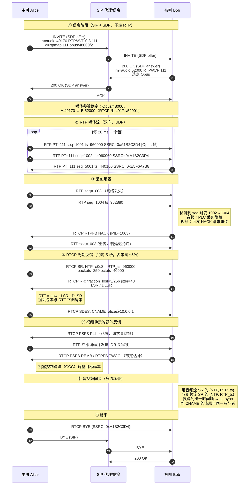
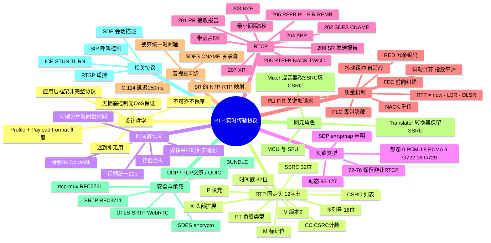

## 1. 工作原理

### 1.1 RTP 的设计哲学："应用层成帧 + 集成层处理"

RFC 3550 明确 RTP 是一个**框架（framework）**而非完整协议：它只提供实时媒体传输的**公共骨架**（序号、时间戳、源标识、负载标识），具体行为由两份补充文档定义：

- **Profile 文档**：定义头字段的具体解释与负载类型映射（如 RFC 3551 的 **RTP/AVP**，RFC 4585 的 **RTP/AVPF**，RFC 3711 的 **RTP/SAVP**）。
- **Payload Format 文档**：定义某种编码如何切分打包（如 RFC 6184 的 H.264、RFC 7741 的 VP8、RFC 7587 的 Opus）。

因此 RTP **有意不实现**：可靠传输、拥塞控制、顺序交付、资源预留、QoS 保证。这些交给应用或配套机制（NACK/FEC/抖动缓冲/GCC）。

### 1.2 发送端流程

```
采集 → 编码（Opus/H.264）→ 按 Payload Format 切分为 RTP 负载
     → 加 RTP 头（seq++、timestamp = 采样时刻、SSRC、PT、M 位）
     → （可选）SRTP 加密与认证
     → UDP → IP
同时：周期性发送 RTCP SR（含 NTP 时间 ↔ RTP 时间戳映射、已发包数/字节数）
```

### 1.3 接收端流程

```
UDP 收包 → （SRTP 解密验签）→ 校验 SSRC 与 PT
        → 按 seq 重排、检测丢包（可触发 NACK 请求重传）
        → 送入 Jitter Buffer（抖动缓冲），按 timestamp 决定播放时刻
        → 解码 → 丢包隐藏（PLC）/ 关键帧请求（PLI）
        → 结合 RTCP SR 的 NTP 映射做音视频同步
        → 渲染播放
同时：周期性发送 RTCP RR（丢包率、累计丢包、最高序号、抖动、DLSR）
```

### 1.4 三个"时间"的区别（最易混淆点）

| 概念 | 载体 | 单位 | 用途 |
|------|------|------|------|
| **RTP 时间戳** | RTP 头 32 位 | **媒体采样时钟单位**（非秒！） | 同一流内的相对时序，驱动抖动缓冲 |
| **NTP 时间戳** | RTCP SR 中 64 位 | 绝对墙上时间（1900 纪元） | 跨流对齐（音视频同步）的桥梁 |
| **到达时间** | 接收端本地记录 | 本地时钟 | 与 RTP 时间戳对比计算**抖动** |

## 2. 报文 / 头部结构

### 2.1 RTP 固定头（12 字节，RFC 3550 §5.1）

```
 0                   1                   2                   3
 0 1 2 3 4 5 6 7 8 9 0 1 2 3 4 5 6 7 8 9 0 1 2 3 4 5 6 7 8 9 0 1
+-+-+-+-+-+-+-+-+-+-+-+-+-+-+-+-+-+-+-+-+-+-+-+-+-+-+-+-+-+-+-+-+
|V=2|P|X|  CC   |M|     PT      |       sequence number         |
+-+-+-+-+-+-+-+-+-+-+-+-+-+-+-+-+-+-+-+-+-+-+-+-+-+-+-+-+-+-+-+-+
|                           timestamp                           |
+-+-+-+-+-+-+-+-+-+-+-+-+-+-+-+-+-+-+-+-+-+-+-+-+-+-+-+-+-+-+-+-+
|           synchronization source (SSRC) identifier            |
+=+=+=+=+=+=+=+=+=+=+=+=+=+=+=+=+=+=+=+=+=+=+=+=+=+=+=+=+=+=+=+=+
|            contributing source (CSRC) identifiers  [0..15]    |
|                             ....                              |
+-+-+-+-+-+-+-+-+-+-+-+-+-+-+-+-+-+-+-+-+-+-+-+-+-+-+-+-+-+-+-+-+
|      (可选) 头部扩展: profile-specific id | length | data      |
+-+-+-+-+-+-+-+-+-+-+-+-+-+-+-+-+-+-+-+-+-+-+-+-+-+-+-+-+-+-+-+-+
|                        payload (媒体数据)                     |
+-+-+-+-+-+-+-+-+-+-+-+-+-+-+-+-+-+-+-+-+-+-+-+-+-+-+-+-+-+-+-+-+
```

| 字段 | 位宽 | 含义 |
|------|------|------|
| **V** (Version) | 2 bit | 版本号，固定 **2** |
| **P** (Padding) | 1 bit | 为 1 表示负载尾部有填充字节，最后一字节指明填充长度（加密块对齐时用） |
| **X** (Extension) | 1 bit | 为 1 表示固定头后有一个头部扩展（RFC 8285 的 one-byte/two-byte 形式，WebRTC 用它传 audio level、absolute send time、TWCC 序号等） |
| **CC** (CSRC Count) | 4 bit | CSRC 标识符个数（0~15） |
| **M** (Marker) | 1 bit | 由 Profile 定义。**音频**：标记语音突发起始（静音后第一个包）；**视频**：标记**一帧的最后一个包**（RFC 6184 中 H.264 即如此） |
| **PT** (Payload Type) | 7 bit | 负载类型，0~127。静态类型见 RFC 3551，动态类型 **96~127** 由 SDP 协商 |
| **Sequence Number** | 16 bit | 每发一个 RTP 包 **+1**，**初值随机**（安全考虑）。用于检测丢包与乱序，溢出后回绕 |
| **Timestamp** | 32 bit | 负载**第一个字节的采样时刻**，单位为媒体采样时钟，**初值随机**。同一帧的多个分片包**时间戳相同** |
| **SSRC** | 32 bit | 同步源标识，随机生成，会话内唯一；标识"这个流是谁发的" |
| **CSRC list** | 0~15 × 32 bit | 贡献源列表，由 **Mixer（混音器）** 填入被混合的原始 SSRC |

### 2.2 时间戳递增规则（易错重点）

时间戳单位是**媒体采样时钟周期**，不是毫秒：

| 媒体 | 采样时钟 | 打包间隔 | 每包时间戳增量 |
|------|---------|---------|--------------|
| G.711 (PCMU/PCMA) | 8000 Hz | 20 ms | **160** |
| G.711 | 8000 Hz | 30 ms | 240 |
| Opus | **48000 Hz**（RTP 时钟固定 48 kHz） | 20 ms | **960** |
| G.722 | 实际 16 kHz，但 RTP 时钟**约定为 8000 Hz**（历史遗留坑） | 20 ms | 160 |
| 所有视频（H.264/VP8/H.265） | **90000 Hz** | 30 fps | **3000** |
| 视频 | 90000 Hz | 25 fps | 3600 |
| 视频 | 90000 Hz | 60 fps | 1500 |

**关键规则**：
- 同一视频帧被分成多个 RTP 包时，这些包**时间戳完全相同**，序号递增，最后一个包 **M=1**。
- 静音抑制（VAD/DTX）期间不发包，但时间戳仍按真实流逝时间推进——恢复发包时会出现时间戳大跳、序号连续，此时应置 **M=1**。

### 2.3 常见负载类型（RFC 3551 静态 + 常用动态）

| PT | 编码 | 类型 | 时钟率 | 说明 |
|----|------|------|--------|------|
| **0** | PCMU (G.711 μ-law) | 音频 | 8000 | 北美/日本标准，64 kbps |
| 3 | GSM | 音频 | 8000 | |
| 4 | G723 | 音频 | 8000 | |
| **8** | PCMA (G.711 A-law) | 音频 | 8000 | 欧洲/中国标准，64 kbps |
| 9 | G722 | 音频 | 8000（**名义值**） | 宽带语音，实际采样 16 kHz |
| 10 / 11 | L16 立体声 / 单声道 | 音频 | 44100 | 无压缩 |
| 14 | MPA (MPEG audio) | 音频 | 90000 | |
| 18 | G729 | 音频 | 8000 | 8 kbps 低码率 |
| 26 | JPEG | 视频 | 90000 | |
| 31 | H261 | 视频 | 90000 | |
| 32 | MPV (MPEG-1/2 video) | 视频 | 90000 | |
| 33 | MP2T | 音视频 | 90000 | MPEG-2 TS 封装 |
| 34 | H263 | 视频 | 90000 | |
| **96~127** | **动态** | — | — | 由 SDP `a=rtpmap` 声明，如 `a=rtpmap:96 H264/90000`、`a=rtpmap:111 opus/48000/2`、`a=rtpmap:101 telephone-event/8000`（DTMF） |
| 72~76 | — | — | — | **保留**，避免与 RTCP 包类型（200~204）混淆 |

> SDP 示例：`m=audio 49170 RTP/AVP 0 8 111` + `a=rtpmap:111 opus/48000/2`。

### 2.4 RTCP 包类型（RFC 3550 §6，RFC 4585）

RTCP 包必须**复合发送**（compound packet）：一个 UDP 包里至少含一个 SR 或 RR，后跟 SDES。

| PT | 名称 | 缩写 | 作用 |
|----|------|------|------|
| **200** | Sender Report | **SR** | 活跃发送者发送：**NTP 时间戳 ↔ RTP 时间戳映射**（唇音同步核心）、已发包数、已发字节数，外加对其他源的接收报告块 |
| **201** | Receiver Report | **RR** | 纯接收者发送：分数丢包率、累计丢包数、最高扩展序号、**到达间隔抖动**、LSR（上次 SR 时间）、DLSR（收到 SR 至发出 RR 的延迟） |
| **202** | Source Description | **SDES** | 源描述项：**CNAME**（规范名，跨流关联同一参与者的关键）、NAME、EMAIL、PHONE、LOC、TOOL、NOTE |
| **203** | Goodbye | **BYE** | 显式离开会话，可带原因 |
| **204** | Application-defined | **APP** | 应用自定义扩展 |
| **205** | Transport-layer FB | **RTPFB** | 传输层反馈（RFC 4585）：`fmt=1` **NACK**（请求重传指定序号）、`fmt=15` **TWCC**（Transport-wide CC 反馈） |
| **206** | Payload-specific FB | **PSFB** | 负载相关反馈：`fmt=1` **PLI**（Picture Loss Indication，请求关键帧）、`fmt=4` **FIR**（Full Intra Request）、`fmt=15` **REMB**（接收端估计最大带宽） |
| 207 | Extended Report | XR | 扩展报告（RFC 3611）：VoIP 质量度量、丢包/丢弃统计 |

### 2.5 SR 包关键字段

| 字段 | 长度 | 含义 |
|------|------|------|
| SSRC of sender | 32 bit | 发送者标识 |
| **NTP timestamp** | 64 bit | 发送 SR 时的绝对时间（1900 纪元） |
| **RTP timestamp** | 32 bit | 与上述 NTP 时刻**对应**的 RTP 时间戳 → **这一对就是唇音同步的锚点** |
| Sender's packet count | 32 bit | 累计已发送 RTP 包数 |
| Sender's octet count | 32 bit | 累计已发送负载字节数（可算平均码率） |
| Report blocks | N × 24 字节 | 对每个接收源的报告（同 RR） |

### 2.6 RR / 报告块字段

| 字段 | 长度 | 含义 |
|------|------|------|
| SSRC_n | 32 bit | 被报告的源 |
| **Fraction lost** | 8 bit | 自上次报告以来的分数丢包率（**除以 256 得百分比**，如 `26` ≈ 10%） |
| Cumulative lost | 24 bit | 累计丢包数（有符号，重复包可致负值） |
| Extended highest seq | 32 bit | 高 16 位为回绕计数，低 16 位为最高序号 |
| **Interarrival jitter** | 32 bit | 到达间隔抖动（RTP 时间戳单位） |
| **LSR** | 32 bit | 上次收到该源 SR 的 NTP 时间戳中间 32 位 |
| **DLSR** | 32 bit | 从收到该 SR 到发出本 RR 的延迟（1/65536 秒单位） |

**RTT 计算**：`RTT = 收到RR的时刻 - LSR - DLSR`（全部换算到同一单位）。

## 3. 交互流程



## 4. 关键机制

### 4.1 抖动（Jitter）计算（RFC 3550 §6.4.1）

对每个收到的包 i，定义"传输时间差"：

```
D(i-1, i) = (R_i - R_{i-1}) - (S_i - S_{i-1})
            └─ 到达间隔 ─┘   └─ 发送(采样)间隔 ─┘
```

其中 `R` 为本地到达时间（换算成 RTP 时间戳单位），`S` 为包中的 RTP 时间戳。抖动用一阶指数平滑估计：

```
J(i) = J(i-1) + ( |D(i-1, i)| - J(i-1) ) / 16
```

**理解**：若网络完美，包的到达间隔等于采样间隔，D=0，抖动为 0。抖动越大，接收端需要越深的缓冲。RR 中报告的就是这个 `J`（单位为 RTP 时间戳单位，音频 8 kHz 下 `J=80` 即 10 ms）。

### 4.2 抖动缓冲（Jitter Buffer）—— 延迟与流畅的权衡

| 缓冲深度 | 效果 | 代价 |
|---------|------|------|
| 太浅 | 延迟低 | 抖动稍大就欠载（underrun），出现断续、爆音 |
| 太深 | 流畅 | 端到端延迟大，交互体验差（>400 ms 单向即明显不自然） |

现代实现使用**自适应抖动缓冲**：根据实测抖动动态调整深度，并在静音期（无语音活动）悄悄伸缩缓冲长度，避免可听见的失真。WebRTC 的 NetEQ 是典型实现（含加速/减速播放、PLC、时间伸缩）。

**ITU-T G.114 建议**：单向端到端延迟 **≤150 ms** 为优，150~400 ms 可接受，>400 ms 不可接受。

### 4.3 丢包应对策略（按延迟预算选择）

| 手段 | 原理 | 适用 | 代价 |
|------|------|------|------|
| **PLC**（丢包隐藏） | 用前后帧外推生成替代音频 | 音频，丢包 <5% | 无额外带宽，质量略降 |
| **NACK 重传** | RTCP 请求重传指定序号 | RTT 小（<100 ms）时有效 | 增加延迟，需缓冲 |
| **FEC**（前向纠错，RFC 5109/8627） | 发冗余包，接收端直接恢复 | 高 RTT 或不能重传时 | **额外带宽 20~100%** |
| **RED**（冗余编码，RFC 2198） | 在新包里捎带上一帧的低码率副本 | 音频 | 带宽小幅增加 |
| **PLI / FIR** | 请求发送端立即出关键帧 | 视频花屏恢复 | 关键帧大，可能引起带宽尖峰 |
| **SVC / Simulcast** | 分层/多码率编码，按能力取用 | 多方会议 | 编码复杂度与上行带宽 |

### 4.4 音视频同步（Lip Sync）完整逻辑

音频流与视频流是**两个独立的 RTP 流**（不同 SSRC、不同随机时间戳基准、不同时钟率），无法直接比较。同步依赖三步：

1. **关联**：两条流的 RTCP **SDES CNAME 相同** → 属于同一参与者（这是 CNAME 的核心用途）。
2. **映射**：各自的 RTCP **SR** 提供 `(NTP绝对时间, RTP时间戳)` 对。
3. **换算**：把两条流的 RTP 时间戳都换算成 NTP 绝对时间轴，即可对齐播放。

```
音频: NTP_a ↔ RTPts_a (48000 Hz)   →  某音频包 ts 对应绝对时刻 = NTP_a + (ts - RTPts_a)/48000
视频: NTP_v ↔ RTPts_v (90000 Hz)   →  某视频帧 ts 对应绝对时刻 = NTP_v + (ts - RTPts_v)/90000
```

**推论**：**没有 RTCP 就没有唇音同步**——这是"RTP 必须配 RTCP"的最有力证据。ITU-R BT.1359 建议音频超前视频不超过 **45 ms**、滞后不超过 **125 ms**。

### 4.5 混音器（Mixer）与转换器（Translator）

| 类型 | 行为 | SSRC 处理 | 场景 |
|------|------|----------|------|
| **Mixer 混音器** | 接收多路流，**合成一路**新流输出 | 生成**自己的新 SSRC**，把原始各源填入 **CSRC 列表**（最多 15 个） | 多方语音会议服务器（MCU）、有限带宽出口 |
| **Translator 转换器** | 逐流转发/转码/改封装，**不合并** | **保留原 SSRC** | 转码网关、防火墙中继、组播↔单播转换、SFU 转发 |

现代 WebRTC 会议多用 **SFU（Selective Forwarding Unit）**，本质是智能 Translator：不解码不混流，按订阅选择性转发，CPU 消耗远低于 MCU。

### 4.6 RTCP 带宽与发送间隔

- RTCP 总流量应 ≤ 会话带宽的 **5%**，其中**活跃发送者分 25%**、接收者分 75%。
- 参与者越多，单个成员的发送间隔越长（自动缩放），但**最小间隔 5 秒**（RFC 3550 建议；AVPF 的 early feedback 模式可突破以支持及时的 NACK/PLI）。
- 首次发送前需随机化（乘 0.5~1.5），避免所有参与者同时发送造成风暴。

### 4.7 SRTP 与 WebRTC 安全

| 项目 | 说明 |
|------|------|
| **SRTP**（RFC 3711） | 对 RTP **负载加密**（AES-CTR/AES-GCM），头部保持明文（便于中间设备处理）；追加 **认证标签**（HMAC-SHA1 80/32 位）保护头部与负载完整性；用**滚动计数器（ROC）**扩展 48 位包索引防重放 |
| **SRTCP** | 同理保护 RTCP，且**强制加密**（RTCP 含 CNAME 等隐私信息） |
| 密钥协商 | SDES（`a=crypto`，SDP 明文传密钥，需信令加密）、**DTLS-SRTP（RFC 5764，WebRTC 强制）**、ZRTP、MIKEY |
| WebRTC 媒体栈 | ICE 打通路径 → **DTLS 握手协商密钥** → SRTP 传输 → RTCP-FB 反馈 → BUNDLE + rtcp-mux 复用单端口 |

### 4.8 端口约定与复用

| 方案 | 说明 |
|------|------|
| **经典（RFC 3550）** | RTP 用偶数端口 N，RTCP 用 N+1；SDP 中 `m=` 行给出 N |
| **显式指定** | SDP `a=rtcp:<port>` 指明 RTCP 端口 |
| **rtcp-mux（RFC 5761）** | RTP 与 RTCP **复用同一端口**，靠 PT 值区分（RTCP 的 PT 在 200~207，故 RTP 保留 72~76 不用）。**WebRTC 默认启用**，NAT 穿透只需打通一个洞 |
| **BUNDLE** | 多条媒体流（音频+视频+数据）全部复用一个传输通道，靠 SSRC/MID 区分 |

## 5. 知识框架


