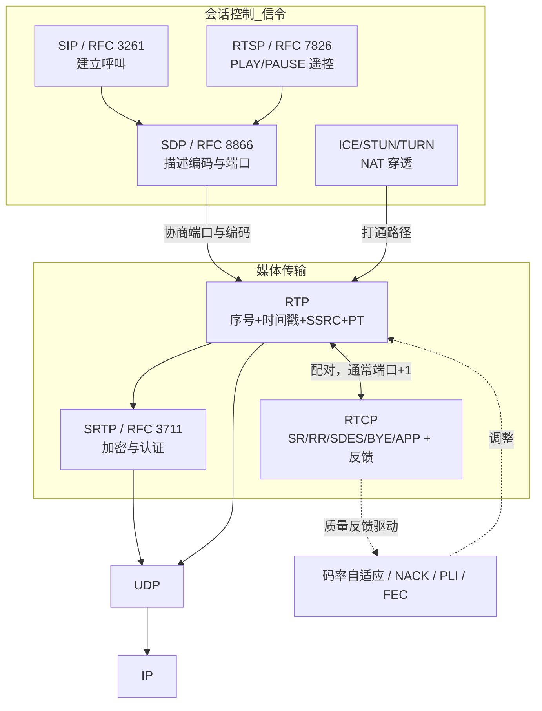

## 1. 协议定位

| 项目 | 信息 |
|------|------|
| 所属层 | **应用层协议，承担传输层职能**（RFC 3550 明确：RTP 通常作为应用程序的一部分实现，位于 UDP 之上，属于"应用层框架 + 传输功能"） |
| 英文全称 | Real-time Transport Protocol（实时传输协议） |
| 主要 RFC | **RFC 3550** RTP/RTCP 核心规范（取代 RFC 1889）· **RFC 3551** 音视频会议 Profile（AVP）与静态负载类型 · RFC 3711 **SRTP**（安全 RTP）· RFC 4585 **AVPF**（带反馈的 Profile）· RFC 5761 RTP/RTCP 端口复用 · RFC 8285 通用头部扩展 · RFC 6184（H.264 打包）· RFC 7741（VP8）· RFC 7587（Opus） |
| 端口 | **无固定端口**。由 SDP / RTSP / SIP / ICE 动态协商；传统约定 **RTP 用偶数端口，RTCP 用其 +1 的奇数端口**；WebRTC 常用 RTP/RTCP 复用（rtcp-mux）到同一端口 |
| 封装于 | 通常 **UDP**（低延迟、容忍丢包）；也可 TCP（RFC 4571，RTSP interleaved）、DTLS-SRTP（WebRTC）、QUIC |
| 典型应用 | VoIP（SIP 电话）、视频会议（Zoom/Teams/腾讯会议）、**WebRTC**、IPTV/组播直播、安防监控（RTSP 摄像头）、音视频直播推流、屏幕共享 |

## 2. 一句话理解

**RTP = 给每个媒体包盖上"序号 + 时间戳 + 我是谁 + 我是什么编码"四个戳，剩下的（可靠性、拥塞控制、播放平滑）交给应用自己做。**

它有意**不提供**可靠传输、不保证顺序到达、不做资源预留——因为对实时媒体来说，**迟到的数据等于无用数据**，重传一个 200 ms 前的音频帧毫无意义，不如直接丢掉做丢包隐藏（PLC）。

## 💡 生活化类比

- **盖邮戳的实时快递**：RTP 像给每一箱直播货物贴上"第几箱（序号）、这箱该几点播放（时间戳）、谁发的（SSRC）、里面是什么格式（PT）"。它不保证箱子一定按顺序到、也不管路上丢没丢——因为直播现场"迟到的箱子里的货早就过期了"，到了也得扔。重新排顺序、补货、卡顿平滑这些活，由收货方自己的"缓冲仓库"去做。
- **遥控器与电视信号**：RTSP/SIP 这类信令像**遥控器**（负责播放/暂停/拨号），RTP 才是真正在线上跑的**电视信号**。你可以没有遥控器手动操作，但光有遥控器没有信号，屏幕上什么也不会出现。

## 3. 它解决什么问题

为什么没有它，网络就"缺了一块"：UDP 只管"把数据扔到对端某个端口"，但实时音视频要能正常播放，还缺好几块基石——没有它们，声音会乱序、画面会卡死、多人会议分不清谁在说话、音画还对不上嘴。具体补齐四样：

UDP 只给你"端口 + 校验和"，实时媒体还缺四样东西，RTP 恰好补齐：

1. **乱序重排**：IP 网络不保证顺序。RTP 的 **16 位序列号（Sequence Number）**让接收端能重排包序、检测丢包并统计丢包率。
2. **播放时序恢复（关键）**：网络抖动使包间隔忽大忽小。RTP 的 **32 位时间戳（Timestamp）**记录采样时刻（按媒体采样率计，如音频 8000 Hz、视频 90000 Hz），接收端据此驱动**抖动缓冲（Jitter Buffer）**，把不均匀到达的包还原为均匀播放。
3. **多源识别与混音**：会议中多人同时说话。**SSRC（同步源标识）**唯一标识每个媒体源，**CSRC 列表**记录混音器合并了哪些源。
4. **载荷类型标识**：**PT（Payload Type）**说明这个包里是 PCMU、Opus、H.264 还是 VP8，支持会话中动态切换编码。
5. **音视频同步（唇音同步）**：单靠 RTP 时间戳无法跨流对齐（各流时间戳基准独立随机）。**RTCP 的 Sender Report** 提供 "NTP 绝对时间 ↔ RTP 时间戳" 的映射对，接收端据此实现 lip-sync。
6. **质量反馈与自适应**：**RTCP** 周期性报告丢包率、抖动、往返时延，发送端据此调整码率、切换分辨率、触发关键帧重传（PLI/FIR/NACK）。

## 4. 核心特征

- 【数据与控制成对】**RTP + RTCP 双协议**：RTP 传数据，**RTCP 传控制与质量反馈**，二者是一对，缺一不可
- 【故意不可靠】**不可靠、不保序、无拥塞控制**：协议本身不重传、不排序；这些由应用层（NACK、FEC、抖动缓冲、GCC/TWCC 拥塞控制）实现
- 【极简头】**12 字节固定头**：可选 CSRC 列表（0~15 × 4 字节）与头部扩展
- 【时间戳按采样钟】**时间戳按媒体时钟计**：不是墙上时间；音频 8 kHz 时每 20 ms 包递增 160；视频统一用 **90 kHz** 时钟
- 【源随机可冲突】**SSRC 随机且可冲突检测**：32 位随机数标识源，冲突时按 RFC 3550 规则重新选择
- 【靠 Profile 扩展】**Profile 机制**：RTP 本体不定义具体编码，由 Profile（如 RFC 3551 的 AVP）+ Payload Format 文档定义
- 【反馈有带宽上限】**RTCP 带宽限制**：RTCP 流量应控制在会话总带宽的 **5%**（其中发送者 25%、接收者 75%），参与者越多发送间隔越长（最小 5 秒）
- 【可混音转发】**可混音/转发**：**Mixer（混音器）**合并多路流并改写 SSRC/CSRC；**Translator（转换器）**转码或跨网转发但保留 SSRC
- 【明文需加密】**安全靠 SRTP**：RTP 本身明文；**SRTP（RFC 3711）**提供加密与认证，WebRTC 强制使用 DTLS-SRTP

## 5. 与其他协议的关系

- **与 UDP**：RTP 的默认承载。选 UDP 是因为 TCP 的重传与队头阻塞会造成不可接受的延迟累积。
- **与 RTCP**：**同一会话的两个协议**，RTP 传媒体、RTCP 传控制。RFC 3550 同时定义了两者。
- **与 RTSP**：RTSP 是**信令/遥控协议**（TCP 554），负责 `DESCRIBE`/`SETUP`/`PLAY`/`PAUSE`/`TEARDOWN`；实际媒体由 RTP 传输。**"RTSP 是遥控器，RTP 是电视信号"**。
- **与 SIP**：SIP（5060）负责呼叫建立/拆除，SDP 描述媒体参数，RTP 传语音——这是 VoIP 的标准三件套。
- **与 SDP**：SDP 不是传输协议，而是**会话描述格式**，在 `m=audio 49170 RTP/AVP 0 8 97` 这样的行里声明端口、Profile 与负载类型。
- **与 WebRTC**：WebRTC 的媒体面 = **ICE（穿透）+ DTLS（密钥协商）+ SRTP（加密的 RTP）+ RTCP-FB（反馈）**，并普遍启用 rtcp-mux 与 BUNDLE 把所有流复用到一个端口。
- **与 HLS/DASH**：后者是**基于 HTTP 的分段拉流**，延迟数秒到数十秒，适合大规模单向直播；RTP 是亚秒级双向实时，适合通话与互动。
- **与 SRT/WebTransport/QUIC**：新一代低延迟传输方案，部分场景替代或承载 RTP。

## 6. 本目录学习路线

1. **[01-原理与报文](01-原理与报文/)** — RTP 12 字节固定头逐位拆解（V/P/X/CC/M/PT/序号/时间戳/SSRC/CSRC）、时间戳与采样率的换算、静态负载类型表、RTCP 五种包类型（SR/RR/SDES/BYE/APP）与反馈消息（NACK/PLI/FIR/REMB）、抖动计算公式、混音器与转换器模型，配 SIP+RTP 完整时序图与知识框架图。
2. **[02-实战与排错](02-实战与排错/)** — Wireshark 解码 RTP 与"播放音频流"、`ffmpeg`/`ffplay`/`gst-launch`/`sngrep`/`tcpdump` 命令、SDP 读法、"单向语音/杂音/花屏/唇音不同步/NAT 穿透失败"排错、RTP vs RTSP vs HLS vs SRT 对比与面试题。

> 学习建议：先牢记 **"序号解决乱序、时间戳解决抖动、SSRC 解决多源、PT 解决编码识别"** 这四句话，再理解 RTCP 为什么必不可少，RTP 就掌握了八成。
>
> ⚠️ 初学者最常踩的坑：以为 RTP 时间戳是"毫秒"（其实是媒体采样时钟单位，视频统一 90 kHz）；以为 RTP 有固定端口（它是动态协商的，Wireshark 默认只当普通 UDP，需要抓信令或 Decode As）；以为 RTP 自己保证可靠（它不保证，靠 NACK/FEC/抖动缓冲补）；忘了 RTCP——没有 RTCP 就没有唇音同步、也没有码率自适应。
