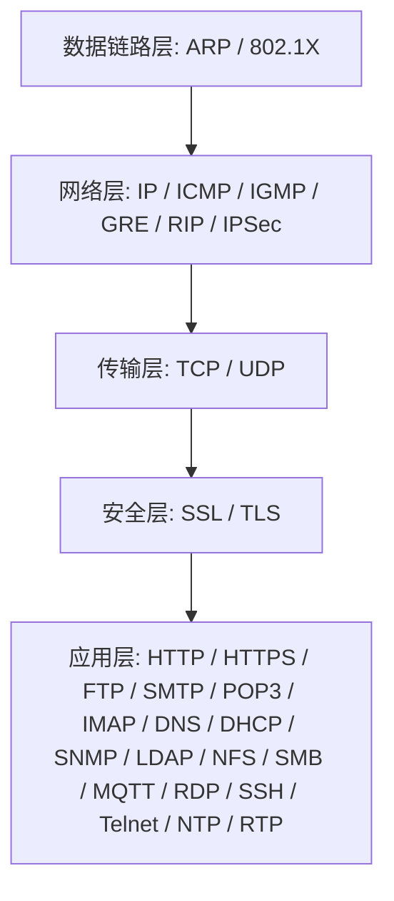
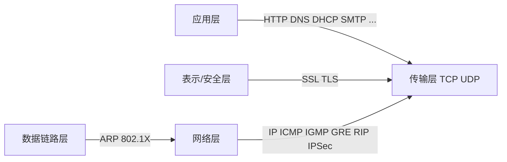

## 1. 这个板块在讲什么

本板块把「常用的 30 个网络协议」按 **OSI / TCP-IP 分层模型**系统化拆解，模仿 CPA / ACCA 那种"总目录 → 分章节子目录 → 多份教程"的学习路径：

- **协议总目录**（本页）：30 个协议按层归类、给学习顺序、给一句话定位；
- **每个协议一个子目录**：`NN-协议名/`，内含 3 份教程——
  - `_index.md`：协议概览（是什么、在哪一层、端口/RFC、解决什么问题）
  - `01-原理与报文.md`：工作原理、报文/头部结构、交互流程（mermaid 时序图）、知识框架
  - `02-实战与排错.md`：抓包观察（Wireshark 过滤式）、常用命令/配置、常见故障、与其他协议对比、速查表

> 目的不是背名词，而是建立"数据包从网卡到应用"的完整心智模型。建议**自底向上**学：先搞懂寻址与路由，再理解可靠传输，最后看应用层服务。

## 2. 推荐学习顺序（自底向上）

**阶段一 · 地基（数据链路 + 网络层）**
1. 先学 `ARP`：同网段通信为什么需要它（IP → MAC）。
2. 再学 `IP`：寻址、分片、路由是怎么发生的。
3. 配套 `ICMP`（ping/traceroute）、`IGMP`（组播）、`GRE`/`RIP`（隧道与路由）、`IPSec`（网络层加密）。

**阶段二 · 传输（传输层 + 安全层）**
4. `TCP` 与 `UDP` 对照学：可靠 vs 尽力、连接 vs 无连接、拥塞控制。
5. `SSL` → `TLS`：加密怎么叠在传输之上。

**阶段三 · 应用（应用层）**
6. 按"能用起来"的顺序：`DNS`（名字解析）→ `DHCP`（拿地址）→ `HTTP/HTTPS`（Web）→ `FTP` → 邮件三件套 `SMTP/POP3/IMAP` → 远程 `SSH/RDP/Telnet` → 管理与共享 `SNMP/LDAP/NFS/SMB` → 物联 `MQTT`、时间 `NTP`、实时 `RTP`。

## 3. OSI 与 TCP/IP 分层速查

## 4. 协议总目录（30 个）

> 点击协议名进入对应子目录教程。编号 `NN` 即学习路径顺序。

### 4.1 数据链路层

| 编号 | 协议 | 中文 | 一句话 |
|------|------|------|--------|
| [01](/learn/network-protocols/01-arp/) | ARP | 地址解析协议 | 把 IP 解析成 MAC，同网段通信的前提 |
| [02](/learn/network-protocols/02-802.1x/) | 802.1X | 端口网络访问控制 | 基于端口的入网认证（EAPOL，Wi-Fi/有线管控） |

### 4.2 网络层

| 编号 | 协议 | 中文 | 一句话 |
|------|------|------|--------|
| [03](/learn/network-protocols/03-ip/) | IP | 网际协议 | 寻址与路由，让数据包跨网络到达（IPv4/IPv6） |
| [04](/learn/network-protocols/04-icmp/) | ICMP | 互联网控制报文 | 网络诊断与控制信息（ping、traceroute 基础） |
| [05](/learn/network-protocols/05-igmp/) | IGMP | 组管理协议 | 管理主机与路由器的组播成员关系 |
| [06](/learn/network-protocols/06-gre/) | GRE | 通用路由封装 | 把一种协议报文封装进另一种，构建隧道 |
| [07](/learn/network-protocols/07-rip/) | RIP | 路由信息协议 | 基于跳数的距离矢量动态路由（UDP 520） |
| [12](/learn/network-protocols/12-ipsec/) | IPSec | IP 安全 | 在网络层为 IP 提供加密与认证（VPN 核心） |

### 4.3 传输层

| 编号 | 协议 | 中文 | 一句话 |
|------|------|------|--------|
| [08](/learn/network-protocols/08-tcp/) | TCP | 传输控制协议 | 面向连接、可靠、带拥塞控制的传输层协议 |
| [09](/learn/network-protocols/09-udp/) | UDP | 用户数据报协议 | 无连接、低开销、尽力交付的传输层协议 |

### 4.4 安全 / 表示层

| 编号 | 协议 | 中文 | 一句话 |
|------|------|------|--------|
| [10](/learn/network-protocols/10-ssl/) | SSL | 安全套接层 | 早期加密通信协议，已被 TLS 取代 |
| [11](/learn/network-protocols/11-tls/) | TLS | 传输层安全 | 为应用层提供加密、认证与完整性保护 |

### 4.5 应用层

| 编号 | 协议 | 中文 | 一句话 |
|------|------|------|--------|
| [13](/learn/network-protocols/13-http/) | HTTP | 超文本传输协议 | Web 的请求/响应协议（TCP 80） |
| [14](/learn/network-protocols/14-https/) | HTTPS | 安全 HTTP | HTTP over TLS，加密的 Web 通信（TCP 443） |
| [15](/learn/network-protocols/15-ftp/) | FTP | 文件传输协议 | 客户端与服务器间传文件（TCP 21/20） |
| [16](/learn/network-protocols/16-smtp/) | SMTP | 简单邮件传输协议 | 负责发送邮件（TCP 25） |
| [17](/learn/network-protocols/17-pop3/) | POP3 | 邮局协议第三版 | 下载邮件到本地并（通常）删除服务端（TCP 110） |
| [18](/learn/network-protocols/18-imap/) | IMAP | 互联网邮件访问协议 | 服务器端管理邮件、多端同步（TCP 143） |
| [19](/learn/network-protocols/19-dns/) | DNS | 域名系统 | 把域名解析为 IP（UDP/TCP 53） |
| [20](/learn/network-protocols/20-dhcp/) | DHCP | 动态主机配置协议 | 自动分配 IP 等网络参数（UDP 67/68） |
| [21](/learn/network-protocols/21-snmp/) | SNMP | 简单网络管理协议 | 监控和管理网络设备（UDP 161） |
| [22](/learn/network-protocols/22-ldap/) | LDAP | 轻量目录访问协议 | 访问和维护目录信息服务（TCP 389） |
| [23](/learn/network-protocols/23-nfs/) | NFS | 网络文件系统 | 像访问本地一样访问远程文件（TCP 2049） |
| [24](/learn/network-protocols/24-smb/) | SMB | 服务器消息块 | Windows 文件/打印/共享协议（TCP 445） |
| [25](/learn/network-protocols/25-mqtt/) | MQTT | 消息队列遥测传输 | 轻量级发布/订阅物联网协议（TCP 1883） |
| [26](/learn/network-protocols/26-rdp/) | RDP | 远程桌面协议 | 远程图形化桌面访问（TCP 3389） |
| [27](/learn/network-protocols/27-ssh/) | SSH | 安全外壳 | 加密的远程登录与隧道（TCP 22） |
| [28](/learn/network-protocols/28-telnet/) | Telnet | 远程终端协议 | 明文远程登录（TCP 23，已不安全） |
| [29](/learn/network-protocols/29-ntp/) | NTP | 网络时间协议 | 在网络中同步时钟（UDP 123） |
| [30](/learn/network-protocols/30-rtp/) | RTP | 实时传输协议 | 传输音视频等实时流媒体（常与 RTCP 配合） |

## 5. 使用说明

- 本板块内容按"先总后分"组织，建议从上方学习顺序入手，不要跳着背名词。
- 每个协议的 `_index.md` 是概览入口，`01-原理与报文.md` 偏原理与结构，`02-实战与排错.md` 偏动手与故障排查。
- 文中 mermaid 图在支持渲染的环境下可直接查看；抓包示例以 Wireshark 过滤式为主，可用 `tcpdump` / `tshark` 在命令行复现。
- 内容持续整理中，欢迎反馈错误与补充建议。

> 注：早期图片来源标注为「常用的30个网络协议」速查图；若其中个别协议名称与你的原图有出入（如 Telnet / NTP），可在对应子目录直接修订，不影响整体结构。
