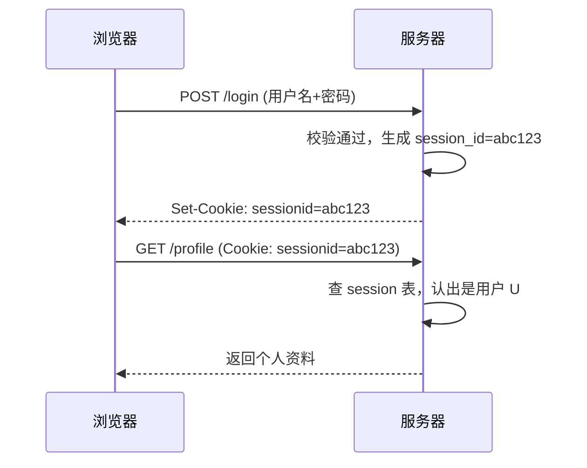

## 先建立直觉

浏览器和服务器之间的对话，本质是**一串没有记忆的文本请求**。但网站要"记住你登录了"——这靠 **Cookie + Session**。而"别的网站不能乱动你的账号"——这靠**同源策略**。这两套机制是全章的地基，也是后面 XSS / CSRF / 注入 的"舞台"。

## 它解决什么问题

不先搞懂它们，你会：
- 以为"加了 Token 就安全"，却不知道 `SameSite=None` 让 CSRF 有机可乘；
- 以为"HTTPS 就加密了"，却忽略了混合内容（HTTP 子资源）照样泄露；
- 配了 `Access-Control-Allow-Origin: *` 还纳闷"为什么能跨域读到我的数据"。

## 核心概念

### 1. 同源策略（Same-Origin Policy）

两个 URL **协议 + 域名 + 端口**三者相同才算"同源"。不同源时，浏览器默认禁止一方读取另一方的响应（如 `a.com` 的脚本读不到 `b.com` 的接口返回）。

| URL A | URL B | 同源？ |
|-------|-------|--------|
| `https://a.com/x` | `https://a.com/y` | ✓ |
| `https://a.com` | `http://a.com` | ✗ 协议不同 |
| `https://a.com` | `https://api.a.com` | ✗ 域名不同 |
| `https://a.com` | `https://a.com:8080` | ✗ 端口不同 |

> 同源策略**挡读取不挡发送**：不同源的表单/脚本照样能把请求发出去（钱可能已经转了），只是拿不到响应。这正是 CSRF 能成立的原因。

### 2. Cookie 与 Session



- **Cookie**：存在浏览器的小文本，每次请求自动带上（按域名）。`HttpOnly` 防 JS 读（挡 XSS 偷 cookie），`Secure` 只允许 HTTPS 传，`SameSite` 限制跨站携带。
- **Session**：服务端存的用户状态，Cookie 里只放一个不透明的 `session_id`。

### 3. CORS（跨源资源共享）

浏览器放行跨域读取的"白名单机制"。服务器用响应头声明允许谁：

```
Access-Control-Allow-Origin: https://a.com
Access-Control-Allow-Credentials: true
Vary: Origin
```

> 坑：`Allow-Origin: *` 与 `Allow-Credentials: true` **不能同时用**。带凭据的跨域必须显式列出具体源。

### 4. SameSite 与 CSRF 的关系

| 取值 | 行为 |
|------|------|
| `Strict` | 跨站请求完全不带 Cookie（最严，但可能误登出） |
| `Lax`（默认） | 跨站 GET（导航类）带，POST/跨站脚本触发的不带 |
| `None` | 跨站都带，但**必须配 `Secure`** |

`SameSite=Lax` 已挡住绝大多数 CSRF，但第 5 章会继续讲 CSRF 的完整防护（token + 二次校验）。

### 5. HTTPS / TLS 在 Web 安全里的角色

HTTPS = HTTP over TLS：加密（保密）、证书认证（防中间人）、完整性校验。它是前面所有机制的**传输底座**——没有它，Cookie、Token 在链路上都是明文。

## 动手：检查一个站点的安全头

用浏览器开发者工具（F12 → Network → 选一个请求 → Response Headers）看是否具备：

```
Set-Cookie: sessionid=abc123; HttpOnly; Secure; SameSite=Lax
Strict-Transport-Security: max-age=31536000; includeSubDomains
Content-Security-Policy: default-src 'self'
X-Content-Type-Options: nosniff
```

缺 `HttpOnly` 的会话 Cookie，一旦有 XSS 就会被 JS 偷走——第 3 章会演示。

## 常见坑

1. **`SameSite` 没设且 `None` + 无 `Secure`**：浏览器会拒收，或退化为可被 CSRF 利用。
2. **把 JWT 存 `localStorage`**：JS 可读 → XSS 直接拿走，等于没 `HttpOnly` 保护。敏感凭证优先放 `HttpOnly` Cookie。
3. **CORS 图省事写 `*`**：任何网站都能读你的接口数据（若带凭据则需具体源）。
4. **混合内容**：主页面 HTTPS，但图片/脚本走 HTTP，被中间人替换的 JS 能劫持整页。
5. **Session 不失效**：退出只清前端 Cookie，服务端 `session_id` 仍有效，被人捡到还能用。

## 小结

- **同源策略**管"能不能读响应"，**Cookie/Session** 管"怎么记住你"，**CORS** 是跨域读取的白名单；
- 三个 Cookie 属性最实用：`HttpOnly`（挡 XSS 偷）、`Secure`（只走 HTTPS）、`SameSite`（挡大部分 CSRF）；
- **HTTPS/TLS 是底座**：没有它，上层防护在链路上形同虚设；
- 下一章：XSS——当攻击者在你的页面里"注入了能执行的 JS"，前面这套信任链会怎么崩。
