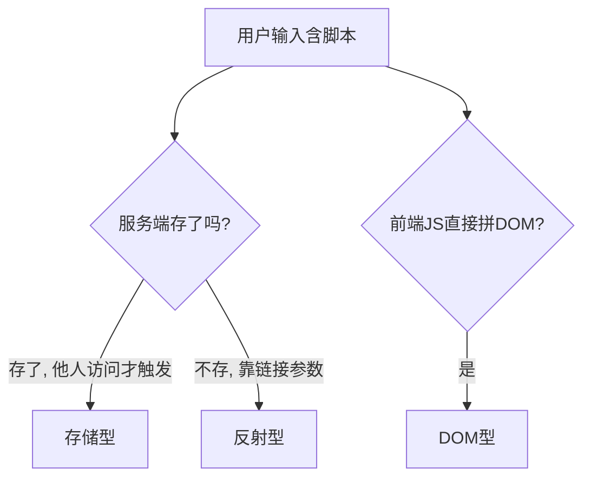

## 先建立直觉

XSS（Cross-Site Scripting）就是：**让别人的浏览器执行了你注入的 JavaScript**。

想象网站的评论区是一块公共黑板。正常用户写"今天天气真好"。攻击者写"`<script>把看板人的Cookie发给我</script>`"。如果网站原样把这段贴到页面上，每个看到这条评论的人，浏览器都会**真的执行**那段脚本——于是他们的登录凭证就被偷走了。

> 名字里的"X"是为了和 CSS 区分，本质就是"在受害者页面里跑攻击者的 JS"。

## 它解决什么问题

XSS 是 Web 最高频漏洞之一（常年占据 OWASP Top 10）。它常是**其他攻击的跳板**：偷到 `HttpOnly` 之外的凭证、配合 CSRF 提权、伪造页面钓鱼。

## 核心概念

### 1. 三种类型

| 类型 |  payload 存放在哪 | 触发方式 | 典型场景 |
|------|-------------------|----------|----------|
| 反射型 | URL 参数 | 受害者点开带毒链接 | 搜索框 `?q=<script>` |
| 存储型 | 数据库/服务端 | 任意人访问含毒页面 | 评论、昵称、私信 |
| DOM 型 | 前端 JS 直接读 URL 写 DOM | 前端逻辑未过滤 | `location.hash` 拼进 `innerHTML` |



### 2. 一个最小存储型示例（仅演示原理）

漏洞代码（危险写法，勿在生产使用）：

```js
// 服务端把评论原样渲染到页面
app.get('/comment', (req, res) => {
  const c = db.getComment();           // 假设 c = "<script>alert(document.cookie)</script>"
  res.send('<div>' + c + '</div>');     // ❌ 未转义，浏览器当 HTML 执行
});
```

攻击者提交 ``，任何浏览该评论的用户 Cookie 被发到 `evil.com`。

### 3. 危害不止弹窗

- **偷凭证**：`document.cookie`（若没 `HttpOnly`）；
- **会话劫持**：拿到 Cookie 后伪装用户发请求；
- **钓鱼/挂马**：把页面改成仿冒登录框；
- **蠕虫**：在社交站内自我传播（如历史上 MySpace 蠕虫）。

## 防御：四道防线

### 防御 1 — 输出编码（最基础）

根据插入位置选用对应编码，让"数据"永远不被当成"代码"：

```js
// Node 示例：HTML 上下文转义
function escapeHtml(s){
  return s.replace(/[&<>"']/g, c => (
    {'&':'&amp;','<':'&lt;','>':'&gt;','"':'&quot;',"'":'&#39;'}[c]
  ));
}
res.send('<div>' + escapeHtml(c) + '</div>');   // ✅ 脚本变成纯文本
```

> 现代框架（React/Vue）默认对插值做转义（`{ {x} }` / `{{x}}`）；危险的是 `v-html` / `dangerouslySetInnerHTML` / `innerHTML`。

### 防御 2 — CSP（内容安全策略）

白名单机制，限制"哪些来源的代码能执行"：

```
Content-Security-Policy: default-src 'self'; script-src 'self'; object-src 'none'
```

即使有 XSS 注入点，外域脚本也会被浏览器拒绝执行。可加 `report-uri` 收集违规。

### 防御 3 — Cookie 属性

`Set-Cookie: sid=xxx; HttpOnly; Secure; SameSite=Lax`——JS 读不到，XSS 偷不走。

### 防御 4 — 输入校验 + 上下文感知

对 URL、富文本用白名单标签/属性过滤（如 `sanitize-html`、`DOMPurify`），不要只靠黑名单。

## 常见坑

1. **只转义 `<>` 不转义属性**：`" onmouseover="alert(1)` 在属性上下文仍能注入。
2. **`innerHTML` 拼接用户输入**：前端 DOM 型 XSS 重灾区，改用 `textContent`。
3. **CSP 配 `unsafe-inline`**：等于给内联脚本开了后门，CSP 形同虚设。
4. **富文本编辑器只前端过滤**：攻击者直接调接口绕过前端，必须在服务端再过滤。
5. **把 JWT 存 localStorage**：XSS 一注入就 `localStorage.getItem('token')` 拿走。

## 小结

- XSS = **让受害者浏览器执行攻击者的 JS**，分反射/存储/DOM 三类；
- 防御是**组合拳**：输出编码（根因）+ CSP（兜底）+ `HttpOnly` Cookie（保凭证）+ 服务端过滤；
- 别迷信"前端转义就安全"，攻击者可以绕开前端直打接口；
- 下一章：注入——不止 XSS 这一种"把输入当代码执行"，SQL、命令、SSRF 同源不同面。
