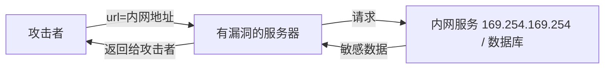

## 先建立直觉

注入（Injection）是 OWASP Top 10 的常客，本质只有一句话：

> **程序把"用户的数据"当成了"程序的指令"去执行。**

XSS 是把数据当 JS 执行（第 3 章）。本章是同一错误的其他形态：当 SQL、系统命令、内部请求、XML 解析器"误信"了用户输入。

## 核心概念

### 1. SQL 注入

漏洞代码：

```js
// ❌ 字符串拼接
const sql = "SELECT * FROM users WHERE name = '" + req.body.name + "'";
db.query(sql);
// 用户输入：' OR '1'='1   →  条件恒真，拖走全表
```

**防护 = 参数化查询（预编译）**，让"数据"和"指令"分离：

```js
// ✅ 占位符，数据库先把 SQL 编译成模板，参数只作值
db.query('SELECT * FROM users WHERE name = ?', [req.body.name]);
```

盲注（无回显）可借 `sleep()` / 二分法逐字符猜数据；防护上**ORM + 最小权限账户**能挡住绝大多数。

### 2. 命令注入

```js
// ❌ 把用户输入拼进 shell
const { exec } = require('child_process');
exec('ping -c 1 ' + req.body.host);   // 输入: 8.8.8.8; cat /etc/passwd
```

防护：避免调用 shell；必须调用时用数组参数（`execFile`）+ 白名单校验（如只允许 IP 正则）。

### 3. SSRF（服务端请求伪造）

> 攻击者让**服务器**替他去访问**本来他访问不到的内部资源**。



常见于"URL 转图片""Webhook 配置"。防护：
- 校验协议只允许 `http/https`，禁止 `file://`、`gopher://`；
- **服务端用 DNS 重解析 + 目的 IP 黑名单**（挡 `169.254.169.254` 元数据、内网段）；
- 出网走独立网段，限制服务器能访问的目标。

### 4. XXE（XML 外部实体注入）

解析不可信 XML 时，外部实体可被用来读文件或发起 SSRF：

```xml
<?xml version="1.0"?>
<!DOCTYPE x [ <!ENTITY xxe SYSTEM "file:///etc/passwd"> ]>
<user>&xxe;</user>
```

防护：禁用 DTD / 外部实体（如 Java 设 `XMLInputFactory.SUPPORT_DTD=false`、用 JSON 替代 XML）。

## 动手：在靶场里观察（授权环境）

本地起 DVWA，调到低安全等级，在"SQL Injection"输入框试 `' OR '1'='1`，观察返回从"单条"变成"全表"——直观感受拼接的危害。再切到"Impossible"级别，看源码是如何用参数化查询挡住的。

## 防御清单（通用原则）

1. **数据与指令分离**：SQL 用预编译、命令用参数数组、模板用上下文转义；
2. **输入白名单优先于黑名单**：能枚举的（IP、枚举值）直接校验格式；
3. **最小权限**：数据库账户只给必要库表权限，服务器出网受限；
4. **不出网解析外部内容**：XML 禁 DTD、不信任外部实体；
5. **纵深**：WAF 兜底 + 日志审计 + 异常告警。

## 常见坑

1. **"用了 ORM 就绝对安全"**：仍写了 `raw()` / 拼接 HQL，照样注入。
2. **只防单引号**：SQL 注入还有绕过（`/**/`、宽字节、二次编码），参数化才是根本。
3. **SSRF 只校验域名不校验 IP**：`evil.com` 解析到 `127.0.0.1` 就绕过，必须在**发起请求前**对最终 IP 做判断。
4. **错误信息回显堆栈**：等于把表结构送给攻击者，生产关详细报错。
5. **把防御全压给 WAF**：WAF 可被绕过（分块、编码），它只是兜底不是主力。

## 小结

- 注入的统一本质：**数据被当成指令执行**；
- 各形态的"正确解法"不同，但都遵循"**分离 + 白名单 + 最小权限**"；
- SQL 靠预编译、命令靠参数数组、SSRF 靠出网管控、XXE 靠禁 DTD；
- 下一章：认证与授权——即使没有注入，错误地处理"你是谁、能做什么"同样致命（越权、JWT 误用）。
