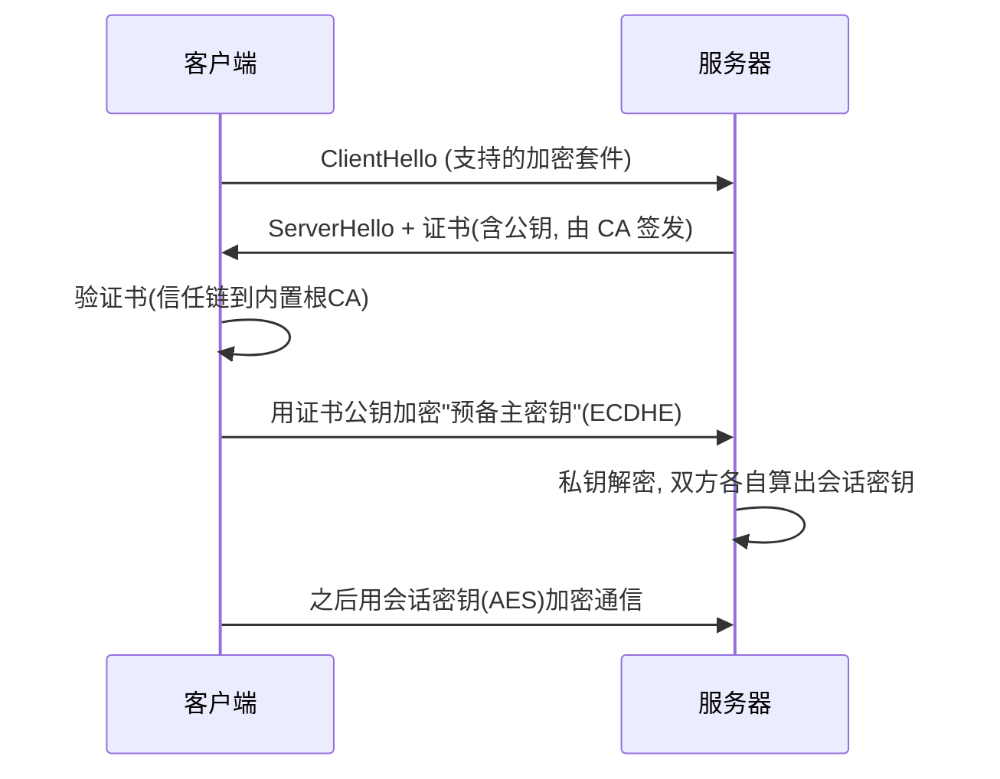

## 先建立直觉

密码学是前面所有防护的**数学地基**：Cookie 怎么保密、JWT 怎么防伪造、HTTPS 怎么信得过——背后都是它。但密码学不是"自己发明算法"，而是**正确地用成熟原语**。

三件核心工具各管一件事：

- **对称加密**：把信锁进盒子，双方用同一把钥匙（快，适合大量数据）；
- **非对称加密**：一把公钥（谁都能拿）锁、一把私钥（只有你有）开（解决"密钥怎么分发"）；
- **哈希**：把任意内容压成固定指纹，不可逆、略改一点就天差地别（校验完整性）。

## 核心概念

### 1. 对称 vs 非对称

| 类型 | 密钥 | 速度 | 典型用途 |
|------|------|------|----------|
| 对称（AES） | 一把共享密钥 | 快 | 加密传输内容、磁盘加密 |
| 非对称（RSA/ECC） | 公钥 + 私钥 | 慢 | 密钥协商、数字签名 |

> 实战里**两者结合**：用非对称算法（如 ECDHE）协商出一个临时对称密钥，之后用 AES 加密数据。这就是 TLS 的思路。

### 2. 哈希与数字签名

- **哈希**（SHA-256 等）：验证"内容没被改"。下载文件后比对哈希值就是这用途。
- **数字签名** = 用**私钥**对哈希值加密；别人用你的**公钥**解密比对，就能确认"这消息确实是你发的、且没被改"。

```
签名: sign = 私钥加密( hash(消息) )
验证: hash(消息) == 公钥解密( sign )  ?
```

### 3. TLS 握手（为什么 HTTPS 能信）



要点：证书由 **CA（证书颁发机构）**签发，浏览器内置一批**根 CA**公钥；能沿"叶子证书 → 中间 CA → 根 CA"验证通过，就信你是你。

### 4. PKI 与信任模型

**PKI（公钥基础设施）** = 证书 + CA + 注册机构 + 吊销机制（CRL / OCSP）。信任的起点是"你信任那些根 CA"。这也是风险点：若某 CA 被攻破，它能给任意域名发假证书。

### 5. HSTS 与混合内容

```
Strict-Transport-Security: max-age=31536000; includeSubDomains; preload
```

HSTS 强制浏览器只走 HTTPS，挡掉"SSL 剥离"攻击（把用户从 https 降级到 http 再窃听）。

## 动手：看一张真实证书

浏览器点地址栏锁图标 → 证书，观察：
- **颁发者**（Issuer）与**使用者**（Subject）；
- **证书链**：你的域名 ← 中间 CA ← 根 CA；
- **有效期**与**指纹**（SHA-256）。

命令行验证：`openssl s_client -connect example.com:443 | openssl x509 -noout -text`

## 常见坑

1. **自己实现加密算法**：几乎必错，务必用标准库（AES-GCM、ChaCha20-Poly1305）。
2. **硬编码密钥进代码仓库**：密钥应走环境变量/KMS，泄露即失陷。
3. **忽略证书校验**：测试时图方便关掉 TLS 验证（`verify=False`），上线忘开，中间人随便掐。
4. **用过期/自签证书跑生产**：用户被浏览器警告，或被迫忽略风险养成坏习惯。
5. **把哈希当加密**：哈希不可逆，不能"解密"——需要可逆就用对称加密，需要验证完整性用哈希+签名。

## 小结

- 对称管"快"、非对称管"密钥分发与签名"、哈希管"完整性"，三者配合；
- **TLS = 非对称协商密钥 + 对称加密数据 + 证书做身份认证**；
- 信任来自**证书链到根 CA**，HSTS 挡降级攻击；
- 下一章回到网络层：端口扫描、防火墙、VPN、内网横向——密码学是它们的底座，而网络边界是另一道防线。
