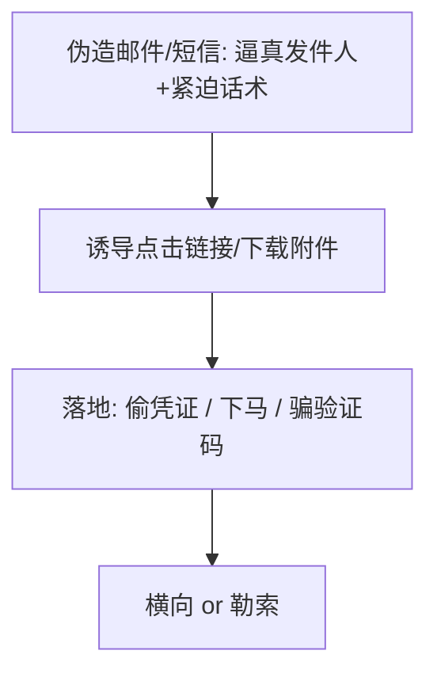

## 先建立直觉

很多严重事故，**技术漏洞只是导火索，真正的入口是人**：

- 一封"快递异常"邮件，员工一点，木马进内网；
- 一个"IT 部门"来电要验证码，管理员脱口而出；

所以这一章分两块：**恶意代码**（机器被装了什么）和**社会工程**（人怎么被绕过了技术防线）。

## 核心概念

### 1. 恶意代码的几种形态

| 类型 | 传播方式 | 特点 |
|------|----------|------|
| 病毒 | 依附正常文件，需用户执行 | 依赖宿主 |
| 蠕虫 | 自我复制、网络传播 | 不需人为干预，扩散快 |
| 木马 | 伪装成有用程序 | 藏后门，用户主动装 |
| 勒索软件 | 邮件/漏洞投放 | 加密文件要赎金 |
| 僵尸网络 | 被控的肉鸡集群 | 用于 DDoS / 挖矿 |

### 2. 钓鱼：最廉价的入口

话术套路：**紧迫感**（"账号即将冻结"）+ **伪装权威**（仿冒公司/银行/熟人）+ **好奇/利益**（"你的照片曝光了"）。

### 3. 社会工程的其他面

- **假冒身份**：冒充 IT、领导、供应商要密码/验证码；
- **诱饵（Baiting）**：U 盘丢走廊，捡的人插上中招；
- **水坑攻击**：污染你常访问的网站，等鱼上钩。

## 防御：技术 + 人 双管齐下

### 技术侧（检测与遏制）

- **终端检测与响应（EDR）**：不只杀毒，还看行为（异常进程、可疑加密）；
- **IoC 情报**：把已知恶意 IP/域名/哈希做成阻断规则（防火墙、邮件网关）；
- **邮件网关**：识别仿冒发件人（SPF/DKIM/DMARC 三件套校验）、沙箱 detonate 附件；
- **最小权限 + 应用白名单**：勒索软件没权限写关键目录就废了一半。

### 人侧（意识建设，性价比最高）

- **不轻易点链接/下附件**：先核对发件人域名、 hover 看真实地址；
- **验证码/密码绝不告诉任何人**：真 IT 不会问你要密码；
- **多因素认证（MFA）**：即使密码泄露，无第二因子也登不进（注意 MFA 疲劳攻击需培训）；
- **演练**：定期钓鱼演练，命中率高的人针对性培训。

## 动手：识别一封钓鱼邮件（自查清单）

1. 发件人域名是 `company.com` 还是 `compnay.com` / `company-support.net`？
2. 是否制造紧迫感让你"别思考"？
3. 链接 hover 后真实地址是否匹配声称的站点？
4. 是否索要密码/验证码/让装软件？
5. 语气是否与你认识的同事/领导平时一致？

任一命中"是"，走**独立渠道**（电话）确认，而不是直接照做。

## 常见坑

1. **只装杀毒不收集行为日志**：传统杀毒对新型木马命中率低，缺 EDR 易漏。
2. **MFA 但允许"批准推送"无确认**：攻击者狂发推送，用户烦了点同意（MFA 疲劳）。
3. **员工怕"报错"不敢上报**：建立"报了不罚"文化，越快报损失越小。
4. **备份和生产线同网**：勒索软件一并加密，备份失效。备份要**离线/不可变**。
5. **DMARC 没设强制拒绝**：仿冒邮件仍能进箱。

## 小结

- 恶意代码按传播/目的分病毒、蠕虫、木马、勒索、僵尸网络；
- **钓鱼与社会工程常是真正入口**——技术防线再厚，人也可能被绕过；
- 防御 = **EDR/IoC/邮件网关（技术）+ MFA/意识演练/上报文化（人）**；
- 下一章：把前面所有知识在**授权靶场**里串成一套方法论（渗透测试 PTES），从"懂"到"会做防御验证"。
