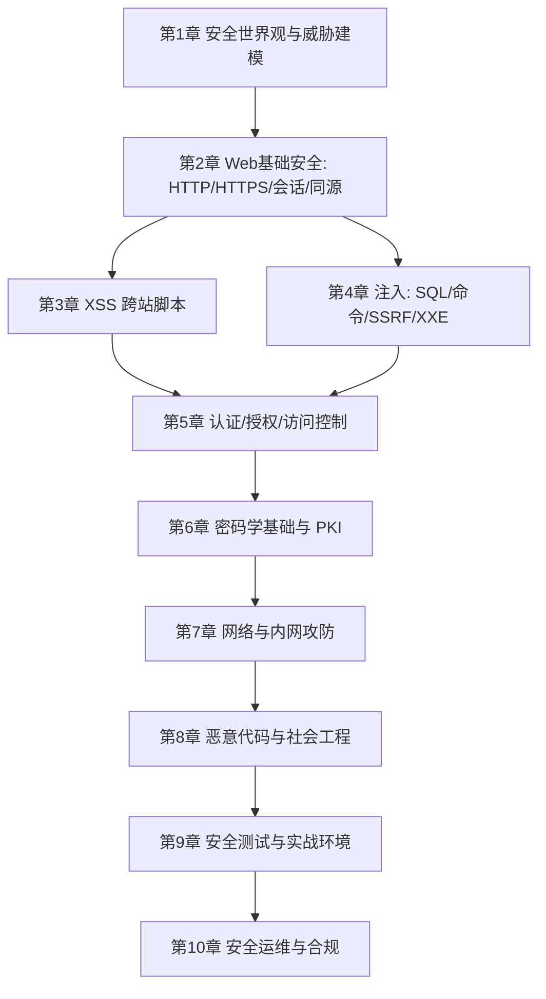

## 1. 这个板块在讲什么

本板块是一份**从认知到动手**的网络安全学习路径，沿用 `CPA / ACCA / 网络协议 / Three.js` 那种"总目录 → 分章节教程"的结构：

- **学习路径总目录**（本页）：10 章按"先建立安全世界观 → Web 安全 → 密码学 → 网络与内网 → 恶意代码与社工 → 实战与运维"的依赖顺序排好，给每章一句话定位；
- **每章一份教程**：`NN-xxx.md`，用"先建立直觉 → 核心概念 → 动手观察/配置 → 常见坑 → 小结"的结构讲清一个主题。

> 网络安全不是"黑客攻击技巧集"，而是一套**风险思维**：先想清楚"我要保护什么、对手是谁、他怎么打、我怎么防"，再去落地技术。本板块全程以**防御视角**展开，所有动手环节都建议在**授权环境**（靶场、CTF、自己的实验机）中进行。

## 2. 推荐学习顺序（自底向上 + 攻防闭环）

**阶段一 · 建立安全世界观（第 1 章）**
1. 先搞懂 CIA 三要素、资产/威胁/漏洞/风险的关系，以及攻击者视角的 Kill Chain 与 MITRE ATT&CK。

**阶段二 · 应用与数据安全（第 2–6 章）**
2. 从 Web 通信基础（同源策略、Cookie/Session）入手，这是后面所有 Web 漏洞的舞台。
3. 逐个拆解高频漏洞：XSS、SQL/命令/SSRF/XXE 注入、认证授权缺陷（越权、JWT/OAuth 误用）。
4. 用密码学与 PKI 收尾这一层——理解 TLS、证书、哈希为什么能"兜底"前几章的防护。

**阶段三 · 网络与主机安全（第 7–8 章）**
5. 回到网络层：端口扫描、防火墙/ACL、VPN、内网横向移动与域安全。
6. 认识恶意代码的形态与社工套路，重点是**检测与防护**而非制作。

**阶段四 · 实战与体系化（第 9–10 章）**
7. 在授权靶场（DVWA、OWASP WebGoat、CTF）把前几章串起来，建立渗透测试的**方法论**（PTES）。
8. 落到企业侧：日志审计、IDS/IPS、安全基线/等保、应急响应与合规（个保法、GDPR）。

## 3. 环境准备（动手必备）

本板块的"动手"强烈建议在**隔离的授权环境**里做，推荐组合：

| 工具 / 环境 | 用途 | 怎么获得 |
|------|----------|-------------|
| Kali Linux（或 Parrot OS） | 集成 nmap / Burp / Wireshark / sqlmap 等 | 虚拟机或 WSL；[kali.org](https://www.kali.org/) |
| Burp Suite Community | Web 流量拦截、改包、重放 | 免费版足够入门；[portswigger.net](https://portswigger.net/burp) |
| Wireshark | 抓包看明文协议、分析握手 | 全平台免费 |
| DVWA / WebGoat / sqli-labs | 合法漏洞练习靶场 | 本地 Docker 起，专为练习设计 |
| CTF 平台 | 综合实战（XSS 打 cookie、注入拿 flag） | CTFtime、各大 CTF 赛事 |
| 在线实验（授权） | 不碰真实系统 | Hack The Box / TryHackMe（需授权账号） |

> **法律与道德红线**：只对**你自己拥有或明确授权**的目标做安全测试。未授权扫描/入侵他人系统是违法行为（国内适用《网络安全法》《刑法》相关条款）。本板块所有示例默认在你自己的实验环境里复现。

## 4. 章节速查

| # | 章节 | 一句话定位 |
|---|------|-----------|
| 01 | 安全世界观与威胁建模 | CIA 三要素、风险公式、Kill Chain、ATT&CK |
| 02 | Web 基础安全：HTTP/HTTPS 与会话 | 同源策略、Cookie/Session、CORS、SameSite |
| 03 | 跨站脚本 XSS | 反射/存储/DOM 三类，CSP 与防御 |
| 04 | 注入攻击：SQL / 命令 / SSRF / XXE | 注入原理、参数化查询、SSRF 利用面 |
| 05 | 认证、授权与访问控制 | 密码存储、JWT/OAuth 误用、越权 IDOR |
| 06 | 密码学基础与 PKI | 对称/非对称、哈希、TLS 握手、证书链 |
| 07 | 网络安全与内网攻防 | 端口扫描、防火墙、VPN、横向移动、域安全 |
| 08 | 恶意代码与社会工程 | 病毒/木马/勒索、钓鱼、检测与防护 |
| 09 | 安全测试与实战环境 | Burp/Wireshark 实战、渗透测试方法论 PTES |
| 10 | 安全运维与合规 | 日志审计、IDS/IPS、等保、应急响应 |

> 本板块持续整理中。每章会逐步补充可运行示例、靶场练习、踩坑记录与推荐资料；如有错误欢迎通过博客评论或邮件反馈。
