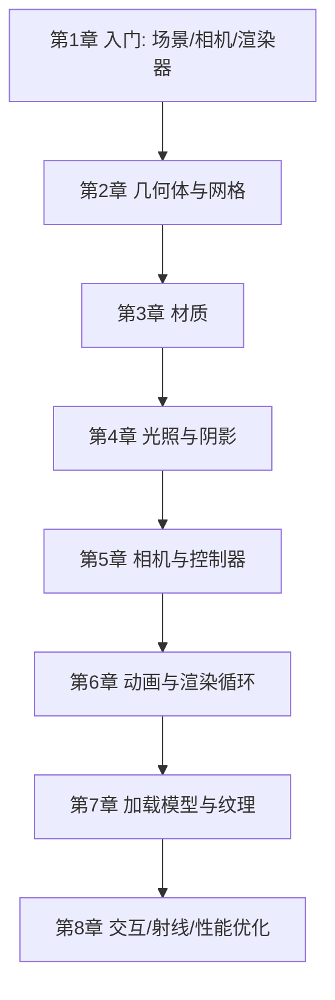

## 1. 这个板块在讲什么

本板块是一份 **从零到能落地** 的 Three.js 教程，模仿 `CPA / ACCA / 网络协议` 那种"总目录 → 分章节教程"的学习路径：

- **教程总目录**（本页）：8 章按依赖顺序排好，给学习路线、给每章一句话定位；
- **每章一份教程**：`NN-xxx.md`，用"先建立直觉 → 它解决什么问题 → 核心概念 → 动手写 → 常见坑 → 小结"的结构讲清一个主题。

> Three.js 不是 3D 标准的发明者，它只是把浏览器里又臭又长的 **WebGL** 封装成了人能写、能维护的 API。学 Three.js，本质是在学"如何用 JavaScript 指挥 GPU 画三角形"。

## 2. 推荐学习顺序（自底向上）



**阶段一 · 看见东西（第 1–2 章）**
1. 先搭出"三件套"：场景、相机、渲染器，把第一个立方体画出来。
2. 再搞清楚几何体是怎么由顶点拼成的，以及 `Mesh = 几何体 + 材质`。

**阶段二 · 让它好看（第 3–5 章）**
3. 材质决定"表面长什么样"——颜色、金属感、粗糙度、透明。
4. 没有光，PBR 材质就是一团黑；学会打光和开阴影。
5. 用 `OrbitControls` 让用户能转着看，理解相机参数怎么影响画面。

**阶段三 · 让它活起来（第 6–8 章）**
6. 用渲染循环 + `Clock` 做动画，而不是 `setInterval`。
7. 加载别人做好的 GLTF 模型和高清纹理，别什么都手搓。
8. 用 `Raycaster` 做鼠标拾取，并用 `InstancedMesh` 等手段守住帧率。

## 3. 环境准备（三选一）

Three.js 是标准 ES Module，现代项目推荐用 **import map + CDN**，零安装即可跑：

```html
<!DOCTYPE html>
<html lang="zh-CN">
<head>
  <meta charset="UTF-8" />
  <meta name="viewport" content="width=device-width, initial-scale=1.0" />
  <title>Three.js Demo</title>
  <style>
    html, body { margin: 0; height: 100%; overflow: hidden; }
    #app { width: 100vw; height: 100vh; display: block; }
  </style>
  <!-- import map: 把裸模块名映射到 CDN 地址 -->
  <script type="importmap">
  {
    "imports": {
      "three": "https://unpkg.com/three@0.160.0/build/three.module.js",
      "three/addons/": "https://unpkg.com/three@0.160.0/examples/jsm/"
    }
  }
  </script>
</head>
<body>
  <canvas id="app"></canvas>
  <script type="module">
    import * as THREE from 'three';
    import { OrbitControls } from 'three/addons/controls/OrbitControls.js';
    // 教程从这里开始写
    console.log('Three.js', THREE.REVISION);
  </script>
</body>
</html>
```

| 方式 | 适用场景 | 命令 / 做法 |
|------|----------|-------------|
| import map + CDN | 快速试错、单文件 Demo | 上例，无需安装 |
| npm 本地构建 | 正式项目（Vite / Webpack） | `npm i three`，源码里 `import * as THREE from 'three'` |
| 旧版全局脚本 | 不推荐，仅兼容老教程 | `<script src="three.min.js">` 后使用全局 `THREE` |

> **版本提示**：本教程基于 `three@0.160.x`。`three` 大版本升级偶尔会改 API（如 `WebGLRenderer.outputEncoding` → `outputColorSpace`），遇到报错先看对应版本的 [迁移指南](https://github.com/mrdoob/three.js/wiki/Migration-Guide)。

## 4. 章节速查

| # | 章节 | 一句话定位 |
|---|------|-----------|
| 01 | 入门与第一个场景 | 三件套 + 渲染循环，画出会转的立方体 |
| 02 | 几何体与网格 | 顶点如何拼成形状，`Mesh` 是什么 |
| 03 | 材质 | 颜色 / 金属 / 粗糙 / 透明 / 自发光 |
| 04 | 光照与阴影 | 光让 PBR 材质"显形"，阴影怎么开 |
| 05 | 相机与控制器 | 透视相机参数、`OrbitControls` 实战 |
| 06 | 动画与渲染循环 | `requestAnimationFrame` + `Clock` 做动效 |
| 07 | 加载模型与纹理 | `GLTFLoader` / `TextureLoader` / 加载管理器 |
| 08 | 交互与性能优化 | `Raycaster` 拾取 + `InstancedMesh` 保帧率 |

> 本板块持续整理中。每章会逐步补充可运行示例、踩坑记录与推荐资料；如有错误欢迎通过博客评论或邮件反馈。
