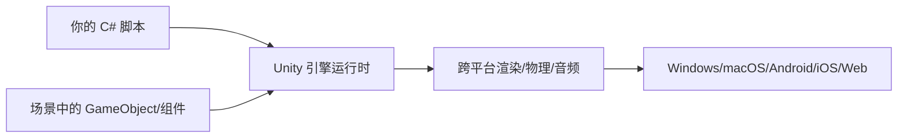

## 先建立直觉

把 Unity 想成一个 **「数字乐高工作台」**：

- **场景（Scene）** 是一块底板，上面摆满了积木；
- **积木 = GameObject**（一个立方体、一盏灯、一台相机都是）；
- **每块积木上的「功能贴纸」= 组件（Component）**：贴了「碰撞体」就能被撞，贴了「脚本」就会按代码动；
- 你拖拖拽拽摆好底板，按 **▶ 播放**，整块底板就「活」了。

> Unity 不是「写代码画画面」，而是「在可视化编辑器里组装 + 用 C# 注入行为」。这也是它对新手友好的原因。

## 它解决什么问题

为什么用 Unity 而不是自己从零写引擎？

1. **跨平台**：同一份工程一键打包到 Windows / macOS / Android / iOS / WebGL / 主机，省去重写渲染层；
2. **生态成熟**：Asset Store 海量现成模型、插件、特效；
3. **上手快**：可视化编辑器 + 组件模式，美术/策划也能参与；
4. **免费门槛低**：个人版（年收入低于阈值）免费，适合学习与独立开发。

## 核心概念

### 1. 三大核心概念

| 概念 | 是什么 | 类比 |
|------|--------|------|
| **GameObject** | 场景里一切物体的基类，本身几乎「空」，靠组件获得能力 | 乐高积木块 |
| **Component** | 挂在 GameObject 上的功能模块（Transform 必带） | 积木上的功能贴纸 |
| **Asset** | 项目资源：脚本、模型、贴图、音频、预制体 | 乐高零件仓库 |

### 2. 编辑器五大面板（务必记住名字）

打开一个项目，默认布局有这五块：

| 面板 | 作用 |
|------|------|
| **Hierarchy（层级）** | 列出当前场景所有 GameObject，体现父子关系（树） |
| **Scene（场景）** | 3D/2D 可视化编辑区，拖拽摆放物体 |
| **Game（游戏）** | 点击 ▶ 后「玩家看到的画面」（相机视角） |
| **Project（项目）** | 工程所有资源文件，等同文件管理器 |
| **Inspector（检视）** | 选中物体后，编辑它的组件属性 |

### 3. 建立第一个场景（动手）

1. `File → New Scene`（选 Basic/Empty）。
2. `Hierarchy` 右键 → `3D Object → Cube`，场景中央出现一个立方体。
3. 选中 Cube，看 **Inspector**：它自带 `Transform`（位置/旋转/缩放）、`Mesh Filter`、`Mesh Renderer`、`Box Collider`。
4. `GameObject → 3D Object → Directional Light` 加一盏平行光（否则物体是黑的）。
5. `GameObject → Camera` 确保有相机（新场景默认已带 `Main Camera`）。
6. 点 ▶ 播放——虽然它不动，但 Game 视图能正确渲染出这个立方体，说明管线通了。

> **关键认知**：场景里每个物体都挂在「场景树」上；父子关系意味着**子物体跟随父物体移动**。比如把 Cube 拖到另一个空物体下，移动父物体，Cube 一起动。

## 常见坑

1. **物体是黑色的**：没加光源，或材质丢了。`Directional Light` 没打对方向也会黑，先确认有灯。
2. **Game 视图是空的**：相机没对准物体。选中 `Main Camera`，在 Scene 里用 `Ctrl/Cmd + Shift + F` 让相机对齐当前视角。
3. **改了代码不生效**：Unity 需要**编译**。保存 .cs 后切回 Unity 会自动编译；报错时看底部 `Console` 面板。
4. **装错版本模块**：想打包安卓却没勾 Android 模块，只能回去用 Hub 补装，**不能运行时改**。

## 小结

- Unity = 可视化组装 + C# 行为注入；场景是对象树，行为是组件；
- 记住五大面板：Hierarchy / Scene / Game / Project / Inspector；
- 第一个场景：Cube + Light + Camera → ▶ 能渲染即成功；
- 下一章：深入理解 GameObject、组件与 Transform 这套世界观。
