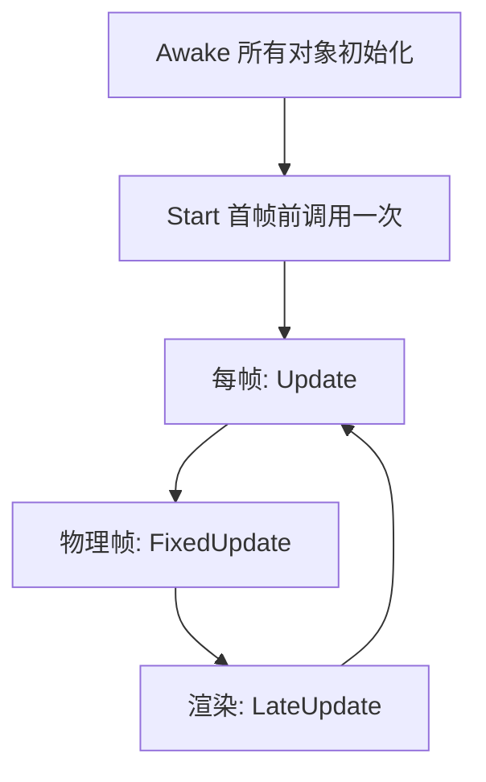

## 先建立直觉

在 Unity 里，**脚本 = 一个继承自 `MonoBehaviour` 的类**，它被当成「组件」挂到 GameObject 上。引擎不会调用 `Main()`，而是在特定时刻自动调用脚本里约定的方法（生命周期函数）。

- `Start()` ≈ 「物体出生时做一次」；
- `Update()` ≈ 「每一帧都做」（约每秒 60 次）；
- 你只需要**填好这些钩子**，引擎负责在正确时机调用。

> 普通 C# 程序从 `Main` 入口开始；Unity 脚本没有 Main，靠引擎「回调」驱动。这是最大区别。

## 它解决什么问题

1. **声明式而非过程式**：你描述「物体该有什么行为」，引擎安排执行节奏；
2. **可视化绑定**：把脚本拖到物体上，字段在 Inspector 里可配，无需改代码；
3. **统一调度**：成百上千个脚本的 Update 由引擎统一管理，配合物理帧、渲染帧分离。



## 核心概念

### 1. 生命周期函数（必记）

| 函数 | 调用时机 | 典型用途 |
|------|----------|----------|
| `Awake()` | 对象实例化后立即、且**所有** Awake 都跑完前 | 初始化自身引用、单例赋值 |
| `OnEnable()` | 组件被启用时 | 注册事件 |
| `Start()` | `Update` 第一次前调用一次 | 依赖他人的初始化（他人已在 Awake 完成） |
| `Update()` | 每渲染帧 | 输入、非物理移动、计时 |
| `FixedUpdate()` | 固定步长（默认 0.02s） | **物理相关**移动、施加力 |
| `LateUpdate()` | 所有 Update 之后 | 相机跟随（等角色先动完） |
| `OnDisable()` / `OnDestroy()` | 禁用 / 销毁 | 注销事件、释放资源 |

> **Awake vs Start**：`Awake` 一定在所有对象的 `Start` 之前跑完，所以「获取别的物体的引用」放 `Awake`，「使用那些引用」放 `Start`，顺序才稳。

### 2. 你的第一个脚本：让方块旋转

```csharp
using UnityEngine;

public class Spin : MonoBehaviour
{
    public float speed = 90f;   // 在 Inspector 可调

    void Update()
    {
        // 绕 Y 轴每秒转 speed 度（Time.deltaTime 让速度不随帧率变化）
        transform.Rotate(0f, speed * Time.deltaTime, 0f);
    }
}
```

把 `Spin.cs` 拖到 Cube 上，▶ 播放，方块转起来了。`speed` 字段在 Inspector 显示并可调——这就是**序列化字段**。

### 3. 序列化字段（Inspector 可见）

```csharp
public int hp = 100;              // public 字段 → Inspector 可调
[SerializeField] private int mp;  // private 也能显示，且保持封装
[HideInInspector] public int id; // 不显示但会序列化保存
[Range(0, 10)] public float vol = 1f; // 滑条
```

> 只有**可序列化**的字段才会出现在 Inspector：`public` 自动可序列化；`private` 需加 `[SerializeField]`。

### 4. 访问别的物体

```csharp
public class Follow : MonoBehaviour
{
    public Transform target;  // 把目标拖进 Inspector 槽位

    void Update()
    {
        if (target != null)
            transform.position = target.position; // 贴在目标上
    }
}
```

## 常见坑

1. **在 Update 里写物理移动**：`Rigidbody.velocity` / `AddForce` 应放 `FixedUpdate`，否则物理步长不一致会抖。
2. **用 `new` 创建 MonoBehaviour**：❌ 错！MonoBehaviour 必须由引擎创建（`AddComponent` 或挂组件）。普通类才用 `new`。
3. **空引用 NullReferenceException**：Inspector 槽位没拖对象，`target` 为 null。加 `if (target == null) return;` 防御。
4. **Time.deltaTime 忘记乘**：直接用 `speed` 旋转，高帧率机器转得飞快。凡「每秒」的量都要乘 `Time.deltaTime`。

## 小结

- Unity 脚本继承 `MonoBehaviour`，由引擎回调驱动（无 Main）；
- 生命周期：`Awake`(全初始化) → `Start`(一次) → `Update`(每帧) → `FixedUpdate`(物理) → `LateUpdate`；
- 用 `public` 或 `[SerializeField]` 暴露字段到 Inspector；
- 移动记得 `Time.deltaTime`；物理放 `FixedUpdate`；
- 下一章：物理系统，让物体有质量、会掉落、能碰撞。
